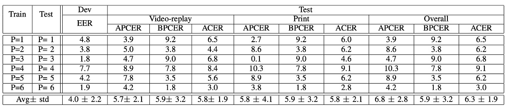
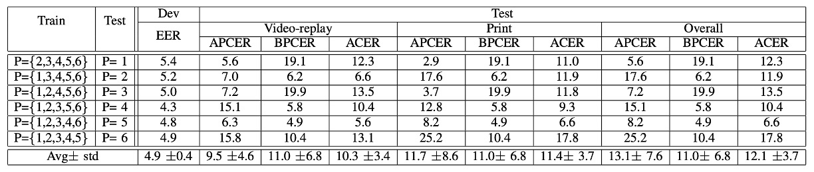
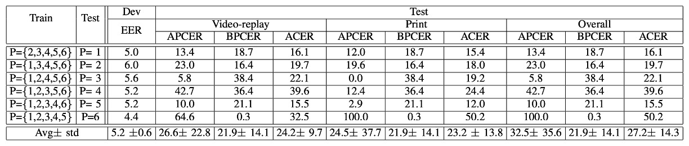

## Four Challenges

[**OULU-NPU: A Mobile Face Presentation Attack Database with Real-World Variations**](https://ieeexplore.ieee.org/document/7961798)

---

Face recognition systems are the first-line biometric systems facing users.

In today's world, they are ubiquitous, with most mobile phones featuring FaceID.

## Defining the Problem

However, face recognition systems are highly vulnerable.

Past research has found that by simply downloading a target's photo from social media, six major systems at the time (Face Unlock, Facelock Pro, Visidon, etc.) could easily be bypassed with just a photo. Even liveness detection designs that ask for blinking eyes or head turns could be fooled using video recordings.

While there are several publicly available datasets for PAD (Presentation Attack Detection) benchmarking, the evaluation methods of these datasets are somewhat "idealized." All the tests are conducted in scenarios where the training and testing sets have exactly the same conditions, leading to excellent results on paper. However, as soon as applied to real-world conditions, they fail miserably.

Additionally, the recording conditions of these datasets do not align with typical mobile phone use, as they mostly use static webcams or DSLRs, with either excessively low or high camera quality, unlike most people's daily-use selfie phones.

The authors believe that a new dataset is needed to address this "generalization failure" problem.

:::tip
PAD stands for Presentation Attack Detection.

A Presentation Attack is an interference request initiated by a user toward a biometric recognition subsystem, which may aim to:

- Impersonate another target identity (Impersonation Attack)
- Obfuscate one's own identity (Obfuscation Attack)

These scenarios are classified as Presentation Attacks (PA).
:::

## Solving the Problem

This paper aims to solve the dataset issue.

To address the problem of "over-idealized datasets that cannot generalize to real-world mobile scenarios," the authors focus on three sources of variations (covariates) in their dataset design:

1. **Unknown environmental conditions** (lighting and background)
2. **Different photographic devices**
3. **Attack tools PAI (print and replay types)**

---

The authors collected videos of 55 participants (15 female, 40 male) in three different scenarios, resulting in a total of 5940 video clips.

These three scenarios vary in lighting and background to simulate different "lighting conditions" users face in everyday mobile phone use:

- **Session 1**: Open office, windows in the back, lights on, natural light.
- **Session 2**: Conference room, only indoor lights, no natural light.
- **Session 3**: Small office, windows in front, both indoor lights and natural light.

As shown in the image below:

<figure style={{"width": "70%"}}>

</figure>

Each participant recorded two video clips per session (registration + authentication), using their own mobile phone for selfies. Each video was limited to 5 seconds, simulating a real unlocking process.

The videos were recorded using 6 mobile phones with "decent" front-facing camera quality:

- Samsung Galaxy S6 edge (5MP)
- HTC Desire EYE (13MP)
- MEIZU X5 (5MP)
- ASUS Zenfone Selfie (13MP)
- Sony XPERIA C5 Ultra Dual (13MP)
- OPPO N3 (16MP rotating camera)

All videos were recorded in Full HD (1920×1080) using a standardized camera app. Although several phones claimed to have the same 13MP camera, the video quality differences were still significant (yes, we all know that camera specifications alone aren’t trustworthy).

The video quality across different phones is shown in the image below:

<figure style={{"width": "90%"}}>

</figure>

---

Attack samples must be difficult to make the challenge meaningful. Therefore, the authors used the rear camera to capture high-resolution still photos and videos of participants, which were then printed or played back to create two types of attacks:

- **Print Attack**: A3 glossy paper, using two printers (Canon C6011 & PIXMA iX6550)
- **Replay Attack**: Played back on two screens (19-inch Dell UltraSharp + MacBook Retina)

The attack setup is shown below:

<figure style={{"width": "80%"}}>

</figure>

The video recording process is also carefully controlled:

- Print attacks were carried out by hand-holding the photo with slight shaking, mimicking real movements.
- Replay attacks were conducted with the setup fixed, ensuring the screen edges were not visible to avoid cheating features.

This type of fake video becomes a nightmare for the algorithm, preventing it from relying on background or frame tricks as in the past.

---

Finally, the authors designed four systematic protocols to test generalization ability:

1. **Protocol I – Environmental Generalization**: Test whether the system can still differentiate between genuine and fake faces under different lighting and backgrounds.
2. **Protocol II – Attack Tool Generalization**: Train using one printer or display and test with a completely new one to see if the model breaks down.
3. **Protocol III – Device Generalization (Leave-One-Camera-Out)**: In each round, exclude one phone from the model's training, and see if it can correctly distinguish fake and real videos from a new phone.
4. **Protocol IV – The Ultimate Challenge**: Change the environment, attack tool, and device all at once to simulate real-world variations, testing all factors together.

All protocols split the 55 participants into training, validation, and testing groups (20/15/20 participants), ensuring the model never has access to testing data during training.

The dataset’s configuration is shown in the table below:

<figure style={{"width": "90%"}}>

</figure>

## Discussion

The authors used a baseline model to test the four protocols, aiming to see if current mainstream PAD methods can survive in the real world.

The evaluation metrics chosen here are three common indicators from ISO/IEC 30107-3:

- **APCER**: The rate at which attack samples are misclassified as bonafide.
- **BPCER**: The rate at which bonafide samples are misclassified as attacks.
- **ACER**: The average of APCER and BPCER.

  $$
  \text{ACER} = \frac{\text{APCER} + \text{BPCER}}{2}
  $$

For the model, the authors use LBP as the baseline, but instead of grayscale images, features are directly extracted from the HSV and YCbCr color spaces.

The process is as follows:

1. Detect face → crop → normalize to 64×64 small images.
2. Use $LBP^{u2}_{(8,1)}$ to extract texture features from each color channel.
3. Feed into a Softmax classifier for training and prediction.

Let’s now look at how well this baseline method generalizes in each scenario.

:::tip
**Why not use RGB?**

The authors believe RGB is not stable enough, while HSV and YCbCr color spaces preserve regional brightness differences and color characteristics better, making them more sensitive to distinguishing between genuine and fake faces.
:::

### Protocol I: The Impact of Lighting Changes

:::tip
In the chart, the last column shows ACER, and the lower the number, the better. This applies to all subsequent charts as well.
:::

This is the simplest protocol.

First, the model is trained using Session 3 data and then tested using Session 3 data:

> **ACER is 2.7%, excellent performance.**

Next, the model is trained using Session 1 and 2 data and tested on Session 3:

> **ACER jumps from 2.7% to 13.5%.**

This indicates that once lighting changes, the recognition accuracy falls apart.

This is because LBP texture features are highly sensitive to brightness. Changing the angle, intensity, or background color of the lighting causes the model to instantly fail at recognizing who you are.

### Protocol II: The Impact of Attack Tool Variations

In the second round, the authors trained the model using Printer 1 + Display 1 and then tested it using Printer 2 + Display 2.

The results were as follows:

- When the attack tool stayed the same, the ACER was **7.2%**.
- After changing the tool, ACER became **14.2%**.

Print attacks, in particular, are the hardest to detect because changing printers completely alters the color texture. In comparison, the model could still handle Replay attacks (from 7.2% to 9.2%), but once the Print attack tool was changed, the performance plummeted.

### Protocol III: The Impact of Camera Device Variations

In the third round, the **LOCO Protocol (Leave-One-Camera-Out)** was used.

In each round, 5 phones were used for training, and the 6th phone’s recognition ability was tested.

The results showed a high average ACER, with significant variation across rounds.

In other words:

> **Changing a phone is like entering a different world.**

The color, clarity, and lens characteristics of the images all differ, presenting a major challenge for models based on "color texture."

### Protocol IV: The Hellish Three-in-One Challenge

The fourth round, the most difficult challenge: **Lighting + Attack Tool + Camera Device** are all changed!

The results showed that the model completely broke down.

Earlier rounds seemed promising, but once this final challenge was introduced, the model failed dramatically. Some phones even failed to recognize faces altogether.

This confirms that generalization under a single variable is not equivalent to real-world generalization.

## Conclusion

In this paper, the authors conducted structured protocol testing on three major sources of variation (environment, device, and attack method). It is only after this that we truly begin to have tools to assess "generalization ability."

Although this dataset is still in its early stages regarding attack types (only print and replay), it opened the FAS community's eyes to the real importance of "domain shift" and "cross-scenario robustness," and it influenced the subsequent design of large dataset evaluations.

The authors' final words in the paper:

> We invite the research community to consider this new database.

For us today, this is no longer just an invitation, but a classic and essential step.
