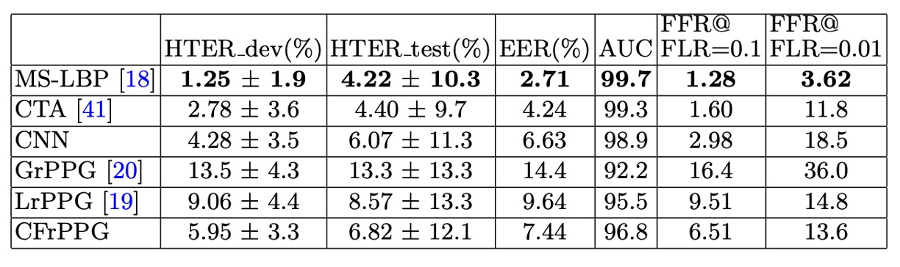

## The Echo of a Heartbeat

[**Remote Photoplethysmography Correspondence Feature for 3D Mask Face Presentation Attack Detection**](https://openaccess.thecvf.com/content_ECCV_2018/papers/Siqi_Liu_Remote_Photoplethysmography_Correspondence_ECCV_2018_paper.pdf)

---

rPPG, essentially evolved from PPG (Photoplethysmography), is a non-contact heartbeat measurement technique.

It does not require the attachment of sensors; with just an RGB camera, it can observe the color changes in the skin caused by heartbeats under natural light, thereby recovering physiological signals.

In the FAS task, this mechanism offers a way to bypass the visual appearance of the image and directly observe signs of life.

In theory, as long as stable rPPG signals can be extracted from the image, it can effectively distinguish between real faces and 3D masks, and even detect attacks such as screen playback or paper-based attacks.

## Defining the Problem

In real-world scenarios, rPPG signals are often not so pure.

The image below shows three common rPPG signal patterns, corresponding to an ideal real face, a real face with interference, and a mask with periodic noise.

<figure style={{"width": "90%"}}>

</figure>

- **First (left): Ideal scenario.**
  The rPPG signal from a real face shows a distinct main frequency in the frequency domain, representing the heartbeat rhythm, with background noise relatively weak. This is the kind of liveliness evidence we expect the model to capture.

- **Second (middle): Signal attenuation.**
  In conditions of low light, distant shooting, or insufficient face region resolution, even with a real human face, the spectrum may only show a blurred main peak or be submerged in noise. This could cause the model to misclassify a real face as an attack sample.

- **Third (right): Noise amplification.**
  When a mask is affected by external stable vibrations (e.g., handheld device shaking, environmental light flickering), it may also produce a similar main peak in the frequency domain. If the model only judges based on the maximum spectral intensity, it may result in a false positive.

These three patterns highlight a harsh reality:

> **rPPG signals are fragile, and the maximum spectral intensity is not sufficient as the sole liveliness indicator.**

Traditional spectral peak methods focus the model's attention on the strongest signal but overlook the overall structure and consistency of the spectrum. The heartbeat signal should ideally remain steadily hidden within the skin's subtle color changes, waiting to be extracted, amplified, and analyzed.

However, the problem lies in: **True facial micro-motions are just one of the factors; more often, noise is the dominant theme.**

A core assumption of rPPG methods is: "The main frequency of the heartbeat will form a clear peak in the spectrum."

Therefore, most existing methods (such as CHROM, POS) rely on the spectral intensity corresponding to this main frequency as the liveliness feature.

However, once environmental factors like camera shake, brightness flicker, or facial displacement appear, even masks can exhibit significant periodic signals. Under low resolution or low-light conditions, the real facial signals may be obscured by environmental noise, causing the spectral peak to disappear.

Traditional cross-correlation operations can enhance shared frequencies but cannot distinguish whether "the shared frequency is the heartbeat or synchronized background noise."

Thus, we must ask:

> **If noise and signal resonate at the same frequency, which one should we trust?**

## Solving the Problem

<figure style={{"width": "90%"}}>

</figure>

Existing rPPG methods typically treat the "spectral peak" as an indicator of heartbeat intensity.

While this works under ideal conditions, as pointed out in previous analyses, once noise and real signals resonate at the same frequency, relying solely on intensity can lead to misclassification. CFrPPG (rPPG Correspondence Feature) is a new method proposed to address this fragile assumption.

### Learning the Spectral Template

The core concept of CFrPPG is:

- **If a face is real, then its different regions should exhibit consistent heartbeat signals at the same frequency.**

To capture this "consistency between regions," the authors design a learnable **spectral template** $w$, which is not directly derived from a single signal but is instead inferred from the rPPG spectra of multiple regions of the face.

We first divide the face into multiple regions, extract the rPPG signals from each region, perform cross-correlation preprocessing, and transform the signals into the frequency domain to obtain ${s_1, s_2, \dots, s_N}$.

These spectra represent the energy distribution across different frequencies for each region but are mixed with noise and variability. Therefore, we want to learn a template $w$ that enhances the "consistent heartbeat frequency" while ignoring the diversity introduced by noise.

This goal can be achieved with the following equation:

$$
\min_w \sum_{i=1}^N \| S_i w - y \|_2^2 + \lambda \| w \|_2^2
$$

Here, $S_i$ is the cyclic matrix formed by $s_i$, $y$ is a one-dimensional Gaussian function with a peak at the heartbeat frequency, which guides the template to learn "which frequencies to respond strongly to."

This design allows us to integrate the "consistent frequency components across all regions" into a single filter $w$.

To speed up the computation, the authors use the property of circulant matrices being diagonalizable in the frequency domain and transform the optimization problem into an element-wise operation in the frequency domain:

$$
\hat{w} = \frac{\sum_{i=1}^N \hat{s}_i^{*} \odot \hat{y}}{\sum_{i=1}^N \hat{s}_i^{*} \odot \hat{s}_i + \lambda}
$$

Here, $\hat{s}_i$ is the DFT-processed form of the $i$-th region's spectrum, $^\*$ denotes conjugate transpose, and $\odot$ represents element-wise multiplication. This means we no longer handle large matrix multiplications but instead use simple addition and division in the frequency domain to learn the filter.

This step is like learning an "ideal heartbeat melody" from many noisy observations, and then we can use this template to compare each signal and check if they share the same beat.

### Establishing Corresponding Features

Once the spectral template $w$ is learned, the next task is to check:

- **Does the rPPG signal in each region of the face "respond" to this template?**

We first transform the spectrum $s_i$ of each region into the frequency domain $\hat{s}_i$ and then perform element-wise multiplication with the template $\hat{w}$ (which corresponds to convolution in the time domain):

$$
\hat{r}_i = \hat{s}_i \odot \hat{w}
$$

This gives us a response sequence $\hat{r}_i$, whose peak positions and shapes can tell us whether the region "resonates with the template." In other words, if a signal truly contains a heartbeat frequency similar to the template, its convolution result will produce a sharp, noticeable peak at the corresponding frequency.

To quantify this resonance, the authors adopt the **Peak-to-Sidelobe Ratio (PSR)**, a common sharpness indicator for filter responses:

$$
\text{PSR}_i = (\text{peak}_{\hat{r}_i} - \mu_{\hat{r}_i})\sigma_{\hat{r}_i}
$$

Where:

- $\text{peak}_{\hat{r}_i}$ is the maximum value of the response sequence
- $\mu_{\hat{r}*i}$ and $\sigma*{\hat{r}_i}$ are the mean and standard deviation of the non-peak regions

In other words, the higher the PSR, the sharper and more focused the response, which is more likely to represent a real heartbeat signal; while noise or incoherent signals will produce flat, blurry, or multi-peak responses, resulting in a lower PSR.

Finally, we concatenate the PSR values from all regions into a multi-dimensional liveliness feature vector:

$$
x = [\text{PSR}_1, \text{PSR}_2, \dots, \text{PSR}_N]
$$

This vector represents the final CFrPPG feature, which no longer relies on a single frequency intensity but instead assesses **the correspondence between all regions of the face and the template** to determine whether the face has a consistent, real heartbeat rhythm.

This design, which starts from "overall consistency," allows the model to better resist interference from local noise and erroneous signals.

### Suppressing Background Noise

In real-world applications, rPPG signals are easily contaminated by global interference, such as slight camera shake, vibrations from handheld shooting, or flickering indoor lighting. These interferences generally have two characteristics: **synchronous across the entire face** and **stable periodicity**, making them hard to distinguish from heartbeat signals in the frequency domain, and easily causing the model to produce incorrect responses.

This means that even a mask without any physiological signals can, as long as the background noise is stable enough, generate spurious heartbeat traces in the frequency domain.

To solve this problem, CFrPPG introduces **background region rPPG spectra** as negative samples during the learning of the spectral template. These regions are located outside the face, and rPPG signals are extracted using the same method as for the face. However, these regions **should not exhibit any physiological rhythm from blood flow**.

These background spectra are considered examples of "should not produce a response," and are incorporated into the template training objective function in the form of a penalty term:

$$
\min_w \sum_{i=1}^M \| S_i^t w - y \|^2_2 + \lambda \|w\|^2_2 + \gamma \sum_{k=1}^K \| S_k^n w \|^2_2
$$

Where:

- $S_i^t$: rPPG spectra from facial regions, used to capture heartbeat consistency
- $S_k^n$: spectra from the background, used to suppress global interference
- $y$: target response (one-dimensional Gaussian), expecting a sharp response at the heartbeat frequency
- $\gamma$: a coefficient controlling the penalty strength, balancing heartbeat learning and background suppression

In this way, the learned template $w$ will satisfy two conditions:

- It produces strong and focused responses at the real heartbeat frequency
- It maintains a very low response to background common periodic noise

The design means we don't directly "exclude" background frequencies but instead let the model learn to ignore those periodic patterns that always appear in the wrong places during training.

In other words, we don't just ask the model "where do you see the heartbeat," but also "where **shouldn't** you see the heartbeat."

As a result, even if unavoidable synchronized shake or background light changes exist in the deployed environment, CFrPPG will be more resilient in focusing on **the rhythms that belong to the face and physiology**, rather than the spurious coincidences introduced by imaging devices.

## Discussion

### Comparison with Other Methods

<figure style={{"width": "90%"}}>

</figure>

As shown in the table above, under the 3DMAD dataset, all methods exhibit relatively high overall performance, reflecting that this dataset was captured under controlled lighting conditions, and the Thatsmyface mask used still has noticeable differences in material compared to a real face. Appearance-based methods (especially MS-LBP) therefore achieve the best results in this scenario.

However, compared to other rPPG methods (such as LrPPG, GrPPG), CFrPPG still slightly outperforms in terms of AUC and HTER, demonstrating its higher recognition stability through consistent modeling of facial heartbeat characteristics. Notably, even under conditions that are "most favorable for appearance-based methods," deep features (CNN) still show some limitations, highlighting their constraints in appearance data transfer.

In addition, this experiment uses a random subject index for leave-one-out cross-validation (LOOCV), conducted over 20 rounds with 17 tests per round for complete cross-validation to reduce the randomness of data splitting. CFrPPG consistently maintains stable performance across multiple evaluations, showing that its architecture possesses consistency across samples.

### Cross-Dataset Testing

<figure style={{"width": "90%"}}>

</figure>

The authors further designed cross-dataset experiments to evaluate the model's generalization ability in the face of unknown environments.

Specifically, the experiment is divided into two directions:

- **3DMAD → HKBU-MARsV2**: Training on a clean, controlled dataset, then testing in a real-world scenario
- **HKBU-MARsV2 → 3DMAD**: Training under noisy, uncontrolled conditions, testing in a standard environment

Each setup is executed with 20 rounds of random group testing to avoid bias in subject allocation.

From the results, **CFrPPG outperforms other methods in both experiments**, showing a larger performance lead compared to the single-dataset tests, which means:

> **CFrPPG not only stabilizes recognition in familiar environments but also maintains recognition ability under cross-dataset transitions.**

The key to this capability lies in that **CFrPPG does not merely memorize the intensity distribution of a particular signal**, but learns the "shared heartbeat frequency pattern across multiple regions of the face." This spectral consistency holds under different shooting conditions and mask types, providing better alignment of features across datasets.

In contrast, appearance-based methods (such as MS-LBP and CNN) show a significant drop in performance in these types of experiments, revealing their "overfitting to specific visual representations."

## Conclusion

rPPG was briefly heralded as one of the hopes for non-contact liveliness detection.

During that time, researchers attempted to read minute light changes from images and recover the blood flow rhythm, as if by being detailed enough, they could see the truth of physiology. But reality quickly provided the answer:

> **The light source is too hard to control, the noise too hard to clear, and the frequency-domain features too fragile.**

rPPG was a kind of romance that was difficult to engineer.

CFrPPG sought to make this short-lived technology more stable and smarter during its brief existence. It used template matching, spectral correspondence, and noise modeling to counter environmental uncertainties. It upgraded "single-peak" to "multi-region consistency," and added background suppression, proving that stable features in noisy environments often come from collaboration, not extremes.

From the FAS perspective, rPPG feels like a side branch that heated up quickly and then faded away; CFrPPG, however, stands at the end of this branch, writing a dignified conclusion for that technological frenzy.

Although we no longer seek heartbeats from images, in this forgotten branch, we once heard its voice.
