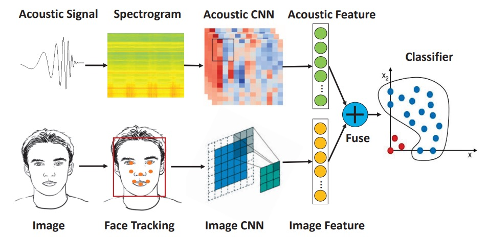

## Faces in Sound Waves

[**Multi-Modal Face Authentication using Deep Visual and Acoustic Features**](https://par.nsf.gov/servlets/purl/10095811)

---

In this paper, the authors did not provide a concise name for their method, so we’ve extracted features from both Visual and Acoustic elements and named it **VA-FAS**.

## Defining the Problem

Smartphones have already incorporated "face recognition" into the daily startup sequence.

To prevent photos from fooling the camera, mainstream solutions capture temporal cues like blinking, lip movements, and subtle head motions in video streams, or detect spatial anomalies in the image to determine whether the user is real.

It seems like no issues, but in reality, if an attacker uses high-resolution video, these temporal and spatial cues quickly become ineffective.

When simple RGB cues cannot uphold the security boundary, the industry moves towards a second approach: adding more sensors next to the camera.

For instance, iPhone’s Face ID uses near-infrared structured light to reconstruct 3D geometry, raising the attack threshold; some flagship Android phones also add ToF or binocular modules.

However, this "hardware reinforcement" strategy may face three challenges:

- **Cost**: Dedicated modules increase the BOM, making it difficult to scale to mid-range or low-end devices.
- **Space**: The front camera area is precious, adding another sensor means sacrificing part of the screen.
- **Ecosystem Lock-in**: Sensor specifications are deeply coupled with algorithms, making cross-platform replication challenging.

Back in the world where most phones are still equipped with just a single front camera and microphone, RGB-based liveness detection vulnerabilities remain wide open.

Thus, we need a third path: **Injecting depth into face recognition without adding extra hardware**.

As a result, the authors turned their attention to sound waves:

> **The reflection signals that have always existed but have never been given proper attention.**

Can sound fill in a layer of depth for 2D images? Can the combination of images and sound truly seal the gap for video attacks?

## Solving the Problem

<figure style={{"width": "90%"}}>

</figure>

The authors proposed an **acoustic-visual fusion face authentication system** that enhances liveness verification strength on mobile phones without adding new hardware.

The overall system consists of three modules:

1. Acoustic feature extraction
2. Image feature extraction
3. Multi-modal feature fusion and classification

Both acoustic and image features are extracted using CNNs and then concatenated into a joint vector, which is classified using a One-Class SVM.

The overall architecture is quite simple. Let's dive into the details of each module.

### Acoustic Feature Extraction

The authors chose to use the built-in "earpiece speaker + top microphone" as the acoustic communication pair. This setup is widely available on various mobile devices and, when placed alongside the front camera, reduces misalignment between the acoustic and visual sensors.

The sound waves transmitted are **16–22 kHz linear chirp**, which is in the near-inaudible range. It belongs to the **FMCW (Frequency-Modulated Continuous Wave)** type, which estimates the reflection path length through frequency differences.

To improve signal quality, the system implements the following designs:

- Using short pulses to avoid self-interference from the speaker;
- Applying a Hanning window to smooth the signal edges and enhance time-frequency stability.

The acoustic signal processing flow is as follows:

The recorded signal first passes through a Butterworth band-pass filter (16–22 kHz) to remove background noise.

The processed waveform can be observed as:

<figure style={{"width": "60%"}}>

</figure>

- **Direct path**: The direct signal from the speaker to the microphone, usually with the highest amplitude.
- **Facial echo**: The main signal reflected from the forehead, nose bridge, cheeks, etc.
- **Noise and interference reflections**: Reflections from the desk, collar, etc., which need to be excluded.

The segmentation strategy is as follows:

- Peak detection is used to locate the direct path;
- Cross-correlation is then used along with a template signal from the registration phase to lock onto the main echo region.

If multiple similar peaks cause instability in the positioning, the facial distance information estimated by the front camera is used to narrow the search range. For instance, if the distance between the eyes widens in the image, it indicates that the face is closer, and the expected echo position can be adjusted.

The final extracted segments are extended by 10 samples on both sides to retain a depth range of about 7 cm.

The echo signal undergoes an additional **FMCW distance transformation**, as shown in the diagram:

<figure style={{"width": "60%"}}>

</figure>

The FMCW technology converts the time delay into frequency shift, and the reflection distance is determined by the following formula:

$$
d = \frac{c \cdot \Delta f \cdot T}{2B}
$$

Where:

- $d$ = distance;
- $c$ = speed of sound;
- $\Delta f$ = frequency difference between the received and transmitted signals;
- $T$ = chirp duration;
- $B$ = bandwidth (6 kHz).

The frequency difference obtained through "signal mixing" is then converted into a time-frequency plot (spectrogram).

This time-frequency plot is fed into a pre-trained CNN (based on the EchoPrint architecture) for inference, with the final classification layer removed, and output as a 128-dimensional vector representing the structural echo spectrum of the face in the acoustic space.

### Image Feature Extraction

<figure style={{"width": "80%"}}>

</figure>

After the acoustic feature extraction, the next step is image feature extraction, which involves four steps:

1. **Face Detection**: Using HOG and a pre-trained model to detect the face box and facial landmarks.
2. **Affine Transformation**: Aligning the facial landmarks to a standard template.
3. **Cropping and Resizing**: Obtaining a fixed-length input image.
4. **Data Augmentation**: Including brightness normalization and angle correction.

For feature extraction, a simplified version of OpenFace (based on FaceNet’s nn4) is used, along with **classification loss + triplet loss** training. The final output is a 128-dimensional image feature vector.

### Feature Concatenation

The two feature vectors are simply concatenated to form the final 256-dimensional joint feature:

$$
\mathbf{z} = [\mathbf{a} \,\|\, \mathbf{v}] \in \mathbb{R}^{256}
$$

The classifier used is One-Class SVM, which builds a high-dimensional boundary with only the registered samples, treating other users as anomalous data. The advantage of this approach is that it doesn’t require the collection of attack samples, is lightweight in computation, and is suitable for deployment on edge devices.

The final system is shown below; the user simply needs to align their face with the red box, and the system will simultaneously play the chirp and capture the image, making a decision within 300 milliseconds.

<figure style={{"width": "80%"}}>

</figure>

## Discussion

### Data and Experimental Design

- **Subjects**: 10 volunteers (not included in the acoustic model training set).
- **Acoustic Samples**: Approximately 2 minutes of recording per person, with a total of 13,806 samples.
- **Image Samples**: 20 face images per person, with supplementary aligned images.
- **Attack Samples**: 5 types of fake faces, including:

  - Paper photos, screen displays, cardboard surfaces, wall posters, and statues.

Data was collected in **uncontrolled environments**, covering various light sources and background noise to test the system’s practicality.

The model performance is measured using four indicators:

$$
\text{Precision} = \frac{TP}{TP + FP}, \quad
\text{Recall} = \frac{TP}{TP + FN}
$$

$$
\text{F1} = \frac{2PR}{P + R}, \quad
\text{BAC} = \frac{1}{2} \left( \frac{TP}{TP + FN} + \frac{TN}{TN + FP} \right)
$$

Where:

- **High Precision** → Indicates fewer false positives.
- **High Recall** → Indicates fewer false rejections of legitimate users.
- **F1 and BAC** are used to evaluate overall performance.

The data is split into an 80:20 training and testing ratio.
The model uses **One-Class SVM**, with each user training on their own samples, and testing with "other users + attack samples" as negative samples. Each modality (acoustic, image, combined) follows the same procedure to ensure fairness in comparison.

### Bimodal Verification Performance

<figure style={{"width": "80%"}}>

</figure>

Based on the bimodal architecture, the experimental results are shown in the table above, with the left column showing averages and the right column showing medians.

In all tests, **the combined features (acoustic + visual) consistently show more stable verification performance than any single modality**.

This is primarily due to the visual module using deep embedding features trained with triplet loss, which effectively separates the distribution boundaries between same-class and different-class samples. This visual recognition strength may quickly fail when facing image-based attacks, such as photos or videos. At this point, the acoustic features can fill in the visual gaps, making the combined modality the only viable option to resist attacks.

In all tests, including one set with identical twin samples, the combined modality model successfully distinguished between the two, with no misjudgments. Although only a single twin sample was tested, the results are still indicative—despite the extreme similarity in physiological appearance, the subtle differences in acoustic reflections can still be captured by the model.

### Impact of Background Noise

The practicality of the acoustic module depends on whether it can function stably in real-world environments. To test this, the authors repeatedly performed data collection and recognition tests in noisy laboratory and classroom environments with human speech.

The results showed that under these common background noise conditions, the model’s recognition performance did not significantly degrade. This indicates that the chirp frequency band (16–22kHz) and filtering mechanisms designed in the system are sufficient to avoid interference from speech and environmental noise, ensuring the stability for real-world applications.

## Conclusion

This paper represents one of the early explorations of "sound waves as a liveness cue" in practical implementations, and it provides a feasible solution given the hardware constraints of the time.

What it proposes is not a singular creative idea, but a complete deployable and evaluable system: from chirp design, echo segmentation, CNN feature extraction, and bimodal concatenation, to mobile implementation strategies and latency control, ultimately with real-world tests to counter static photos and dynamic videos.

The system does not overly rely on new hardware and does not assume ideal data conditions. It is grounded in engineering realities, posing a fundamental question given resource limits:

> **If a smartphone only has a microphone, speaker, and front camera, how much defensive space do we have left?**

Given the hardware conditions, algorithmic design, and types of attacks at the time, such a system could effectively differentiate between real faces and fakes, and between living users and video playback.

The answer this research provides is: **It’s enough**.
