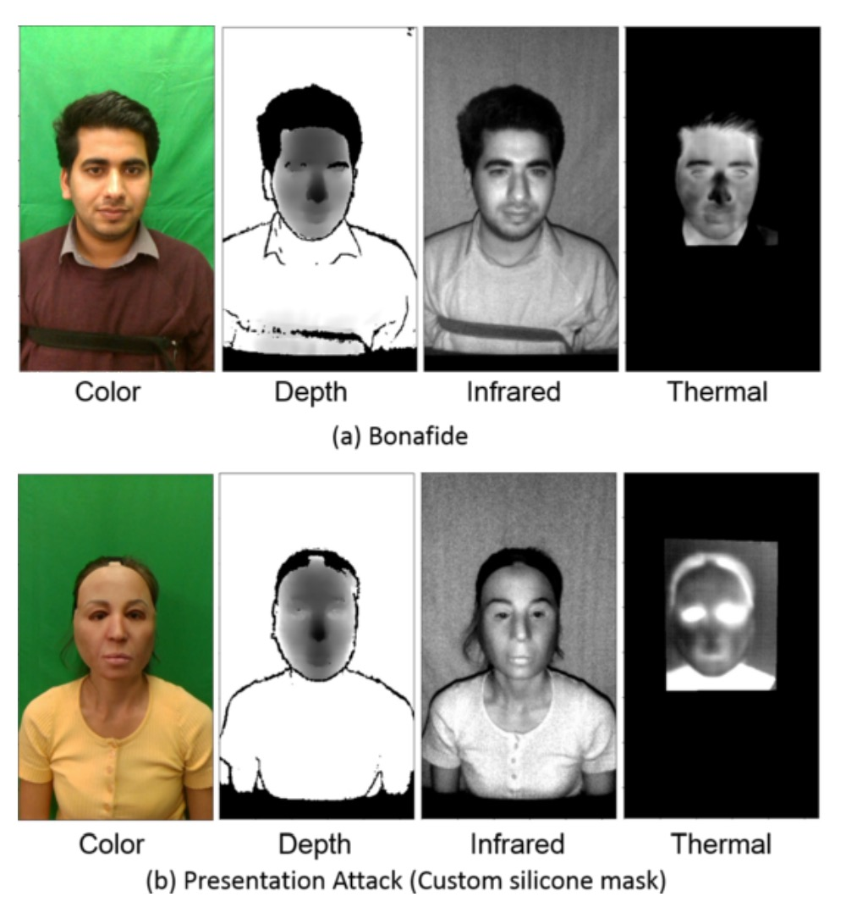

## The Invisible Face

[**Biometric Face Presentation Attack Detection with Multi-Channel Convolutional Neural Network**](https://arxiv.org/abs/1909.08848)

---

In the development of a field, new terms are often defined. These terms not only describe the technology but also influence the direction of future research.

In this paper, spoofing attacks are referred to as Presentation Attacks (PA). The definition of PA is:

> **Disruptive requests initiated by a user to the biometric recognition subsystem that may serve the following purposes:**
>
> 1. **Impersonation Attack**
> 2. **Obfuscation Attack**
>
> **Both situations are classified as Presentation Attack (PA).**

## Defining the Problem

When Convolutional Neural Networks (CNNs) entered the Face Anti-Spoofing (FAS) field, traditional methods relying on handcrafted features were quickly replaced. However, even with CNNs, many methods still only use RGB images for judgment, that is, facial photos taken under normal visible light conditions.

The issue is that spoofing techniques have long since evolved beyond the "Print" level. Nowadays, silicone masks, 3D models, and other sophisticated techniques have become more common. Relying solely on RGB information is no longer sufficient.

As a result, some research started to introduce depth information to help, such as using Time-of-Flight (TOF), structured light, or dual-lens systems to create 3D vision, detecting facial distance and contour changes.

Since we're already introducing more dimensions to solve the problem, why not go a step further?

> **Besides RGB images, we can find additional information such as depth, heat, and more.**

This paper starts from this perspective. The authors not only used color and depth data but also incorporated Near-Infrared (NIR) and thermal imaging (Thermal) to include more "invisible facial cues" into the model.

However, this also encounters a very practical issue: datasets are not keeping up. Most open datasets only include RGB data, and those with depth data are limited in quantity, which hinders the training of stable models, let alone performing generalization tests.

Thus, another key contribution of this paper is the introduction of a new dataset:

> **WMCA (Wide Multi-Channel Presentation Attack).**

It not only includes various 2D and 3D spoofing techniques (such as paper masks, silicone masks, rigid materials, transparent shields, etc.), but also provides synchronized data from four channels: RGB, depth, NIR, and thermal images.

By allowing the model to see more dimensions of information, it becomes harder for attackers to deceive the system simultaneously.

## Solving the Problem

### Model Architecture

<figure style={{"width": "90%"}}>

</figure>

In terms of model design, the authors propose a multi-channel convolutional neural network architecture (Multi-Channel CNN, MC-CNN), aimed at integrating information from different sensor channels to improve the model's ability to detect spoofing attacks.

In the FAS field, the lack of datasets remains a significant issue. As a result, most research does not train a CNN from scratch but instead opts to use pre-trained networks for transfer learning.

This paper follows the same approach by using a pre-trained face recognition model as the backbone. The chosen model is the lightweight [**LightCNN**](https://arxiv.org/abs/1511.02683), which is used to extract facial features from each channel.

Before entering the network, images from each channel undergo alignment and normalization processing. Face detection is done using MTCNN, and feature point detection is done using SDM. The eyes and mouth are aligned to a common coordinate, and then adjusted to 128×128 grayscale images.

The RGB channel serves as the reference, and other channels, such as depth, near-infrared, and thermal images, are synchronized based on the RGB feature points to ensure consistency across both space and time. Non-RGB images are also standardized via MAD and converted into 8-bit format for easier input into the model.

Each channel passes through a shared LightCNN architecture to extract the corresponding facial features. These feature vectors, each with a dimension of 256, are then concatenated, resulting in a unified representation, which is passed through two fully connected layers for classification:

- The first fully connected layer has 10 nodes.
- The second layer is a sigmoid output (1 node) indicating whether it is a spoofing attack.

The overall training uses binary cross-entropy (BCE) as the loss function:

$$
L = −(y \log(p) + (1 − y) \log(1 − p))
$$

Where $y$ is the true label (1 for `REAL`, 0 for `SPOOF`), and $p$ is the model's predicted probability.

### WMCA Dataset

:::tip
If you're thinking about creating your own dataset, the design details in this section might offer you plenty of inspiration.

For more information, check out: [**IDIAP/data**](https://www.idiap.ch/en/scientific-research/data/wmca)
:::

To validate the performance of multi-channel models in anti-spoofing tasks, the authors additionally created a new dataset called:

- **WMCA (Wide Multi-Channel Presentation Attack)**.

This dataset is carefully designed not only to fill the gap in the number of channels present in existing PAD datasets but also to cover a rich and challenging variety of attack methods.

The dataset includes video data from **72 subjects**, with each person recorded for both bonafide (real samples) and multiple presentation attack scenarios, with each video lasting approximately 10 seconds. The recording process uses multiple sensors synchronized to capture the data, resulting in a total of about **5.1 TB** of uncompressed data, making it one of the few high-quality FAS datasets available.

<figure style={{"width": "60%"}}>

</figure>

WMCA uses two sets of sensors for synchronized recording, covering various spectra and depth information. The devices used are shown in the image above, where:

- **(b) Seek Thermal Compact PRO**: Provides thermal imaging (Thermal)
- **(c) Intel RealSense SR300**: Provides RGB, depth, and near-infrared (NIR) channels

These sensors are modularly installed on the same optical frame to maintain consistent shooting angles and distances. The RGB channel records at 30fps, while thermal imaging records at 15fps. Each video stores approximately **300 frames** per channel (thermal images store 150 frames), with all data being uncompressed for high-quality analysis. The resulting image samples are shown below:

<figure style={{"width": "80%"}}>

</figure>

To ensure spatial and temporal consistency of the multi-channel data, the authors developed a custom calibration board with thermal contrast characteristics and used high-power lighting for synchronized shooting. They also used custom software to automatically capture corresponding points for calibration.

The data collection lasted for five months and spanned seven different recording stages. Each stage involved changes in lighting, backgrounds, and device settings, simulating a variety of real-world scenarios, including:

- **Lighting**: Sunlight, LED side lighting, office lighting, etc.
- **Background**: Uniform backgrounds vs. complex backgrounds
- **Wearing Glasses**: For bonafide samples, both "with glasses" and "without glasses" versions were recorded
- **Masks and Fake Heads**: Hot air was blown across the face before recording to enhance the camouflage realism in the thermal channel

All participants faced the camera with a neutral expression and maintained a distance of approximately 40 cm. The entire shooting process was controlled by an operator to ensure consistency and comparability across all data.

### Seven Types of Attacks

<figure style={{"width": "50%"}}>

</figure>

The detailed number of attack samples in WMCA is shown in the table above. It contains **1332 spoof attack samples**, categorized into seven main types, each with different levels of challenge:

1. **Glasses**: Funny fake glasses, paper glasses, etc. (Partial occlusion attack)
2. **Fake Head**: Various model heads, some heated to simulate body temperature
3. **Print Attack**: Using high-resolution inkjet printers or office laser printers to output facial photos
4. **Replay Attack**: Using devices like an iPad or smartphone to play pre-recorded facial videos
5. **Rigid Mask**: High-fidelity rigid masks, decorative plastic masks
6. **Flexible Mask**: Homemade silicone masks that mimic real facial features
7. **Paper Mask**: Paper masks designed to resemble a real identity

These attack types range from the simplest 2D attacks to highly realistic 3D attacks. Coupled with multi-spectral data, this significantly enhances the dataset’s utility for training and testing models’ generalization abilities.

<figure style={{"width": "80%"}}>

</figure>

### Evaluation Protocol and Experimental Setup

WMCA supports two experimental protocols corresponding to the "known attacks" and "unknown attacks" scenarios:

- **Grandtest Protocol**: The simulated attack types are known. The data is divided into train / dev / eval sets, with each subject appearing only once. All attack types are distributed across the three sets.

- **Unseen Attack Protocol (LOO)**: A stricter test designed for generalization ability. Seven leave-one-out (LOO) protocols are defined, where each time one attack type is excluded as an "unknown attack" and only appears in the test set. For example, in the "LOO fakehead" protocol, fake head attacks do not appear in the training or validation sets and are only evaluated in the testing phase.

Each video is sampled for 50 frames (average sampling), and each corresponding set of four-channel images from the same time point forms a training sample, treated as an independent sample for training and inference.

### Evaluation Metrics

Performance evaluation uses the three standard metrics defined by [ISO/IEC 30107-3]:

- **APCER** (Attack Presentation Classification Error Rate) - The rate of attack samples being misclassified as real.
- **BPCER** (Bonafide Presentation Classification Error Rate) - The rate of real samples being misclassified as attacks.
- **ACER** (Average Classification Error Rate) - The average of the above two errors.

Additionally, ROC curves are plotted to assist in comparing the overall classification abilities of various methods.

:::tip
In previous papers, you may have encountered similar metrics, such as:

- **False Rejection Rate (FRR)**: The proportion of legitimate access requests incorrectly rejected (legitimate users misclassified as attacks).
- **False Acceptance Rate (FAR)**: The proportion of attack samples incorrectly accepted (attackers misclassified as legitimate users).

These two error rates combine into the **Half Total Error Rate (HTER)**, calculated as:

$$
\text{HTER} = \frac{\text{FAR} + \text{FRR}}{2}
$$

---

Conceptually, they are the same, but over time, researchers have provided more refined definitions and standardized names to avoid misunderstandings in discussions.

:::

## Discussion

### Baseline System Performance in Grandtest

<figure style={{"width": "90%"}}>

</figure>

The above chart shows the performance of the baseline system under the grandtest protocol, with thresholds based on a BPCER = 1% setting from the dev set. We can observe several key points from the table:

- In the single-channel tests, the **Infrared channel combined with RDWT-Haralick features** performed the best, indicating that IR information provides strong discriminatory power for liveness detection.
- **FASNet, although using only the RGB channel, outperformed the IQM-LBP series** due to its structural design and ImageNet pre-trained weights, showing that deep learning architectures can optimize feature learning even with a single channel.
- While **score-level fusion of multiple channels can further improve recognition performance**, the improvement is limited (ACER still around a few percent), indicating that traditional methods struggle to effectively integrate cross-channel features, which is still insufficient for high-security applications.

### MC-CNN vs Best Baseline (Grandtest)

<figure style={{"width": "70%"}}>

</figure>

The above figure compares the final performance of MC-CNN with the best baseline system on the dev and test sets:

- **MC-CNN achieved ACER = 0.3% on the test set, significantly outperforming the baseline (typically above 2%)**.

By learning joint representations across multiple channels, the model effectively integrates complementary information from RGB, Depth, IR, and Thermal channels. This result highlights that score fusion alone is limited, and the key is designing multi-channel architectures with joint embedding capabilities.

### Recognition Performance in Unseen Attack Scenarios

<figure style={{"width": "90%"}}>

</figure>

To evaluate the model's generalization ability to unseen attacks, the authors designed seven LOO protocols in WMCA, where one attack type is excluded from the training and validation sets and appears only in the test set:

In most unseen attack scenarios, MC-CNN outperforms the traditional baseline, demonstrating strong generalization across attack types. For example, after excluding silicone or replay attacks, the system still effectively detects unseen attacks (ACER is noticeably lower than the baseline).

However, the **glasses attack** performed poorly in both the baseline and MC-CNN systems. The primary reason for this is the high similarity of the visual features between bonafide individuals wearing glasses and the glasses attack, particularly in the depth and thermal channels, which resulted in the model misclassifying it as a real sample.

## Conclusion

The shortcomings of this paper are quite apparent. In real-world applications, we often only have access to RGB images. The hardware costs and synchronization requirements of multi-channel sensor devices make this approach difficult to implement directly in practice.

However, from the perspective of the dataset, this paper defines the "unseen attack" evaluation setting, which differs from traditional single-classification criteria. This is still valuable in the context of today's open-set and anomaly detection discussions. Additionally, the challenges identified by the authors (such as detecting partial attacks and the fuzzy boundaries between attack types) remain significant issues that researchers still face.

Lastly, the concept of "multi-channel" could be further expanded into "multi-modal":

> **Not only different spectral or depth dimensions of image inputs but also combining voice, behavior, contextual information, and other heterogeneous perception sources to develop a truly cross-perceptual-domain defense system.**

From this perspective, while this paper may not be a pioneer in multi-modal AI, it provides an early prototype of sensor fusion for joint perception, which remains insightful for future developments.
