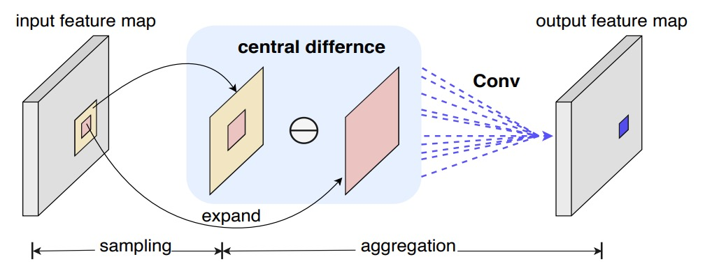
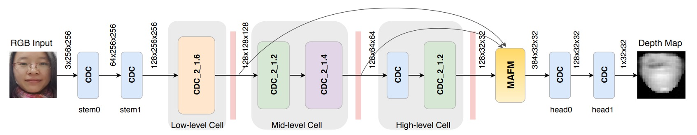
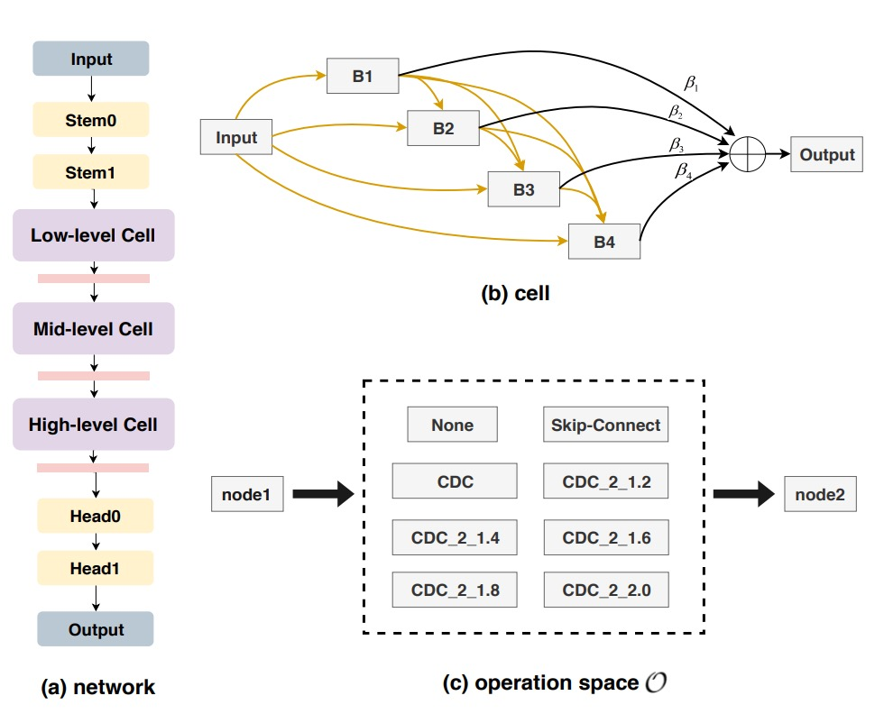
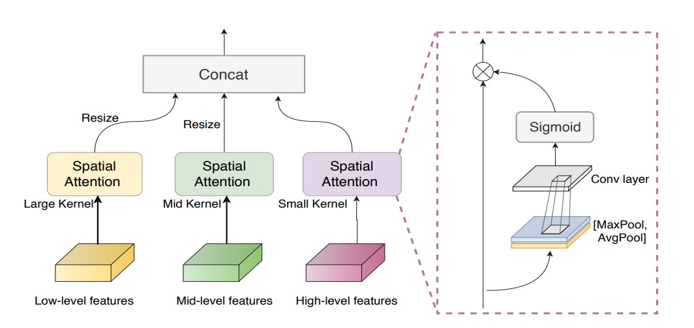
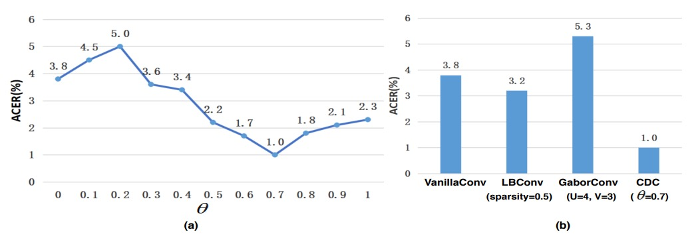
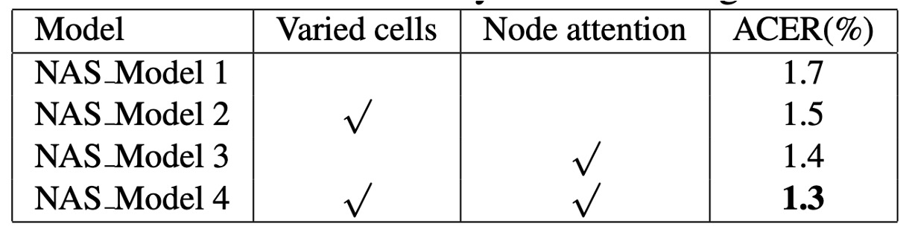
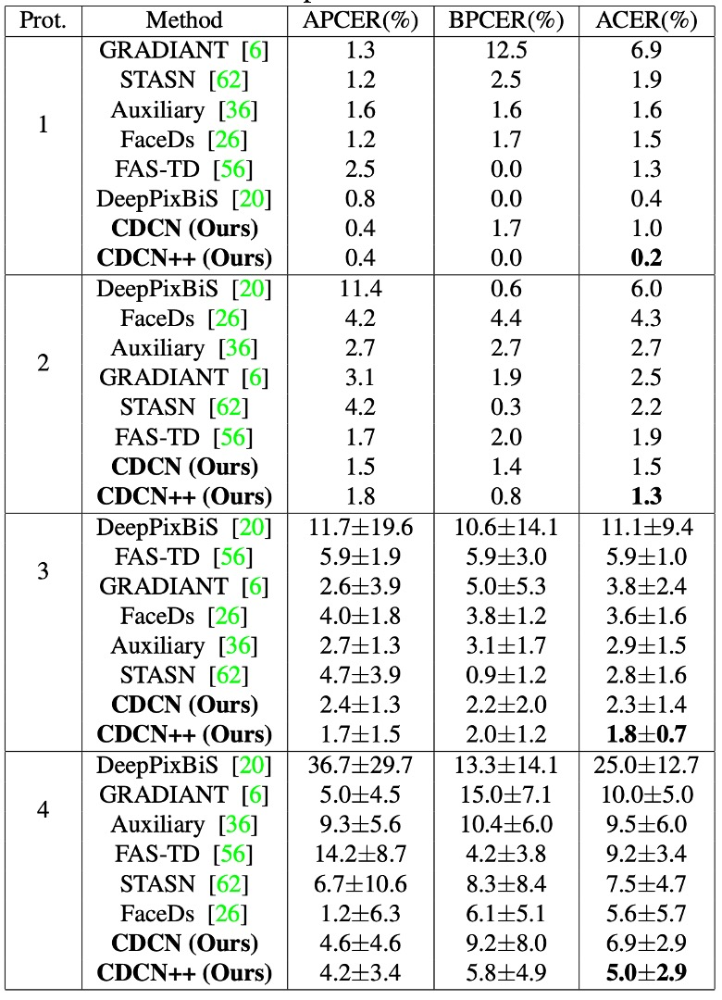
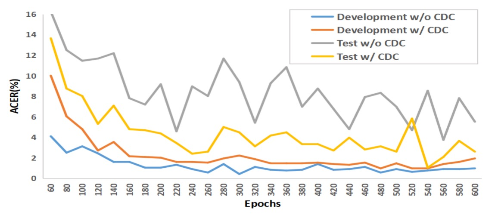
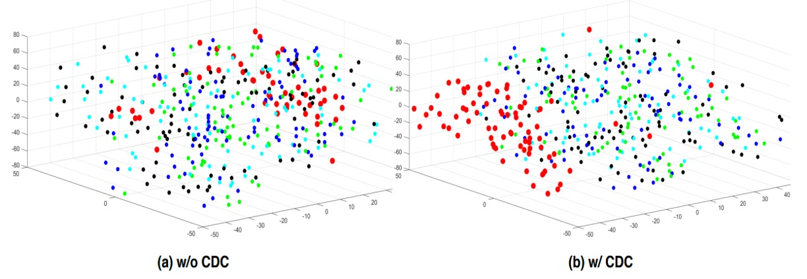

## Between Truth and Falsehood

[**Searching Central Difference Convolutional Networks for Face Anti-Spoofing**](https://arxiv.org/abs/2003.04092)

---

People tend to believe that as long as the model is deep enough and data is abundant, the system can naturally distinguish between "real" and "fake."

But perhaps we have overlooked a more fundamental problem.

This time, let's look at a very famous classic paper: CDCN.

## Problem Definition

In an era where face recognition has become the standard, Face Anti-Spoofing (FAS) gradually turns into a critical checkpoint in identity verification workflows. Attack methods have evolved from high-resolution printing, video replay, to sophisticated 3D masks, and continue to emerge.

Facing such opponents, the technical community once pinned hopes on handcrafted features: local descriptors like LBP, DoG, HOG, SIFT, which once captured subtle patterns, noise, and printing residuals hard for the human eye to detect.

Unfortunately, these methods are sensitive to scene changes and lack robustness, failing to meet modern application demands.

Thus, we turned to deep learning, entrusting Convolutional Neural Networks (CNNs) to discriminate the boundary between real and fake.

But CNN’s strength is also its blind spot.

Deep architectures excel at abstract semantics but gradually forget low-level details, especially those lattice textures, moiré patterns, or reflective edges only visible under specific lighting and angles. When the environment shifts slightly or the camera changes, these models not only fail to generalize but may even mistake background textures or screen borders for live features.

To compensate for the semantic gap, some began introducing depth maps as auxiliary supervision signals, aiming to teach the model finer spatial perception. However, most of these architectures remain expert-designed and rely on classification backbones (e.g., ResNet, VGG, DenseNet) not originally created for FAS, so their generalization remains limited.

The problem boils down to a fundamental point: if the convolution itself is insensitive to details, higher-level designs cannot compensate for its visual foundation’s distortion.

> **Could convolution itself be the unopened door?**

## Solution

Before we start, let's review how convolution operates.

We know standard 2D convolution can be written as:

$$
y(p_0) = \sum_{p_n \in R} w(p_n) \cdot x(p_0 + p_n)
$$

where $p_0$ is the output feature map position, and $R$ is the receptive field (e.g., 3×3).

This "local weighted sum" approach has become the cornerstone of vision tasks but proves insufficient against attacks, because those extremely subtle spoof traces often don't exist in pixel intensity alone, but hide in the differences between pixels.

### Central Difference Convolution (CDC)

<div align="center">
<figure style={{"width": "80%"}}>

</figure>
</div>

Inspired by LBP, the authors introduced "central difference" into convolution, so each computation includes a "variation amount":

$$
y(p_0) = \sum_{p_n \in R} w(p_n) \cdot \bigl(x(p_0 + p_n) - x(p_0)\bigr)
$$

Compared with traditional convolution, the focus here is no longer on the "magnitude of the value" but on "how much it differs from the center."

Just like detecting fine lines or protrusions, what matters more might be the "edges," not the "overall brightness."

:::tip
It essentially means edge detection.
:::

However, pure central difference sometimes loses the absolute information of the image itself.

So the authors further proposed a hybrid form:

$$
y(p_0) =
\theta \sum_{p_n \in R} w(p_n) \cdot \bigl(x(p_0 + p_n) - x(p_0)\bigr)
\;+\; (1 - \theta) \sum_{p_n \in R} w(p_n) \cdot x(p_0 + p_n)
$$

where $\theta \in \[0,1]$ is a balancing coefficient:

- When $\theta=0$, it reverts to the original convolution;
- When $\theta=1$, it focuses entirely on the difference term.

The authors named this mixed operation **CDC** (Central Difference Convolution), which preserves both "intensity" and "difference" information sources.

For practical implementation, it can be rearranged as:

$$
y(p_0) =
\sum_{p_n \in R} w(p_n) \cdot x(p_0 + p_n)
\;-\;\theta \cdot x(p_0) \sum_{p_n \in R} w(p_n)
$$

Thus, in common deep learning frameworks (PyTorch, TensorFlow), CDC can be integrated into networks with just a few lines of code, without adding extra parameters.

Here is a simple implementation of a CDC convolutional layer roughly as follows:

```python
class Conv2dCD(nn.Module):

    def __init__(self, *, theta=0.7, bias=False, **conv_kwargs):
        super().__init__()
        self.theta = theta
        self.conv = nn.Conv2d(bias=bias, **conv_kwargs)

    def forward(self, x):
        out = self.conv(x)  # regular convolution

        if self.theta == 0:
            return out

        # central difference term

        # (C_out, C_in, 1, 1)
        k_sum = self.conv.weight.sum(dim=(2, 3), keepdim=True)
        out_diff = F.conv2d(x, k_sum, bias=None,
                            stride=self.conv.stride,
                            padding=0,
                            groups=self.conv.groups)

        return out - self.theta * out_diff
```

### CDC Networks

Previous studies mostly attempted to use **depth maps** as auxiliary supervision signals, strengthening live detection through pixel-level contrast.

The authors followed this idea by building a network backbone based on **DepthNet**, replacing all convolutions with CDC to form **Central Difference Convolutional Networks (CDCN)**.

- **Network Input/Output**:

  - Input: single-frame RGB face image (3×256×256).
  - Output: predicted grayscale depth map (32×32).

- **Feature Fusion**: low-, mid-, and high-level features are concatenated to enhance capturing facial texture and spatial structure.

- **Hyperparameter**: $\theta=0.7$ is set in experiments, emphasizing difference signals while retaining some original intensity information.

For the loss function, to supervise spoof traces more finely, two losses are introduced:

1. **MSE loss $L_{\text{MSE}}$**: measures mean squared error between predicted and ground truth depth.
2. **Contrastive Depth Loss $L_{\text{CDL}}$**: assists in capturing finer depth differences, enabling the model to distinguish real facial edge contours from fake textures caused by printing.

The overall loss is:

$$
L_{\text{overall}} = L_{\text{MSE}} + L_{\text{CDL}}.
$$

### CDCN++



However, the overall CDCN architecture is still manually designed and may not be optimal for the task.

Therefore, the authors combined **Neural Architecture Search (NAS)** to automatically find the best-suited architecture for FAS, resulting in an advanced version: **CDCN++**, shown above.

Traditionally, NAS is used for image classification or detection; here it is introduced for **deeply supervised FAS tasks**. Through bi-level optimization, weights and architecture parameters are alternately tuned on training and validation sets, as illustrated below:

<div align="center">
<figure style={{"width": "80%"}}>

</figure>
</div>

The search space is divided into multiple cells, each containing candidate operations such as skip-connect, CDC, or none. A **node attention** strategy is introduced to automatically evaluate the importance of intermediate nodes.

Ultimately, the system outputs the optimal backbone architecture for FAS.

### Multiscale Attention Fusion Module

<div align="center">
<figure style={{"width": "80%"}}>

</figure>
</div>

Even with a NAS-discovered backbone, simply concatenating low-, mid-, and high-level features may still overlook which spatial regions deserve more focus.

To address this, the authors introduced the **Multiscale Attention Fusion Module (MAFM)**:

$$
F'_i = F_i \;\odot\; \Bigl[\sigma\Bigl(C_i\bigl(\bigl[\mathrm{A}(F_i),\,\mathrm{M}(F_i)\bigr]\bigr)\Bigr)\Bigr]
,\quad i \in \{\text{low},\,\text{mid},\,\text{high}\},
$$

where $\odot$ denotes Hadamard (element-wise) multiplication, $\mathrm{A}$ and $\mathrm{M}$ represent average pooling and max pooling on the input feature map respectively, $\sigma$ is the sigmoid function, and $C_i$ is a convolution operation.

In summary, CDCN++ integrates **central difference convolution + NAS-discovered backbone + multiscale attention fusion**, driven by depth supervision, achieving both high accuracy and strong generalization.

## Discussion

The authors evaluated their method on six public datasets, including high-resolution sets (OULU-NPU, SiW) and low-resolution ones (CASIA-MFSD, Replay-Attack, MSU-MFSD), as well as cross-testing with unknown attack types on SiW-M.

Depending on the dataset and scenario, metrics such as ACER, HTER, AUC, and EER were used to assess model recognition performance and generalization ability in unseen environments.

During training, PyTorch was used with Adam optimizer. Pre-generated facial depth maps (via PRNet) served as supervision signals. The model outputs depth predictions for single frames, whose mean is taken as the final classification score. Unless otherwise specified, all experiments kept $\theta=0.7$ as the CDC default setting.

### Impact of CDC Parameter

<div align="center">
<figure style={{"width": "80%"}}>

</figure>
</div>

1. **Importance of $\theta$**

   As shown in figure (a), the relationship between $\theta$ and model performance is nonlinear. When $\theta > 0.3$, CDCN significantly outperforms the pure convolution baseline ($\theta=0$, ACER = 3.8%) on OULU-NPU Protocol-1.

   The best performance occurs at $\theta=0.7$ with ACER as low as 1.0%. This indicates that **moderate weighting of central difference** helps the model extract subtle textures, reducing feature shifts under varying lighting and device conditions.

2. **Comparison with other convolution operations**

   Figure (b) further shows that the proposed CDC significantly outperforms common alternatives such as Local Binary Convolution and Gabor Convolution. Although LBConv also yields some gains, it still lags behind CDC, demonstrating that a hybrid of gradient information plus intensity is better suited for the high sensitivity demands in face anti-spoofing.

### Contributions of NAS and MAFM

<div align="center">
<figure style={{"width": "70%"}}>

</figure>
</div>

Experimental results indicate that enabling both varied cells and node attention during NAS training notably improves search quality.

The authors explain this as FAS requiring optimal extraction and semantic fusion of details across multiple levels (low, mid, high). Allowing each cell layer autonomous design space and applying node attention at the output to select the most discriminative nodes better mimics the hierarchical processing characteristic of human vision.

Directly fusing the searched backbone features across multiple levels already surpasses the baseline without NAS, yet still leaves room for improvement, as shown below:

<div align="center">
<figure style={{"width": "70%"}}>

</figure>
</div>

Further adding MAFM reduces ACER by another 0.5%, demonstrating that applying differentiated attention in spatial domain — especially with appropriate kernel sizes (e.g., 7×7, 3×3) — significantly enhances the model’s ability to discern which facial regions “deserve a closer look.”

### Performance on OULU-NPU

<div align="center">
<figure style={{"width": "70%"}}>

</figure>
</div>

Results on OULU-NPU show CDCN++ achieves the lowest ACER across four protocols (min 0.2%, max 5.0%) and similarly strong performance on the three SiW protocols.

Compared to advanced methods requiring multi-frame dynamic features (e.g., STASN, Auxiliary), CDCN++ attains or surpasses top performance with single-frame inputs, highlighting its potential for real-time deployment.

### Cross-Dataset Generalization

<div align="center">
<figure style={{"width": "70%"}}>

</figure>
</div>

When facing unseen attack types (13 in SiW-M) and cross-dataset scenarios, the CDC architecture maintains excellent generalization.

For CASIA-MFSD → Replay-Attack (CR) cross-test, CDCN++’s HTER is only 6.5%, about 11% lower than previous state-of-the-art, confirming that "local gradient differences" correspond well to robustness against unknown environments and spoofs.

### Analysis and Visualization

<div align="center">
<figure style={{"width": "80%"}}>

</figure>
</div>

The above shows results from OULU-NPU Protocol-1.

Traditional convolution tends to overfit the training set and perform poorly on test data, whereas the CDC model’s training and testing curves run nearly parallel, demonstrating strong resistance to varying illumination and environment changes.

<div align="center">
<figure style={{"width": "80%"}}>

</figure>
</div>

Using t-SNE visualization of features before and after CDC, the authors found CDC yields clearer clustering of genuine and fake face representations, reflecting its more effective "separation" of real vs. spoof cues.

## Conclusion

The core hypothesis of this paper is a highly symbolic handcrafted disentanglement:

> **Spoof traces should leave anomalies in local gradients.**

This is both a design simplification and an intuitive observation.

If a real face is continuous, delicate, and three-dimensional, any reproduced spoof will inevitably show some "difference" at edges, textures, or reflections.

What CDC does is extract such differences and embed them into the convolution operation in a controllable, interpretable way. From this perspective, **it is a handcrafted feature disentanglement of spoof traces**, more primitive than later automated latent factor separation architectures, but methodologically purer.

This "disentangle first, then recognize" technical stance has been repeatedly echoed in style transfer, feature separation, and domain generalization research, with different forms, and prettier packaging.

And CDC is one of the early tools that attempts to describe the "shape of difference."
