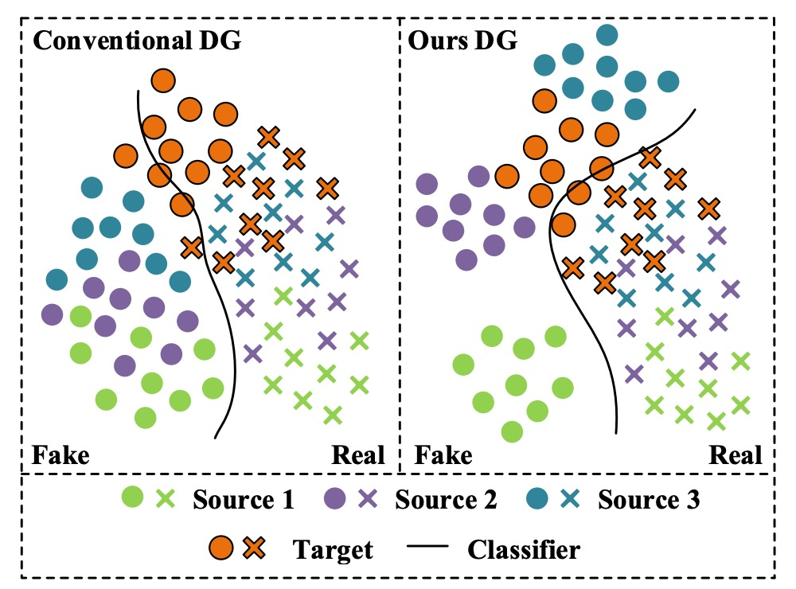
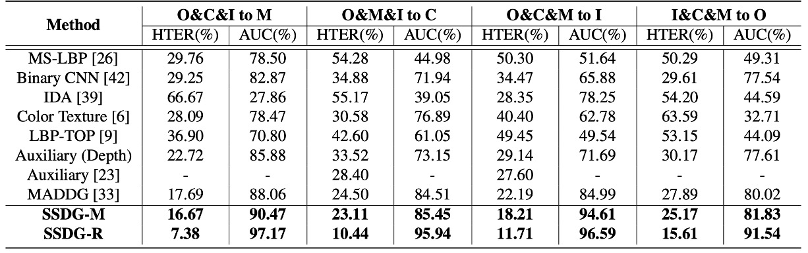
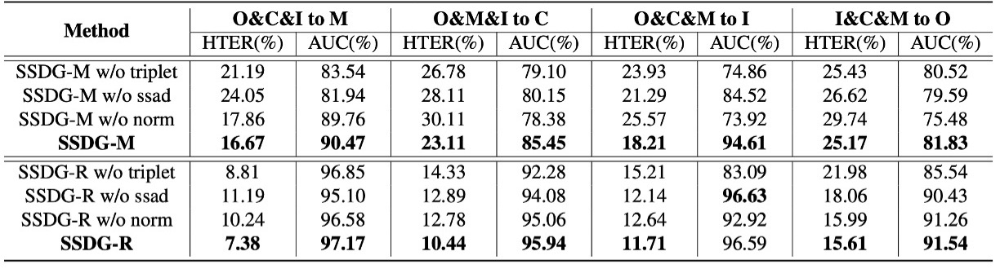

## Stable Realness

[**Single-Side Domain Generalization for Face Anti-Spoofing**](https://arxiv.org/abs/2004.14043)

---

The techniques used to attack facial recognition systems are varied and plentiful, and the solutions to address them are no less innovative.

Starting with this paper, let's look at FAS research based on Domain Generalization (DG) techniques.

## Problem Definition

For the FAS problem, researchers have developed two major technical routes:

- **Texture-Based**:
  This method identifies real and fake faces through differences in image details, such as color distortion, material texture abnormalities, etc. Methods include handcrafted features (e.g., LBP, HOG, SIFT) as well as recent CNN feature learning.

- **Time-Series Based**:
  This method analyzes the changes in multiple frames of images, such as eye blinking, mouth movements, or rPPG pulse signals, and uses CNN-LSTM or RNN architectures to capture liveness indicators.

These methods perform well within a specific dataset (intra-database), but once the model is applied to another dataset (cross-database), the accuracy drops sharply.

For example:

<div align="center">
<figure style={{"width": "70%"}}>

</figure>
</div>

Let's look at the image on the left first.

From practical experience, each color can represent "a specific phone model":

- **Green**: iPhone XX
- **Purple**: Samsung OO
- **Blue**: Pixel YY

Then there's:

- **Orange**: A phone with imaging quality that is drastically different from others but not included in the training dataset.

---

After training an FAS model with the first three datasets, we discover that the pass rate for the "Orange" phone is particularly low. However, it turns out that many users of the "Orange" phone exist, so when we deploy the model, we receive a large number of complaints.

What we expected was the scenario on the right, where the model had a certain level of generalization ability during training and could perform well across different data sources. But in reality, we were slapped with the harsh truth.

The inability to generalize effectively to different data sources is a recurring issue, and there are several reasons for it:

- **Distribution Differences**: The training and testing datasets come from different sources, such as background, resolution, lighting conditions, capturing devices, and demographic composition.
- **The diversity of fake faces is much higher than that of real faces**, with variations in attack methods and production processes, making it difficult to consolidate fake face features and leading to blurred classification boundaries.

Traditional methods rely too much on dataset-specific features, resulting in models learning representations with obvious "dataset bias."

Therefore, the authors of this paper believe that the FAS proposition should be:

> **Design a highly generalized model without using any target data.**

Otherwise, no matter how much data we collect, we will still not be able to handle fake faces from different sources and attack types.

## Solution

<div align="center">
<figure style={{"width": "90%"}}>

</figure>
</div>

To address the generalization difficulty caused by the "high heterogeneity of fake face features" and the "relative consistency of real faces," the authors propose a novel anti-spoofing training strategy: **Single-Side Domain Generalization (SSDG)**.

As shown in the image above, the design philosophy of this framework can be summarized in one sentence:

> **The closer the features of real faces, the better; fake faces can be ignored.**

In other words, SSDG does not force the creation of a common generalization space for both real and fake faces, but instead adopts an asymmetric strategy—cross-domain adversarial training is applied to real faces, making their distribution tend to be consistent, while for fake faces, the distribution differences are deliberately retained and even strengthened for their specificity.

This contrastive learning design solidifies the classification boundary and effectively generalizes to unseen target datasets.

The overall model includes the following key modules:

- Feature Generator (G)
- Domain Discriminator (D)
- Face Anti-Spoofing Classifier
- Asymmetric Triplet Loss Training
- Feature and Weight Normalization Modules

Let’s take a closer look at each of these modules.

### Single-Side Adversarial Learning

In the DG (Domain Generalization) field, a common technique for overcoming cross-domain challenges is to introduce adversarial training. This prevents the model from distinguishing which domain a sample originates from, allowing it to learn domain-invariant features.

The method is simple: add a "domain classifier" to the model, teaching it to classify samples as either "source A" or "source B."

Typically, we allow the classifier to decrease its loss as classification performance improves. However, in adversarial training, the opposite is true: the better the classifier performs, the higher the loss, forcing the model to **not** learn domain-specific features.

In this paper, the authors introduce a new adversarial learning method:

- **Single-Side Adversarial Learning (SSAL)**.

The modeling approach is as follows:

There are $N$ source datasets, denoted as $D = \{D_1, D_2, ..., D_N\}$, each containing:

- Real face samples $X_r$
- Fake face samples $X_f$

These are fed into the feature generator, resulting in feature representations:

$$
Z_r = G_r(X_r), \quad Z_f = G_f(X_f)
$$

Since parameters are shared, $G_r$ and $G_f$ are the same model $G$, with the distinction being in the input source.

Next, the features $Z_r$ are input to the domain classifier $D$ to determine which dataset they belong to. To enable the model to learn cross-domain consistent real face features, the feature generator $G$ attempts to "fool" the classifier, creating an adversarial learning process.

The overall loss function is:

$$
\min_D \max_G \ \mathcal{L}_{\text{Ada}}(G, D) = - \mathbb{E}_{(x,y) \sim X_r, Y_D} \sum_{n=1}^{N} \mathbf{1}[n = y] \log D(G(x))
$$

Where $Y_D$ is the domain label, and $\mathbf{1}[n = y]$ is the indicator function, signifying whether the sample belongs to the $n$-th dataset.

In this adversarial process, **fake faces do not participate**, preventing their high variability from destabilizing the training process.

To implement this "train one side, adversarily counteract the other" mechanism, the authors use the **Gradient Reversal Layer (GRL)**. This is a common trick used in DG models, which we’ll explain shortly.

### Asymmetric Triplet Loss

Since we are abandoning the idea of compressing fake faces into a shared feature space, we need to find a way to separate them and increase the distance from real faces. This is the problem that the asymmetric triplet loss aims to solve.

The implementation works as follows:

Suppose there are three source datasets. We reclassify the samples into four categories:

- All real faces → One category (Cross)
- Three types of fake faces → Each in its own category (Circle / Square / Triangle)

The goal is to satisfy the following:

1. Separate fake faces (inter-domain separation)
2. Cluster real faces together (intra-class compactness)
3. Increase the distance between real and fake faces (inter-class separation)

As shown in the image below:

<div align="center">
<figure style={{"width": "80%"}}>

</figure>
</div>

For each anchor/positive/negative triplet combination $(x_a^i, x_p^i, x_n^i)$, the asymmetric triplet loss is defined as:

$$
\mathcal{L}_{\text{AsTrip}}(G) = \sum_i \left( \|f(x_a^i) - f(x_p^i)\|_2^2 - \|f(x_a^i) - f(x_n^i)\|_2^2 + \alpha \right)
$$

Where $\alpha$ is the margin hyperparameter, controlling the width of the classification boundary.

This design forces the model to naturally separate real and fake faces in the feature space, while maintaining stable and compact distributions for real faces.

### Feature and Weight Normalization

The authors further introduce a dual normalization design to enhance feature consistency and classification boundary stability:

- **Feature Normalization**:
  Apply L2 normalization to all output features, ensuring they lie on the unit sphere, thus eliminating norm differences caused by image quality (such as lighting or lens conditions).

- **Weight Normalization**:
  Normalize the classifier's weight vectors $W_i$ to unit length, and set biases to zero, simplifying the classification decision to:

$$
\cos(\theta_1) - \cos(\theta_0) = 0
$$

This allows the model to focus on **directional differentiation** rather than relying on feature magnitude, further stabilizing the decision process.

After integrating these modules, the overall SSDG framework's training loss is:

$$
\mathcal{L}_{\text{SSDG}} = \mathcal{L}_{\text{Cls}} + \lambda_1 \mathcal{L}_{\text{Ada}} + \lambda_2 \mathcal{L}_{\text{AsTrip}}
$$

Where:

- $\mathcal{L}_{\text{Cls}}$: The cross-entropy loss for the general classifier
- $\lambda_1, \lambda_2$: Balancing coefficients to control the weight of adversarial and triplet losses

Unlike traditional methods that require pre-training and fine-tuning, SSDG adopts an **end-to-end training strategy**, optimizing all modules simultaneously, simplifying the process and improving overall stability.

:::info
By now, you might be thinking about various margin-based losses used in facial recognition. These can be explored during implementation.
:::

## Additional Supplement

:::tip
For readers who may not be familiar with DG or the concept of GRL, I’ll provide a brief technical note here to help you quickly grasp the concept and implementation of GRL.
:::

**What is GRL? Why is it so important for DG?**

In Domain Generalization (DG) and Domain Adaptation (DA), a very classic technique called **Gradient Reversal Layer (GRL)** was introduced in the 2015 DANN paper (Domain-Adversarial Neural Network). The core function of GRL is to enable **adversarial feature learning** during model training.

:::info
DANN is a highly cited paper with over 10,000 citations. We can discuss its content when we have time.
:::

To explain GRL in one sentence:

> **Do nothing during the forward pass, but secretly multiply the gradient by -1 during the backward pass.**

This allows us to create a tug-of-war effect between two training objectives: **the feature extractor tries to make the data source indistinguishable**, while the domain classifier attempts to **identify the data source**, which is the essence of adversarial learning.

The goal of DG is to make the model learn to ignore the information about the "data source," i.e., to make the features **domain-invariant**. However, these features cannot be directly "taught" but must be learned through feedback signals that "force" the model to learn:

- If the data is from different domains, the feature extractor must deceive the domain classifier so that it cannot distinguish between domains.
- If the domain classifier becomes too strong, the feature extractor will work harder to confuse the domain, and this mutual pulling will eventually converge to a feature space that works well across all domains.

GRL is the tool that implements this tug-of-war mechanism, allowing the whole process to be optimized automatically using standard backpropagation.

Here's a simple implementation of the forward and backward processes of GRL:

```python
import torch
from torch.autograd import Function

class GradientReversalFunction(Function):

    @staticmethod
    def forward(ctx, x, lambd):
        ctx.lambd = lambd
        return x.view_as(x)

    @staticmethod
    def backward(ctx, grad_output):
        return grad_output.neg() * ctx.lambd, None

def grad_reverse(x, lambd=1.0):
    return GradientReversalFunction.apply(x, lambd)
```

Usage in the model's forward pass looks like this:

```python
class DomainAdversarialNetwork(torch.nn.Module):

    def __init__(self):
        super().__init__()
        self.feature_extractor = ...
        self.classifier = ...
        self.domain_discriminator = ...

    def forward(self, x, lambd=1.0):
        feat = self.feature_extractor(x)
        class_out = self.classifier(feat)
        # Insert GRL: automatically reverse gradient during backprop
        reversed_feat = grad_reverse(feat, lambd)
        domain_out = self.domain_discriminator(reversed_feat)
        return class_out, domain_out
```

In this example, `lambd` is a hyperparameter that controls the strength of the reverse gradient. In the SSDG paper, a dynamic adjustment formula for `lambd` is used:

$$
\lambda = \frac{2}{1 + \exp(-10k)} - 1
\quad \text{with} \quad k = \frac{\text{current\_iters}}{\text{total\_iters}}
$$

This design allows the model to focus on the classification task during the early stages of training, and as training progresses, the intensity of adversarial learning increases, ultimately achieving a balance.

## Discussion

### Dataset Testing Setup

:::info
This testing method is still in use as of 2025. Readers might want to keep this in mind.
:::

The authors conducted experiments using four publicly available datasets, sourced as follows:

- **O**: OULU-NPU
- **C**: CASIA-FASD
- **I**: Replay-Attack
- **M**: MSU-MFSD

The testing method randomly selects one dataset as the test set, with the remaining three datasets used for training. This design simulates a real-world scenario where a model encounters new data sources that have not been seen during training. This results in four testing tasks:

- **O & C & I → M**
- **O & M & I → C**
- **O & C & M → I**
- **I & C & M → O**

This cross-design accurately simulates the most common problem during deployment: **the data the system faces may have never appeared in the training set.**

### Comparison with Other Methods

<div align="center">
<figure style={{"width": "90%"}}>

</figure>
</div>

The authors summarized the performance of the most representative FAS methods on four cross-database testing tasks, including:

- **CNN-based methods (Yang et al., Atoum et al.)**
- **Time-series and physiological signal methods (Liu et al. rPPG)**
- **Traditional feature-based methods (LBP, SURF)**
- **MADDG method (the only existing DG competitor)**

In the table above, if SSDG uses an MADDG-based architecture, it is called SSDG-M; if it uses a ResNet18-based architecture, it is called SSDG-R.

The experimental results show that SSDG outperformed all other methods with a clear margin on all tasks:

- Lowered HTER
- Increased AUC
- Consistently stable results, with no "lucky win" situations

Based on these results, the authors make several key observations:

- **Most existing methods do not address the cross-database distribution issue**:

  - They perform well on intra-database tests but fail when the environment changes.
  - They essentially learn dataset-specific features rather than generalizable representations.

- **MADDG is a rare exception, but it still has blind spots in its strategy**:

  - It tries to build a generalized feature space for both real and fake faces.
  - The variation in fake faces is too large, and their sources are too diverse, making such alignment difficult to converge, often leading to suboptimal results.

In contrast, the asymmetric learning strategy adopted by SSDG is more pragmatic:

- Real faces: cross-domain alignment, learning stable representations
- Fake faces: actively separating, not forcing alignment

This "let what should group together group, and let what should scatter scatter" strategy is the key to SSDG's success.

### Ablation Experiment

<div align="center">
<figure style={{"width": "90%"}}>

</figure>
</div>

In this table, the authors break down the three core modules of SSDG to observe the impact of removing each module:

- **ssad**: Single-side adversarial learning
- **triplet**: Asymmetric triplet loss
- **norm**: Feature and weight normalization

The analysis shows that regardless of whether using the MADDG-based or ResNet18-based architecture, removing any module leads to increased HTER and decreased AUC. The complete SSDG with all three modules performs the best and is the most stable.

This indicates that SSDG's performance is not driven by any single key technique but by the collaborative and interdependent design of all its components.

## Conclusion

The **SSDG framework** proposed in this paper is not based on larger networks or more data, but responds to a neglected fact in its design strategy:

> **Real faces are a stable signal, while fake faces are a chaotic signal. They should not be treated the same.**

Through this strategy, SSDG triumphed across four public datasets, even holding up well in scenarios with limited data and simplified architecture. This differentiated learning strategy has since become a standard approach in anti-spoofing tasks, no longer relying on a single unified fake face concept to handle all anomalous samples.

This has made SSDG an important milestone in the FAS field, opening the door for many subsequent DG-based studies.
