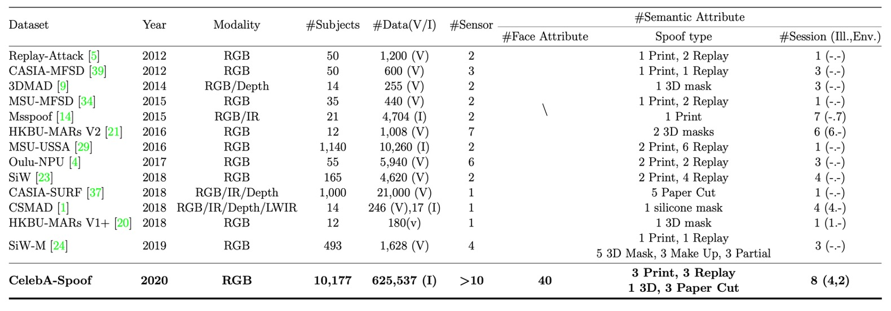

## Large-Scale Anti-Spoofing Trials

[**CelebA-Spoof: Large-Scale Face Anti-Spoofing Dataset with Rich Annotations**](https://arxiv.org/abs/2007.12342)

---

Face Anti-Spoofing (FAS) has become a familiar term in the computer vision community over the past few years. From phone unlocking, access control, to mobile payments, almost every facial interaction system faces the soul-searching question: "Is this face live or spoofed?"

However, as methods continue to evolve one after another, a critical issue has quietly surfaced:

> **The datasets are no longer enough.**

---

## Defining the Problem

Most existing FAS datasets have three obvious issues:

1. **Lack of Diversity**: There aren’t enough facial samples, scenarios are too limited, and the number of devices is small. Common datasets typically have fewer than 2000 people, 4 shooting scenarios, and fewer than 10 devices. How can such data support cross-scenario deployment?
2. **Sparse Annotations**: Datasets often only label "Live" or "Spoof," at most adding the spoof type, but without annotations on lighting conditions or background environments. Models don't learn the "non-facial but highly relevant" real-world clues.
3. **Performance Saturation**: On some datasets (e.g., SiW, OULU-NPU), the recall of ResNet-18 reaches 100.0% or 99.0% at FPR=0.5%. This means: these datasets **can no longer distinguish between good and bad models**.

The current dataset scale has reached a point where it can't support deep learning model training. It's like testing a university student with elementary school math problems. No matter how many problems you give, the results are all the same. What's the point?

The authors of this paper took on this issue: Let's tackle it.

## Solving the Problem

To solve the above problems, the authors introduced **CelebA-Spoof**.

At the time, it could be called "the largest, most annotated, and most diverse facial anti-spoofing dataset ever."

Let’s take a look at its specifications:

- **Massive Scale**: It includes 10,177 different identities and 625,537 images.
- **Rich Scenarios and Devices**: The images come from over 10 different input devices (mobile phones, tablets, computers, etc.), captured from 8 sessions (including 2 environments × 4 lighting conditions).
- **Extensive Annotations**: In addition to labeling Live/Spoof, each image also includes:
  - Spoof type (e.g., print, screen replay, etc.)
  - Lighting conditions (e.g., indoor lighting, direct sunlight, etc.)
  - Environmental background (e.g., office, outdoor street scene, etc.)
  - 40 facial attributes from CelebA (e.g., bangs, glasses, smile, etc.)

In total, **43 attributes**—not only is this a large number, but it allows us to explore the true challenges of FAS from various perspectives.

### CelebA-Spoof Dataset

<figure style={{"width": "90%"}}>

</figure>

CelebA-Spoof is the largest and most meticulously annotated FAS dataset, constructed with an emphasis not only on quantity but also on diversity and semantic richness.

The authors didn’t simply use pre-existing data to bulk it up. Instead, they started from the sources of Live and Spoof images, building a high-quality dataset step by step that aligns with real-world application scenarios.

The Live images in CelebA-Spoof are sourced from CelebA, a large facial dataset originally designed for facial attribute prediction. The authors carefully selected 202,599 images. However, this wasn’t just a straightforward “accept all” process. They manually removed potentially “non-true face” images from CelebA, such as advertisement posters, cartoon-style portraits, or other non-natural faces, to avoid mistakenly labeling borderline spoof images as real Live data.

To create Spoof images, the authors sorted the selected live images based on each subject's face size, selecting the top k=20 images to serve as the source material for spoof creation. This ensured that the spoof data maintained diversity while keeping a balanced distribution of spoof images across different subjects. Ultimately, 87,926 images were chosen to form the basis of the spoof images.

Next, the authors enlisted 8 data collectors and 2 annotators to develop a rigorous collection process, ensuring sufficient variation in angles, shapes, and devices used for spoof image capturing.

They planned three collection dimensions, as shown in the image below:

- **Angles**: Covering five types of head tilt ranges: vertical, looking down, looking up, straight, and tilted (-30° to +30°).
- **Shapes**: Simulating various ways of displaying physical or digital media, including regular flat display, folding, inward folding, and corner-turning situations.
- **Devices**: Using 24 different sensors, spanning PC, tablet, mobile phone, and cameras, with resolutions ranging from 12MP to 40MP.

In addition to the images themselves, CelebA-Spoof also organizes semantic information for each image.

The Live images retain the original 40 facial attributes from CelebA, such as gender, hairstyle, glasses, smile, etc. These attributes, though not originally designed for anti-spoofing tasks, are introduced into the FAS domain for the first time, providing extra clues for the model to understand "facial naturalness."

For Spoof images, three additional semantic attributes are added:

- **Spoof Type**
- **Illumination**
- **Environment**

These three dimensions define 8 session combinations (illumination × environment), with outdoor scenes being a significant breakthrough since they are the first systematic inclusion of outdoor spoof attack images in existing datasets, as shown below:

Finally, the authors also planned the statistical characteristics of CelebA-Spoof:

- **Total Images**: 625,537 images, with a Live/Spoof ratio of about 1:3.
- **Face Bounding Box Size**: Mainly between 0.01M and 0.1M pixels, close to mobile phone shooting conditions.
- **Train/Validation/Test Split**: Split as 8:1:1, with strict guarantees that subjects do not overlap across the three datasets, preventing models from learning "this face has been seen before."
- **Lighting Condition Distribution**: In addition to normal lighting, it includes 12% dark, 11% back light, and 19% strong light.
- **Attack Type Distribution Balance**: This allows the model to learn consistent features across various spoof types.

The table below compares CelebA-Spoof with other datasets:

### Model Architecture

<figure style={{"width": "90%"}}>

</figure>

In addition to the dataset, the authors also proposed a model architecture to test this dataset, called:

- **AENet (Auxiliary Information Embedding Network)**.

As shown in the image above, AENet is not a typical deep network architecture with a stacked design, but rather integrates the multi-level annotation information provided by the CelebA-Spoof dataset through **shared backbone features + dual-branch task decoupling**.

Let’s break down the structure:

The main body of AENet consists of a pre-trained CNN backbone used to extract mid- to high-level semantic features from the input image. Based on this, the model extends three functional modules:

1. **Main Classification Branch (Green)**: Responsible for predicting whether the image is Live or Spoof, using a traditional softmax classifier.
2. **Semantic Prediction Branch (Orange)**: Consisting of three fully connected layers, this branch predicts three types of semantic information:

   - **$S_f$**: Facial attributes (for live images)
   - **$S_s$**: Spoof type (e.g., print, screen replay)
   - **$S_i$**: Illumination conditions (e.g., low light, backlight)

   According to the semantic logic, the model should learn the following behaviors:

   - The $S_f$ prediction for spoof images should be close to 0 (these are not natural facial attributes).
   - The $S_s$ and $S_i$ predictions for live images should be “No attack” and “No illumination,” meaning the first class in the classification vector.

3. **Geometric Prediction Branch (Blue)**: Through two $3 \times 3$ convolution layers followed by upsampling, the output size is $14 \times 14$, producing:

   - **$G^d$**: Depth Map
   - **$G^r$**: Reflection Map

   Geometric signals specifically model spoof features, such as:

   - Fake faces are usually flat → The depth map should be close to all zeros.
   - Flat reflections produce anomalies → The reflection map provides important supplementary signals.

---

The authors define two loss functions for the three branches, corresponding to the multi-task learning scenario of semantics and geometry.

- **Semantic Learning Loss ($\text{AENet}_{C,S}$)**:

  $$
  L_{c,s} = L_C + \lambda_f L_{S_f} + \lambda_s L_{S_s} + \lambda_i L_{S_i}
  $$

  - $L_C$: Binary classification task loss (softmax)
  - $L_{S_f}$: Facial attribute prediction (binary cross entropy)
  - $L_{S_s}, L_{S_i}$: Spoof type and illumination conditions (softmax)
  - Hyperparameters set as: $\lambda_f = 1$, $\lambda_s = 0.1$, $\lambda_i = 0.01$

  The weight design here reflects the model's consideration of information reliability: facial attribute information is the most stable, hence the highest weight; spoof and illumination attributes are considered supplementary cues to assist but not dominate.

- **Geometric Learning Loss ($\text{AENet}_{C,G}$)**:

  $$
  L_{c,g} = L_C + \lambda_d L_{G^d} + \lambda_r L_{G^r}
  $$

  - $L_{G^d}$, $L_{G^r}$: Mean squared error (MSE) for depth and reflection supervision
  - The weights are set as $\lambda_d = \lambda_r = 0.1$

  For the generation of ground truth, the authors defined the supervision logic rigorously:

  - The depth map for Live images is predicted by PRNet (see Supplementary Info 1).
  - The reflection map for Spoof images comes from methods in previous literature (see Supplementary Info 2).
  - Images without structural features (such as spoof depth or live reflection) are set to all zeros to avoid misleading supervision.

  ***

  :::tip
  **References:**

  1. [**[18.03] Joint 3D Face Reconstruction and Dense Alignment with Position Map Regression Network**](https://arxiv.org/abs/1803.07835)
  2. [**[18.06] Single Image Reflection Separation with Perceptual Losses**](https://arxiv.org/abs/1806.05376)
     :::

### Evaluation Metrics

Different papers use different metrics, which can be confusing for readers.

To address this, the authors standardized the following evaluation metrics:

- **APCER**: The proportion of Spoof images misclassified as Live
- **BPCER**: The proportion of Live images misclassified as Spoof
- **ACER**: The average of APCER and BPCER
- **EER**: Equal Error Rate (the point of intersection where false positive and false negative rates are equal)
- **HTER**: Half Total Error Rate (commonly used in cross-dataset testing)
- **FPR@Recall**: False positive rate at a specific recall rate (used to observe performance under extreme conditions)
- **AUC**: Area Under the ROC Curve (an overall classification ability indicator)

The authors used the first six metrics in **intra-dataset** (CelebA-Spoof itself) and HTER for **cross-dataset** experiments. This ensures consistent comparison benchmarks under different settings.

## Discussion

### Ablation Study

As shown in the table above, the authors compared three models:

1. **Baseline**: Only uses binary supervision for Live/Spoof.
2. **$\text{AENet}_S$**: Only uses semantic supervision (no classification task).
3. **$\text{AENet}_{C,S}$**: Learns both classification and semantic information simultaneously.

- **Question 1: Can semantic information classify by itself?**

  Experimental results show:

  - $\text{AENet}_S$ performs worse than the baseline → Semantic information "cannot stand alone."
  - $\text{AENet}_{C,S}$ significantly outperforms the baseline → Semantic information greatly improves performance when used as a supplementary cue.

- **Question 2: Which semantic information is the most important?**

  The authors further analyzed the impact of individual semantic dimensions:

  - Removing Spoof Type ($S^s$) → **APCER skyrockets** (i.e., spoof classification accuracy decreases)
  - Removing Face Attribute ($S^f$) → **BPCER increases** (i.e., live classification accuracy decreases)

  **Thus, $S_s$ is critical for spoof classification, while $S_f$ is crucial for live classification. These two attributes actually supplement the "contextual information" that is hard to learn from appearance alone.**

---

In addition to semantic information, the authors also conducted an ablation study on geometric information, testing the following:

The conclusions here are similar to those for semantic information: geometric information cannot replace classification supervision on its own, but adding geometric supervision improves the model's classification performance consistently.

Finally, the authors explored the impact of different geometric information on classification:

In the image above (a), we can see that for Replay spoof, removing the depth map ($\text{w/o } G^d$) actually yields better performance, indicating that this type of attack relies more on the reflection map for identification. This is reasonable because screens tend to produce reflection anomalies, and the Reflection Map can capture these optical features.

Conversely, in Print spoof, removing the reflection map ($\text{w/o } G^r$) actually improves performance, suggesting that the depth map provides more crucial clues. After all, printed images lack three-dimensional structure, which is easily detected by the depth cue.

:::tip
Different spoof types prefer different geometric signals. Not all spoofed faces can be detected with a single method; the model must learn to "selectively attend" based on the attack type.
:::

Now looking at image (b), we can see an important observation: the depth map is very sensitive to illumination.

For example, in the case of A4 attacks, when the experiment is limited to normal light, strong light, and backlight conditions, using only the depth map ($\text{w/o } G^r$) results in a significant improvement in performance. This suggests that in stable lighting conditions, the depth map can correctly capture structural anomalies in spoof images.

However, once the scene enters a dark environment, this spatial structural information is distorted, and the model's accuracy drops.

:::tip
The depth map is a delicate but powerful signal—strong in performance but sensitive to lighting. When deployed in outdoor or low-light conditions, extra care must be taken.
:::

Overall, both semantic and geometric information cannot completely replace classification supervision, but the "supportive effects" of both are highly complementary in different contexts.

## Conclusion

CelebA-Spoof is not only a breakthrough in scale but also, with its "semantic + geometric + contextual annotation" design, it marks the first step for the FAS task from a "pure binary classification" approach to a "context understanding + structural recognition" multi-dimensional supervision task.

To this day, CelebA-Spoof remains the primary source for pretraining and benchmark testing for most FAS systems. Amid the rapidly evolving technological tide, it serves as the solid foundation that continues to be cited and used in practice.
