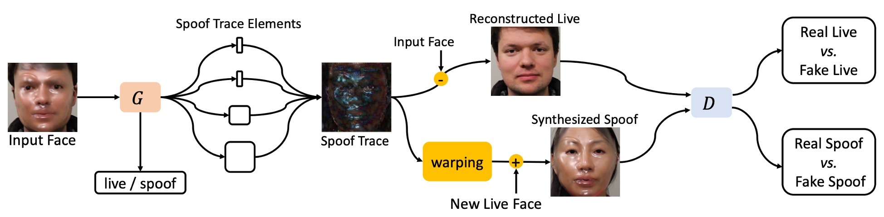
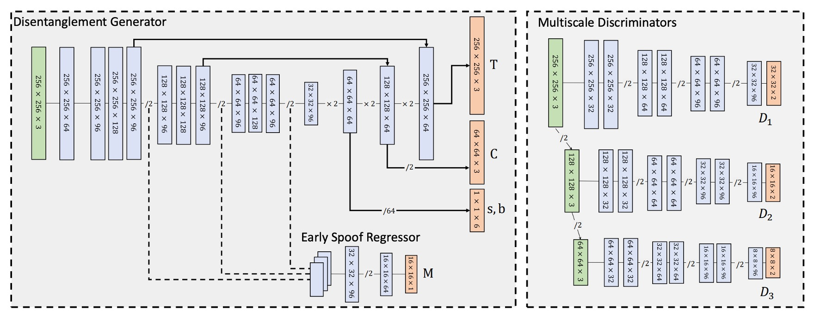

## Traces of Disguise

[**On Disentangling Spoof Trace for Generic Face Anti-Spoofing**](https://arxiv.org/abs/2007.09273)

---

The model tells us this is fake. But it cannot say why.

Would you trust a model like this?

## Problem Definition

Face Anti-Spoofing (FAS), as the first line of defense in biometric systems, has a research history spanning over a decade.

From early eye movement detection and subtle head motions to recent CNN discriminators and deep supervised learning, model accuracy seems to improve steadily. However, when facing unknown attack methods, different devices, and lighting conditions, generalization remains a hard-to-cross barrier.

The problem is not whether the model can "learn to distinguish real from fake," but what exactly it has learned.

Has it truly seen the traces of the spoof itself?

Or has it merely learned to differentiate resolution, color saturation, or cropping positions within certain datasets?

Especially when we treat various attack types—photos, screens, masks, makeup—equally and try to build a universal FAS system, we realize that **most existing methods rely on a "black-box decision": given a face, output a score.**

But such a score cannot explain on what basis the model made its decision. In fact, we cannot even make the model explain _why_ it says "this is fake."

As a result, people find it hard to trust the model’s decisions, and it becomes difficult to advance its training strategies. Because we cannot observe the model's reasoning, we cannot truly understand the boundary between it and the spoof.

The authors of this paper say: instead of asking whether the model thinks it's real or fake, we should ask:

> **What did you see on this face that made you think it is not alive?**

## Solution

<figure style={{"width": "90%"}}>

</figure>

In traditional binary classification tasks, the model outputs a "real or fake" score, but it cannot answer: **What exactly did you see?**

Here, the authors propose a different approach, called the **Spoof Trace Disentanglement Network (STDN).**

As shown in the figure above, the model first extracts the latent "spoof trace" from an input face, then proceeds to:

- **Reconstructed Live**: restore the spoof face back to a live version.
- **Synthesized Spoof**: transfer the spoof trace onto another live face to generate new attack samples.

This approach turns the spoof trace from a hidden judgment basis into an explicit, controllable visible variable, becoming the core signal of the entire system.

:::tip
The methodology in this paper is somewhat complex, involving multiple modules and steps. Readers may need some patience to fully grasp the authors’ design logic.
:::

### Spoof Trace

Let the input image be $I \in \mathbb{R}^{N \times N \times 3}$, which belongs either to the spoof domain $\mathcal{S}$ or the live domain $\mathcal{L}$.

The goal is to find a corresponding live-domain image $\hat{I} \in \mathcal{L}$ that minimizes the difference:

$$
\hat{I} = \arg\min_{\hat{I} \in \mathcal{L}} \| I - \hat{I} \|_F
$$

where $\| \cdot \|_F$ denotes the Frobenius norm.

By definition, the spoof trace is represented as:

$$
G(I) = I - \hat{I}
$$

If $I$ originally comes from the live domain, then ideally $G(I)$ should be zero; for spoof images, $G(I)$ corresponds to the visual forgery residual.

To enhance the interpretability and synthesis capability of the spoof trace, the authors further decompose it into four hierarchical components based on prior research:

- **Color range bias**: $s \in \mathbb{R}^{1 \times 1 \times 3}$, controlling pixel intensity adjustment;
- **Color balance bias**: $b \in \mathbb{R}^{1 \times 1 \times 3}$, adjusting color balance across channels;
- **Smooth content pattern**: $C \in \mathbb{R}^{L \times L \times 3}$, representing smooth textures, requiring upsampling;
- **High-frequency texture**: $T \in \mathbb{R}^{N \times N \times 3}$, containing details such as moiré patterns and edge contours.

These elements jointly form the spoof trace construction function:

$$
G(I) = sI + b + \lfloor C \rceil_N + T
$$

where $\lfloor C \rceil$ denotes upsampling $C$ to match the spatial resolution of $I$.

With this formulation, STDN transforms the spoof trace from a latent classification cue into an explicit intermediate variable, enabling the model not only to distinguish real and fake but also to indicate _where_ the spoof lies.

This modeling brings three core advantages:

1. **Visualization and interpretability**: The model outputs the spoof trace as visible evidence supporting its decision;
2. **Synthesis and data augmentation**: The trace can be applied to other images to generate spoof examples;
3. **Improved generalization**: Avoids reliance on non-spoof factors like lighting or background.

:::tip
The primary goal is to feed the spoof trace into a GAN model for synthesis, enabling the model to learn how to generate spoof images.
:::

### Disentangled Generation

<figure style={{"width": "90%"}}>

</figure>

The spoof trace disentanglement in STDN is realized via an Encoder–Decoder based generator tasked with progressively extracting the spoof trace components $\{s, b, C, T\}$ from the input image.

As shown above, the input image $I \in \mathbb{R}^{256 \times 256 \times 3}$ is first processed by the Encoder, which applies a series of convolutional layers for downsampling, producing a latent feature tensor:

$$
F \in \mathbb{R}^{32 \times 32 \times 96}
$$

This latent representation forms the basis for the Decoder to disentangle the spoof trace.

The Decoder then uses transpose convolution layers to progressively upsample and generate spoof trace elements at different spatial resolutions:

- **Color shift terms $s, b$**: single-value tensors for the entire image at the lowest resolution, thus disentangled at the initial decoder stage;
- **Low-frequency texture $C$**: produced at intermediate decoding stage with resolution around $64 \times 64$, then upsampled for synthesis;
- **High-frequency texture $T$**: output at the final decoder layer, maintaining the original image resolution $256 \times 256$.

This coarse-to-fine disentanglement design, aligned with the spatial properties of each spoof feature, provides clear semantic separation and precise generation correspondence.

Furthermore, to preserve high-frequency details and improve synthesis quality, the generator adopts a U-Net style skip connection between corresponding Encoder and Decoder layers, allowing direct transfer of local texture information.

### Dual-Domain Input Strategy

Unlike typical GANs trained only on the source domain (e.g., spoof), this method feeds the generator images from both domains:

- spoof domain: providing positive trace samples;
- live domain: serving as reference, expecting spoof trace near zero.

This encourages the model to learn discriminative and semantically meaningful spoof traces from both live and spoof images, preventing the trace itself from causing classification bias.

However, since spoof trace strength and patterns vary across spoof types (photos, masks, makeup), the trace alone is not a perfect classification cue. Therefore, the authors introduce an Early Spoof Regressor (ESR) to strengthen latent space discrimination.

### Early Spoof Regressor

The ESR module is designed as follows:

- Input: bottleneck feature tensor $F \in \mathbb{R}^{32 \times 32 \times 96}$;
- Output: a spoof probability map $M \in \mathbb{R}^{16 \times 16}$ with values in $\{0,1\}$, corresponding to live and spoof regions.

This spoof map represents a spatial judgment of the input image, enabling the generator not only to produce the trace but also to perform preliminary classification.

To support this design, the overall generator architecture uses a "heavy encoder, light decoder" approach, with the encoder having more channels and deeper blocks, allowing the ESR to fully leverage encoded spoof representations.

### Classification Strategy at Test Time

During testing, the final spoof score is composed of two parts:

1. The L1 average intensity of the ESR output spoof map $M$;
2. The L1 average intensity of the spoof trace $G(I)$;

computed by

$$
\text{score} = \frac{1}{2K^2} \| M \|_1 + \frac{\alpha_0}{2N^2} \| G(I) \|_1
$$

where

- $K = 16$: spatial resolution of the ESR spoof map;
- $N = 256$: spatial resolution of the input image;
- $\alpha_0$: hyperparameter controlling the influence of the spoof trace on the final score.

This dual-metric fusion strategy improves sensitivity to spoof strength and provides a buffer when spoof trace and ESR judgments differ.

### Reconstruction and Synthesis

After disentangling the spoof trace, STDN can be applied not only for classification but also as structured signals for two tasks:

1. **Reconstruction**: removing the trace from a spoof image to restore the corresponding live image.
2. **Synthesis**: transferring the spoof trace extracted from one spoof image onto any live face to generate synthetic spoof attack samples.

Starting with the live image reconstruction task:

Given an input image $I \in \mathcal{S} \cup \mathcal{L}$ and its corresponding spoof trace $G(I)$, STDN restores the live image by

$$
\hat{I} = I - G(I)
$$

where $\hat{I}$ is regarded as the minimal modification of the input image in the live domain $\mathcal{L}$.

This operation serves not only as a visual quality evaluation for trace disentanglement but also strengthens the invertibility and semantic consistency of the spoof trace during training.

Next, for spoof image synthesis:

To enable data augmentation and spoof diversity simulation, STDN allows transferring the spoof trace to another live face. Given two images:

- $I_i$: source spoof image with trace $G(I_i)$,
- $I_j$: target live image,

the synthesized spoof image is expressed as

$$
\tilde{I}_{i \rightarrow j} = I_j + G(I_i)
$$

:::tip
This reminds us of the recently popular Model Merging techniques in the LLM field, where additional functionalities on top of the original model are treated as sets of “vector” parameters that can be arbitrarily added or subtracted to expand the model’s capabilities.

If we similarly treat specific types of attacks’ “spoof traces” as vector parameters and perform addition or subtraction, we might enable the model to learn to handle various attack types by combining these vectors.
:::

However, a challenge exists: spoof traces may contain regionally localized textures highly correlated with the original face geometry (e.g., mask edges, wrinkles). Directly applying these traces onto different face shapes or poses leads to noticeable geometric distortion and visual inconsistency.

To address this, the authors propose a differentiable **Online 3D Warping Layer** to align spoof traces spatially.

### Geometric Warping Layer

<figure style={{"width": "90%"}}>

</figure>

This module builds facial correspondence points based on a 3D Morphable Model (3DMM) and performs geometric transformation from sparse to dense fields via Delaunay triangulation.

**Steps:**

1. **Spoof trace evaluation**
   For source image $I_i$, its spoof trace is defined as

   $$
   G_i = G(I_i)[p_0]
   $$

   where $p_0 = \{(x,y) \mid 0 \leq x,y < 256 \} \in \mathbb{R}^{256 \times 256 \times 2}$ represents the original pixel coordinate grid.

2. **Compute dense offset**
   To apply the spoof trace onto $I_j$, compute the dense field offset $\Delta p_{i \rightarrow j} \in \mathbb{R}^{256 \times 256 \times 2}$. The warped trace is

   $$
   G_{i \rightarrow j} = G(I_i)[p_0 + \Delta p_{i \rightarrow j}]
   $$

   Since offsets may be fractional, bilinear interpolation is used for coordinate mapping.

3. **Sparse-to-dense conversion**
   Fit a 3DMM to each face and extract $Q=140$ representative vertex 2D projections:

   $$
   s = \{ (x_0, y_0), (x_1, y_1), \dots, (x_Q, y_Q) \} \in \mathbb{R}^{Q \times 2}
   $$

   Then calculate sparse offset between source and target:

   $$
   \Delta s_{i \rightarrow j} = s_j - s_i
   $$

4. **Triangle interpolation to dense offset**
   Apply Delaunay triangulation interpolation:

   $$
   \Delta p_{i \rightarrow j} = \mathrm{Tri}(p_0, s_i, \Delta s_{i \rightarrow j})
   $$

   This operation weights the displacements of the three vertices of the triangle containing each pixel to construct a dense offset map efficiently and differentiably. The entire warping process can be integrated end-to-end into the training pipeline.

### Manipulating the Spoof Trace

The structural nature of the spoof trace makes it operable.

The authors propose a data augmentation strategy during training:

**When synthesizing spoof images, randomly remove one of the spoof trace elements $s, b, C, T$ to simulate samples with weaker spoof intensity, serving as harder examples for training.**

The theoretical basis is that some spoof features might be very subtle or masked in practice. If the model relies on a single strong feature, it may fail on such samples. Randomly removing trace components forces the model to learn more diverse and comprehensive spoof representations.

Compared to traditional brightness/blur or artificial distortions, this approach manipulates semantically meaningful spoof elements directly, generating more realistic and structurally coherent synthetic data. Experiments demonstrate superior gains over conventional augmentation.

### Multi-scale Discriminators

In STDN, the generator’s goal is not only to produce plausible spoof traces but also to ensure that the synthesized samples (reconstructed live or synthesized spoof) are visually and semantically credible.

To this end, the authors design **three PatchGAN discriminators at different resolutions**, covering information from high-frequency textures to global structure.

The three discriminators are:

- $D_1$: processes images at original resolution $256 \times 256$, focusing on high-frequency textures corresponding to spoof trace $T$.
- $D_2$: processes images downsampled by half $128 \times 128$, emphasizing mid-frequency structures and smooth textures corresponding to $C$.
- $D_3$: processes images downsampled by quarter $64 \times 64$, focusing on low-frequency global shifts and color balance corresponding to $s, b$.

This hierarchical discrimination improves overall consistency and cross-validation of the four spoof trace components, forming a full disentangle → reconstruct → synthesize → discriminate cycle.

#### Discriminator Architecture Details

Each discriminator $D_k$ uses a **PatchGAN** architecture—a fully convolutional network stacking convolutional layers proven effective in image generation and FAS tasks.

Specifics include:

- Each discriminator consists of:

  - **7 convolutional layers** (with nonlinear activations and BatchNorm);
  - **3 downsampling layers** (stride = 2);

- Output is a **2-channel response map** sized $H' \times W' \times 2$, where each position corresponds to a patch prediction and the 2 channels indicate confidence scores for each domain.

The 2-channel design means:

- **Channel 1**: compares reconstructed live images with real live images, verifying the realism after spoof trace removal;
- **Channel 2**: compares synthesized spoof images with real spoof images, assessing credibility and attack effectiveness after adding spoof trace.

This bidirectional supervision simultaneously improves generation quality on both restoration and forgery ends, strengthening semantic consistency and invertibility of the spoof trace.

### Loss Functions

STDN training employs a multi-task learning framework, consisting of **five loss types** and **three training steps** to collaboratively guide the generator and multi-scale discriminators in learning spoof trace separation, invertibility, and visibility.

- **1. ESR Loss (Early Spoof Regressor Loss)**

  For the ESR output spoof map $M \in \mathbb{R}^{16 \times 16}$, it should output all zeros for live images and all ones for spoof images (including synthesized spoofs). An L1 loss is used:

  $$
  \mathcal{L}_{\text{ESR}} = \frac{1}{K^2} \left( \mathbb{E}_{i \sim \mathcal{L}} \left[ \| M_i \|_1 \right] + \mathbb{E}_{i \sim \mathcal{S} \cup \hat{\mathcal{S}}} \left[ \| M_i - \mathbf{1} \|_1 \right] \right)
  $$

  where:

  - $K = 16$: spoof map resolution;
  - $\hat{\mathcal{S}}$: spoof domain synthesized by the generator;
  - $\| \cdot \|_1$: L1 norm.

---

- **2. Generator Adversarial Loss**

  To train the generator so that reconstructed live and synthesized spoof images approach their real domains, Least Squares GAN (LSGAN) loss is adopted over three discriminators $D_n$:

  $$
  \mathcal{L}_G = \sum_{n=1}^3 \left\{
  \mathbb{E}_{i \sim \mathcal{S}} \left[ \left( D_n^{(1)}(I_i - G_i) - 1 \right)^2 \right] +
  \mathbb{E}_{i \sim \mathcal{L}, j \sim \mathcal{S}} \left[ \left( D_n^{(2)}(I_i + G_{j \rightarrow i}) - 1 \right)^2 \right]
  \right\}
  $$

  where:

  - $D_n^{(1)}$: live domain output channel of discriminator $n$;
  - $D_n^{(2)}$: spoof domain output channel of discriminator $n$.

---

- **3. Discriminator Adversarial Loss**

  The discriminator must correctly distinguish real and generated samples:

  $$
  \mathcal{L}_D = \sum_{n=1}^3 \Big\{
  \mathbb{E}_{i \sim \mathcal{L}} \left[ \left( D_n^{(1)}(I_i) - 1 \right)^2 \right] +
  $$

  $$
  \mathbb{E}_{i \sim \mathcal{S}} \left[ \left( D_n^{(2)}(I_i) - 1 \right)^2 \right] +
  \mathbb{E}_{i \sim \mathcal{S}} \left[ \left( D_n^{(1)}(I_i - G_i) \right)^2 \right] +
  $$

  $$
  \mathbb{E}_{i \sim \mathcal{L}, j \sim \mathcal{S}} \left[ \left( D_n^{(2)}(I_i + G_{j \rightarrow i}) \right)^2 \right]
  \Big\}
  $$

- **4. Trace Regularizer Loss**

  To enhance spoof trace semantics and suppress meaningless residuals in live samples, an L2 regularization term is added:

  $$
  \mathcal{L}_R = \beta \cdot \mathbb{E}_{i \sim \mathcal{L}} \left[ \| G(I_i) \|_2^2 \right] + \mathbb{E}_{i \sim \mathcal{S}} \left[ \| G(I_i) \|_2^2 \right]
  $$

  where $\beta > 1$ controls live trace compression strength.

- **5. Supervised Pixel Loss**

  Since synthesized spoofs have known spoof trace sources, pixel-level supervision is applied to the generator. To avoid misleading gradients, a stop-gradient operation locks the reference trace:

  $$
  \mathcal{L}_P = \mathbb{E}_{i \sim \mathcal{L}, j \sim \mathcal{S}} \left[ \left\| G\left( I_i + \text{stop\_grad}(G_{j \rightarrow i}) \right) - \text{stop\_grad}(G_{j \rightarrow i}) \right\|_1 \right]
  $$

  This loss forces the generator to learn correct spoof trace extraction structures instead of duplicating input content.

### Training Procedure Design

<figure style={{"width": "90%"}}>

</figure>

As illustrated above, STDN training adopts a multi-task collaborative optimization mechanism. Each mini-batch includes three complementary sub-steps, updating parameters for the generator, discriminators, and trace disentanglement supervision respectively.

The detailed descriptions of each stage are as follows:

- **1. Generator Step**

  In this step, live face $I_{\text{live}}$ and spoof attack sample $I_{\text{spoof}}$ are fed into the generator for spoof trace disentanglement. The model performs two generation tasks:

  - **Reconstructing live image**: Using $G(I_{\text{spoof}})$ to restore the corresponding live version

    $$
    \hat{I}_{\text{live}} = I_{\text{spoof}} - G(I_{\text{spoof}})
    $$

  - **Synthesizing spoof image**: Applying spoof trace $G(I_{\text{spoof}})$ to another live face $I_{\text{live}}$ to obtain synthesized spoof

    $$
    \hat{I}_{\text{spoof}} = I_{\text{live}} + G_{i \rightarrow j}
    $$

  The generator update objective is composed of three losses:

  - $\mathcal{L}_G$: adversarial loss (to push synthesized samples closer to real domains);
  - $\mathcal{L}_{\text{ESR}}$: early spoof regressor supervision;
  - $\mathcal{L}_R$: trace intensity regularization.

  The total loss is:

  $$
  \mathcal{L}_{\text{G-step}} = \alpha_1 \mathcal{L}_G + \alpha_2 \mathcal{L}_{\text{ESR}} + \alpha_3 \mathcal{L}_R
  $$

- **2. Discriminator Step**

  Using the same batch, the following images are passed into the three multi-scale discriminators $D_n$ to learn to distinguish real from synthesized domains:

  - Original live samples $I_{\text{live}}$
  - Original spoof samples $I_{\text{spoof}}$
  - Reconstructed samples $\hat{I}_{\text{live}}$
  - Synthesized spoof $\hat{I}_{\text{spoof}}$

  Each scale discriminator learns to:

  - Differentiate real live vs. reconstructed live on channel $D_n^{(1)}$;
  - Differentiate real spoof vs. synthesized spoof on channel $D_n^{(2)}$.

  The discriminator adversarial loss is defined as:

  $$
  \mathcal{L}_{\text{D-step}} = \mathcal{L}_D
  $$

  Due to adversarial training instability, the learning rate for this step is set to half that of the other steps to balance gradient magnitude and maintain training stability.

- **3. Extra Supervision Step**

  This step introduces "supervised spoof trace synthesis" to strengthen the generator’s ability to correctly recognize and disentangle spoof trace structures.

  Inputs include:

  - Original live face $I_{\text{live}}$
  - Corresponding synthesized spoof $\hat{I}_{\text{spoof}}$
  - Ground-truth spoof trace $G_{j \rightarrow i}$ obtained from source spoof trace.

  Only the generator parameters are updated here, with target losses:

  - $\mathcal{L}_{\text{ESR}}$: further spoof classification supervision;
  - $\mathcal{L}_P$: pixel-level spoof trace disentanglement error (with stop-gradient to fix target trace).

  The combined loss is:

  $$
  \mathcal{L}_{\text{sup-step}} = \alpha_4 \mathcal{L}_{\text{ESR}} + \alpha_5 \mathcal{L}_P
  $$

  :::tip
  To maintain the statistical stability of Batch Normalization, this step inputs $I_{\text{live}}$ and $\hat{I}_{\text{spoof}}$ in pairs, ensuring balanced batch data distribution.
  :::

## Discussion

Since the methodology section has occupied a large portion, we conclude with several key points for discussion.

### Known Attack Detection

From tables (a), (b), and (c) above, we observe that STDN demonstrates detection performance comparable to or better than existing methods across multiple protocols on the OULU-NPU and SiW datasets. Notably, on OULU-NPU protocols 1 and 4, STDN reduces ACER by 30% and 32% respectively compared to previous best methods.

Under various print and replay attacks, STDN’s live reconstruction and spoof trace extraction mechanisms provide stable judgment criteria. For the 13 attack types in SiW-M, experiments show STDN outperforms prior work on most spoof types, confirming its generalizability across diverse attack scenarios.

### Unknown Attack Detection

As shown above, STDN achieves better overall EER and ACER than prior best models on unknown attacks.

Although certain attacks (e.g., transparent masks, paper masks) remain challenging, STDN can quickly localize key regions and improve recognition once a few samples are acquired, leveraging explicitly disentangled spoof traces.

This demonstrates that trace modeling enables the system to maintain adaptability under unknown attack conditions.

### Spoof Trace Visualization and Evaluation

1. **Spoof Medium Classification**

   

   Using the disentangled spoof trace alone to detect different spoof materials yields higher accuracy than directly using original images, indicating that the trace indeed contains critical textures or color cues sufficient to distinguish various forgery materials.

2. **Visual Decomposition**

   

   The figure illustrates that different attack types (print, makeup, 3D masks, paper attacks, etc.) show varying degrees of distortion or texture residue across the four layers $s, b, C, T$; the model can transfer these residues onto other faces to generate credible synthetic spoofs, supporting the effectiveness of the 3D geometric warping layer and trace transferability.

### Module Contributions and Ablation Studies

<figure style={{"width": "70%"}}>

</figure>

Experimental results indicate that integrating multi-scale discriminators with the ESR (Early Spoof Regressor) design optimizes both reconstruction quality and adversarial robustness, reducing ACER from 2.6% to 1.6%.

With the final configuration ESR + D-GAN + $L_P$, synthesized samples provide strong supervision and prevent error accumulation from poor spoof generation, stabilizing ACER at 1.1%.

## Conclusion

Instead of asking if it’s real or fake, ask first: **Where does the spoof leak out from?**

STDN rewrites live detection from a “black-box classification” into a “trace disentanglement — reconstruction — synthesis” cycle, extending early _de-spoofing_ and saliency map methods to make visual evidence a primary model output.

This is not just a network design change but a conceptual shift: understand the spoof first, then discuss real or fake.

Of course, STDN has its limitations:

- Spoof traces are defined only in the image domain; high-fidelity 3D masks or cross-modal attacks remain unverified;
- Geometric and texture consistency of synthesized samples depend on generator capacity and supervision signals;
- Extensions of trace modeling to other sensing modalities (acoustics, depth, blood flow signals) are yet unexplored.

Nonetheless, STDN offers a traceable future path:

> **If spoofs can be explicitly marked, they can be synthesized; if synthesized, they can be countered.**

Amidst the flood of indistinguishable real and fake, the true value lies not in mere scoring but in disentangling the syntax and structure of spoofs.

Though more complex than classification, STDN, as an early key milestone in multi-attack “trace disentanglement,” lays a solid foundation for future work.
