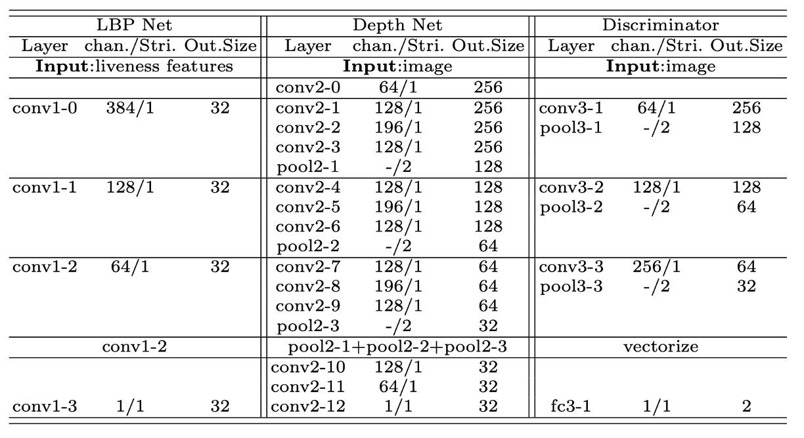

## Untangling the Soul Knot

[**Face Anti-Spoofing via Disentangled Representation Learning**](https://arxiv.org/abs/2008.08250)

---

This paper did not give itself a catchy name.

So we simply adopt the paper’s title and call it: **Disentangle-FAS**.

## Problem Definition

Face Anti-Spoofing (FAS) has always stood at the forefront of recognition systems.

From unlocking phones, access control, financial identity verification, to various eKYC scenarios, we rely on this task to tell whether a face is a real person or some kind of disguise.

As algorithms improve, datasets expand, and model accuracy climbs, we thought the problem was being solved.

But in reality, we are just forcing models to memorize more answers by using increasingly diverse fakes.

Looking closely, the entire field is actually stuck on several persistent problems:

- **Black-box models for real-vs-fake classification that cannot explain their decisions;**
- **Extremely poor generalization—models collapse once the dataset changes;**
- **Data is never enough, and attack methods evolve even faster.**

More seriously: we cannot even clearly describe what “liveness features” actually are.

This is neither an issue of model architecture nor data scale.

> **Rather, our understanding of the face itself is too chaotic.**

Too many semantics coexist on the face: identity, pose, lighting, background, device characteristics, skin texture, etc., yet we force the model to make a one-shot “real or fake” decision in this tangled syntax.

Is this approach fundamentally flawed from the start? Could it be possible that:

> **We let the model first try to extract an independent clue belonging to “liveness” from the entanglement of noise and semantics?**

## Solution

<figure style={{"width": "90%"}}>

</figure>

To untangle the “mixed semantics on the face,” the authors propose **two core components**:

1. A **Disentanglement Process** that separates liveness and content.
2. Multiple forms of **Auxiliary Supervision** (such as LBP, Depth, and Discriminators) to strengthen the disentanglement effect.

### Disentanglement Process

First, the authors design an “exchange and recombination” pipeline that splits the latent feature vectors of face images into two parts:

- **Liveness Features** ($L$): representing the key factors of “whether the face is real or fake.”
- **Content Features** ($C$): representing identity, background, lighting, pose—attributes unrelated to real or fake.

The full process is illustrated in the figure above:

1. A real face $A$ and a fake face $B$ are separately fed into the encoder, yielding $(L_A, C_A)$ and $(L_B, C_B)$.
2. Then, **the liveness features are swapped** to synthesize new images $\hat{A}_b$ and $\hat{B}_a$, which respectively mean:

   - Image $\hat{A}_b$ reconstructed by combining “fake face’s liveness features” with “real face’s content features.”
   - Image $\hat{B}_a$ reconstructed by combining “real face’s liveness features” with “fake face’s content features.”

In this way, recombining real face’s $L$ with fake face’s $C$ should theoretically generate a new image that “looks like person A but carries the spoof attributes of B,” and vice versa.

This swapping operation forces the model to completely separate “real/fake” and “facial content,” otherwise the synthesized images would be distorted or bear incorrect traces.

### Reconstruction Loss: Image & Latent

The **Encoder + Decoder** combination in this pipeline must guarantee “the ability to reconstruct the image back again.”

The authors impose two types of reconstruction losses as constraints:

1. **Image Reconstruction Loss**

   They expect $\mathrm{D(E}(x_i))$ to approximate the original $x_i$ itself, defined as:

   $$
   \mathcal{L}_{rec}^{x_i} \;=\; \mathbb{E}_{x_i \sim p(x_i)} \Bigl\|\,D\bigl(E(x_i)\bigr) \;-\; x_i\Bigr\|_1
   $$

   where $E$ is the encoder, $D$ is the decoder, and $p(x_i)$ is the distribution of real images.

2. **Latent Reconstruction Loss**

   After swapping, they want to decode-encode $\hat{z}_i$ back to reconstruct the original $z_i$:

   $$
   \mathcal{L}_{rec}^{z_i} \;=\; \mathbb{E}_{z_i \sim q(z_i)} \Bigl\|\,
   E\bigl(D(z_i)\bigr) \;-\; z_i
   \Bigr\|_1
   $$

   This ensures that liveness and content features are indeed separated and can be mutually reconstructed, preventing the model from mixing them back during training.

### Auxiliary Supervision

To further “lock down” the liveness features, the authors add three auxiliary supervision signals within the disentanglement process:

1. **LBP Map**
2. **Depth Map**
3. **Discriminative Supervision** (Discriminator)

The table below shows the detailed network architectures for each auxiliary module:

<figure style={{"width": "80%"}}>

</figure>

Each network consists of a series of convolutional layers, batch normalization (BN), and ReLU activations, using features at different levels for calibration or discrimination.

- **LBP Map**

  Considering that “fake faces” often have texture flaws (e.g., printing dots, moiré patterns on screens), the authors apply LBP (Local Binary Pattern) supervision on the **liveness features**:

  - **Real faces:** expect the LBP network output to approximate the true LBP map;
  - **Fake faces:** correspond to an “all-zero map,” implying the texture should be invalid or fake.

  The loss function is formulated as:

  $$
  \mathcal{L}_{lbp}
  =\;
  \mathbb{E}_{l_i \sim P(l_i),\, x_i \sim P(x_i)} \Bigl\|\,
  LBP(l_i) - lbp_{x_i}
  \Bigr\|_1
  \;+\;
  \mathbb{E}_{l_i \sim N(l_i),\, x_i \sim N(x_i)} \Bigl\|\,
  LBP(l_i) - 0
  \Bigr\|_1
  $$

  where $P(\cdot)$ denotes the real face distribution, $N(\cdot)$ the fake face distribution, $lbp_{x_i}$ the real face’s LBP image, and $0$ is the all-zero map.

- **Depth Map**

  For the 3D geometric information of real faces, the authors also introduce **depth supervision**:

  - Real faces correspond to a “pseudo depth map” generated by 3D alignment algorithms;
  - Fake faces correspond to an all-zero map.

  The loss function is:

  $$
  \mathcal{L}_{dep}
  =\;
  \mathbb{E}_{x_i \sim N(x_i)} \Bigl\|\,
  Dep(x_i) - 0
  \Bigr\|_1
  \;+\;
  \mathbb{E}_{x_i \sim P(x_i)} \Bigl\|\,
  Dep(x_i) - dep_{x_i}
  \Bigr\|_1
  $$

  Here, $Dep(\cdot)$ denotes the output of the depth network.

  Both real and fake face reconstructions must output the corresponding depth or zero map, thereby reinforcing that all liveness information is contained within the $L$ branch.

- **Discriminative Supervision**

  Finally, the authors design multi-scale **discriminators** to help determine whether the “generated images” look realistic.

  Essentially a GAN-style adversarial training:

  - **Discriminator loss ($L_{Dis}^D$):** update the discriminator with the generator fixed to learn to distinguish real (R) from generated (G);
  - **Generator loss ($L_{Gen}^D$):** update the entire Disentanglement Network with the discriminator fixed to force it to produce more realistic images.

  The generator loss is defined as:

  $$
  \mathcal{L}_{Gen}^{D}
  = - \;
  \mathbb{E}_{I \in G}\,\log\bigl(D_1(I)\bigr)
  \;-\;
  \mathbb{E}_{I \in G}\,\log\bigl(D_2(I)\bigr).
  $$

  Where $D_1$ and $D_2$ are discriminators at different scales capturing local details and global structure.

### Final Objective Function

The authors sum all the above losses to form the final training objective:

$$
\mathcal{L}
=\;
\mathcal{L}_{Gen}^{D}
\;+\;
\lambda_1\,\mathcal{L}_{rec}^{x_i}
\;+\;
\lambda_2\,\mathcal{L}_{rec}^{z_i}
\;+\;
\lambda_3\,\mathcal{L}_{dep}
\;+\;
\lambda_4\,\mathcal{L}_{lbp}
$$

Here, $\lambda_1, \lambda_2, \lambda_3, \lambda_4$ are important hyperparameters balancing each loss term.

The entire training adopts a typical **adversarial iterative** scheme: first optimize the discriminator, then optimize the entire disentanglement network.

Back and forth, the goal is to achieve:

- Synthesized images **realistic enough** after swapping;
- Liveness and content features **truly disentangled** and reconstructable;
- **LBP and depth supervision** solidifying that liveness features indeed carry real/fake information.

Thus, at inference time, the model only needs to look at the “$L$ vector” to determine authenticity, freeing it from interference caused by domain shifts, device differences, lighting changes, and so on.

## Discussion

The authors conducted experiments on four common FAS datasets:

- Oulu-NPU and SiW (used for **intra-testing**)
- CASIA-MFSD and Replay-Attack (used for **cross-testing**)

They evaluated performance using standard metrics: **APCER, BPCER, ACER,** and **HTER**.

### Intra-testing: Oulu-NPU

<figure style={{"width": "60%"}}>

</figure>

The experimental results on **Oulu-NPU** are shown above. Disentangle-FAS outperforms previous works in three of the four protocols except for p2 where it is slightly worse. Notably, it achieves the best performance under p4 (which covers all variations), demonstrating **stronger generalization**. Within a single dataset scenario, **disentangling liveness features** allows the model to more precisely capture the “real or fake” cues.

:::tip
Please refer to the original paper for the SiW experiment results.
:::

### Cross-testing: CASIA-MFSD ↔ Replay-Attack

<figure style={{"width": "60%"}}>

</figure>

The cross-testing design trains on CASIA and tests on Replay, or vice versa, which is a standard “cross-domain” evaluation for FAS.

As shown, Disentangle-FAS reduces the HTER by 1.2 percentage points when going from (CASIA → Replay) compared to previous works, while maintaining comparable performance in (Replay → CASIA).

This implies that after isolating the “liveness features,” the model can still accurately distinguish genuine from fake when testing images vary in lighting, identity, camera device, etc., avoiding complete failure.

### Translation Results and Visualization

<figure style={{"width": "80%"}}>

</figure>

The authors show three groups of translation results: “real ↔ fake,” “real ↔ real,” and “fake ↔ fake.”

- During the “real ↔ fake” swapping, the corresponding depth maps also switch synchronously, proving that liveness features carry the core real/fake information;
- For “real ↔ real” or “fake ↔ fake” internal swaps, the depth maps remain almost unchanged.
- This means identity, lighting, and background remain in the content features and are not taken away by the liveness features.

Further, the authors focus on local areas (e.g., printing textures, moiré patterns on screens) and show that after swapping, the generated images genuinely capture various texture details characteristic of different “fake” types, as in the figure below:

<figure style={{"width": "80%"}}>

</figure>

In other words, the liveness subspace not only separates real and fake but also contains the distinctive features of different kinds of spoofs.

### Ablation Study

The authors tested many ablation combinations, with the core conclusions:

- **With vs. Without Disentanglement:** t-SNE visualization shows that when liveness and content are separated, real and fake faces cluster more cleanly in feature space; without disentanglement, features remain mixed.

   

   <figure style={{"width": "80%"}}>
   
   </figure>
   

- **LBP + Depth Supervision:** Using both low-level texture (LBP) and high-level geometry (Depth) auxiliary supervision outperforms using either alone or just binary classification.

- **Score Fusion:** Averaging LBP and Depth scores yields the best performance due to their complementarity.

   

   <figure style={{"width": "50%"}}>
   
   </figure>
   

This method consistently demonstrates better generalization and interpretable visualization: the liveness feature space not only judges real or fake but also reflects texture differences corresponding to different spoof types, allowing us to truly “see” what the model has learned about attack distinctions.

## Conclusion

Disentangle-FAS does not attempt to build a more complex classifier. Instead, it rewrites the task by splitting the latent syntax of the “face” into two worlds:

**One for liveness, one for content.**

Within this framework, real or fake is no longer a scalar output score but a semantic space that can be swapped, generated, and visualized.

The model not only learns to discriminate but also to decompose and even explain: **where the fake parts are and why they are fake.**

Through visual translation of liveness features, auxiliary supervision from depth and texture, and cross-domain evaluations, this paper tells us:

> **Rather than just “judging real or fake,” we should teach models to “see where the fake originates.”**

In the chaotic and ever-changing future of attacks, this path may not be easy, but it offers a chance to **make defense syntactically meaningful, inferable, and explainable.**

This marks a step away from the black box toward a more conscious form of visual recognition.
