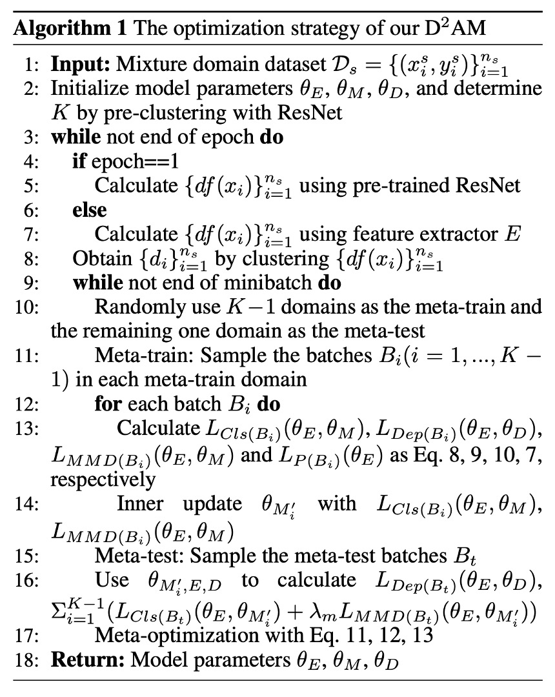

## Thousand-Domain Soul Forging

[**Generalizable Representation Learning for Mixture Domain Face Anti-Spoofing**](https://arxiv.org/abs/2105.02453)

---

Earlier, we reviewed SSDG, which employs a single-domain generalization technique to address the FAS problem.

This time, the once-popular Meta Learning has also joined the battlefield.

## Defining the Problem

Following the preliminary success of DG techniques in FAS, the authors of this paper immediately raised the next question:

> **What exactly is a "domain"?**

Is it a different shooting scene? A different attack method? Or are you just using the dataset name as the domain label?

These approaches have quietly been adopted in DG tasks in the past, but the problem is that these "domains" are not scientifically defined.

The authors highlight three issues:

1. **Manually labeling domain labels is too time-consuming.**

   > If someone has to say, "This belongs to the domain with yellowish lighting," standardization becomes a problem.

2. **The domain itself is a complex factor and cannot be divided by a single dimension.**

   > Some domains are because of poor cameras, while others are because the model looks fake. Who can say these two should belong to the same category?

3. **Even if you divide them by dataset, it is still sub-optimal.**

   > Dataset A and Dataset B actually have a lot of overlap, and the model might have already mixed them up.

---

In response to this dilemma, the authors propose a solution:

> **Can we let the model learn to group itself?**

Allow the model to generate pseudo-domains and then train its generalization ability from these pseudo-domains.

This is the core idea behind D²AM.

## Solving the Problem

<figure style={{"width": "90%"}}>

</figure>

The model architecture diagram provided by the authors looks quite complex and might feel intimidating.

So, we need to pair it with another section in the paper to understand this architecture. Please refer to the following algorithm logic:

<figure style={{"width": "50%"}}>

</figure>

### Stage 1: Clustering

The task in this stage is very clear:

> **"I don’t know which domain these images come from, but that’s okay, I’ll group them myself."**

The approach is roughly as follows:

1. **Extract CNN style statistics (mean, std)**
2. **Pass through the DRLM module, splitting the features into $F^+$ and $F^-$**
3. **Discard task-related information and use entropy loss to clean $F^-$**
4. **Apply K-means to $F^-$ to produce pseudo domain labels**

Let’s go through the detailed steps:

- **Step 1: Preprocessing**

  Refer to Algo1: Lines 2-5. Initially, the authors use a ResNet-50 (pretrained on ImageNet) to process all the images.

  This is not for classification but to extract style features, resulting in the following vector:

  $$
  df(x) = \{\mu(F_1), \sigma(F_1), ..., \mu(F_M), \sigma(F_M)\}
  $$

  Features from pretrained models can **avoid too much task-related information from contaminating domain classification**. After the first round, the model switches to using its own feature extractor, $E$, in D²AM (Algo1: Lines 6-7).

  ***

- **Step 2: Enhance domain features with DRLM**

  DRLM is a small module, similar to an SE block, that adds channel attention to CNN features:

  $$
  a = \sigma(W_2 \cdot ReLU(W_1 \cdot pool(F)))
  $$

  Then, it divides the original features into two parts:

  - $F^+ = a \cdot F$: These are the task-related features.
  - $F^- = (1 - a) \cdot F$: These are the domain-related features that we care about.

  ***

- **Step 3: Discard unnecessary task information and clean with Entropy loss**

  The authors introduce an "anti-entropy" regularization:

  $$
  \mathcal{L}_p = P(F^-) \log P(F^-)
  $$

  where $P(F^-) = \text{Sigmoid}(W_p \cdot pool(F^-))$

  Its purpose is to make the model **extremely confused** about task labels for both positive and negative samples (i.e., forcing it not to learn task-related information), allowing it to focus solely on domain features.

  ***

- **Step 4: K-means clustering to produce pseudo-domain labels (Algo1: Line 8)**

  The $F^-$ features from all samples are extracted and used for K-means clustering. **Positive and negative samples must be clustered separately** (because task information still remains). Then, they are paired and merged so that positive and negative samples form the same pseudo-domain.

  To avoid the clusters jumping around, the authors use the **Kuhn-Munkres (Hungarian algorithm)** to align and match epochs.

### Stage 2: Meta-learning

With the pseudo domains already clustered, the model now enters the "simulation-based training" phase.

The spirit of this phase is similar to meta-learning:

> **"I divide the data into different small countries (domains), and continuously simulate 'What I learned in Country A, can it be applied in Country B?'"**

So, each epoch goes through:

- **Meta-train**: Train on K−1 domains
- **Meta-test**: Validate generalization on the remaining domain
- **Meta-optimize**: Update parameters based on training and testing results

---

This part involves doing two things every time during training: Meta-train and Meta-test.

- **Step 5: Randomly select K−1 pseudo-domains for Meta-train (Algo1: Lines 10–12)**

  For each domain $D_i$, a batch $B_i$ is extracted, and three actions are performed:

  1. Classification loss:

  $$
  \mathcal{L}_{Cls}(B_i) = \sum_{(x,y) \in B_i} y \log M(E(x)) + (1 - y) \log(1 - M(E(x)))
  $$

  2. MMD regularization:

  $$
  \mathcal{L}_{MMD}(B_i) = \left\| \frac{1}{b} \sum \phi(h^s) - \frac{1}{b} \sum \phi(h^t) \right\|^2_{\mathcal{H}}
  $$

  The goal is to reduce the distortion of the overall distribution caused by outliers and stabilize the feature space.

  3. Depth regression (using PRNet to estimate the real face depth):

  $$
  \mathcal{L}_{Dep}(B_i) = \| D(E(x)) - I \|^2
  $$

  ***

- **Step 6: Perform Meta-test (Algo1: Lines 15–16)**

  A domain is selected as the unseen test domain, and a batch $B_t$ is taken. Each inner-updated meta learner runs the following:

  $$
  \mathcal{L}_{Cls}(B_t, \theta_{M_i}'), \quad \mathcal{L}_{MMD}(B_t, \theta_{M_i}')
  $$

  Finally, the depth loss is also included.

  ***

- **Step 7: Meta-Optimization (Algo1: Line 17)**

  The parameters of the three modules are updated together, corresponding to Eq. 11–13:

  - **$θ_E$**: Feature extractor
  - **$θ_M$**: Meta learner
  - **$θ_D$**: Depth estimator

  Each update also includes the entropy loss from DRLM:

  $$
  \sum_{j=1}^3 \lambda_p \mathcal{L}_p^j
  $$

  This ensures the entire network focuses more on learning the "domain grouping ability for generalization."

---

Finally, let’s summarize how this pipeline works:

1. CNN feature → DRLM: Split into $F^+$ and $F^-$
2. Extract $F^-$ → Clustering to produce pseudo domain labels
3. Use these labels as the training basis for meta-learning
4. After training, go back to extract features → Re-cluster → Retrain
5. Repeat the entire process until the model generalizes effectively

Overall, this is a "self-classifying, self-training, self-disciplining" algorithm that constantly improves itself.

## Discussion

### Comparison with Other Methods

<figure style={{"width": "90%"}}>

</figure>

After all this discussion, is D²AM really stronger?

The authors provide a series of experimental results in the table above, using four mainstream FAS datasets as "unknown test sets," allowing the model to challenge generalization capabilities with only three source domains.

The experimental results show that, in all experimental setups, D²AM consistently outperforms other methods. Not only does it surpass traditional FAS models, but it even beats DG methods that include domain labels.

Especially on OULU, CASIA, and REPLAYATTACK, D²AM not only achieves higher AUC and lower HTER, but also shows better stability. Most importantly, it does all of this without requiring manual domain labels, relying entirely on its own ability to infer domains.

### t-SNE Visualization

The authors thoughtfully used t-SNE to create several plots to help with understanding:

- **$F^+$ (task-related features)**: The distribution is more scattered, but classification is clear.
- **$F^-$ (domain-related features)**: Clustering is clear, but it doesn't interfere with classification.

In other words, $F^-$ helps clarify "which domain the sample is from," while $F^+$ handles "whether the sample is real or fake."

This also validates the design of the DRLM module + entropy loss, showing that it serves its purpose well.

### Clustering Visualization

<figure style={{"width": "70%"}}>

</figure>

The authors further observed the behavior of pseudo-domains and made some interesting discoveries:

- As epochs progress, the basis for D²AM's clustering changes:

  - In Epoch 3, the focus is on lighting.
  - In Epoch 6, the focus shifts to the background.

- Each clustering result changes (NMI around 0.6–0.8), indicating that it does not simply memorize the first round of clustering but adjusts the domain divisions based on the model's adaptation.

What is most surprising is that **the overlap between the pseudo-domains generated by D²AM and real domains is only between 60% and 70%.**

Previously, we assumed that domain labels were the standard starting point, but in fact, they might not be the best way to divide the data.

## Conclusion

D²AM proposes a completely different approach in the domain generalization (DG) field.

> **I don’t need you to label the domains for me; I will group them, train on them, and get better on my own.**

Its core idea is simple: **"Generalization should not rely on knowing the domain in advance."**

Through the DRLM module + Entropy Loss + MMD regularization, D²AM can learn a more challenging domain division method without domain labels, and further train a truly stable FAS model.

This is not just a case for FAS; it is a more general machine learning concept. For scenarios with mixed data sources and unknown domains, D²AM provides an incredibly insightful starting point.
