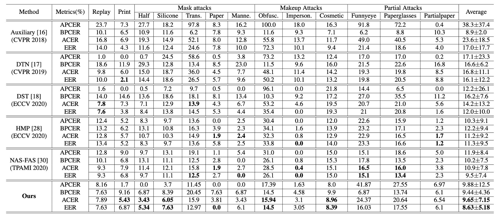
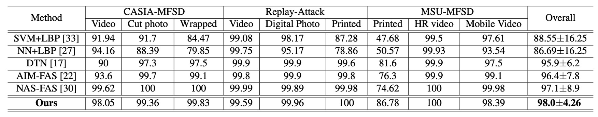
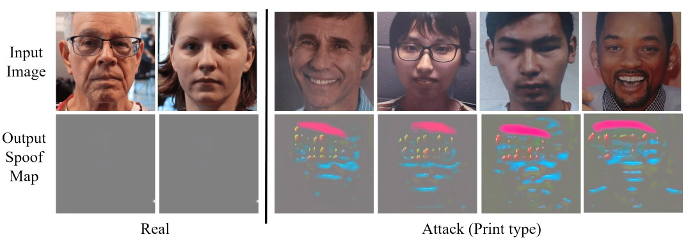
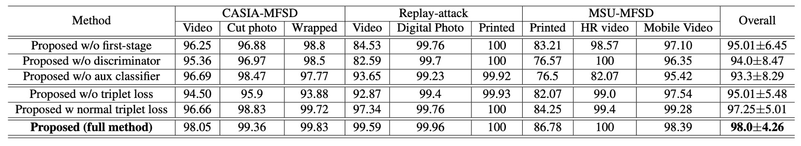

## The Technique of Dual Disentanglement

[**Disentangled Representation with Dual-stage Feature Learning for Face Anti-spoofing**](https://arxiv.org/abs/2110.09157)

---

Disentangled representation learning has become an increasingly popular topic.

The concept of disentanglement itself is relatively agreed upon: it aims to extract spoofing features.

But what about everything else besides the spoof features?

## Problem Definition

In most face anti-spoofing systems, the model tries to infer one thing from an image: is this a live person or a spoof?

However, this decision is actually inferred from a tangled mixture of signals: **the face material, residual lighting, or compression artifacts.**

In other words, almost all information that can sneak in, does sneak in.

This is exactly the core issue disentangled representation learning seeks to address:

> **Not only to answer true or false, but to clarify what exactly you have seen.**

In recent years, many studies have proposed various disentanglement strategies, and we have reviewed several related papers.

Some split the latent space into two parts, separating liveness features from content features; others try to decompose spoof traces into multi-scale residuals simulating spoof artifacts. But nearly all methods rely on one assumption:

> **We can complete both segmentation and reconstruction in a single stage.**

This assumption is not reasonable, because things are not always so clear-cut:

- Once disentanglement and classification objectives overlap too much, models tend to take shortcuts.
- Adversarial training can encourage latent space separation but often induces gradient oscillations, making learning highly unstable.
- Even introducing auxiliary supervision (e.g., depth maps, rPPG signals) cannot guarantee these cues work for all types of attacks.

In other words, we force the model to distinguish spoofing without providing a stable way for it to learn the spoofing syntax.

It can see real or fake, but cannot understand the syntactic differences between them; it can classify most samples correctly but cannot predict how the next attack might morph. **The concept of disentangled representation in practice still suffers from architectural instability, signal dependency, and unpredictability for unknown attacks.**

The authors of this paper propose:

> **Why not learn in stages?**

Slowly but surely is faster.

## Solution

<figure style={{"width": "90%"}}>

</figure>

When facing unknown attacks, simple binary classification is far from enough.

Here, the authors choose a "split first, then disentangle" approach, letting the model first identify all common characteristics of the "live prototype," and then gradually peel off the spoof-specific features.

As shown above, the whole model requires two stages to complete training. Let's take a closer look at the detailed procedure.

### Learn Liveness Information First

The authors first build a **Live-info Network** for autoencoding learning.

- Input: only live face samples $x^* \in P_X$
- Encoder $E_L$: extracts liveness features $F_L$
- Decoder $D_L$: tries to reconstruct input, outputting $\hat{x}^*_{syn}$

To ensure the model captures the essence of "live faces," the following loss function is minimized to reduce reconstruction error:

$$
\mathcal{L}_{Live}
= \mathbb{E}_{x^* \sim P_X} \Big[\big\|x^* - \hat{x}^*_{syn}\big\|_2^2\Big]
$$

At this stage, the model does not encounter any spoof faces, so the liveness features extracted by $E_L$ are relatively "pure"; they describe all common variations among live faces without interference from spoof signals.

This encoder will later be used as a **fixed-weight** liveness feature extractor, introduced into the next stage.

### Dual-Stream Parallel Reconstruction

In the second stage, spoof samples are introduced into training, forming a dual-stream parallel reconstruction disentanglement module:

1. **Live-encoder $E_L$**

   - Loads the weights trained in the first stage to extract liveness features $F_L$.
   - These weights are frozen to ensure the liveness representation remains uncontaminated.

2. **Spoof-encoder $E_S$**

   - Dedicated to extracting spoof features $F_S$, i.e., attack signals absent or subtle in real faces.

3. **Reconstructor $D$**

   - Attempts to reconstruct the input image $\hat{x}_{syn}$ based on the fused features $F_L$ and $F_S$.

To ensure $D$ learns complete reconstruction and to force $E_S$ to focus on spoof discrepancies, the authors use both **reconstruction loss** and **adversarial loss**:

- **Reconstruction Loss**

  $$
  \mathcal{L}_{recon}
  = \mathbb{E}_{x \sim P_X} \Big[\big\|x - \hat{x}_{syn}\big\|_2^2\Big]
  $$

- **Generator Loss**

  $$
  \mathcal{L}_{Gen}
  = \mathbb{E}_{x \sim P_X} \Big[(D(\hat{x}_{syn}) - 1)^2\Big]
  $$

- **Discriminator Loss**

  $$
  \mathcal{L}_{Dis}
  = \mathbb{E}_{x \sim P_X} \Big[(D(x) - 1)^2 + (D(\hat{x}_{syn}))^2\Big]
  $$

Here, $D(\cdot)$ is the discriminator responsible for distinguishing whether $\hat{x}_{syn}$ is a real sample.

Through this adversarial mechanism, the model simultaneously learns to properly separate and combine **live features $F_L$** and **spoof features $F_S$**.

### Extracting Spoof Clues

The authors connect $F_S$ to a U-Net-like decoder $D_{map}$, which attempts to convert spoof features into a **spoof map**. To maximize the spoof map’s ability to distinguish "live vs. spoof," they introduce a triple loss design:

1. **Triplet Loss**

   The goal is to pull together intra-live samples while pushing apart live and spoof samples.

   Using live samples as anchors $f_i^a$, positive samples (live) $f_i^p$, and negative samples (spoof) $f_i^n$, they compute both normal triplet loss $\mathcal{L}_t^{normal}$ and hard triplet loss $\mathcal{L}_t^{hard}$, then sum to form $\mathcal{L}_t$.

2. **Minimizing Residual Spoof Loss ($\mathcal{L}_r$)**

   For live faces, no significant spoof patterns should be generated, so the spoof map is encouraged to approach zero:

   $$
   \mathcal{L}_r
   = \mathbb{E}_{x \sim P_{live}} \Big[\big\|\hat{y}_{map}\big\|_1\Big]
   $$

3. **Auxiliary Classifier Loss ($\mathcal{L}_c$)**

   To enhance spoof map discriminability, the spoof map $\hat{y}_{map}$ is concatenated with the original image $x$ and fed into an auxiliary classifier $C_{aux}$ to predict live/spoof labels:

   $$
   \mathcal{L}_c
   = \mathbb{E}_{(x,y)} \Big[ -y \cdot \log(\hat{y}_c) + (1-y)\cdot \log(1-\hat{y}_c) \Big]
   $$

Finally, the overall loss function is summarized as:

$$
\mathcal{L}
= \lambda_1 \mathcal{L}_{recon}
+ \lambda_2 \mathcal{L}_{Gen}
+ \lambda_3 \mathcal{L}_t
+ \lambda_4 \mathcal{L}_r
+ \lambda_5 \mathcal{L}_c
$$

The paper sets the weights as $\lambda_1=4, \ \lambda_2=1, \ \lambda_3=3, \ \lambda_4=5, \ \lambda_5=5$.

### Training and Inference

1. **Training procedure**

   - Stage one: train $E_L$ and $D_L$ only with live face samples.
   - Stage two: freeze $E_L$, then jointly train $E_S$, $D$, and $D_{map}$; adversarial loss, reconstruction loss, and multiple supervisions refine spoof feature disentanglement.

2. **Inference**

   - Use only $E_S$ and $D_{map}$ to generate the spoof map.
   - The average value of the spoof map is taken as the spoof score.
   - Samples with scores above a threshold are classified as spoof attacks.

On a GeForce GTX 1080, the authors report an inference speed of **121.48 ± 1.4 FPS**.

Based on this design, the authors explicitly separate the training into "learning live features" and "disentangling spoof features" stages, maintaining stable detection performance on unknown attacks without relying on any external auxiliary signals (e.g., depth maps, rPPG).

## Discussion

### Cross-type Experimental Performance

The above table shows experimental results on SiW-M, which contains various types of attacks. The method in this paper significantly outperforms similar studies in average ACER and EER, demonstrating not only low average values but also **small standard deviations** indicating stability.

Next, results from multi-dataset testing on **MSU-MFSD, CASIA-MFSD, Replay-Attack** show that this method achieves an overall best **98.0% AUC**. The improvement is especially notable in “print attack” scenarios, which have been challenging in the past.

This demonstrates that the dual-stage disentanglement strategy maintains balanced recognition performance across various spoof materials and imaging modalities.

### Same-type Experimental Performance

<figure style={{"width": "70%"}}>

</figure>

To test variations in facial expression, lighting, and camera devices, the authors used three sub-protocols in SiW:

1. **Protocols 1 and 2:** DualStage performs well, handling common pose and lighting variations smoothly.
2. **Protocol 3:** Since the training data contains only one attack type, the model cannot fully explore diverse spoof features; ACER is slightly higher at 3.58%, but still competitive.

These results show that in same-type (known attack) scenarios, DualStage not only learns stable “liveness representations” but also copes well with basic environmental changes.

### Visualization of Disentangled Features

To illustrate the disentangled features, the authors performed a “face swap” experiment.

They swapped the live features from a real face with the spoof features from a fake face to generate corresponding spoof or live images.

The results show that after swapping, the real face acquires spoof textures such as “stripes or grayscale imbalance,” while the original spoof face partially recovers natural skin tone.

This confirms that the **spoof feature** in this framework indeed represents the “residual spoof traces,” acting as the key factor driving the generation of spoof patterns.

### Spoof Map Analysis

Finally, to observe what the disentangled spoof feature looks like, the authors decoded it via a U-Net style decoder $D_{map}$ to generate detection maps.

On live samples, the spoof maps are nearly zero; on spoof samples, obvious bright regions appear locally (e.g., screen edges, mouth and nose details).

This indicates that DualStage not only disentangles abstract features but also provides visual cues in image space to aid observation and analysis.

### Ablation Study

Because DualStage employs many loss functions, the authors conducted ablation experiments on their effects and compared results with other methods.

Removing the first stage (w/o first stage) or the adversarial loss causes the model to fail severely on some attacks. Removing triplet-related losses greatly weakens the spoof map’s ability to distinguish real and attack samples.

This shows that the combination of **“learning from one-class live faces + adversarial training + multiple triplet losses”** is a crucial design for the model.

## Conclusion

DualStage proposes a straightforward design:

**Split the disentanglement process into two stages — first stably learn liveness features, then gradually peel off spoof signals.**

Without additional depth maps or rPPG, and relying solely on images themselves, the model can generate discriminative spoof maps and demonstrate robust cross-type generalization on multiple public datasets. This allows it to maintain a solid position even without multimodal support.

Of course, it still has drawbacks: performance is less satisfactory in scenarios with extremely sparse attack types (e.g., SiW Protocol 3). Future improvements may require further handling of seemingly “irrelevant” but actually disruptive feature fragments.

As a methodological proposal, it leaves an important message:

> **Disentanglement does not have to be done all at once.**

The model can learn gradually, as long as it is given the right sequence.
