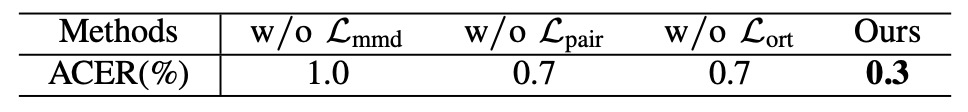
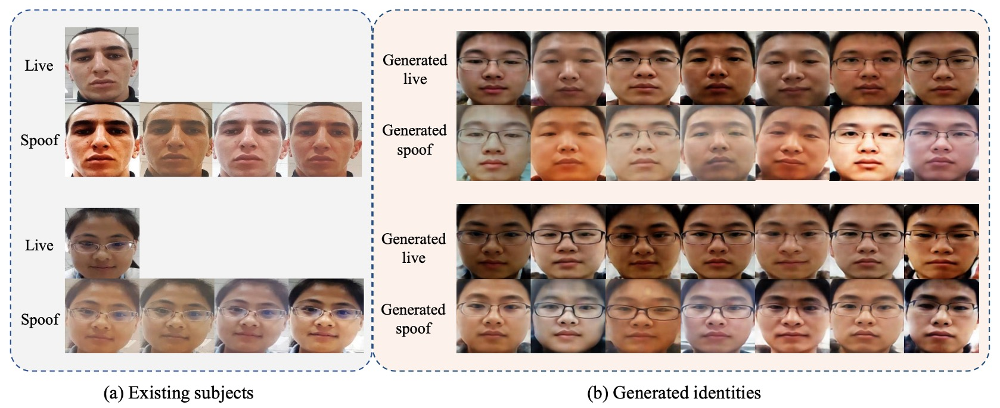

## The Eve of Illusion Recombination

[**Dual Spoof Disentanglement Generation for Face Anti-spoofing with Depth Uncertainty Learning**](https://arxiv.org/abs/2112.00568)

---

Some illusions are not hard to detect; rather, you have simply never seen them appear in this form.

## Problem Definition

When face recognition systems begin to take on real-world verification responsibilities, recognition accuracy is no longer just a number on a leaderboard, but a boundary of risk. Face Anti-Spoofing (FAS), as the gatekeeper of this boundary, has in recent years evolved from a binary classification task into a generalization game against diverse variations.

However, most existing methods remain trapped by an unresolved assumption:

> **The limitation of data leads to models generally lacking the ability to recognize unknown identities and attack types.**

The training datasets we use mostly come from closed environments, fixed devices, few identities, and limited attack types.

For example, OULU-NPU contains only 20 subjects, SiW has 90; such data distributions cannot support models facing challenges in real deployments with multi-source devices, multinational ethnicities, complex lighting, and attack techniques. The resulting effect is that models overfit to training samples and fail to effectively recognize attacks under unseen conditions.

Searching for more and more data has become the default solution.

If we consider image translation methods, most can only "swap faces but not identities," so generated samples remain bound to the original identity; synthetic processes based on external data collection face practical costs such as copyright, annotation, manpower, and delay.

Furthermore, when we attempt to introduce generative models to solve the data bottleneck, we inevitably encounter another problem:

> **The quality of synthetic samples varies, which may disrupt the stability of supervisory signals.**

Especially in frameworks that use depth maps as supervisory signals, blurry and distorted images directly affect depth prediction accuracy, causing the entire training process to lose convergence and interpretability.

This is a dual-problem structure:

- How to generate synthetic images that simultaneously possess new identities and existing attack patterns, improving intrinsic data variability?
- How to ensure these generated samples do not negatively pollute depth-supervised training, causing the main network to learn incorrect visual cues?

The authors of this paper confront this issue head-on, proposing corresponding solutions from the perspectives of synthetic data generation logic and training processes.

Before moving on to the next section, let us refocus on the original question:

> **How many illusions must a truly useful FAS system have seen to confidently say, "This is not real"?**

## Solution

To address the two major problems of "data scarcity" and "image distortion," the authors integrate two ideas: "generative data augmentation" and "uncertainty learning," establishing a dual-module architecture:

- **DSDG** (Dual Spoof Disentanglement Generation)
- **DUL** (Depth Uncertainty Learning)

### Dual Spoof Disentanglement Generation (DSDG)

<figure style={{"width": "90%"}}>

</figure>

The core goal of DSDG is **to automatically synthesize diverse paired live/attack samples without relying on external data**.

The authors use a dual-encoder Variational Autoencoder (VAE) to disentangle facial images into "identity features" and "attack features," then recombine them in the decoder to generate new paired images.

This approach simultaneously expands the coverage of identities and attack modes.

As shown in Figure (a), the overall structure consists of two encoders and one decoder, plus a disentanglement module that distinguishes spoof and identity features. The specific steps are:

1. **Dual Encoder Feature Outputs**

   - **$\text{Enc}_s$** inputs the attack image $I_{\text{spoof}}$, separately extracting the "attack pattern feature" $z^t_s$ and the "identity feature" $z^i_s$.
   - **$\text{Enc}_l$** maps the live image $I_{\text{live}}$ to the identity feature $z^i_l$;

   Using the reparameterization trick, each encoder outputs the mean $\mu$ and standard deviation $\sigma$, then obtains features by

   $$
   z = \mu + \epsilon \sigma,\quad \epsilon \sim \mathcal{N}(0, I)
   $$

   :::tip
   The **reparameterization trick** originates from the paper [**Auto-Encoding Variational Bayes**](https://arxiv.org/abs/1312.6114).

   Simply put, it is a technique that allows the stochastic sampling in Variational Autoencoders (VAEs) to be incorporated into gradient backpropagation. This trick makes training VAEs more stable and improves convergence speed.
   :::

2. **Reconstruction and Disentanglement**

   The decoder $\text{Dec}$ receives the three features $(z^t_s, z^i_s, z^i_l)$ and generates reconstructed $\hat{I}*{\text{spoof}}$ and $\hat{I}*{\text{live}}$ respectively.

   To ensure the attack feature is correctly extracted, a spoof classifier is attached on $z^t_s$ with a cross-entropy loss ($L_{\text{cls}}$) to enforce correct attack-type prediction.

   Meanwhile, an "angular orthogonality" constraint ($L_{\text{ort}}$) is introduced between the attack feature $(z^t_s)$ and identity feature $(z^i_s)$ to encourage vector orthogonality, preventing confusion.

3. **Distribution Alignment and Reconstruction Loss**

   To achieve VAE feature distribution learning, the authors apply Kullback-Leibler (KL) divergence ($L_{\text{kl}}$) to force the encoded distributions toward a standard Gaussian.

   Reconstruction losses via L1 or L2 distance ($L_{\text{rec}}$) ensure reconstructed images approximate the input originals.

   Additionally, Maximum Mean Discrepancy (MMD) loss ($L_{\text{mmd}}$) and identity feature mapping loss ($L_{\text{pair}}$) align the identity distributions, ensuring the same face maintains consistent identity in both live and spoof forms.

All losses are combined into the total objective function:

$$
\mathcal{L} = L_{\text{kl}} + L_{\text{rec}} + \lambda_1 L_{\text{mmd}} + \lambda_2 L_{\text{pair}} + \lambda_3 L_{\text{ort}} + \lambda_4 L_{\text{cls}}
$$

After training the VAE-like structure, as shown in Figure (b), multiple pairs $(\hat{z}^t_s, \hat{z}^i_s)$ can be generated by sampling from a standard Gaussian noise. Then $\hat{z}^i_s$ is copied as $\hat{z}^i_l$ (to ensure paired identity consistency) and passed to the decoder to generate new samples $(\hat{I}_{\text{spoof}}, \hat{I}_{\text{live}})$.

This process requires no additional annotations or external data and can "create from nothing" a large-scale synthetic dataset with new identities and original attack patterns. However, since VAEs inherently tend to produce blurry or locally distorted images, directly including these noisy samples in training risks confusing the depth supervision.

To address this, the authors propose **Depth Uncertainty Learning** as a remedy.

### Depth Uncertainty Learning (DUL)

<figure style={{"width": "70%"}}>

</figure>

Beyond the diversity of synthetic samples themselves, the authors further address the interference problem in depth supervision by introducing an uncertainty representation mechanism that quantifies and suppresses the negative effects of generative noise via Gaussian distributions.

Traditional depth supervision methods produce a fixed depth value for each image patch. However, when synthetic images contain local distortions, the depth annotations often become unreliable.

The authors treat the depth value as a Gaussian distribution $\mathcal{N}(\mu_{i,j},,\sigma_{i,j}^2)$, where $\mu_{i,j}$ is the learnable depth mean and $\sigma_{i,j}$ represents uncertainty.

During training, the value actually involved in the loss calculation is a sampled depth $d_{i,j} = \mu_{i,j} + \epsilon \sigma_{i,j}$, where $\epsilon \sim \mathcal{N}(0, I)$.

This "reparameterization" approach allows uncertainty to be learned through backpropagation.

Within this framework, the Depth Uncertainty Module (DUM) applies two convolutional operations on the depth feature map: one outputs $\mu_{i,j}$, the other outputs $\sigma_{i,j}$.

Then, via KL divergence, the Gaussian $\mathcal{N}(\mu_{i,j}, \sigma_{i,j}^2)$ is aligned with a Gaussian constructed from the real depth values $\mathcal{N}(\hat{\mu}_{i,j}, I)$, ensuring the learning process gradually focuses on reliable depth.

Practically, DUM can replace or be attached to any existing depth prediction backbone network (such as ResNet or CDCN) to output "mean + uncertainty" at the pixel level.

The authors use mean squared error ($L_{\text{MSE}}$) as the main depth supervision and add a weighted term $\lambda_{\text{kl}} L_{\text{kl}}$ in the total loss to control the strength of uncertainty regularization.

Overall, the total loss can be expressed as:

$$
L_{\text{overall}} = L_{\text{MSE}} + \lambda_{\text{kl}} L_{\text{kl}} + \lambda_g \Bigl(L_{\text{MSE}}' + \lambda_{\text{kl}} L_{\text{kl}}'\Bigr),
$$

where $\lambda_g$ is a hyperparameter controlling the proportion of synthetic data, allowing training to balance contributions from both real and generated samples.

Through these two core modules, the authors successfully transform the FAS training process into a dual structure of "data augmentation" and "uncertainty learning."

## Discussion

In this chapter, the authors provide a systematic discussion based on multi-faceted experiments and visualizations, explaining how DSDG uses a VAE to generate highly diverse data, while DUM suppresses noise through uncertainty estimation. They ultimately demonstrate effectiveness across multiple scenarios, attack types, and cross-dataset evaluations.

### Ablation Studies

The authors conduct ablation experiments on key hyperparameters and module configurations, focusing on the impact of identity quantity on performance, adjustment of synthetic image ratio ($r$), and the contribution of individual losses (e.g., $L_{\text{mmd}}$, $L_{\text{pair}}$, $L_{\text{ort}}$) to identity disentanglement.

1. **Number of Identities and Generalization Performance**

   

   <figure style={{"width": "60%"}}>
   
   </figure>
   

   Using OULU-NPU Protocol 1 (P1) as an example, the table shows a clear decrease in ACER as the number of identities increases from 5 to 20. This demonstrates that when the base dataset covers more facial variations, the effect of DSDG's enhancement is more stable.

2. **Synthetic Image Ratio $r$**

   

   <figure style={{"width": "70%"}}>
   
   </figure>
   

   The authors analyze the training batch ratio of "real samples : synthetic samples" and find that $r = 0.75$ yields the best ACER performance.

   

   <figure style={{"width": "70%"}}>
   
   </figure>
   

   Further adjusting the number of generated images (from 10k to 30k) reveals that around 20k samples balance noise interference reduction most effectively.

3. **Importance of Identity Disentanglement Losses**

   

   <figure style={{"width": "80%"}}>
   
   </figure>
   

   In controlled experiments, removing any one of $L*{\text{mmd}}$, $L*{\text{pair}}$, or $L_{\text{ort}}$ significantly increases ACER.

   This indicates the critical role of the tripartite identity constraints designed by the authors in ensuring proper separation of attack patterns and facial identities.

4. **Hyperparameters $\lambda_{\text{kl}}$ and $\lambda_g$**

   

   <figure style={{"width": "70%"}}>
   
   </figure>
   

   Sensitivity tests on the KL weight ($\lambda_{\text{kl}}$) and synthetic data ratio ($\lambda_g$) show that within a fairly broad range, ACER remains better than the baseline, indicating robustness to hyperparameters and application flexibility.

### Intra-Dataset Testing

:::info
The tables in the paper are too large to include here without affecting readability; please refer directly to the original paper for detailed results.
:::

To evaluate recognition ability within the same dataset, the authors select OULU-NPU and SiW.

- **OULU-NPU (see Table X in the paper):** Across all four protocols, DSDG + DUM achieve the best results, especially on Protocol 4, a challenging scenario with unknown lighting, attack types, and cameras.
- **SiW (see Table XI in the paper):** Across three protocols, the method attains the lowest ACER in the first two protocols; in Protocol 3, performance is slightly below state-of-the-art but still better than the original CDCN.

This validates that without external data, integrating generative augmentation with depth uncertainty delivers stable performance under common attack types and environmental changes.

### Model Analysis and Visualization

The authors use various visualization methods to show the nature of generated images, attack feature disentanglement, and depth uncertainty distribution, helping readers understand DSDG and DUM’s internal workings.

1. **Generated Images**

   

   <figure style={{"width": "90%"}}>
   
   </figure>
   

   The images show comparisons across different identities with the same attack, and the same identity with diverse attack patterns, illustrating that DSDG can augment identities while preserving original attack traces.

   

   <figure style={{"width": "90%"}}>
   
   </figure>
   

   Under the diverse attack-rich SiW-M dataset, the authors also showcase generated 3D masks, makeup, and partial attacks, verifying the controllable scope of VAE’s partial distortions.

2. **Attack Pattern Disentanglement**

   

   <figure style={{"width": "90%"}}>
   
   </figure>
   

   Images generated by swapping spoof-type features under the same identity are placed side-by-side, showing clear distinction between live and spoof samples. t-SNE projection reveals that without the classifier and orthogonality loss ($L_{\text{ort}}$), attack distributions tend to overlap; enabling these losses leads to distinct clusters.

3. **Depth Uncertainty**

   

   <figure style={{"width": "90%"}}>
   
   </figure>
   

   Standard deviation significantly increases in distorted regions (red areas), indicating the model can automatically down-weight uncertain pixels. Compared to CDCN, DUM helps precisely locate real edges and reflection regions, improving discrimination on borderline ambiguous samples.

## Conclusion

DSDG addresses a simple but persistent question: how to simultaneously augment identity and attack diversity and suppress generative noise erosion on depth supervision without extra annotations or external data?

It is not a breakthrough in network architecture but rather a repair to data syntax and learning stability.

At the time of publication, it was on the eve of the widespread deepfake surge and before Diffusion models became mainstream. Yet the authors already realized that "data problems cannot be solved by data alone," and attempted to push the generalization boundary with two modular strategies: generation and uncertainty.

Of course, limitations remain:

- Using VAE as the generative backbone restricts resolution and detail stability;
- Dependence on depth limits extension to non-depth-supervised scenarios;
- Dependence on spoof types remains and is not fully relaxed, impacting purely unsupervised settings.

Nevertheless, these do not diminish its role in the technology chain. DSDG reminds us:

> **Data diversity, supervision reliability, and model robustness must be considered simultaneously, or reinforcement only stacks noise.**

Models evolve, attacks mutate, algorithms get forgotten.

But those who once tried to decompose problem structures instead of chasing scores leave shadows, becoming waypoints for those who follow.
