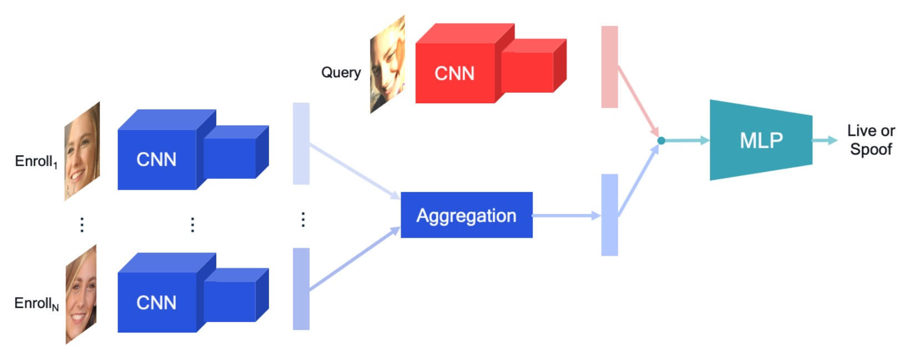
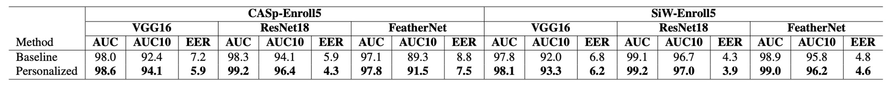

## Personalized Attempt

[**A Personalized Benchmark for Face Anti-Spoofing**](https://openaccess.thecvf.com/content/WACV2022W/MAP-A/papers/Belli_A_Personalized_Benchmark_for_Face_Anti-Spoofing_WACVW_2022_paper.pdf)

---

This paper is more application-oriented and not widely cited.

However, it introduces a personalized benchmark for existing Face Anti-Spoofing (FAS) models, conceptually aligning with the current societal emphasis on privacy. Let’s take a look.

## Defining the Problem

<figure style={{"width": "60%"}}>

</figure>

We have already reviewed several FAS papers.

The general approach is to input a new image into a pre-trained FAS model, and the model tells you whether the image is live or spoofed. In this process, the model makes its determination based on the features of the image.

The authors of this paper, however, focused on the “user enrollment images.”

Current facial recognition models are based on a “metric learning” framework. In practical applications, users capture one (or more) photo(s) during enrollment, and the subsequent verification process compares these enrolled images.

So, why not use these enrolled photos as references for the FAS model?

The authors of this paper proposed this idea and demonstrated its effectiveness in experiments.

## Solving the Problem

### Model Architecture

<figure style={{"width": "90%"}}>

</figure>

This research presents a compact yet scalable personalized FAS architecture. The core idea is to treat the images from the user enrollment phase (Enrollment Set) as "personal liveness references" and use feature aggregation mechanisms to compare them with the current query image (Query), enhancing the reliability of liveness detection. The overall process, as shown in the image above, can be broken down into the following three stages:

1. **Dual-path Feature Extraction Module**:

   The model uses two independent CNN encoders, one for encoding the query image and the other for encoding the enrollment images. This design helps prevent interference between the two and addresses the differences in quality, environment, and equipment between query and enrolled images in real-world scenarios.

   - The query image $I_q$ is encoded by encoder $\phi_q$ into a feature vector $f_q \in \mathbb{R}^D$
   - The enrollment images $\{I^i_e\}_{i=1}^N$ are encoded by another encoder $\phi_e$ into $\{f^i_e\}_{i=1}^N$

2. **Enrollment Feature Aggregation Module**:

   The model needs to integrate the features of multiple enrollment images into a single latent vector $f^{agg}_e$, representing the personalized reference for the user. The authors explored several aggregation strategies, including:

   - **Non-parametric Methods**

     - **Concatenation**

       - Concatenate the $N$ enrollment features into a vector of length $N \cdot D$
       - Retain full information but is order-sensitive and lacks permutation invariance

     - **Mean**
       - Average the $N$ features:
         $$
         f^{agg}_e = \frac{1}{N} \sum_{i=1}^N f^i_e
         $$
       - Highly compressed into a single vector, with order invariance
       - Model the correspondence between the query and enrollment using an MLP

     ***

   - **Sequence Modeling (GRU)**

     - Treat enrollment features as a time sequence (particularly suitable for SiW video frames)
     - Use the GRU algorithm for recursive aggregation:
       $$
       h_l^i = \text{GRU}(f_l^i, h_l^{i-1})
       $$
     - The hidden state of the last layer serves as the aggregated feature $f^{agg}_e = h_L^N$

     This approach is suitable for modeling the **temporal and change relationships** in the enrollment features, capturing continuous information like pose transitions and expression changes.

     ***

   - **Attention-based Learning**

     Use key-query-value attention on query and enrollment features:

     $$
     f^{agg}_e = \text{Softmax} \left( \frac{QK^T}{\sqrt{M}} \right)V
     $$

     Specifically:

     - $Q = A_Q(f_q)$
     - $K_i = A_K(f^i_e)$, $V_i = A_V(f^i_e)$
     - $A_Q, A_K, A_V$ are all linear layers

     This method is suitable for modeling the **similarity** between query and enrollment features, enhancing the correspondence between them.

     ***

   - **Graph Neural Network (GNN)**

     Treat the query + enrollment features as nodes in a graph:

     - $N + 1$ nodes: the query + $N$ enrollment images

     Each GNN layer performs:

     1. Calculate the adjacency matrix $A_l$: based on the distance function $\psi_l(f^i_l, f^j_l)$ between node features
     2. Perform graph convolution to update node features:
        $$
        f^{i}_{l+1} = \rho \left( \sum_{A_l \in \mathcal{A}_l} A_l f^i_l W_l \right)
        $$

     Finally, use the query node’s feature as the input for classification.

     This method is suitable for modeling the **relative relationships** between enrollment features, capturing the similarities and differences between different enrollment images.

     ***

   In the experiments, the simplest mean operator showed stable and excellent performance, indicating that even without changing the core model architecture, a simple aggregation strategy can effectively introduce the concept of personalization.

3. **Feature Fusion and Classification Module**:

   Finally, concatenate the query feature $f_q$ with the aggregated enrollment feature $f^{agg}_e$ and input it into an MLP for classification. The model learns the correspondence between the two through end-to-end training and predicts the spoof probability of the query image.

The most notable feature of this architecture is its **high scalability and deployment-friendly nature**.

Since the enrollment features can be precomputed and stored as embedding vectors during the enrollment phase, the subsequent query process only requires a single forward pass, reducing computational load. Additionally, it can be designed to ensure user privacy through secure encryption. In the future, even with the addition of multimodal inputs (e.g., RGB + Depth + IR) or other backbones, it can be seamlessly integrated, demonstrating high practical potential.

### Dataset Construction

To validate the effectiveness of the proposed model architecture, the authors modified existing public FAS datasets to create the first batch of personalized versions with "user enrollment correspondence," as follows:

- **CASp-Enroll** (modified from CelebA-Spoof)
- **SiW-Enroll** (modified from SiW)

This dataset conversion process is universal and can be applied to any anti-spoofing dataset containing subject metadata. The core logic is as follows:

- In the original dataset, each data point consists of a query image and its spoof label:
  $$
  d_i = (I_q^{(i)}, t_q^{(i)})
  $$
- The personalized dataset adds the corresponding enrollment set, which includes N live images from the same user:
  $$
  d_i = (I_q^{(i)}, t_q^{(i)}, \mathbf{e}^{(i)}), \quad \text{where } \mathbf{e}^{(i)} = (I^1_e, ..., I^N_e)
  $$
- A unique enrollment set is created for each user and applied to all query samples of that user.

### CelebA-Spoof-Enroll (CASp-EnrollN)

CelebA-Spoof is one of the largest liveness detection datasets, covering over 10,000 users and 600,000 images. To create CASp-Enroll, the authors devised the following strategy:

- Set a fixed enrollment size N (e.g., N=5) to ensure each user has a standardized reference set.
- For each user, select their live samples: if the number of live samples is less than N, exclude the user.
- The first N live images are designated as the enrollment set, with the remaining live and spoof images used as queries.
- Enrollment images are selected by filename sorting to avoid introducing bias from random factors.

This data partitioning logic not only maintains data standardization but also aligns with the practical "enrollment first, subsequent verification" process.

### SiW-Enroll (SiW-EnrollN)

SiW is a high-quality video-based anti-spoofing dataset originally from 165 subjects who filmed 4,478 short clips. To personalize the dataset:

- Split the dataset into train/test according to Protocol 1, and sample every 10 frames to avoid excessive sample repetition.
- For each user × device combination, select one representative video, and randomly extract N frames from it to form the enrollment set.
- To simulate real-world device operation scenarios, the video must meet these conditions:
  - No lighting changes
  - Pose changes (to increase diversity in the enrollment representation)
- All frames from the video are excluded from the query set to prevent information leakage.

This design simulates real-world scenarios such as "multiple device logins" and "different shooting qualities," presenting more challenging and realistic testing conditions.

## Discussion

### Is Personalization Really Better?

The experimental results, shown in the table above, clearly show that for the two personalized datasets (**CASp-Enroll5** and **SiW-Enroll5**), models that incorporate enrollment information **outperform the baseline across all backbone combinations**, demonstrating the significant benefits of personalization.

- For **CASp-Enroll5**, the personalized version achieved the highest **+2.2% AUC10 improvement**, with the most significant gains observed in traditional architectures like VGG16 and ResNet18.
- Although **FeatherNet** is a lightweight model designed specifically for FAS, it still showed steady improvement after incorporating personalization, indicating that this method is effective not only for large models but also for resource-sensitive deployment architectures.

In contrast, the improvement in **SiW-Enroll5** was smaller, likely due to the less diverse and lower variability of the enrollment composition, which resulted in less informative personalized references compared to CASp-Enroll5.

This directly answers the first research question:

> **Can adding personalized reference data truly improve FAS performance?**

The answer is affirmative.

Even without adjusting the model architecture or changing the loss function, simply providing an enrollment set from the same user allows the model to learn more discriminative matching criteria.

:::tip
This means that even with existing FAS systems, simply adding a registration process and maintaining a small set of live data can provide additional anti-spoofing protection without requiring large-scale retraining. This is especially attractive for systems deployed on mobile devices.
:::

### Is the Simplest Method the Best?

<figure style={{"width": "70%"}}>

</figure>

The authors evaluated five different enrollment feature aggregation methods.

From the experimental results shown in the figure:

> **The simplest mean (Mean) method turned out to be the most stable and highest-performing.**

A closer look shows:

- On **CASp-Enroll5**, the Mean aggregation achieved the highest AUC and AUC10 (98.6 / 94.1), while also reducing the EER to the lowest overall (5.9), demonstrating extremely high overall performance.
- On **SiW-Enroll5**, although the Mean method wasn’t the highest, it was close to the best value and consistently remained in the top three.
- In contrast, the **Attention** method surprisingly performed worse, not only failing to outperform the baseline but even slightly regressing in SiW (EER increased to 7.1).
- While GNN showed some expressive ability, it lagged behind non-parametric methods in CASp, suggesting that its complexity did not bring commensurate benefits.

These results echo a common phenomenon in model design: **more complex mechanisms are not necessarily more effective.** Especially when the quality and scale of enrollment data are limited, simpler methods are often better at learning stable matching logic.

:::tip
If the goal is to quickly introduce personalization into an existing FAS framework, **prioritize the Mean aggregation strategy** as it provides good performance with very low computational cost.
:::

### Can’t Share the Encoder?

<figure style={{"width": "70%"}}>

</figure>

This ablation experiment attempts to answer a critical question: **Can the query image and the enrollment image share the same feature extractor?**

Intuitively, both are facial images with the same input format, so they could theoretically be processed by the same CNN encoder. However, the experimental results provide a clear and unexpected conclusion:

> **Sharing the encoder not only does not help but actually significantly harms model performance.**

As shown in the table, when we use the same encoder to extract features for both query and enrollment images:

- **On CASp-Enroll5**, the AUC10 significantly dropped (from 94.1 to 90.8), and the EER surged to 13.7%, even falling below the baseline without personalization.
- **On SiW-Enroll5**, performance was severely degraded, with EER reaching 20.6%, indicating that the model almost failed to distinguish between live and spoof images.

In contrast, using independent encoders maintained the high performance.

:::tip
Although the tasks of the Enrollment and Query images are similar, their information nature differs, so separate learning paths should be retained.
:::

## Conclusion

This study presents a novel approach for personalized FAS by incorporating user enrollment images as references, allowing the model to incorporate individual characteristics in the recognition process and effectively improving spoof attack detection. From creating the benchmark, conversion process, to evaluating aggregation strategies and model designs, the overall work is clear and insightful, providing a starting point for future FAS systems that account for user differences.

:::tip
From a security and attack surface perspective:

- **The authenticity and integrity of enrollment data cannot be guaranteed**: If malicious individuals upload forged or blurry images during the enrollment phase, the system could learn "incorrect liveness references," creating a new type of attack surface.
- **Data bias and fairness issues have not been explored**: The current experiments focus on actor and controlled shooting data. Whether this can be generalized to regular users, different groups, and scenarios remains to be further verified.

Before practical application, more comprehensive validation and design are needed in terms of attack risk assessment, system defense design, and compliance with privacy regulations.
:::
