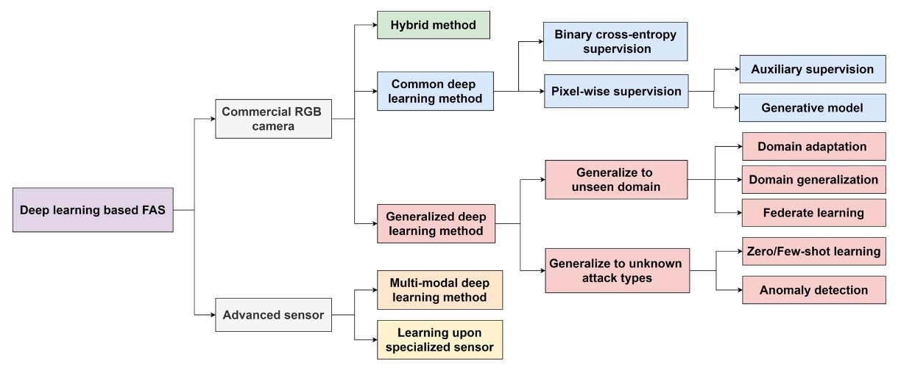
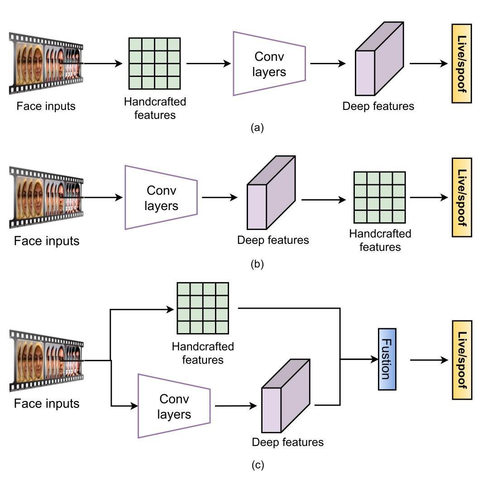
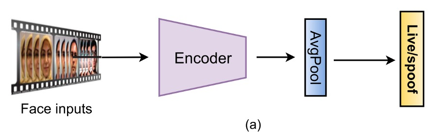
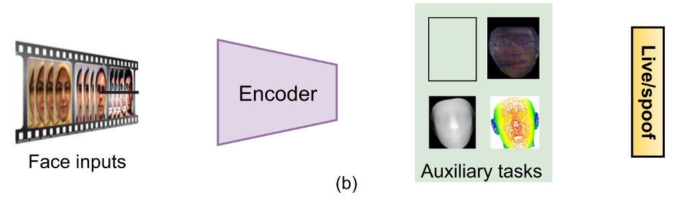
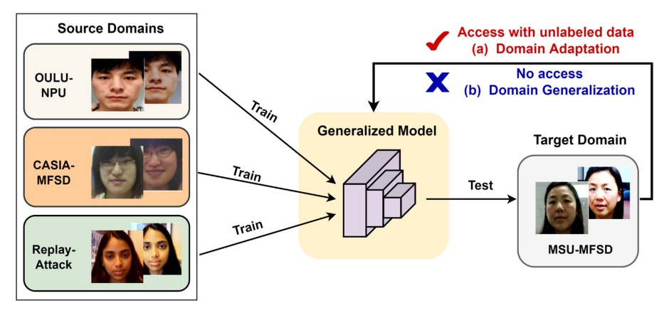

## A Chronicle of Attacks and Defenses

[**Deep Learning for Face Anti-Spoofing: A Survey**](https://ieeexplore.ieee.org/abstract/document/9925105)

---

After reviewing a few papers, we have a general understanding of the research background and development context of FAS.

Now, let's directly review the various methods developed over the past decade or so.

:::tip
This survey paper includes around two hundred references, so interested readers can look it up for further reading.
:::

## FAS Framework

The first step of all attacks is to deceive the sensor.

Therefore, we can roughly divide attacks into two categories:

- **Digital Attacks (Digital Manipulation)**: Such as deepfakes or image processing, where modifications are made directly in the virtual domain.
- **Physical Presentation Attacks**: The focus of this paper, where the goal is to deceive the camera through physical media in the real world.

Common attack types and the construction methods of FAS systems are shown in the diagram below:

<figure style={{"width": "90%"}}>

</figure>

From physical presentation attacks, we can further categorize them based on intent:

- **Impersonation**: Imitating others, such as holding a photo or wearing a 3D mask to make the system believe you are a specific person.
- **Obfuscation**: Concealing oneself, such as with makeup, sunglasses, or wigs, preventing the system from recognizing who you are.

Based on geometric structure, attacks can also be divided into:

- **2D Attacks**: For example, flat photos, screen replay videos, cutout photos, etc.
- **3D Attacks**: Includes masks made from various materials such as paper, plaster, silicone, or resin. These types of attacks are often more realistic and challenging.

Interestingly, besides full-face "direct attacks," there are also many "side attacks," which are **local attacks** targeting specific areas, such as wearing funny glasses or sticking stickers on the cheek, deceiving only partial regions and adding difficulty to defense.

With the development of deep learning methods, the scale and complexity of datasets have also gradually increased.

This paper summarizes three major trends:

1. **Scaling Up**: For example, CelebA-Spoof, HiFiMask, etc., with the number of images and videos reaching hundreds of thousands, providing saturated training data.
2. **Enhanced Diversity**: New datasets no longer just contain common print and replay attacks, but introduce more refined types of 3D attacks, lighting variations, and cross-scene recordings, such as SiW-M, which covers up to 13 types of attack.
3. **Sensor Upgrades**: Expanding from a single RGB camera to advanced sensors like Depth, Near Infrared (NIR), Thermal, Shortwave Infrared (SWIR), and even Light Field cameras for recording.

### Overview of Deep Learning Methods

<figure style={{"width": "90%"}}>
  
</figure>

The image above shows a **FAS method classification tree**, starting from the sensor level and extending to different model designs and generalization strategies.

Starting with the classification at the sensor level:

- **Commercial RGB Camera**: Currently the most common type of device, found in most smartphones or laptops. FAS methods developed for this type of device focus on detecting forgeries in the visible light modality.
- **Advanced Sensor**: Examples include NIR, Depth, Thermal, SWIR, and Light Field cameras, which provide richer image features. Models applied to these devices can combine cross-modal information to enhance recognition capabilities, but also increase development and deployment costs.

---

Since in most cases, only an RGB camera is available, we will focus on FAS methods for this modality.

- **Common Deep Learning Method**

  This involves traditional binary classification supervised learning (such as Binary Cross-Entropy), or further pixel-level supervision (Pixel-wise Supervision), emphasizing the model's ability to learn local spoof cues.

  Common auxiliary designs include:

  - **Auxiliary Supervision**: Introducing intermediate feature supervision or deep feature assistance for judgment.
  - **Generative Model**: Using GANs or reconstruction methods to enhance recognition of anomalous samples.

- **Hybrid Method**

  This combines different supervision structures (e.g., BCE + reconstruction loss), balancing classification and regional reconstruction abilities to improve the model's ability to capture spoof cues.

- **Generalized Deep Learning Method**

  The core goal of this approach is **Domain Generalization**, not only to perform well in the training scenario but also to handle unseen data distributions.
  The main technical branches include:

  - **Domain Adaptation**: Fine-tuning the model when there is a small amount of target data.
  - **Domain Generalization**: Ensuring generalization ability without any target data.
  - **Federated Learning**: Integrating learning across multiple devices to enhance generalization performance under privacy constraints.

:::tip
The Vision Language Model (VLM) approach, which is not popular yet, will be discussed in later sections.
:::

### Evaluation Metrics

The evaluation of FAS tasks focuses on two core aspects:

- **FAR (False Acceptance Rate)**: The rate at which attack samples are misclassified as legitimate users.
- **FRR (False Rejection Rate)**: The rate at which legitimate users are misclassified as attack samples.

To balance these two, common composite metrics include:

- **HTER (Half Total Error Rate)**: The average of FAR and FRR

  $$
  \text{HTER} = \frac{\text{FAR} + \text{FRR}}{2}
  $$

- **EER (Equal Error Rate)**: The error rate when FAR and FRR are equal (i.e., the value of HTER at the balance point), commonly used as a comprehensive performance evaluation metric for models.
- **AUC (Area Under Curve)**: The area under the ROC curve, reflecting the model's ability to distinguish between bonafide and spoof attack samples. The closer to 1, the better.

In addition, based on the **ISO/IEC 30107-3** standard, three more detailed error metrics have been gradually introduced:

- **APCER (Attack Presentation Classification Error Rate)**: The rate at which attack samples are misclassified as bonafide.
- **BPCER (Bonafide Presentation Classification Error Rate)**: The rate at which bonafide samples are misclassified as attacks.
- **ACER (Average Classification Error Rate)**: The average of APCER and BPCER

  $$
  \text{ACER} = \frac{\text{APCER} + \text{BPCER}}{2}
  $$

These metrics provide specific quantitative measures of model performance in various misclassification scenarios, particularly suitable for fine-grained evaluation in real-world deployment environments.

:::tip
HTER and ACER are essentially the same thing, just with different naming conventions.
:::

### Evaluation Protocols

<figure style={{"width": "90%"}}>
  
</figure>
<figcaption>Comparison of deep learning FAS method performance under four mainstream testing protocols.</figcaption>

---

Different protocol settings reflect the **level of challenge faced by models in real-world deployment scenarios**. We can think of these settings as growth stages for models, from "familiar" to "unknown," and they can be divided into four common test protocols:

1. **Intra-Dataset Intra-Type**

   Training and test data come from the **same dataset** and **the same type of attack**. This is the most basic evaluation method, where the model uses data from the same distribution in both training and testing phases.

   This is common in sub-protocols of datasets like OULU-NPU and SiW. In this setting, the domain gap is minimal, making it the easiest for deep models to achieve high accuracy.

   As shown in the figure (a), most methods perform well in the OULU-NPU Protocol-4 test, with ACER typically below 5%.

   ***

2. **Cross-Dataset Intra-Type**

   Training and test data come from **different datasets**, but the attack type is the same, mainly testing the model's domain generalization ability.

   This simulates the challenge of having "development environments" and "real-world application scenarios" that are inconsistent. The results shown in figure (b) display testing on Replay-Attack training and CASIA-MFSD test. When only a single dataset is used for training (green bars), HTER is generally higher. However, when combining multiple datasets (purple bars), domain adaptation methods like SSDG and SSAN significantly improve generalization performance.

   ***

3. **Intra-Dataset Cross-Type**

   A leave-one-type-out setup, meaning a specific attack type appears **only in the test phase**, not included in the training data.

   This protocol is designed to test how well the model can handle "unknown attack types." As shown in figure (c) for SiW-M testing, which includes up to 13 attack types with varying difficulty, resulting in an average EER of about 10%, though with a large standard deviation.

   By using pre-training and transfer learning, models like ViTranZFAS can reduce the EER to 6.7%.

   ***

4. **Cross-Dataset Cross-Type**

   This is the most challenging setup, where both the **data source and attack type** are changed.

   Training only uses OULU-NPU and SiW (mainly 2D attacks), while testing uses datasets like HKBU-MARs or CASIA-SURF 3DMask, which involve 3D masks. The results shown in figure (d) indicate that current methods like NAS-FAS and DTN can only detect certain low-realism 3D masks, with high-realism materials still difficult to differentiate.

   This protocol is the most realistic, addressing unknown scenarios and composite attack challenges that are likely to be encountered in real-world deployments, making it an important direction for future research.

---

Each protocol's design is a step-by-step elevation of the model's ability: From the ideal "closed training and testing" to the open "unknown real-world scenarios," how an FAS system grows and learns to identify previously unseen attacks is the core challenge of this counter-forgery fight.

## RGB-based FAS

The image above summarizes the evolution of FAS technology based on RGB cameras.

Starting from the era reliant on handcrafted features, it has progressed toward deep model designs that emphasize multimodal fusion and generalization capabilities.

Since RGB cameras are standard on almost all devices, the anti-spoofing systems developed for these devices have become the main battlefield for the application of FAS technology.

## Hybrid Methods

<figure style={{"width": "70%"}}>

</figure>

Although deep learning has dominated classification and detection tasks, the practical reality of FAS tasks is quite different:

> **The dataset is generally small, and the sample distribution is often imbalanced, which leads to model training being prone to overfitting.**

At this point, some research has turned to combining traditional handcrafted features with deep models, hoping to fill the "blind spots" in model perception of non-textural cues, such as lighting changes, heartbeat rhythms, and abnormal motions.

These methods can generally be divided into three approaches.

The first is "**feature pre-fusion**," where traditional methods are used to extract static or dynamic features before feeding them into a deep model for classification. Common techniques include using multi-scale LBP or Weber descriptors to capture detailed textures, or combining LBP with CNN to retain low-level information such as edges and intensity.

If the goal is to capture dynamic cues, dense optical flow is used to analyze motion trajectories, rPPG is turned into time-series images and fed to Vision Transformer, and some studies even use histograms of brightness changes to counter replay attacks.

> **The core logic of these methods is: The model learns from you, but I will prepare the clues you need to see.**

---

The second method is "**feature post-fusion**," which follows the opposite process: deep models first extract features, and then some handcrafted descriptors are added for reinforcement. For instance, PCA might be used to clean unnecessary information from VGG-face, or color LBP might be directly extracted from convolution layers to reinforce statistical signals. There are also cases where LBP-TOP or optical flow is stacked onto temporal features to increase the resolution of time dynamics.

> **The biggest challenge with this approach is that CNN features change semantically as the layer depth increases, so selecting the appropriate fusion layer often requires experience and experimentation, with no standard answer.**

---

The third approach is "**dual-stream fusion**," where handcrafted features and deep models each run independently and are then integrated at either the feature layer or score layer.

Examples of this approach are more varied: some directly combine the predictions of LBP and VGG16, while others use features like HOG and LBP to guide the learning direction of the CNN's lower layers. There are also studies that combine the brightness and blur clues extracted by a 1D CNN, specifically targeting replay-type attacks.

> **This approach involves placing different models together, letting each utilize its strengths, and then synthesizing the results.**

---

Overall, the biggest advantage of hybrid methods is that they can compensate for the parts where pure deep models are weak, especially those subtle but meaningful non-textural features, such as facial micro-reflections, heartbeat cycles, and camera motion blur. In scenarios with insufficient data and large scene variations, this approach can indeed offer additional stability and flexibility.

However, it also has obvious limitations, such as the non-learnability of handcrafted features, the need for expert parameter tuning, and limited generalization capabilities. Furthermore, due to the semantic inconsistency between handcrafted and deep features, fusion can sometimes lead to information conflicts and model confusion.

## Traditional Deep Learning Methods

Hybrid methods existed because deep models were still in their developmental stage, and there wasn't enough data, so handcrafted features were used to hold the fort.

However, as CNN architectures have matured and large anti-spoofing datasets have been released, the FAS community has started embracing an "end-to-end learning" approach, focusing on the idea of "more data, thicker networks, and harsher supervision."

This approach emphasizes learning the **difference features between live and spoofed images directly from the image**, discarding all non-learnable add-ons and using end-to-end learning from input to output, becoming the mainstream route for commercial RGB FAS.

Although the forms are varied, these methods can generally be divided into two categories:

- Treating FAS as a binary classification problem.
- Using pixel-level supervision along with generative designs to teach the model more detailed spoof patterns.

### Binary Classification Supervision

<figure style={{"width": "85%"}}>
  
</figure>

The most intuitive approach is to treat FAS as a Bonafide vs. Spoof binary classification problem, using BCE Loss as the loss function to directly predict the label from the input image.

Early networks like 8-layer CNN, VGG16, and ResNet18 were commonly used, and later, lightweight architectures based on MobileNet appeared. There were even studies that combined CNNs with LSTMs, allowing the model to analyze "multiple-frame" subtle movements, such as blinking and slight head motions, in an attempt to incorporate temporal signals into the decision-making process.

To prevent the model from being misled, the loss function has also evolved:

- **Changed to multi-class classification**: Some researchers added attack type labels (multi-class CE) to allow the model to distinguish between different spoof techniques like replay, printing, and 3D masks, turning the binary classification problem into a multi-class classification problem.
- **Contrastive learning**: Some researchers used Triplet or Contrastive Loss to make intra-class features compact and inter-class features separable, strengthening the model’s representation capability.

Even designs like Focal Loss and asymmetric Softmax have been introduced to address issues like sample imbalance and spoof distribution skew.

The advantage of this design is that it is easy to implement and converges quickly, but there are potential pitfalls. The biggest risk is:

> **The model may easily learn things it shouldn't.**

For instance, "hints" like screen edges, black borders, or lighting anomalies may lead to high accuracy in the short term, but the model is essentially memorizing the dataset, with poor generalization performance. If not careful, it can become a bunch of electronic trash.

### Pixel-level Supervision

To address the issue of the model overly relying on hints, some research has introduced pixel-level supervision signals, allowing the model to focus more on the physical and material features of the face itself, rather than background or device-induced noise.

---

- **(a) Auxiliary Task Supervision**

    

    <figure style={{"width": "85%"}}>
    
    </figure>
    

  This approach uses one or more auxiliary labels, such as:

  - Pseudo depth maps to distinguish between flat attacks and real faces.
  - Binary masks to indicate spoof areas, or more advanced labels like ternary maps, rPPG, light reflection maps, etc.

  These methods allow the model to learn both identification and interpretation. (The output images can be used as interpretative results.)

  Examples include DepthNet and CDCN, which were among the earliest architectures to use depth maps for supervision. FAS-SGTD also adds short-term and long-term motion estimations, trying to establish a rhythm of "even if you pretend well, the flaw will still show."

  Mask-based methods were initially promoted by George & Marcel, and later studies added attention modules to address the issue of model attention shifting. Some studies also introduced ternary masks to exclude background signals and help the model focus on key areas.

  The advantages of these methods are obvious:

  > **Strong interpretability, spatial semantics, and support for multi-task learning, but they heavily depend on the quality of the data.**

  Most pixel labels are constructed either manually or using external models, and poor-quality labels can actually mislead the model.

---

- **(b) Generative Supervision**

    

    <figure style={{"width": "85%"}}>
    
    </figure>
    

  In addition to direct labeling, another line of research has emerged, which focuses on "letting the model discover anomalies on its own."

  These methods often use autoencoders or encoder-decoder structures, allowing the model to attempt to reconstruct bonafide images and then assess the spoof level based on reconstruction errors.

  Some studies define spoofing as a form of "noise added to the input," trying to uncover flaws through noise estimation. A more advanced approach is the concept of meta-teachers, where a teacher model generates pixel-level supervision, and the student model is responsible for learning spoof features, essentially forming a built-in QA system.

  The advantages of these methods are:

  > **Strong visualization, interpretability, and particularly well-suited for data-driven generalization learning.**

  However, there are notable downsides: training can be unstable, convergence is slow, and sometimes the model may learn sensor-specific noise, increasing the risk of overfitting.

  :::tip
  For example, the model may learn the imaging characteristics of an iPhone and then classify images from other brands of phones as spoof.
  :::

---

From this wave of traditional deep learning methods, it’s evident that the FAS community is no longer satisfied with just classification accuracy. There is now increasing attention on the model's interpretability, generalization ability, and scene adaptability.

## Generalization-Oriented Deep Learning Methods

If the challenge of traditional deep learning methods is insufficient data and the model's over-reliance on incorrect hints, then the challenges of generalization-oriented methods are even more practical:

> **The model only performs well in the scenes it has "seen," but as soon as the camera changes, the lighting changes, or even just the face changes, it immediately breaks down.**

This "good training, poor real-world performance" issue is especially severe in the FAS domain.

:::tip
We had great accuracy in the office, but when we deployed it at a convenience store entrance, the model failed miserably.

This situation is clearly unacceptable in applications such as access control, payments, and remote verification, which is why more and more research is focusing on the **generalization ability** of FAS models.
:::

Generalization challenges can be roughly divided into two types:

- One comes from environmental variations (unseen domains), such as lighting, sensors, background noise, etc.
- The other comes from the unknown nature of attack types (unknown attacks), such as 3D masks or deformable cover-ups that the model has never seen before.

These two problems are fundamentally different, and thus, their solutions differ. Let’s take a closer look at each.

### Facing Unknown Environments

<figure style={{"width": "85%"}}>
  
</figure>

When data distribution shifts due to environmental variations, even the best-trained models cannot guarantee stable outputs.

In such scenarios, generalization strategies are mainly divided into two approaches:

- **Domain Adaptation**
- **Domain Generalization**

The difference between the two lies in whether you can obtain data from the target environment.

---

- **Domain Adaptation: I know where you're going, so I'll adjust for you**

  This approach assumes that you already know where the model will be deployed, and may even have some (labeled or unlabeled) data from the target domain. Since the destination is known, it’s possible to adjust the direction in advance.

  Some methods perform unsupervised alignment, such as Li et al. minimizing the maximum mean discrepancy (MMD) to reduce the distribution difference between source and target features, or using adversarial learning to make it hard for the model to distinguish between the source domain, forcing it to learn universal features.

  Semi-supervised methods further assume a small amount of target domain samples (e.g., 3 samples per class), which can significantly improve model performance. However, there’s a cost: if you only have bonafide samples and no spoof samples, the model may become biased.

  More advanced designs, like multi-layer MMD, domain-specific normalization, or knowledge distillation, try to adjust the network architecture itself. Some studies even perform filter pruning, slimming the model while transferring it.

  > **The downside is obvious: in real-world scenarios, you don’t know what spoof samples will look like, making it difficult to obtain valid data.**

  ***

- **Domain Generalization: I don't know where you're going, but I hope you can go anywhere**

  In contrast, Domain Generalization assumes a more extreme scenario: there is no data from the target domain, so the model must be trained using multiple source domains to create a model that can "handle all future situations." This sounds like an AI adventurer training camp, which is why it has become a hot research topic in recent years.

  Methods can generally be divided into several categories: the most basic is adversarial learning, where a domain discriminator is designed to force features to not carry domain-specific information; others use feature disentanglement to separate interference factors like identity and camera noise, leaving behind spoof representations that can survive across different domains.

  Meta-learning methods are more "role-playing": training the model on different source domains as different tasks, enabling it to quickly adapt to new environments. Some studies don’t even need domain labels and instead use clustering to dynamically generate pseudo-domains, essentially turning generalization into a built-in skill.

  Additionally, there are simple but effective designs from normalization, such as Liu’s BIAN (Batch + Instance Adaptive Normalization), which combines multiple normalization strategies to remove domain bias with unexpectedly good results.

  > **The downside is that it's hard to train and can be heavily influenced by outlier samples, reducing overall performance.**

### Facing Unknown Attacks

Another challenge comes from the diversity of attack methods:

> **You can prepare for different spoof types, but you can’t guarantee that attackers won’t come up with a method you haven’t seen.**

In this case, models trained to only recognize known attacks will have a blind spot, leading to incorrect classifications.

Therefore, the approach to counter unknown attacks has gradually shifted from a closed-set to an open-set mindset, primarily manifesting in two directions:

1. **Zero / Few-Shot Learning**
2. **Anomaly Detection**

---

- **Zero / Few-Shot Learning: I haven't seen it, but I have a hunch**

  The concept of zero-shot learning is: abstract features are learned from known spoof types, so when encountering an unseen attack, the model can "guess" based on semantic knowledge. For example, Liu et al. proposed the Deep Tree Network (DTN), categorizing spoof types and building a tree-like semantic structure, then using this structure to identify unknown attack types.

  Few-shot learning is a more practical approach, allowing the model to see a very small number of new samples (e.g., five samples) and quickly updating model parameters using meta-learning to adapt quickly. Qin’s method combines the advantages of zero- and few-shot learning, adding a dynamic learning rate mechanism, while Perez-Cabo designed a continual few-shot learning system, allowing the model to update as data grows and preventing forgetting of old tasks.

  The common advantage of these methods is their fast response and scalability, but when the number of samples is extremely small or even zero, confusion may still occur. Especially when spoof methods are highly convincing, distinguishing them becomes much more difficult.

  ***

- **Anomaly Detection: I don't know you, so I don't trust you**

  The anomaly detection approach is simpler and more straightforward: I only learn bonafide, and anything that doesn’t resemble bonafide is suspicious.

  These methods often adopt one-class training strategies, such as using GMM, One-Class SVM, or Autoencoder reconstruction error to define the "normal region."

  Further designs converge bonafide features in the feature space into a hypersphere, and any point outside the sphere could be considered a spoof. There’s also George’s One-Class Contrastive Loss (OCCL), combining contrastive learning with posterior scoring to enhance the model's ability to distinguish anomalous points.

  The advantage of these methods is that they are open-world friendly and do not require attack samples. However, the downside is clear:

  > **If spoof samples look too much like bonafide, they can easily be confused, and the classification boundaries are difficult to define.**

## Multi-Sensor Deep Learning Methods

:::info
This paper also discusses research methods that use advanced sensors, such as near-infrared, thermal imaging, and 3D depth sensors. These methods have the advantage of capturing more biological features and environmental changes, thus improving the model's accuracy and stability.

However, in practical life, RGB cameras remain the mainstream. Therefore, we will skip this section.

Interested readers can refer to the relevant chapters in the original paper.
:::

## Discussion

Thanks to the rapid progress of deep learning technologies, FAS models have made significant strides in recent years.

According to most benchmark tests (e.g., OULU, SiW, CASIA-SURF), current models have achieved stable performance under major protocols, with ACER < 5%, EER < 10%, and HTER < 15%. Particularly, with the help of sophisticated architectures (such as NAS-FAS, FAS-SGTD) and detailed pixel-level supervision (e.g., pseudo depth, reflection map), the recognition performance for 2D and some 3D attacks has been quite good.

However, these numbers are just part of the picture. When models step out of the laboratory and into the real world, many challenges remain:

- They collapse as soon as lighting changes.
- They crash when the attack type changes.
- They confidently make wrong predictions when data is sparse.

Even though generalization-oriented designs (such as SSDG, SSAN, FGHV) have shown potential for cross-domain adaptation, overall, FAS remains an unsolved task.

The authors of this paper summarize the current challenges and potential future breakthroughs in the following five aspects.

### Architecture Design, and Model Interpretability

Current mainstream methods still heavily rely on classic CNN architectures (such as ResNet, MobileNet) and manually designed supervision signals (e.g., depth maps, masks). While these configurations are stable, they often struggle in real-world scenarios with high data diversity.

In the future, we can consider introducing automation mechanisms, such as:

- Using **AutoML** to search for the best model architectures under different modalities and temporal conditions;
- Automatically designing reasonable fusion strategies for multi-modal inputs (e.g., RGB, Depth, NIR), replacing manual stacking;
- Designing lightweight models so that FAS is not limited to servers but can also be deployed on smartphones and IoT devices;
- Strengthening interpretability: from Grad-CAM to spoof maps and even natural language generation for prediction explanations, making the model’s decision process less of a black box.

Enabling the model to explain why it recognizes a face as fake will be a key step toward trusted FAS systems in the future.

### Representation Learning

The essence of FAS is actually an advanced application of representation learning. The problem is not about capturing "differences," but about whether the differences captured are truly related to spoofing.

Future focus can be directed toward several areas:

- Introducing **transfer learning** and large pre-trained models (e.g., ViT, SAM) to transfer general visual knowledge;
- Achieving **feature disentanglement**: separating spoof-specific signals from identity, lighting, and image quality;
- Combining **metric learning** (e.g., Triplet, Hypersphere Loss) to separate the feature distributions of bonafide and spoof;
- Using **self-supervised learning** to learn regional contrasts from unlabeled patches and build detail recognition capabilities;
- More advanced adversarial data augmentation techniques, such as synthetic reflections, micro-movement distortions, and extreme materials, to allow the model to make judgments even in the face of unfamiliar attacks.

In simple terms, the goal is to make the model learn: "I not only know you don’t look alive, I know exactly _where_ you don’t look like one."

### Real-World Open-Set Testing

Current FAS test protocols are mostly "small-scale, single-factor, closed-set," for example, only testing lighting variations or a single spoof type. However, real-world scenarios involve more than one changing variable, and even the attackers themselves can vary.

Therefore, **establishing a practical open-set test framework** will be a necessary condition for evaluating the next generation of models.

Future directions could include:

- GrandTest or cross-protocol testing: exposing the model to unseen domains + spoof;
- Multi-modal training: if the model is trained using only RGB, can it generalize when exposed to RGB + Depth? Can it predict pseudo-modalities?
- Mixed multi-protocol testing: for example, random combinations of RGB-NIR-D to simulate inconsistent sensor scenarios.

If past tests were designed to make the model pass, future tests should aim to make the model fail, because only when it fails can we truly understand what it has learned.

### Universal and Integrated Attack Detection

With the rise of digital forgeries like Deepfake, morphing, and GAN-generated attacks, the scope of FAS is gradually expanding. Future anti-spoofing tasks will no longer be just about whether a face is real, but rather:

> **Is the origin, integrity, and authenticity of this image trustworthy?**

This means FAS models must begin to possess:

- **Multi-task learning capabilities**, learning common spoof patterns from multiple domains, such as documents, products, faces, etc.;
- **Cross-domain knowledge integration**, modeling both physical spoofing (e.g., glasses, makeup) and digital spoofing (e.g., StyleGAN, FaceSwap);
- **Adversarial attack defense**, including the recognition and resistance of physical spoofing techniques like glasses, stickers, and special patterns.

Universal PAD (Presentation Attack Detection) will be the next critical turning point, marking the final step toward the commercialization of FAS applications.

### Privacy-Preserving Training Methods

With the introduction of privacy laws such as GDPR, the practice of "centralizing data for training" is becoming more challenging. Facing the reality that data cannot be shared or labeled, model training must shift to a "data stays put, model moves" strategy.

Promising directions include:

- **Federated Learning**: Each client trains locally, then aggregates model parameters, balancing privacy and learning efficiency;
- **Source-Free Learning**: The model is publicly available but data is sealed, continuing to learn autonomously post-deployment using pseudo-labels;
- **Risk control in private data learning**: How to prevent the model from memorizing user-specific features and how to achieve reliable de-identification will be the new battlefield combining FAS and AI security.

Being able to "determine whether you're real, without knowing who you are" will be the new challenge for FAS in the privacy era.

## Conclusion

Past FAS systems were designed to block paper and mobile spoofing; today’s FAS is facing server-side generation, cross-domain attacks, and camouflage-based interferences. On this evolutionary path, we’ve transitioned from classification models to generative models, from closed-set to open-set, and from single supervision to multi-task learning and self-supervised optimization.

But it's still not enough.

FAS is the first line of defense against attackers, yet it remains the most vulnerable part of AI systems. The future of FAS requires integrated systems capable of cross-modal understanding, cross-data learning, and cross-scenario survival. It should be able to assess trustworthiness, adjust strategies, identify risks, and adapt in the face of unknown attacks.

The exploration of this field is still ongoing, and the road ahead remains long.
