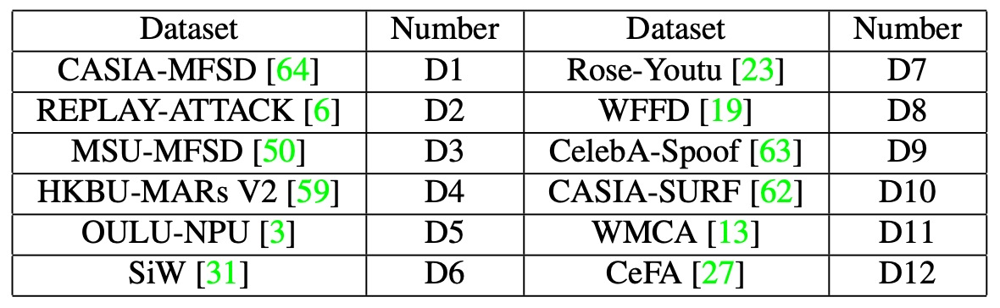

## The Shadow of Style

[**Domain Generalization via Shuffled Style Assembly for Face Anti-Spoofing**](https://arxiv.org/abs/2203.05340)

---

Let’s take a look at a famous paper.

This paper introduces the concept of "style," combining it with contrastive learning to emphasize live-related cues. This marks an important breakthrough in style-aware Domain Generalization (DG) design.

## Defining the Problem

Face Anti-Spoofing (FAS) has always been in an invisible battle.

Traditional FAS methods rely on handcrafted features, such as LBP and SIFT, to extract texture details from images. In the deep learning era, CNN-based methods have been used to train binary classifiers for distinguishing between live and spoofed faces, incorporating various auxiliary information such as depth maps, reflection maps, and rPPG signals to enrich the recognition cues.

However, even though these methods are stable, they often only perform well under "laboratory conditions."

Once we step out of the boundaries of the original training data, performance drops significantly, especially when faced with different devices, lighting conditions, or spoofing techniques. The model's predictions start to fluctuate and may even result in severe misclassifications.

This phenomenon is known as the **Cross-Domain Generalization** dilemma, which stems primarily from the following three points:

- **Data Bias**: Training data has a narrow coverage, unable to encompass all potential variations;
- **Feature Overfitting**: The model learns surface patterns from a particular domain rather than the essence of liveness;
- **Insufficient Model Generalization Design**: Most models still follow traditional CNN processes, neglecting subtle differences between samples.

To improve generalization capability, researchers have invested considerable effort into **Domain Adaptation (DA)** and **Domain Generalization (DG)**:

- DA methods like MMD minimization, adversarial alignment, and multi-discriminator learning focus on finding a common embedding space between different data distributions;
- DG aims to learn generalizable representations without involving target data, using strategies like feature disentangling and meta-learning.

While these methods have indeed improved model stability under certain settings, they also reveal a deeper issue:

> **Our understanding of "what constitutes a key feature" is still incomplete.**

FAS is not a simple image classification task; it doesn't rely on overall semantics but rather on fine details: the continuity of skin texture, the spread of reflective areas, and the rhythm of subtle pulsations. These are the signals carried by style and statistical information.

Here, **Normalization Layers** become a key observation:

- **Batch Normalization (BN)** focuses on global statistics across samples, reinforcing semantic consistency;
- **Instance Normalization (IN)**, on the other hand, focuses on individual samples, capturing unique patterns and style representations.

The guidance these two provide to the model is fundamentally different: BN seeks stability, while IN extracts variation. In FAS tasks, this delicate balance is often overlooked.

Currently, attempts at style transfer typically remain at the data augmentation stage before training, unable to be directly integrated into the learning process of the model, making it difficult to scale and deploy in real-world environments.

In other words, in the absence of a unified perspective, multi-domain validation, and semantic distinction, we are still in the exploratory phase of "how to make the model learn to ignore unimportant style features and focus on the essence of liveness."

The authors of this paper try to address this core gap:

> **We already know that style can mislead the model, so is it possible to reverse the approach and make style the key to uncovering spoofing?**

The problem of cross-domain generalization is not over, but the issue of style analysis has already quickly emerged.

As one wave settles, another rises.

## Solving the Problem

<figure style={{"width": "90%"}}>

</figure>

To make the model reliably identify liveness in unknown, unlabeled scenarios, not only is it necessary to counter style differences, but we also need to **actively restructure the structural space of style**.

The Shuffled Style Assembly Network (SSAN) proposed in this paper is based on this idea, designing a **style-controllable, semantically-alignable, and contrastively-learned** cross-domain FAS framework.

The core architecture is shown in the figure above, and we can break the entire process down into three stages:

1. **Feature Disentangling**: Decompose the image into content and style
2. **Style Reassembly**: Use AdaIN to self-organize and shuffle combinations
3. **Contrastive Learning**: Compare style semantics with liveness labels to adjust the spatial structure

### Dual-Stream Disentangling of Content and Style

The input image first enters the Feature Generator, which extracts low-level semantic and texture information, then feeds it into two branches for further processing:

- The **Content Stream** uses Batch Normalization (BN) to extract global semantics and applies a Gradient Reversal Layer (GRL) for adversarial learning, forcing the model to learn domain-invariant representations.

  The objective function for adversarial learning is:

  $$
  \min_D \max_G \mathcal{L}_{adv}(G, D) = -\mathbb{E}_{(x, y) \sim (X, Y_D)} \sum_{i=1}^{M} \mathbf{1}_{[i = y]} \log D(G(x))
  $$

  - $G$: Content feature generator
  - $D$: Domain discriminator
  - $Y_D$: Set of domain labels for the data
  - GRL reverses gradients, making $G$ learn domain-invariant semantic representations.

- The **Style Stream**, based on Instance Normalization (IN), extracts style statistics from multi-level feature maps, including brightness, texture, and other style factors. These will play a crucial role in the subsequent reassembly phase.

### Style Reassembly and Shuffling

Once the content feature $f_c$ and style feature $f_s$ are obtained, the model performs style reassembly through the **Style Assembly Layer (SAL)**.

The core of SAL comes from Adaptive Instance Normalization (AdaIN):

$$
\text{AdaIN}(x, \gamma, \beta) = \gamma \cdot \frac{x - \mu(x)}{\sigma(x)} + \beta
$$

Here, $\mu(x)$ and $\sigma(x)$ are the channel statistics, and $\gamma, \beta$ are parameters generated from the style input $f_s$ through an MLP.

The overall SAL operation is as follows:

$$
\begin{align*}
\gamma, \beta &= \text{MLP}[\text{GAP}(f_s)] \\
z &= \text{ReLU}[\text{AdaIN}(K_1 \otimes f_c, \gamma, \beta)] \\
\text{SAL}(f_c, f_s) &= \text{AdaIN}(K_2 \otimes z, \gamma, \beta) + f_c
\end{align*}
$$

Here, $K_1, K_2$ are 3×3 convolution kernels, and the final output is added to the original content residual, preserving the semantic backbone while introducing the style tonalities.

To introduce variability, SSAN designs two combination strategies:

- **Self-Assembly**:

  $$
  S(x_i, x_i) = \text{SAL}(f_c(x_i), f_s(x_i))
  $$

  Combine the content and style from the same sample to create anchor features.

- **Shuffle-Assembly**:

  $$
  S(x_i, x_i^*) = \text{SAL}(f_c(x_i), f_s(x_i^*)), \quad x_i^* \in \text{random}(1, \dots, N)
  $$

  Combine the content from one sample with the style of another sample, increasing cross-domain style interference and creating mixed representations that are harder to distinguish.

### Contrastive Learning in Style

<figure style={{"width": "70%"}}>

</figure>

As shown in the figure above, SSAN incorporates a contrastive learning mechanism, allowing the model to learn to distinguish in the style space:

- Which style variations are irrelevant to liveness (should be ignored)
- Which style differences contain attack features (should be reinforced)

Specifically:

- The **self-assembled features** $a = S(x_i, x_i)$ are set as anchors, with stop-gradient fixed at their position in the feature space;
- The **shuffled features** $b = S(x_i, x_i^*)$ are used as contrastive samples. Based on whether their labels match, the cosine similarity loss is calculated:

$$
\text{Sim}(a, b) = -\frac{a}{\|a\|_2} \cdot \frac{b}{\|b\|_2}
$$

The contrastive loss is then further defined as:

$$
\mathcal{L}_{contra} = \sum_{i=1}^N \text{Eq}(x_i, x_i^*) \cdot \text{Sim}(\text{stopgrad}(a), b)
$$

Where:

$$
\text{Eq}(x_i, x_i^*) =
\begin{cases}
+1, & \text{label}(x_i) == \text{label}(x_i^*) \\
-1, & \text{otherwise}
\end{cases}
$$

This allows the model to learn a semantic geometry in the style space: similar liveness features should be close together, and different category styles should be separated, regardless of their domain.

### Overall Loss

The final training loss for SSAN is integrated as follows:

$$
\mathcal{L}_{overall} = \mathcal{L}_{cls} + \lambda_1 \cdot \mathcal{L}_{adv} + \lambda_2 \cdot \mathcal{L}_{contra}
$$

The three loss components correspond to:

- **Classification accuracy**
- **Content semantic adversarial alignment**
- **Style space semantic separation**

Through the tension between these three forces, the model achieves a balance between semantic stability and style variability.

By disentangling style from images, style from semantics, and recognizing real versus fake from semantics, SSAN does not follow the path of de-stylization but instead follows a strategy of **controlled style learning**.

## Discussion

### Comparison with Other Methods

<figure style={{"width": "90%"}}>

</figure>

As is customary, this paper also uses the OCIM test to validate the model’s cross-domain generalization ability.

The test uses four datasets: OULU-NPU (O), CASIA-MFSD (C), Replay-Attack (I), and MSU-MFSD (M) for Leave-One-Out cross-validation. The specific strategy is to select three datasets for training and leave one for testing, performing four rounds of testing.

From the results in the figure, we can observe:

- SSAN maintains a relatively top-tier performance across all four tests;
- In some protocols, SSAN outperforms previous methods, such as SSDG and CDCN;
- Unlike some methods that perform well on single or dual dataset evaluations but degrade significantly in the OCIM test, SSAN’s generalization ability is less affected by data combinations.

Additionally, the authors point out that SSAN-R (using ResNet-18 as the backbone) outperforms SSDG-R under the same test settings, showing that the design of style manipulation and contrastive learning not only integrates semantic and style information but also enhances the practical utility of lightweight architectures.

### Large-Scale Testing

The authors combined **twelve public datasets** to construct training and testing data, creating a large-scale learning and inference scenario. The datasets used vary in format (images and videos) and cover various attack types. The detailed configurations are shown in the table below:

<figure style={{"width": "60%"}}>

</figure>

This benchmark defines two test scenarios:

- **Protocol 1: Intra-Dataset Evaluation**

  - All 12 datasets are used for both training and testing;
  - Primarily used to simulate model learning ability when data volume is sufficient.

- **Protocol 2: Cross-Dataset Evaluation**

  - The datasets are split into two groups:
    - P1: \{D3, D4, D5, D10, D11, D12\}
    - P2: \{D1, D2, D6, D7, D8, D9\}
  - Sub-protocols are as follows:
    - Protocol 2-1: Train on P1, test on P2
    - Protocol 2-2: Train on P2, test on P1

  Compared to Protocol 1, this setting includes more unseen attacks and scenarios, making it more challenging and closer to real-world application risks.

---

Based on the above settings, the experimental results are as follows:

<figure style={{"width": "60%"}}>

</figure>

All methods used the default training procedures and settings from their respective original papers.

From the results, we can observe that:

- **SSAN outperforms other methods in overall performance**, both in terms of lightweight architecture and generalization ability;
- Some methods that previously performed well in academic benchmarks showed significant degradation in the large-scale, multi-dataset tests;
- This highlights the gap between traditional test protocols and real-world deployment environments.

The authors argue that a model that performs excellently in academic settings does not necessarily guarantee reliability in the real world.

The experimental design and comparisons in this chapter respond to this point and validate SSAN's stable recognition ability under cross-domain, multi-variation, and data imbalance conditions.

### Feature Visualization

To further observe the feature space structure learned by SSAN, the authors use t-SNE to visualize three types of features, corresponding to the three projection maps in the figure above:

- **Content Features: Consistency of Cross-Domain Semantics**

  Although coming from different datasets, including various live and attack samples, the content features in the projected space still exhibit a **tight and mixed** distribution. This indicates that after adjustment with BN and adversarial learning, the model can compress the semantics from multiple domains into a unified embedding space.

  In other words, **semantics are no longer influenced by the data source**, which lays a stable foundation for subsequent style operations.

---

- **Style Features: Semantic Boundaries of Style Information**

  Despite the lack of direct supervision, the style features in the t-SNE space form a rough boundary that **distinguishes live from attack**. This boundary is not dependent on semantic content but rather on statistical differences in sample styles, such as texture, lighting, reflection, etc.

  This result validates the critical role of contrastive learning: **guiding the model to enhance signals related to liveness in the style space while suppressing domain-related interference**.

---

- **Stylized Features: The Classification Space of Semantics and Style**

  Once the content and style features are combined, the final stylized features present clear classification boundaries. Even when testing samples from unseen datasets, **the projection results still show distinct clustering, with stable distributions of live and attack samples**.

  This demonstrates that SSAN's learning strategy in the style space is not only effective but also highly generalizable, **transforming style differences into interpretable classification criteria**.

---

This set of visualizations shows us that SSAN does not simply rely on data volume or architectural depth to achieve results. Instead, it establishes an embedded space that separates style from semantics, blending supervision and assembly in a way that remains logically consistent across domains. This is the true face of generalization ability.

## Conclusion

SSAN offers more than just a framework name—it provides a clear design philosophy: to treat "style" as a controllable, learnable, and even transformable source of information.

This approach was not commonly seen in FAS papers at the time. Many model designs still focus on how to "align domains" or "smooth out variations," rather than "extracting signals beneficial to liveness from style."

What SSAN does is go against the grain:

- It clearly distinguishes between content and style concepts, and supports this breakdown with a practical framework;
- It uses Instance Normalization (IN) as a base for style extraction, contrasting with BN's semantic stability to form a structural comparison;
- It designs a training process of style reassembly and contrastive learning, turning style differences into semantic levers for adjustment;
- It uses a stop-gradient anchor mechanism to control the learning path, ensuring that style variations do not affect overall space stability.

While more complex style control strategies and data distribution adaptation techniques have been proposed in recent years, the design philosophy left by this paper remains worth revisiting.
