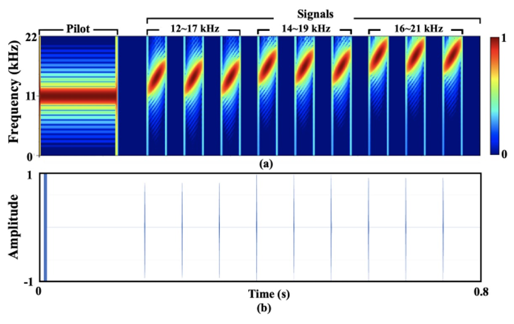
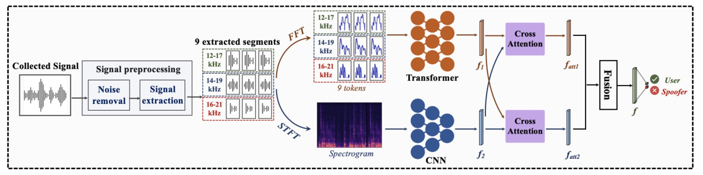
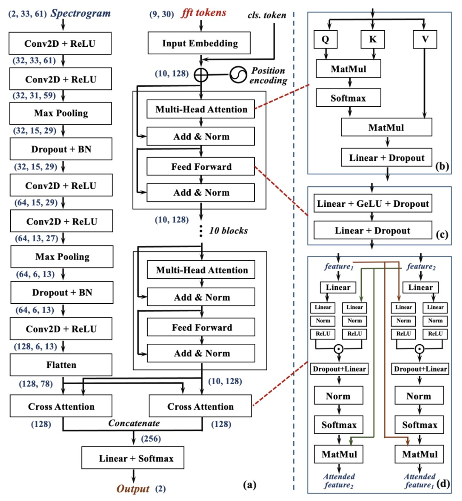
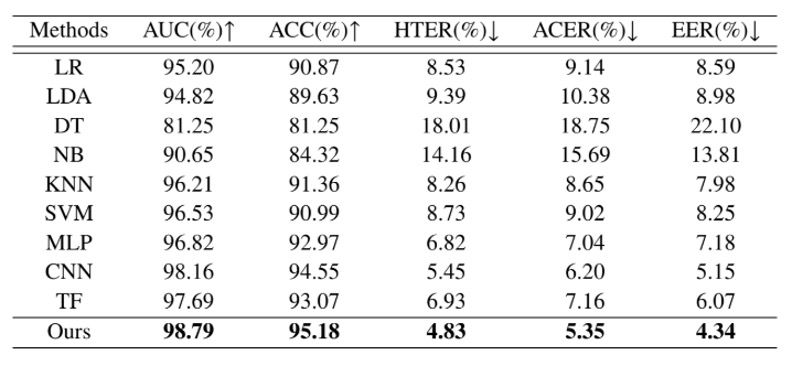
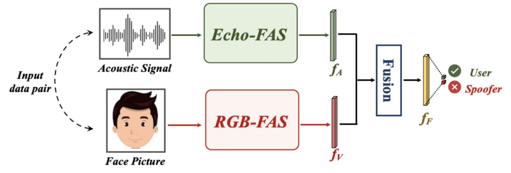
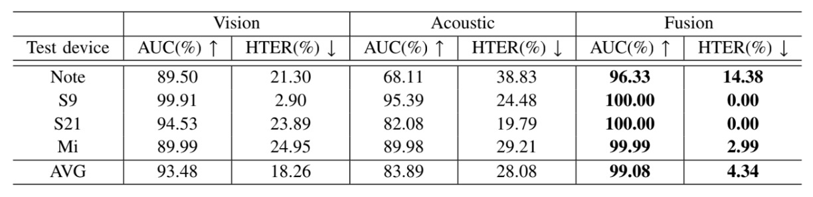

## The Echo of Spoofing

[**Beyond the Pixel World: A Novel Acoustic-Based Face Anti-Spoofing System for Smartphones**](https://drive.google.com/file/d/1ggyRAQgWdSSS-tVMJvxPE7QwNUXSBLqf/view)

---

The application of acoustic technology in the Face Anti-Spoofing (FAS) domain is not extensively covered.

Perhaps, one or two highly cited related works can be found each year.

## Defining the Problem

The technological evolution of FAS is like an ongoing excavation of recognition engineering.

We've studied the shadows of LBP, the gradients of HOG, the high-frequency flicker on CNN feature maps, and even tried to find the rhythm of life from the heartbeat signals of rPPG. With each advancement in forgery techniques, we are forced to redefine the evidence of "liveness."

But one thing has always remained unchanged:

- **No matter how much we strengthen features, add modalities, or blend loss functions, these methods still heavily rely on "vision."**

The more we see, the more precisely we see, the more accurately we observe.

But what about reality?

The lens might have fingerprints, the lighting might suffer from overexposure, and the user's face is not always aligned at the angle desired by the algorithm.

Additionally, almost all RGB-based recognition systems face a few classic problems:

- The domain gap between new phones and old models;
- The spectral difference between indoor lighting and outdoor sunlight;
- The disconnection between data distribution and inference conditions.

To solve these issues, some have turned to hardware enhancements, such as infrared, depth modules, and even millimeter-wave radar.

But these solutions are expensive!

They come with high costs and complex deployments, ultimately shifting the recognition barrier from algorithms to costs and specifications, without truly addressing the need for generalization.

Thus, the author presents a different perspective:

> **If we can't see clearly, how about we listen?**

Speakers and microphones are ubiquitous in smartphones, requiring no additional installation or widespread technical adaptation.

And sound is not just a carrier of information; it can also act as a detector. From a round-trip sound wave path, we can identify geometric information about the face:

- A piece of paper produces a dry, thin echo;
- A screen replay creates a distorted and unstable reflection;

Only a real human body can leave a sound wave texture corresponding to its density.

But, is this really useful?

## Solving the Problem

Before diving into the system design, the author created a brand new acoustic database: **Echo-Spoof**.

It is completely different from traditional FAS databases, which mainly focus on images. Echo-Spoof, on the other hand, collects reflection signals from "sound waves."

If we expect to perform anti-spoofing solely with the native speakers and microphones of smartphones, we must ensure that this acoustic detection mechanism remains effective in the real world.

The author set three core requirements:

1. **Acoustic-based**:

   Traditional FAS databases collect facial images or videos, but Echo-Spoof only collects sound wave reflection signals. Geometric information is extracted from the face's curvature, contour, and material, without using RGB and without exposing user privacy.

2. **Large-scale**:

   This database comes from 30 volunteers (with an equal gender split), collecting more than 250,000 sound wave signal fragments. A large-scale dataset is necessary to cover the uncontrolled variables found in various real-world scenarios.

3. **High-diversity**:

   In the real world, variability comes from many directions: different phones, different distances, different noise levels, different pitch angles, and so on.

   The author specifically designed these conditions to simulate common real-world usage scenarios, such as "the distance between the person and the phone being 25 to 45 cm," "ambient noise fluctuating between 40 dB, 60 dB, and 70 dB," or "facial pitch angles being -10°, 0°, and +10°."

   These details were included in the database collection manual, ensuring that Echo-Spoof is not just an idealized small dataset.

The data collection process is shown in the figure below:

<figure style={{"width": "70%"}}>

</figure>

Using a smartphone's earphone speaker, the author emitted designed sound waves and recorded the reflected signals using the top microphone. If it was a real face, the waveform contained the true facial geometry; if it was paper or a screen replay, it showed another distorted form.

This large amount of acoustic data was ethically reviewed (human ethics application) before being officially collected, ensuring experimental safety and privacy compliance.

### Variable Considerations

- **Device**:
  The author selected four Android smartphones (Samsung S9, Samsung S21, Samsung Edge Note, Xiaomi Redmi 7) for data collection. Different smartphones have subtle differences in their speaker and microphone manufacturing processes, which can lead to additional noise distribution and better test the model's cross-device stability.

- **Distance**:
  When using smartphones daily, a person's face is typically about 25 to 45 cm from the screen. The author collected sound waves at 25 cm, 35 cm, and 45 cm to observe the impact of distance on signal-to-noise ratio (SNR).

- **Ambient Noise**:
  In real life, quiet offices and noisy cafés are two entirely different worlds. The author controlled the ambient noise at three levels: 40 dB (quiet), 60 dB (slightly noisy), and 70 dB (very noisy), using a noise detection app to monitor if the levels met the criteria.

- **Pitch**:
  Even the handheld angle can influence the relative position between the face and the phone: pitch angles of -10°, 0°, and +10° were considered. Since face detection in the real world is not always perfectly vertical, small angle variations are more in line with user habits.

With such detailed design, Echo-Spoof has achieved a high level of "scale" and "diversity." This allows for more effective testing and evaluation of the acoustic detection's stability and resistance to interference in different scenarios during later stages.

### Signal Design

To ensure that Echo-FAS can operate smoothly in everyday scenarios, the author proposed the following key considerations:

1. **Improving Recognition Quality**:
   The author used frequency-modulated continuous waves (FMCW) to capture multiple echoes from different regions of the face, extracting geometric information about the face.

2. **Reducing Environmental Interference**:
   By utilizing higher frequency ranges (12–21 kHz) to separate from common noise frequencies (below 8 kHz) and adding a pilot tone for synchronization, the author eliminated timing discrepancies between devices.

3. **User Experience**:
   The author aimed to avoid harsh sounds while maintaining enough energy for detection. The Hamming window function was used to suppress unnecessary spectral components, and the volume was controlled to minimize the likelihood of being heard by the user.

The final design is shown in the figure below:

<figure style={{"width": "70%"}}>

</figure>

The entire signal lasts approximately 0.8 seconds with a sampling rate of 44.1 kHz (a typical value supported by most Android devices).

For easy description, the author added a **11.025 kHz pilot** to the signal and combined it with nine chirp (linear frequency sweep) sequences to create the final output. The signal frequency covers 12–21 kHz, subdivided into three frequency sweep ranges (12–17 kHz, 14–19 kHz, 16–21 kHz), with each repeated three times.

Each chirp consists of 60 samples, and the interval between two chirps is 3000 samples to avoid time-domain overlap.

### Signal Analysis

Echo-FAS utilizes **FMCW** (Frequency-Modulated Continuous Wave) technology, a common frequency-sweeping method used in radar systems originally designed for precise distance measurement. Here, it has been adapted to act as an acoustic scanner for facial geometry recognition.

The principle is not difficult to understand: different parts of the face (such as the nose bridge, lips, forehead) are at different distances from the phone's speaker. As a result, sound waves, when encountering these structures, are reflected back with varying time delays and phase changes. If these subtle differences can be precisely analyzed within a specific frequency band, they can form a set of facial contour features sufficient for recognition.

To explain the theoretical basis for this ability, the author cites the resolution calculation formula in the FMCW framework:

$$
R_d
= \frac{v \cdot \delta T}{2}
= \frac{v \cdot \delta f}{2k}
= \frac{v}{2 \cdot BW}
= \frac{343 \text{m/s}}{2 \times 5000 \text{Hz}}
= 3.43 \text{cm}
$$

Where $v$ is the speed of sound (approximately 343 m/s), $BW$ is the bandwidth of the sweeping signal, and $k$ represents the slope of the frequency variation.

This formula tells us that as long as the depth difference between two points on the face exceeds 3.43 cm, it will leave a distinguishable time delay in the echo. This resolution is sufficient to differentiate between major facial structures, such as the tip of the nose and the chin, or the forehead and the cheek.

Based on this recognition requirement, the author chose a frequency range of 12 to 21 kHz.

This frequency range offers multiple advantages: it is above the main frequencies of most environmental noise (usually below 8 kHz), while also close to the upper limit of the human audible frequency range (about 15-17 kHz), effectively reducing user perception.

However, higher frequencies encounter limitations in the smartphone's speaker output, especially above 21 kHz, where the signal significantly attenuates, weakening the subsequent feature extraction. Therefore, this range strikes a balance between "audibility, noise immunity, and hardware capability."

To ensure the signal can be accurately recognized in recordings, the author introduced an 11.025 kHz **pilot tone** at the beginning of the sound wave. This is a continuously stable pure tone that is distinct from other chirp signals and environmental noise in the spectrum.

By performing cross-correlation with the recorded content, the model can accurately locate the starting point of the signal and automatically adjust for timing delays between different phone devices, which is a key factor for stability in real-world deployment.

For the design of the frequency sweep signals, the author set the length of each chirp to 60 samples (approximately 1.4 milliseconds) and added a 3000-sample interval between chirps.

This configuration considers both physical and engineering limitations:

If the chirp is too long, it might improve the signal-to-noise ratio but could also overlap with the facial echo in time; for example, at a distance of 30 cm, the round-trip time for sound is about 1.7 milliseconds, which corresponds to 77 samples. If the chirp length exceeds this value, it becomes difficult to distinguish the echo from the direct signal.

Conversely, if the interval between two chirps is too short, the echo from a distant object (like a wall) could fall within the range of the next chirp's facial echo, causing aliasing and interference.

Experimental results show that an interval of 3000 samples (approximately 68 milliseconds) effectively avoids these issues while not significantly increasing the overall detection time. The entire signal ends within 0.8 seconds, which remains within a user-perceptible threshold.

Although the frequency design avoids the audible range as much as possible, some signals still fall below 17 kHz, potentially causing auditory interference for certain users.

To address this, the author incorporated a **Hamming window** in the signal design, ensuring that the start and end of the chirp have a smooth envelope shape, further reducing sound sharpness. They also conducted volume optimization tests for various phone models to ensure the output volume balanced "distortion-free but sufficiently loud."

According to surveys, over 90% of participants reported "almost no perceived noise," providing strong evidence for the feasibility of this design in practical applications.

### Signal Processing

If designing a sound is like a language, then signal processing is learning to recognize its meaning.

In Echo-FAS, the recorded sound is not just an echo; it is a mixture that includes the **direct transmission signal** from the speaker, the **primary echo** from the face, and **background reflections** from other objects in the environment.

The purpose of signal processing is to extract the true face geometry from this collection of sound waves, which will then be used as input for the subsequent recognition model.

The entire processing flow is divided into three stages:

- **Segmentation**
- **Direct Transmission Removal**
- **Target Reflection Extraction**

As shown in the figure below:

<figure style={{"width": "90%"}}>

</figure>

First, **signal segmentation**.

The recording starting point is not stable, as the speaker and microphone on the phone are not perfectly synchronized. Therefore, the author designed a 11.025 kHz pilot tone as a synchronization marker. Through cross-correlation with the recording content, the system can accurately determine the true starting point of the signal.

After confirming the starting point, the entire recording is segmented into nine parts, corresponding to the nine chirp groups designed earlier. Each segment contains a mixture of direct transmission signals and various echoes, serving as the first step for rough localization.

Next, **direct transmission removal**.

This signal, emitted by the speaker and directly received by the microphone without reflection, typically dominates the highest peak in the recording due to its minimal transmission distance and energy loss. To remove it, the author uses a matching filter with the original chirp, identifies the starting point of this segment, and discards the samples before and after it, keeping only the part that potentially contains facial or background echoes.

Finally, the critical step of **target reflection extraction**.

After removing the direct transmission signal, the remaining signal might still contain echoes from distant objects like walls or tables. These echoes occur later and are more dispersed. However, facial echoes are usually the shortest in distance and appear "earliest and most concentrated" in each segment, as shown in the figure below:

<figure style={{"width": "80%"}}>

</figure>

Thus, the author proposed an **adaptive localization algorithm**: for each segment, a matched filter is applied to find the peak with the highest energy, and the peak positions from the nine segments are averaged to find the "most consistent and likely" position that represents the facial echo. The algorithm iteratively searches for the average point with the smallest standard deviation, ensuring stable localization. Then, 60 samples from each segment after this point are extracted as the final output of the facial acoustic features.

As a result, each detection extracts nine 60-point sound wave blocks from the original recording, which serve as the basis for the subsequent model to judge authenticity. No additional hardware or multi-channel design is required; a single microphone and a well-planned sound are all that is needed to capture the sound structure.

### Model Architecture

After solving the acoustic challenges, we now move on to the model architecture, which should be relatively familiar to our readers.

The diagram below illustrates the entire recognition process, divided into three stages:

- **Preprocessing**
- **Two-Branch Feature Extraction**
- **Cross-Attention Fusion Decision**

For our readers, this section should be relatively straightforward, so let's take a closer look at each stage.

### Preprocessing

The input is a raw sound signal recorded from the microphone.

Using the signal processing steps introduced earlier, the system first synchronizes the signal, removes the direct transmission signal, and extracts nine segments of the echo from the entire recording.

### Two-Branch Architecture

<figure style={{"width": "70%"}}>

</figure>

These nine echo segments are fed into two parallel and complementary neural network branches for the analysis of two types of frequency features:

- **Global Frequency Branch (right side, Transformer branch)**:

  Each signal segment undergoes a Fast Fourier Transform (FFT) to convert it into frequency-domain representation, which serves as the input tokens for the Transformer structure.

  This branch focuses on capturing the distribution of the signal’s frequency and long-range dependencies. The Transformer learns the "frequency patterns" associated with facial structures from these spectra, creating a set of global perspective feature maps.

- **Local Frequency Branch (left side, CNN branch)**:

  The other side uses Short-Time Fourier Transform (STFT) to convert each signal segment into a time-frequency spectrogram.

  These images retain the frequency modulation process of the sound wave over time, which corresponds to the dynamic features captured while scanning the face. These images are then fed into the CNN network, which excels at extracting patterns and detailed changes in local regions, learning to extract "geometric detail textures" from the acoustic reflection map.

---

These two paths offer distinct modeling advantages: the Transformer focuses on the overall frequency structure, while the CNN focuses on local response textures. In Echo-FAS, they are designed to complement each other, not oppose one another.

Each branch outputs a set of feature representations: the global features $f_1$ and the local features $f_2$.

To align these two perspectives effectively, Echo-FAS incorporates a **Dual Cross-Attention Module**. As shown in the diagram (d), the Cross-Attention module allows $f_1$ to attend to $f_2$, and vice versa, allowing the two feature sets to mutually attend and merge. Eventually, these two sets of features are concatenated and passed to the classification layer for the final decision.

### Depth Selection

<figure style={{"width": "70%"}}>

</figure>

To validate the rationality of this architecture, the author conducted a series of ablation experiments.

As shown in the diagram, as the number of Transformer blocks (right) and CNN layers (left) increases, the system’s recognition performance gradually improves until it reaches a performance balance after a certain depth. Ultimately, the author chose 10 layers of Transformer and 5 layers of CNN as the backbone of the two-branch architecture, balancing performance and resource consumption.

## Discussion

### Cross-Identity Recognition Capability

<figure style={{"width": "70%"}}>

</figure>

In real-world scenarios, FAS systems cannot pre-recognize all users. They must be able to make correct judgments when encountering "unseen faces." Therefore, the first experiment focuses on the core generalization challenge: **cross-identity liveness detection**.

In the table above, the author trained Echo-FAS on 25 users and tested it on 5 additional subjects who had never appeared in the training data.

The results show that Echo-FAS achieved **98.79% AUC and 95.18% ACC** under this setting, demonstrating stable and excellent performance. Furthermore, the table also includes results from other classification models, including MLP, CNN, and Transformer architectures. While these models also reached a certain level of recognition, they were clearly outperformed by Echo-FAS.

This not only reaffirms that acoustic signals themselves have rich distinguishable features but also strengthens the advantage of the Echo-FAS architecture in "signal modeling" and "information alignment."

In simple terms, even without having seen your face, **Echo-FAS can still hear that you're real.**

This is an efficient demonstration of acoustic liveness detection capabilities and lays a foundation for future cross-device and cross-attack testing, proving the model's generalization ability.

### Stability Under User Habits

<figure style={{"width": "85%"}}>

</figure>

Not everyone holds their phone in an ideal position.

Some users tilt their head down to scroll, others unlock with a side profile, and some habitually use the phone at a slight upward angle. These daily habits, which were often seen as "non-ideal poses" in previous FAS systems, are actually the default in real-world usage.

To test the stability of Echo-FAS under these operational variations, the author designed a "user pitch tolerance test":

- **The angle between the face and the phone (pitch) was divided into three settings: -10°, 0°, and +10°, corresponding to common usage scenarios such as tilted, frontal, and downward-facing angles, respectively. The model was tested for each angle.**

The results show that Echo-FAS maintained stable and high-accuracy recognition performance at all angles and outperformed all baseline models. This proves that Echo-FAS does not rely on fixed camera angles; its ability to capture the geometric features of acoustic signals is sufficient to handle posture variations encountered in real use.

This provides a user-friendly guarantee: **You don't need to adjust your angle to match the model; the model adjusts itself to understand you.**

The "acoustic geometry" emphasized by Echo-FAS is not just the language of the technical architecture but a practical approach to ensuring stability in real-world interactions. This makes it not only effective in benchmarks but also suitable for everyday user experiences.

### Multi-Modal Fusion

In many real-world application scenarios, we cannot predict which phone a user will use or under which lighting conditions the identification will take place. This makes RGB-based FAS models prone to domain gaps caused by device heterogeneity, leading to significant performance drops in deployment.

Echo-FAS's acoustic modality, however, provides a relatively stable signal source because it reads the structure of the face, not the appearance of the image, making it less susceptible to the effects of lighting and image encoding differences.

To verify the complementarity between sound and image, the author designed a multi-modal fusion experiment, as shown below:

<figure style={{"width": "85%"}}>

</figure>

Each sample consists of two signals: an acoustic signal (the geometric features provided by Echo-FAS) and a facial image (the appearance features from the RGB modality).

The acoustic signal is processed by the Echo-FAS backbone to extract feature $f_A$, while the image is processed by a ResNet18 pre-trained on ImageNet to extract visual features $f_V$. After fusion, the two features jointly make a decision.

The experiment used four smartphones (Samsung S9, S21, Edge Note, and Redmi7) for data collection. For each training session, three devices were used, with the remaining device used as the test domain, simulating the cross-device generalization challenge encountered in real deployment.

The results of the experiment are shown in the table below:

<figure style={{"width": "85%"}}>

</figure>

The fused model significantly outperformed the RGB-only models in all test scenarios, proving that the acoustic modality successfully complements the RGB model's limitations.

When the camera devices change or image quality is unstable, Echo-FAS provides a structural signal that pulls geometric features back into the decision logic, reducing the model's over-reliance on appearance details.

## Conclusion

Echo-FAS offers a highly practical FAS solution.

It requires no additional hardware, the signal is lightweight, and inference is fast, making it plug-and-play on everyday devices while exhibiting strong recognition stability. Its advantage lies in that the user does not need to change anything: no new habits to learn, no need to rely on specific angles or lighting, and no lengthy delays to endure.

Basically, as long as the phone has a microphone, it will work.

However, this system still has limitations.

First, it cannot handle complex materials and depth layers of 3D masks, a dimension that flat sound waves cannot parse. Second, it still struggles to fully eliminate frequency response differences between hardware, and subtle traces of device-specific acoustic fingerprints remain in the model's generalization. Even with filtering and adaptive design, the sound remains limited by the machine it depends on.

Therefore, Echo-FAS's position is not to replace existing methods, but to provide a low-dependence, highly compensatory, lightweight recognition modality. In environments where conditions are uncontrollable, and images are unreliable, it offers another possibility:

The clue to impersonation doesn't just come from images, it can also come from an echo.
