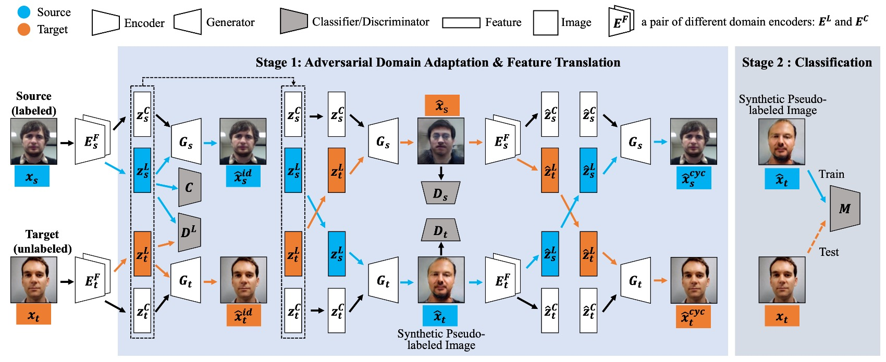
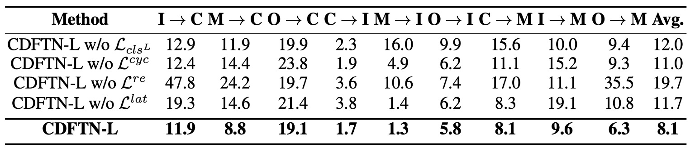
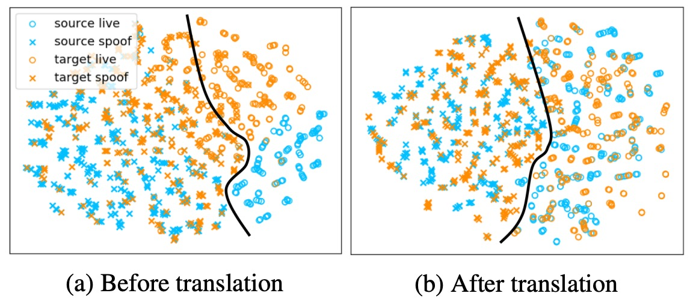

## The Entanglement of Style

[**Cyclically Disentangled Feature Translation for Face Anti-Spoofing**](https://arxiv.org/abs/2212.03651)

---

After SSAN introduced the concept of "style" into the Face Anti-Spoofing (FAS) domain, many researchers began to focus on this issue.

This led to several follow-up studies, and we continue to explore this paper.

## Defining the Problem

Face Anti-Spoofing (FAS) has never been a simple classification problem; it is the threshold for the survival of liveness detection technology.

On one side, there is a real human face, with flesh and breath; on the other, there is a high-resolution photo, a replayed video, or a silicon-based mask.

Early methods relied on handcrafted features, such as LBP, HOG, and SIFT, which once shone brightly. Later, CNNs took over, starting with ImageNet pre-trained models like VGG and ResNet, progressively stacking deeper and wider architectures. Some methods began incorporating LSTMs to capture temporal information, and others introduced a materials science perspective.

But no matter how methods evolved, one problem remained unsolved:

> **Change the dataset, and the model becomes useless.**

When the shooting device, ambient lighting, or cultural region changes, liveness models become like a disrupted compass, unable to point in the right direction.

Thus, Domain Generalization (DG) was born. We want models to learn the abstract "liveness semantics" rather than memorize the appearance of a specific dataset. However, DG methods are often built on multiple labeled domains, a resource that is not commonly available in real-world scenarios.

A more deployment-friendly approach is Unsupervised Domain Adaptation (UDA), where there is a labeled source and an unlabeled target.

UDA methods typically fall into three categories:

1. Feature alignment, minimizing the distribution gap between source and target;
2. Adversarial training, using a discriminator to obscure the source;
3. Image transformation, directly making the source look like the target.

All are effective but have one problem:

> **They don't "truly disentangle semantics and style."**

These methods are typically hard alignments or hard generations, and no matter what, they sacrifice the integrity of the semantics at some stage.

So, if we accept that the difference between live and spoofed faces comes from "semantics," and the difference between domains comes from "style and background," can we design a model that truly overturns the domain framework?

## Solving the Problem

<figure style={{"width": "90%"}}>

</figure>

This paper introduces an architecture called **Cyclically Disentangled Feature Translation Network** (CDFTN for short).

You can probably sense the intense pressure from the above diagram—it looks complex, and it truly is.

The authors’ goal is not to directly classify real vs fake faces, but to first "disentangle" the latent features of a face across different dimensions, and then "reassemble" them into a representation that can bridge domain differences.

The entire process can be divided into two phases:

1. **Phase 1: Feature disentangling, cross-domain translation, and generation of new images.**
2. **Phase 2: Using the images generated in Phase 1 to train the final classifier.**

The core concept of this method is to decompose each face into two subspaces:

- **Liveness Space**: Corresponds to semantic features of live vs. spoofed faces (which should exhibit cross-domain stability).
- **Content Space**: Contains domain-specific information, such as device, lighting, and background, which can be seen as interference or noise.

Next, you’ll need some background in adversarial learning, so let’s assume you’re already a GAN master. Let’s dive straight in.

## Phase 1

### Feature Disentangling and Adversarial Learning

The first step is the adversarial process between the Encoder and the Discriminator. In each domain (source/target), there are two encoders:

- $E_L$: Extracts liveness features
- $E_C$: Extracts content/style features

To ensure that $E_L$ focuses on information related to liveness detection while hiding the "domain origin" difference, the authors use **adversarial learning** to force $E_L$ to generate a latent vector $z^L$ that is indistinguishable between the source and target. Its loss function can be written as:

$$
\min_{E_L} \max_{D_L} \mathcal{L}_{D_L} =
\mathbb{E}_{x^s \sim P_S}[\log D_L(E_L(x^s))] +
\mathbb{E}_{x^t \sim P_T}[\log(1 - D_L(E_L(x^t)))]
$$

Here, $D_L$ is a discriminator that determines whether the input $z^L$ comes from the source or the target; $E_L$ tries to "trick" $D_L$ so that the liveness features extracted from both domains are difficult to distinguish.

### Classifier for Retaining Liveness Information

To ensure that the liveness features extracted by $E_L$ can correctly distinguish between real and fake faces, the authors add a classifier $C$ to the source domain and train it using the standard cross-entropy loss:

$$
\mathcal{L}_{cls} = -\mathbb{E}_{(x^s, y^s)} [y^s \log C(E_L(x^s))]
$$

This ensures that the liveness vector $z^L$ extracted from the source not only hides the domain information but also retains the crucial element for distinguishing "real face / fake face."

### Cross-Domain Generation and Style Recombination

This is where **CDFTN** shines.

In the first phase, the model not only extracts liveness features but also needs to "exchange liveness and content features across different domains" to generate new "pseudo-labeled images."

The reason for this is that in real-world applications, the source and target domains often have significant differences (e.g., camera brand, shooting environment, lighting), and relying solely on data from the source domain for training usually fails to generalize to the target.

By using cross-domain recombination, the model can better "see" the potential variations in style across domains, thus expanding the available training data and making the final learned liveness detection more cross-domain stable.

First, we obtain the following from the source and target domains:

$$
(z^L_s, z^C_s) = (E_L(x^s), E_C(x^s)), \quad
(z^L_t, z^C_t) = (E_L(x^t), E_C(x^t)).
$$

Here, $z^L$ represents the features most relevant for distinguishing real vs. fake faces in the "liveness space," while $z^C$ represents the domain-specific style information (such as device effects, background, lighting characteristics).

Next, the latent vectors of the two domains are exchanged, generating the following "pseudo-labeled images":

$$
\hat{x}^t = G_t(z^L_s, z^C_t), \quad
\hat{x}^s = G_s(z^L_t, z^C_s),
$$

where $G$ is the corresponding decoder. It combines the liveness features $z^L$ and content features $z^C$ to reconstruct the image in pixel space. In other words, $\hat{x}^t$ is a new image synthesized from "liveness features from the source" and "content style from the target domain"; and $\hat{x}^s$ is the reverse.

The significance of this is: if we can preserve the original real/fake semantics (carried by $z^L$) while simultaneously making the style closer to the target domain (determined by $z^C$), we can obtain additional training images that "look similar to the target but still preserve real or fake face semantics." These images can then be used by the classifier to learn better recognition in the target domain.

To ensure the quality of $\hat{x}^s, \hat{x}^t$ (e.g., realism, consistency with the corresponding domain style), the authors add an image discriminator $D$ at the pixel level. This discriminator, similar to the one used in standard GANs, is tasked with distinguishing between "real images" and "images generated by exchanging features." The corresponding adversarial loss is:

$$
\mathcal{L}_{adv} =
\mathbb{E}_{x}[\log D(x)] +
\mathbb{E}_{\hat{x}}[\log(1 - D(\hat{x}))].
$$

If the discriminator can detect that the generated image is "fake," it indicates that the generation quality is still inadequate. Therefore, the generator $G$ tries to improve the realism of the generated samples to "fool" the discriminator $D$. Through this process, $\hat{x}^s, \hat{x}^t$ can appear more realistic and match the styles of their respective domains.

### Consistency Loss

To avoid confusion or loss of **liveness features** or **original image content** during the style transformation process, the authors introduce three additional consistency losses to strengthen constraints, ensuring that the exchanged images retain their "real/fake" semantics and do not suffer from excessive style distortions.

1. **Reconstruction Loss $\mathcal{L}_{re}$**

   Without cross-domain exchange (i.e., sending the same image's $z^L$ and $z^C$ back to the same decoder), we should be able to reconstruct the original image. If the reconstruction error is too high, it indicates that the encoder or decoder failed to correctly extract or restore the image, and it needs to be penalized during training.

2. **Cycle Loss $\mathcal{L}_{cyc}$**

   Inspired by the concept of CycleGAN, if we have generated $\hat{x}$ (the exchanged image), we can feed it back into the corresponding encoder to extract $(z^L, z^C)$ and then convert it back to the original domain. We require the final reconstruction to be "as close as possible" to the original image. This "round-trip" mechanism helps prevent irreversible information loss during cross-domain transformations.

3. **Latent Space Loss $\mathcal{L}_{lat}$**

   This loss primarily ensures that the liveness features $z^L$ do not undergo significant deformation after cross-domain exchange. For instance, if the original image represents a "real face," after multiple domain transformations, it should still maintain the "real face" semantics, not be distorted by style exchanges or noise operations. This loss constrains the model to preserve the semantic consistency of liveness features before and after the exchange.

Combining these steps results in a closed-loop feature translation process: **from disentangling to exchanging, followed by adversarial learning and consistency losses to calibrate**, ultimately producing "sufficiently realistic images that effectively retain real vs. fake face semantics." These images will be used in the second phase for further training.

## Phase 2

After completing Phase 1, the authors **fix** the entire generation framework and use the "pseudo-labeled images" $\hat{x}^t$ generated earlier to train the final classifier $M$. The paper compares two design choices:

- **LGSC (Feng et al., 2020)**: A multi-task design (including classification + regression + triplet).
- **ResNet-18**: A binary classification design.

If using LGSC, the final loss can be written as:

$$
\mathcal{L}_{stage2} = \alpha_1 \mathcal{L}_a + \alpha_2 \mathcal{L}_r + \alpha_3 \mathcal{L}_{tri},
$$

Whereas if using ResNet-18, only the binary classification part is retained.

---

This is one of the more complex papers we've read recently. Overall, the core idea of CDFTN is:

1. **First disentangle liveness semantics from domain-related content**, using adversarial learning to ensure cross-domain consistency of liveness features.
2. **Then exchange features between domains**, generating more "pseudo-labeled images" through cross-domain generation.
3. **Finally, use these pseudo-images as supplemental data** to train a more robust final classifier.

From a methodological perspective, this architecture is indeed complex, but its approach is straightforward: the "real/fake" judgment of the same face should not be influenced by differences like camera brand or lighting conditions. Therefore, by first disentangling the "liveness" semantics and then attributing domain differences to content space, we can achieve more generalized and accurate liveness detection across domains.

## Discussion

This paper evaluates the effectiveness of **CDFTN** in the context of cross-domain face anti-spoofing through both **Single Target Domain Translation (SS2ST)** and **Multi-Target Domain Translation (SS2MT)**.

The authors used four commonly used cross-domain FAS datasets:

- **CASIA-MFSD** (C)
- **Replay-Attack** (I)
- **MSU-MFSD** (M)
- **Oulu-NPU** (O)

In the **single target domain** setting, one source (including all data) and one target (with its training set) are selected for the experiment.

This results in 12 test scenarios:

- C → I, C → M, C → O
- I → C, I → M, I → O
- M → C, M → I, M → O
- O → C, O → I, O → M

In the **multi-target domain** setting, one of the C, I, M, O datasets is chosen as the source, and the other three are treated as unlabeled targets.

Thus, there are 4 scenarios:

- C → I & M & O
- I → C & M & O
- M → C & I & O
- O → C & I & M

For evaluation metrics, the authors used the following two common quantitative metrics:

1. **HTER (Half Total Error Rate)**:

   $$
   \mathrm{HTER} = \frac{ \mathrm{FRR} + \mathrm{FAR} }{2},
   $$

   where $\mathrm{FRR}$ and $\mathrm{FAR}$ are the False Rejection Rate and False Acceptance Rate, respectively.

2. **AUC (Area Under the Curve)**: The higher the AUC, the better the classifier's ability to distinguish between real and fake faces.

### Comparison with Other Methods

The authors first compared **CDFTN** with other cross-domain learning methods, and the results are shown in the table above:

- Overall, **CDFTN** significantly reduces **HTER** and improves **AUC** in most cross-domain test scenarios.
- The only exception is the **CASIA → Oulu** scenario, where the performance improvement is less significant. The authors speculate that the main reason is that the **Oulu** dataset contains more attack methods (2 types of printers and 2 types of screen devices), and the original image resolution is extremely high (1920×1080), causing severe blurring after resizing.

It is evident that simply performing domain adaptation does not yield such significant results. The reason is that **CDFTN**, through **feature translation**, effectively extracts target domain features, enabling the model to learn more general and stable liveness representations.

### Multi-Target Domain Feature Translation

<figure style={{"width": "70%"}}>

</figure>

The authors compared three different settings:

1. **SS2ST**: Single target domain.
2. **SS2BT**: Merging multiple target domains into a "mixed" single domain for SS2ST.
3. **SS2MT**: Training a separate sub-network for each target domain, then using target domain translation and generated images together.

The results show that **SS2MT** not only significantly outperforms **SS2BT**, but also achieves better average performance than **SS2ST**.

This indicates that when dealing with multiple subdomains, using a single encoder (treating all targets as one entity) may degrade performance due to large internal domain differences.

**SS2MT** learns separately for each subdomain, allowing the model to more comprehensively capture liveness features from each subdomain, thus achieving more stable overall results. Moreover, using **SS2MT** requires **only one training process** to handle multiple target domains, making the overall process more efficient.

### Ablation Study

<figure style={{"width": "90%"}}>

</figure>

The authors further removed the four main design components one by one and tested them using two classifiers (LGSC and ResNet-18).

The results show:

1. Removing **$L_{cls}^L$** (the cross-entropy loss for the liveness classifier on the source) caused a performance drop, indicating that if $z^L_s$ doesn't retain liveness discriminability, the model struggles to extract genuinely discriminative liveness features.
2. Removing **$L_{cyc}$** (cycle consistency) caused the model to lose the closed-loop translation constraint, leading to semantic drift during cross-domain processes.
3. Removing **$L_{re}$** (self-reconstruction loss) caused the model to lose the ability to accurately restore the original image, undermining the basic constraints on the encoder/decoder. This had a significant impact on performance.
4. Removing **$L_{lat}$** (latent space consistency) caused liveness features to distort or be lost during reconstruction, similarly degrading results.

Overall, these losses are indispensable to the full architecture. Among them, **$L_{re}$** has the most significant impact on the final performance, followed by **$L_{lat}$**.

### Visualization Analysis

<figure style={{"width": "70%"}}>

</figure>

The above image shows the authors' visualization analysis of **CDFTN**, using t-SNE to reduce the feature space to 2D, with samples from different domains colored differently.

It demonstrates the distribution of features before (left) and after (right) feature translation. It is clearly visible that the samples from different domains are more overlapping after translation, and the decision boundary is clearer, indicating that the cross-domain feature differences have been effectively minimized.

## Conclusion

In the research history of FAS, the weight of the term "style" has gradually increased.

Initially considered an interference factor, it later became a key explanation for the failure of recognition generalization, and further became an explicit modeling dimension. The relationship between style and semantics has become the core of many methodologies in recent years.

CDFTN is a key point along this path.

It not only disentangles semantics from style, but more importantly, it transforms this disentanglement into part of the generation mechanism and trains a classifier using cross-domain pseudo-labeled samples, attempting to establish a semantic-driven style reconstruction process.

Compared to research directions focusing on "how to combat domain shift," respecting the existence of style and allowing the model to learn to coexist with it is also an important topic.
