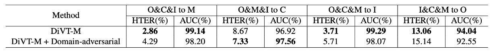

## All-Star Championship

[**Domain Invariant Vision Transformer Learning for Face Anti-spoofing**](https://openaccess.thecvf.com/content/WACV2023/papers/Liao_Domain_Invariant_Vision_Transformer_Learning_for_Face_Anti-Spoofing_WACV_2023_paper.pdf)

---

It's rare to see a paper where the authors list several of Taiwan's top universities.

NTU, NCKU, NTHU, NKNU... Huh? And even E.SUN Financial.

## Problem Definition

In the previous section, we discussed a lot about Domain Generalization (DG), and this paper serves as a bridge to extend the concept of DG from CNN architectures to Transformer models.

The new generation of architectures will carry on the legacy of the past and continue forward.

Looking back at existing DG-FAS solutions, they can generally be categorized into two directions.

**The first approach attempts to bring "real faces" closer together.**

Regardless of which domain they come from, real faces should share some intrinsic life-like features. In the feature space, these real samples from different domains are clustered into the same semantic group. The key idea here is to establish a stable anchor point across different scenes.

**The second approach focuses on splitting "attack types."**

Different attack methods have different disguise strategies, which lead to varying visual features. These features are pushed apart and separated during the learning process to prevent the model from confusing or misjudging them.

Thus, the entire feature space appears as follows:

- Real faces are concentrated at the center, as the core of alignment.
- Various spoofed faces are dispersed at the boundaries, separated from each other.

In practice, most of these methods are still built on CNN architectures. For example, SSDG uses single-sided adversarial learning to stabilize real face features, ANRL modifies normalization logic to combat domain shift, and SSAN separates style and content for cross-domain contrastive learning. There are also generative methods like FGHV, which use Gaussian distribution assumptions to approximate real faces.

These designs are sophisticated and effective but come with complex learning mechanisms and high resource costs.

All of these efforts are based on a shared assumption:

> The model has never seen any data from the target domain.

While this assumption is stringent, it is closer to real-world applications. The real world doesn't wait for you to gather all the variables; it just throws an unseen exception at you, requiring your model to immediately provide an answer.

This is why some have started turning their attention to Transformers.

Compared to CNNs, Transformers have a larger receptive field and more flexible relational modeling capabilities, making them theoretically more advantageous in scenarios like cross-domain learning, where long-range semantic variations are common.

However, current Transformer attempts for FAS are still limited. Some directly apply ViT, others use it as a teacher model while the student model remains CNN-based. Most designs also don't make special adjustments for domain generalization.

So, if we want to design a truly cross-domain generalized Transformer, where should we start?

## Solution

The core claim of this paper is actually very simple:

Use a lightweight yet sufficiently smart Transformer architecture to bring "real faces" together and separate "attacks."

### Model Architecture

<figure style={{"width": "90%"}}>

</figure>

The overall approach is built on MobileViT, a hybrid architecture that combines CNN and Transformer.

:::tip
Not familiar with MobileViT? You can refer to our previous notes:

- [**[21.10] MobileViT: Changing the Design of Convolution Kernels**](../../lightweight/2110-mobilevit/index.md)
  :::

MobileNet-v2 is responsible for initial downsampling and feature extraction, while the MobileViT block connects local convolutions with global attention to capture both facial details and global structure. This design strikes a balance between efficiency and representational power, making it suitable for deployment in resource-constrained environments.

The first step for cross-domain generalization is to achieve consensus between "real faces" from different scenes.

Assume we have datasets from $K$ domains: $D_1, D_2, \ldots, D_K$, where each dataset contains real faces and several types of attack samples.

The authors merge all the real faces into:

$$
D_R = \bigcup_{k=1}^K D^\text{real}_k
$$

Then, using the Transformer backbone, these samples are mapped to feature space, resulting in a set of embedding vectors:

$$
E_R = \pi(D_R)
$$

The authors' approach is to treat the origin $[0]^d$ as the center of real faces, designing a simple $\ell_1$-norm loss to pull these features towards the origin:

$$
\mathcal{L}_\text{DiC} = \frac{1}{N} \sum_{i=1}^N \mathbb{1}[x_i \in D_R] \cdot \|\pi(x_i)\|_1
$$

This idea is inspired by Center Loss, but the difference is that we don’t need to dynamically update the center point or assign a center for each class. In this setup, real faces form a single class, and the number or type of attacks is not predefined.

Conceptually, the following diagram shows how real faces from different domains are concentrated at the center, rather than being scattered along a specific domain axis, while attack samples are ignored.

<figure style={{"width": "60%"}}>

</figure>

After bringing real faces closer, the next step is to push away the spoofed faces.

For each attack type, we combine data from different domains into a single class:

$$
D^c = \bigcup_{k=1}^K D^c_k, \quad c \in \{1, \ldots, C\}
$$

Then, we add a classification head and perform $C+1$ class classification (real face + various attacks).

The cross-entropy loss here is:

$$
\mathcal{L}_\text{DiA} = -\frac{1}{N} \sum_{i=1}^N \sum_{c=0}^{C} \hat{y}^c_i \log y^c_i
$$

where $\hat{y}^c_i$ is the one-hot label (c=0 represents real face), and $y^c_i$ is the softmax output of the model for each class.

The task of this classifier is not just to "identify" the attack type but more importantly to further separate real and fake samples in the latent space. The benefit of this approach is that attack samples are dispersed, while maintaining distance from real faces, enhancing the decoupling ability across domains.

The final loss function is a weighted combination of the two:

$$
\mathcal{L}_\text{total} = \mathcal{L}_\text{DiA} + \lambda \mathcal{L}_\text{DiC}
$$

During inference, only the prediction probability for real faces from the classification head is used as the output, without requiring additional modules.

This approach does not introduce adversarial learning or rely on style separation or feature generation. Instead, it achieves stable and effective generalization with two intuitive objective functions and a lightweight architecture.

## Discussion

The authors tested their method on four commonly used public FAS datasets: CASIA-FASD, MSU-MFSD, Replay-Attack, and OULU-NPU.

These datasets come from different capture devices, attack methods, and lighting conditions, each with distinct domain differences, making them a representative test set for evaluating generalization capabilities.

Following DG-FAS conventions, the training and test sets for Replay-Attack and OULU-NPU are separated, with no validation set; the other datasets are all included in the experiments.

The number of real and attack images included in these datasets is summarized in the table below. Readers are encouraged to review this table first to understand the proportion and data density differences, which will aid in comparing the performance of different models.

<figure style={{"width": "50%"}}>

</figure>

The evaluation metrics used are two common ones:

- **HTER (Half Total Error Rate)**: The lower, the better, indicating a good balance between different types of errors in the model.
- **AUC (Area Under the Curve)**: The higher, the more stable the model.

### Implementation Details

All images were aligned and cropped using MTCNN, then resized to $256 \times 256$.

The **MobileViT-S** version was chosen as the backbone, pre-trained on ImageNet-1K. The optimizer used was Adam, with a learning rate of $10^{-4}$ and weight decay set to $10^{-6}$. The balance coefficient λ between the two loss functions was set to 0.2.

### Leave-One-Out Test Results

<figure style={{"width": "90%"}}>

</figure>

The table above shows the performance under the leave-one-out setting. In this setup, three datasets from the four are used for training, and the remaining one is used as the test set, simulating the situation where the model encounters a new domain.

Most methods are frame-based, and this paper's method follows suit; the only exception is **NAS-FAS**, which is based on video signals and theoretically benefits from additional temporal cues.

In this rigorous test, **DiVT outperformed existing SOTA methods on HTER in all settings**, with two test combinations improving by over 3%.

The only time DiVT did not win was in the AUC metric for I&C&M to O, where NAS-FAS slightly outperformed it. However, this method is video-based, making it a different level of comparison when compared to pure image-based methods.

### Small Sample Setting

<figure style={{"width": "70%"}}>

</figure>

In addition to the regular leave-one-out setup, the authors also tested a **limited training data setup**, using only MSU-MFSD and Replay-Attack as the training sources, with the others as test sets.

This setup is closer to the data challenges encountered during actual deployment.

Compared to enhanced baselines like SSDG-R and SSAN-R, the table above shows that DiVT still retains an advantage in most situations, especially with consistent and stable performance in the AUC metric. Even though it slightly lags behind in some HTER metrics, it overall demonstrates superior robustness to domain shift.

## Ablation Study

The following analysis focuses on three questions:

1. How significant are the performance differences between different Transformer architectures?
2. How much do the two loss functions contribute to the performance?
3. Would changing the classification logic yield better or worse results?

### Comparison of Different Architectures

<figure style={{"width": "90%"}}>

</figure>

The results are shown in the table above. The upper part shows the performance of various architectures using only binary cross-entropy loss, while the lower part shows the results after incorporating the proposed losses.

Key differences observed include:

- **Transformer architectures (DiVT-V/S/M) generally outperform CNNs (ResNet-18)**, indicating that in cross-domain tasks, global attention and long-range dependencies are more advantageous than local convolutions.
- Among all Transformers, **MobileViT (DiVT-M) performs the best**. It retains local features while integrating global relationships, is small, and learns quickly, making it ideal for real-world scenarios.
- ViT-Base performed the worst. The authors speculate this might be because ViT lacks the ability to model local patterns and its large parameter size makes it unsuitable for tasks with limited data.
- When the architecture was switched to ViT-Tiny, the results improved, further confirming that "model size needs to match data scale."

The success of MobileViT also reinforces a key point: **Convolutions are not useless; they should just appear in the right places.**

### Effect of Loss Function Combinations

<figure style={{"width": "90%"}}>

</figure>

The authors then tested the combinations of the two core loss functions in our method (DiC loss and DiA loss), comparing the results when used separately, not used, and used together.

Observations include:

- **DiA (classification loss) is the primary contributor**, with an average AUC improvement of about 3.7%.
- **DiC (pulling real faces together) also provides stable improvements**, with about a 1.3% AUC gain.
- **Using both together yields the best results**, confirming that the strategies of "spatial concentration" and "semantic separation" complement and enhance each other.

### Would Changing the Classification Logic Be Better?

<figure style={{"width": "90%"}}>

</figure>

The authors also explored whether the design of the classification task itself affected the results. Besides binary classification (real vs. fake), they also tested:

- Classification by domain (real + spoof from each domain)
- Classification by attack type (real + various attack types)
- Combined classification by domain and attack type

The conclusion is clear: **classification by attack type works the best**, while the other strategies tend to lead to overfitting or confusion.

This validates that the "unified real face, split spoof faces" spatial strategy in DiVT is more stable than traditional domain-label-based designs.

### What If We Added Adversarial Loss?

Some might ask why not add adversarial loss, like SSDG or SSAN?

Experiments showed that adding adversarial loss did not provide significant benefits and sometimes even performed slightly worse. The potential reasons could be:

- DiVT’s feature space is already stable enough without additional competition.
- The best practices for using Transformers in adversarial learning have not yet been fully developed.

### Comparison of Computational Resources

<figure style={{"width": "70%"}}>

</figure>

Finally, the authors compared the parameter counts and FLOPs of the models. As expected, DiVT-M achieves the best balance between performance and efficiency.

Although ViT-Tiny has fewer FLOPs, it has more parameters and did not perform as well as MobileViT. This shows that **the architecture best suited for DG-FAS is not just lightweight, but also able to capture spatial patterns effectively.**

## Conclusion

Methods targeting domain generalization are no longer just about "model performance" but about "methodology choices."

This paper avoids the complex chess game of adversarial training and does not rely on synthetic data to enhance visual cues. Instead, it opts for a near-geometric abstraction, pulling space straight and clearly defining features in the coordinate system.

Beyond the technical level, this design approach reveals a sensitivity to real-world deployment:

> **It’s not about stacking modalities or using heavy architectures. It’s about finding the critical point where just enough is done to maintain the rhythm.**

Future challenges will resemble combinatorial boundary problems, with the intersection of domain and attack dimensions becoming increasingly complex. This kind of minimalist and clear representation strategy could be the starting point for reorganizing the problem space.
