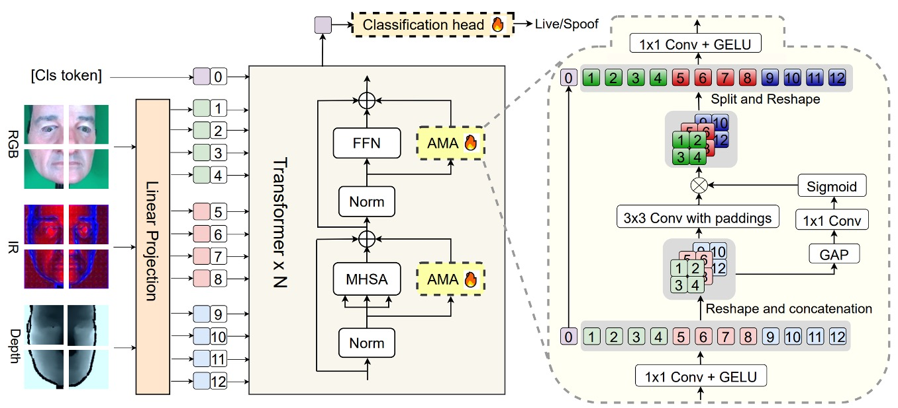
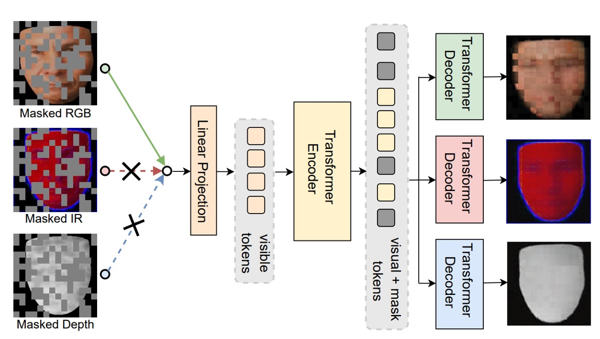
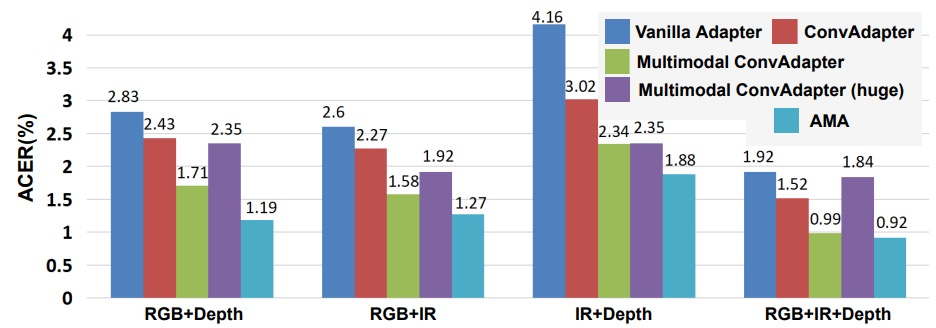

## Drawing Parallels

[**Rethinking Vision Transformer and Masked Autoencoder in Multimodal Face Anti-Spoofing**](https://arxiv.org/abs/2302.05744)

---

As we’ve reviewed various papers, we know that face recognition is a system that’s often compromised.

Although it has high accuracy and is convenient to use, the core issue of face recognition has never changed: you can never be sure if the face in the frame is a real person or just a photo.

## Defining the Problem

Over the past decade, from LBP to CNN, from single-modality RGB to multimodal fusion (such as RGB, IR, Depth), we have built a comprehensive system to detect spoofed faces. However, whether using handcrafted features or deep learning models, they still fail when faced with “new types of attacks” or “unseen scenarios,” mainly due to issues with generalization.

To address this problem, multimodal approaches have emerged as one solution.

After all, in high-risk scenarios (such as facial payments or vault access control), relying solely on an RGB image is too limited. IR, depth information, and even thermal imaging can provide additional live detection cues from different dimensions.

But then the problem arises.

With the advent of Vision Transformer (ViT), everyone wants to apply it to Face Anti-Spoofing (FAS). The reason is simple:

- **ViT’s long-range modeling capability and cross-modality scalability seem to complement the blind spots of CNN.**

As a result, some people directly fine-tune it, while others add modules to enhance its cross-modality capabilities, and the results seem promising.

But, do we really understand its essence?

- **Is ViT really suited for such multimodal tasks?**
- **Why does the pretraining, which performed remarkably on ImageNet, seem to struggle here?**
- **If we don’t use ImageNet and instead train our own ViT, how do we avoid overfitting?**
- **Does ViT capture the subtle differences between modalities?**

The authors’ question is not just about optimizing a model training strategy, but they went back to the fundamentals and asked a more basic question:

> **Do we truly know how to use ViT to solve FAS?**

## Solving the Problem

After understanding the essence of the issue, the authors proposed solutions for three key aspects of ViT in multimodal FAS: **input data format, fine-tuning strategy, and pretraining method**.

Let’s look at each one.

### Input Data

Although ViT excels in global modeling, it lacks sensitivity to local details.

In FAS tasks, the key factors that distinguish real from fake faces often lie in subtle edge textures or high-frequency details. This is where CNN’s ability to capture “small details” becomes especially important.

Therefore, the authors revisited three classic local feature descriptors to fill ViT’s blind spots:

- **LBP (Local Binary Pattern)**

  This method calculates binary codes based on intensity differences between neighboring pixels. It is insensitive to lighting variations and is good at capturing texture details.

  The formula is as follows:

  $$
  \text{LBP} = \sum_{i=1}^{p} F(I_i - I_c) \cdot 2^{i-1}, \quad F(I) = \begin{cases}
  1 & I \ge 0 \\
  0 & \text{otherwise}
  \end{cases}
  $$

- **HOG (Histogram of Oriented Gradients)**

  This method captures the edge direction distribution and expresses image structure through gradient histograms, offering tolerance to geometric and lighting variations.

- **PLGF (Pattern of Local Gravitational Force)**

  This lesser-known method is inspired by the law of universal gravitation. It strengthens edge and contour information by using local gravitational force distribution, making it especially effective against noise and lighting variations. The formula is as follows:

  $$
  \text{PLGF} = \arctan\left( \sqrt{ \left(\frac{I \times M_x}{I} \right)^2 + \left(\frac{I \times M_y}{I} \right)^2 } \right)
  $$

  Where $M_x$ and $M_y$ are direction masks designed according to position, mimicking the distribution of physical gravitational force.

The specific pattern is shown below:

<figure style={{"width": "80%"}}>

</figure>

We can see the visual effects of these three features: from the dot matrix texture of LBP, the direction distribution of HOG, to the contour reconstruction of PLGF, each providing a different perspective to reinforce the original modality data.

The authors also tried to combine these features (e.g., GRAY + HOG + PLGF) and use them as three-channel inputs for ViT. This hybrid design of handcrafted and deep features proves to be particularly effective in multimodal FAS.

### Model Architecture

<figure style={{"width": "90%"}}>

</figure>

Let’s take a closer look at the core model architecture of this paper.

The backbone is a **pretrained ViT**, and the overall structure is intentionally designed to be **highly frozen and lightly fine-tuned**:

- Only the final classification head $E_{\text{head}}$ and the additional module **AMA (Adaptive Multimodal Adapter)** are involved in training, while the rest of the ViT structure is preserved in its original form.

The role of AMA is to act as an adapter, allowing the ViT, which traditionally processes a single modality, to understand multimodal inputs (such as RGB, IR, and Depth).

:::tip
If you are unfamiliar with the concept of an adapter, you can refer to our other paper notes:

- [**[19.02] Adapter: Saving 96% of Parameters**](../../model-tuning/1902-adapter/index.md)

:::

The structural design can be divided into four stages, as shown in the internal diagram of the AMA module above:

1. **Channel Compression $\Theta↓$**

   Each modality’s input token undergoes a 1×1 convolution, reducing the original channel dimension $D$ to a hidden dimension $D_0$. This step aims to condense the information and prepare a unified format for subsequent modality fusion.

2. **Local Modality Fusion $\Theta_{2D}$**

   The features from the three compressed modalities are then concatenated into a three-dimensional space (batch, channel, height, width) and undergo a 3×3 2D convolution for spatial fusion. This step takes full advantage of the spatial alignment characteristics between modalities, performing feature interaction while preserving their relative positions.

3. **Dynamic Modality Weights $\Theta_{\text{Ada}} + \sigma$**

   To allow the contributions of different modalities to be adjusted automatically based on the scene, AMA uses global average pooling (GAP) to extract global information from each modality. This is followed by a 1×1 convolution and a Sigmoid function to output modality weights $(w_{RGB}, w_{IR}, w_{Depth})$. These weights will accordingly adjust each modality's influence in the fused output.

4. **Channel Recovery $\Theta↑$**

   Finally, another 1×1 convolution expands the channel dimension from $D_0$ back to $D$, and these fused modality features are combined with the processed class token to form the final token vector sequence fed into the classification head.

This design has several advantages:

- **High Parameter Efficiency**: Only a few parameters are fine-tuned, reducing the risk of overfitting.
- **Refined Modality Fusion**: Unlike traditional direct concatenation, it introduces dynamic weighting and convolutional fusion.
- **Flexible Modality Combinations**: AMA can operate with any combination of modalities (e.g., RGB+IR only).

In other words, AMA is a **low-intrusive, high-scalability** modality fusion module, specifically tailored for the structural features of ViT. It allows a frozen ViT to process high-dimensional, multimodal spoof cues without retraining the lower layers.

### Pretraining Method

<figure style={{"width": "80%"}}>

</figure>

Finally, the authors proposed a new pretraining framework for ViT: **Modality-Asymmetric Masked AutoEncoder (M²A²E)**, which is also the title of this paper.

Traditional MAE cuts the image into patches, randomly masks a portion, and then trains the model to reconstruct it. However, in a multimodal scenario, this design faces several issues:

- The patches of all modalities are masked, which causes the model to rely too heavily on one modality.
- The model's goal is simply to restore the image, which doesn't necessarily help with tasks like live detection that require "cross-modality semantics."

So, M²A²E changes the logic of masking and reconstruction:

- At each step, only one modality is randomly selected as the input.
- The tokens of that modality are masked.
- The model is then required to reconstruct:
  - The masked patches of the selected modality (this part is traditional MAE).
  - The complete image of the other modalities (this is the key innovation).

This design forces the model to learn to "use one modality to predict the appearance of the other modalities," which is called **cross-modality reconstruction**. It offers two major advantages:

- Stronger ability to model semantic relationships between modalities.
- The ability to capture spoof cues such as "color distortion" and "depth missing."

## Discussion

### Experimental Results

<figure style={{"width": "90%"}}>

</figure>

In the WMCA experiments, the authors designed two scenarios:

- One where the model has already seen the attack types (**seen protocol**)
- Another where it has never encountered new attack types (**unseen protocol**).

The table above shows the **benefits brought by AMA and M²A²E** under these two scenarios, which can be interpreted in three ways:

1. **AMA as an "Enhancer"**

   Compared to the baseline ViT, **the model with AMA showed a significant decrease in ACER across all modality settings**. Even when the original ViT could only handle global patch-level attention, AMA addressed the lack of local and modality interaction, enhancing overall recognition ability.

2. **M²A²E as a "Generalizer"**

   In the unseen attack scenario, **the model pretrained with M²A²E was more stable in handling unknown spoof attacks** compared to the version pretrained with ImageNet, especially in IR and Depth modalities. This indicates that it successfully learned a transferable spoof feature representation.

3. **RGB+IR+Depth as the Strongest Combination**

   The three-modal combination in the last column, AMA+M²A²E, resulted in **an even better ACER than the four-modality MCCNN model**. This shows that with the right modality selection and module design, better performance can be achieved with fewer sensors.

:::tip
For more experimental results, readers are encouraged to refer to the original paper.
:::

### Are Local Descriptors Useful?

Here, the authors tested multiple input features for the IR modality, including:

- Single descriptors: **LBP**, **HOG**, **PLGF**
- Combined inputs: **HOG+PLGF**, **LBP+HOG+PLGF**, **GRAY+HOG+PLGF**

Key takeaways include:

- **LBP is the weakest**: Regardless of the modality, LBP consistently underperformed compared to other features. This might be because it is too simplistic to support the high-dimensional modeling needs of ViT.
- **PLGF performed consistently**: In the IR modality, even using just PLGF was enough to match or even surpass the performance of the original input.
- **Combining features works best, especially GRAY+HOG+PLGF**: This combination performed the best in the IR modality, **outperforming both direct fine-tuning and ConvAdapter-enhanced models**.

The experimental results suggest that the IR modality is sensitive to lighting changes and requires reinforcement through local texture and lighting invariance, and these classic handcrafted feature combinations indeed provide useful details for ViT.

### Is AMA Just About More Parameters?

<figure style={{"width": "90%"}}>

</figure>

The authors tested five different adapter structures to find the most suitable design for ViT-FAS:

1. **Vanilla adapter**: Primarily fully connected layers (FC)
2. **ConvAdapter (single-modality)**: Replacing FC with 2D convolution
3. **Multimodal ConvAdapter (compressed version)**: Fusion of features from different modalities followed by 2D convolution
4. **Multimodal ConvAdapter (full-dimension)**: Output dimensions retain the product of all modalities (D₀ × K)
5. **Adaptive Multimodal Adapter (AMA)**

Key observations include:

- **The improvement from FC to Conv is very noticeable**, indicating that local receptive fields complement ViT rather than interfere.
- **Simplified Multimodal ConvAdapter outperforms the single-modality version**, showing that modality fusion within ViT is feasible.
- **The full-dimension version actually overfits**, suggesting that high-dimensional fusion doesn’t necessarily improve performance.
- **AMA is the most balanced among these methods**, retaining modality differences while effectively weighting different feature sources.

Thus, the conclusion is that ViT’s modality fusion should rely on convolutions, but blindly increasing dimensionality is not the answer. AMA’s weighted fusion approach is the best solution in the current design.

## Conclusion

We often see Transformer models applied to new tasks, but what sets this paper apart is that it doesn’t rush to stack more layers; instead, it goes back to a more fundamental question:

> **“If ViT is to be used for Multimodal FAS, what traits should it possess?”**

The authors broke down this question into three aspects: input detail design, pretraining logic, and fine-tuning method. This approach is particularly valuable for FAS tasks with limited data and rapidly evolving attack patterns.
