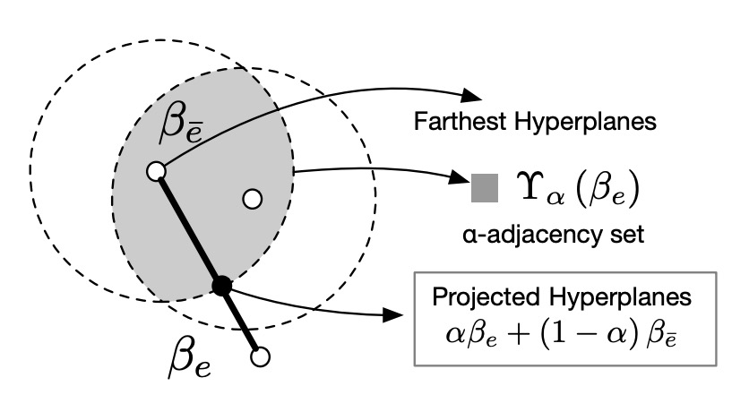
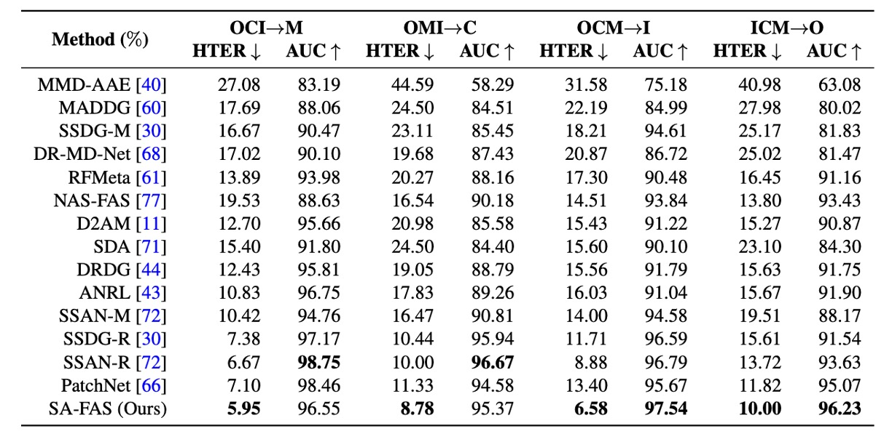
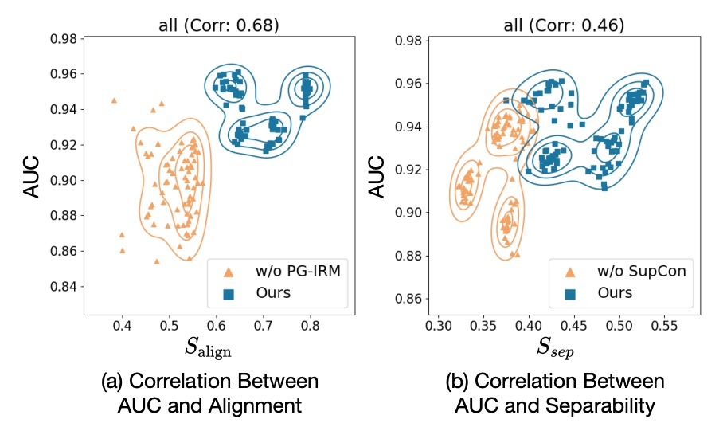

## The Law of the Hyperplane

[**Rethinking Domain Generalization for Face Anti-Spoofing: Separability and Alignment**](https://arxiv.org/abs/2303.13662)

---

For the topic of Face Anti-Spoofing (FAS), we first explored solutions based on Domain Generalization (DG) such as SSDG, and then adaptive DG solutions like D2AM.

So, is DG truly the correct direction?

:::tip
For readers who have not seen the previous papers, you can refer to our previous notes:

- [**[20.04] SSDG: Stable Realness**](../2004-ssdg/index.md)
- [**[21.05] D2AM: Thousand-Domain Soul Forging**](../2105-d2am/index.md)
  :::

## Defining the Problem

DG indeed works well, but it has its limitations.

First, most of these past methods are built on an idealized premise:

> **We can learn a feature space that is "domain-invariant."**

This sounds beautiful, but in practice, it often cannot hold up.

Because the number of domains in the training data is limited, and the range of variations is constrained, models tend to overfit on the training distribution. Once you enter real-world testing scenarios—such as different devices, resolutions, or lighting—the model starts to hallucinate.

The situation can get worse:
When data from different domains is forced into the same feature space, the originally well-separated live and spoof data get mixed up.

So, how would the model judge this?
Simple—it would learn some irrelevant "false correlations," such as:

> **"Low resolution means an attack, high resolution means a real person."**

But when the domain changes, this correlation doesn’t exist anymore, and the result is disastrous.

Since the domain-invariant path seems unfeasible, let's think of a different direction:

> **Rather than eliminating domain signals, let's "preserve them" and redesign the feature space.**

## Solving the Problem

The starting point of SA-FAS is actually quite simple:

We no longer try to eliminate the influence of domains, but instead **acknowledge and make good use of these differences**, and redesign the feature space.

This space needs to have two core properties:

1. **Separability**: The live/spoof distinction should be clear, and different domains should retain their structure.
2. **Alignment**: The spoof transitions of each domain should change in the same direction.

This might seem contradictory: we want separation but also consistency?

In fact, these two are complementary: **Separation** ensures we are not confused by the domain, and **Alignment** allows us to classify using a single decision boundary.

### Separability

To ensure that data from the same category and domain can "cluster together," SA-FAS employs **Supervised Contrastive Learning (SupCon)**.

The loss function is defined as:

$$
\mathcal{L}_{\text{sep}} = \sum_{i=1}^{2b} -\frac{1}{|S(i)|} \sum_{j \in S(i)} \log \frac{\exp(z_i \cdot z_j / \tau)}{\sum_{t=1, t \ne i}^{2b} \exp(z_i \cdot z_t / \tau)}
$$

In simple terms:

- Find a sample set $S(i)$ that shares the same label and domain as anchor $z_i$.
- Bring these positive samples closer together, and push negative samples farther apart.
- Use the temperature coefficient $\tau$ to control the degree of contrast.

If you've read about contrastive learning, this should seem familiar: Yes, this is essentially the **Supervised version of InfoNCE**, also known as **Multi-positive InfoNCE**.

:::tip
For a detailed definition of SupCon loss, refer to:

- [**[20.04] Supervised Contrastive Learning**](https://arxiv.org/abs/2004.11362)
  :::

Let’s look at a diagram to get a sense of how these three methods impact the feature space:

- **(a) ERM**: The data is mixed up, making it impossible to separate live/spoof; the classifier relies on misjudging the live data.
- **(b) ERM + SupCon**: The data has clustered, but the boundary directions for each domain are still messy.
- **(c) SA-FAS**: Not only is the data separable, but the transformation directions are consistent, and the classification is stable.

### Alignment

Having clustering alone is not enough; if each domain has its own boundary direction, it becomes impossible to generalize.

To address this issue, SA-FAS introduces the concept of **Invariant Risk Minimization (IRM)**.

The ideal of IRM is:

> **There exists a classifier $\beta^*$ that works for all domains.**

The formula is as follows:

$$
\min_{\phi, \beta^*} \frac{1}{|E|} \sum_{e \in E} \mathcal{R}_e(\phi, \beta^*) \tag{IRM}
$$

$$
\text{s.t. } \beta^* \in \arg\min_{\beta} \mathcal{R}_e(\phi, \beta), \quad \forall e \in E
$$

However, this goal is overly idealistic, and often it is impossible to find a classifier that fits all domains simultaneously, making IRM difficult to converge.

### Projected Gradient IRM (PG-IRM)

Therefore, the authors propose an improved version: **PG-IRM**.

The core logic is:

> **Each domain first finds the best boundary $\beta_e$ for itself, and then gradually pulls everyone in the same direction.**

This turns the problem into:

$$
\min_{\phi, \{\beta_e\}} \frac{1}{|E|} \sum_{e \in E} \mathcal{R}_e(\phi, \beta_e) \tag{PG-IRM}
$$

And an additional "nearness condition" is added to ensure that each $\beta_e$ cannot be too far from the others:

$$
\forall e, \ \beta_e \in \Omega_e(\phi) \cap \Upsilon_\alpha(\beta_e)
$$

Where:

- $\Omega_e(\phi)$ is the set of minimum loss solutions for that domain.
- $\Upsilon_\alpha(\beta_e)$ is an α-neighborhood set, constraining the hyperplanes from being too far apart:

$$
\Upsilon_\alpha(\beta_e) = \left\{ \upsilon \mid \max_{e' \ne e} \min_{\beta_{e'} \in \Omega_{e'}(\phi)} \|\upsilon - \beta_{e'}\|_2 \le \alpha \cdot \max_{e' \ne e} \min_{\beta_{e'} \in \Omega_{e'}(\phi)} \|\beta_e - \beta_{e'}\|_2 \right\}
$$

---

The entire alignment process can be imagined as follows:

- **(a)** The original IRM tries to directly find $\beta^*$, but may have no solution.
- **(b)** PG-IRM allows each domain to find its own best $\beta_e$.
- **(c)** Each step brings $\beta_e$ closer to the "farthest" one.
- **(d)** In the end, all hyperplane directions align, achieving alignment.

### α-adjacency is the Key

Why does PG-IRM work, while IRM often fails?

Because PG-IRM does not require "all domains to be exactly the same"; instead, it just needs "to be close enough."

This "closeness" concept is called α-adjacency, as shown in the diagram below:

<figure style={{"width": "70%"}}>

</figure>

As long as each domain’s hyperplane $\beta_e$ falls within an α-distance of the other hyperplanes, the alignment is considered successful.

This design guarantees:

- Every update step is valid (non-empty set).
- Projection can be completed with simple linear interpolation, preventing deadlock.

---

Finally, we combine these two loss functions to form the total loss of SA-FAS:

$$
\mathcal{L}_{\text{all}} = \mathcal{L}_{\text{align}} + \lambda \mathcal{L}_{\text{sep}}
$$

During inference, we average the classifiers of all domains to make the final decision:

$$
f(x) = \mathbb{E}_{e \in E}[\beta_e^T \phi(x)]
$$

According to experiments, the model trained this way shows excellent generalization ability, with the classifiers from all domains nearly overlapping, indicating successful alignment.

## Discussion

The most common cross-domain evaluation setting is used here:
Training on three datasets from four options (CASIA, Idiap Replay, MSU, Oulu) and leaving the one that wasn’t seen during training for testing. For example:

- **OCI → M**: Train on Oulu, CASIA, Idiap, test on MSU
- **OMI → C**: Train on Oulu, MSU, Idiap, test on CASIA
- And so on, resulting in four possible directions.

This is essentially a FAS exam, testing who can avoid failure when tested on a set that was never seen during training.

### Comparison with Other Methods

<figure style={{"width": "90%"}}>

</figure>

Here, the authors compare SA-FAS with other methods to see which performs best.

The experimental results show that SA-FAS performs excellently in all four cross-domain settings, particularly in the OCM→I setup, where the HTER directly outperforms SOTA by 2.3%, with a relative error reduction of over 25%.

If you're looking to challenge cross-domain FAS, this chart likely represents the toughest score line you can find.

:::info
Usually, the model reports the "best snapshot," meaning the model at the point where it has the lowest test error during training. This might be at epoch 16, or maybe at epoch 77.

This setup is indeed "model-friendly," but it also hides some risks:

- Without a test set, you can't select the best snapshot (something commonly faced in real-world applications).
- Some models will quickly overfit in the later stages of training, resulting in nice numbers but poor generalization.

To address this, the authors provide an additional experiment in Appendix B, using the "average of the last 10 epochs" as the result, and found:

> **Most methods see a significant drop, indicating that generalization is still a tough challenge.**

However, SA-FAS not only remains at the top, but also has the smallest standard deviation, showing that it is not just strong but also stable.
:::

### Evaluation Metric Analysis

<figure style={{"width": "90%"}}>

</figure>

The authors define two custom metrics:

- **$S_{sep}$**: The separation degree of the center vectors of live/spoof in the feature space (the greater the distance, the better).
- **$S_{align}$**: The alignment of the classifier direction with the spoof → live transition direction (the more aligned, the better).

Each point represents a training snapshot, with the X-axis showing the metric and the Y-axis showing the AUC score.

The results from the above chart show that: **Both metrics are highly positively correlated with AUC.**

- With PG-IRM → $S_{align}$ ↑ → AUC ↑
- With SupCon → $S_{sep}$ ↑ → AUC ↑

This indicates that SA-FAS has data-supported geometric design.

### Feature Distribution

In the OMI → C setup, the authors plot the final-layer feature distribution using UMAP:

- Each point is a live/spoof sample.
- The color represents the domain, and the dashed line is the classifier boundary.

Observations show:

- The boundary can accurately separate live/spoof on the unseen domain (CASIA).
- Domains with different resolutions exhibit different distributions, but the classification direction remains consistent.

This is a form of "visible generalization," where there is no need to flatten the domains but instead allow them to naturally spread in the same direction.

### Comparison with DANN and SSDG

<figure style={{"width": "90%"}}>

</figure>

DANN tries to create domain-invariant features, but the training set looks good, and once it’s tested on an unseen domain, the entire live/spoof distribution collapses.

SSDG performs slightly better than DANN, aligning the spoof category’s degradation direction, but the live data is still very messy, and there is a significant domain gap that remains unaddressed.

## Conclusion

In the past, we always tried to eliminate the influence of domains, like combating some kind of noise.

But SA-FAS offers a more pragmatic direction:

> **Rather than pretending domains don’t exist, design a feature space that allows them to exist reasonably.**

From generalization capability and stability to interpretability, SA-FAS provides strong and convincing answers.
