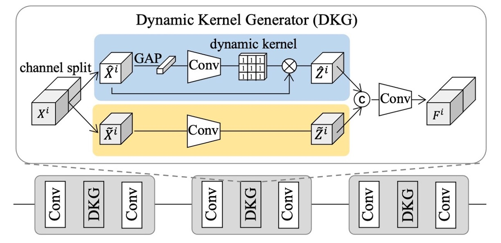
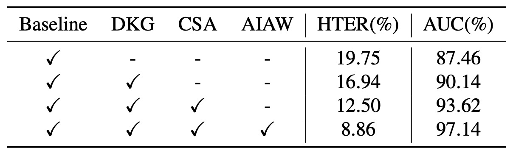

## A Monologue of Styles

[**Instance-Aware Domain Generalization for Face Anti-Spoofing**](https://arxiv.org/abs/2304.05640)

---

Over the past decade, researchers have tried every possible method to draw the boundary between the real and the fake:

- Using handcrafted features like LBP, SIFT, and HOG to recognize textures and details;
- Exploring anomalies in the YCrCb color space and Fourier spectrum;
- Analyzing subtle differences in time-series, attempting to find evidence of a real face from blink, micro-movements, and blood flow;

Then, the whole field passed the baton to CNN, using classifiers, depth maps, reflectance maps, and rPPG for auxiliary supervision.

However, these methods often experience a significant drop in performance when the scene, device, or attack method changes, making them difficult to deploy.

## Defining the Problem

To make models adaptable to unknown domains, researchers introduced the concepts of **Domain Adaptation (DA)** and **Domain Generalization (DG)**.

In particular, in DG, adversarial learning and meta-learning became mainstream choices, aiming to learn a representation that says, "No matter where you come from, I can spot you."

But as this path progressed, its limitations began to emerge:

- Almost all methods rely on explicit domain labels;
- These labels are often just dataset names, device models, or human-defined classification criteria, which are laughably crude.

You say "this is Replay," but Replay contains multiple lighting conditions and backgrounds; you say "this is Oulu," but no one can specify how many style subgroups it contains.

Even with labels, these methods only align features at the distribution level but fail to control for certain feature channels that still secretly retain style traces. These seemingly harmless signals often become blind spots for the model when faced with new samples.

So, if we cannot rely on domain labels, how can we still judge the "outliers"?

Is there another boundary between real and fake?

## Solving the Problem

<figure style={{"width": "90%"}}>

</figure>

To solve this problem, the authors propose a new architecture, called:

- **Instance-Aware Domain Generalization (IADG)**.

The goal is to enable the model to learn "instance-level" features without relying on domain labels, and to maintain stable performance in unknown domains.

It primarily consists of three core components:

- **Asymmetric Instance Adaptive Whitening (AIAW)**
- **Categorical Style Assembly (CSA)**
- **Dynamic Kernel Generator (DKG)**

Let's take a closer look at the design of each module in order.

### Dynamic Kernel Generator

<figure style={{"width": "70%"}}>

</figure>

Since samples from multiple source domains often have high diversity, a single static filter cannot meet the feature needs of all instances. To address this, the authors designed **DKG** to automatically generate "instance-adaptive" dynamic filters, working alongside static filters to capture more comprehensive individual perception features, aiding subsequent cross-domain generalization.

The structure of DKG consists of two parts: "static convolution branch" and "dynamic convolution branch":

- The static branch has fixed parameters;
- The dynamic branch generates convolution kernel parameters dynamically based on the features of each sample.

As shown in the figure above, let $X_i$ and $F_i$ represent the input and output features of the $i$-th sample in DKG.

During training, both branches learn synchronously, and the process is as follows:

1. The input feature $X_i$ is split along the channel dimension into $\hat{X}_i$ and $\tilde{X}_i$;
2. **Static convolution branch**: $\tilde{X}_i$ is processed by a static convolution filter $f_{\theta_s}$ to produce $\tilde{Z}_i$;
3. **Dynamic convolution branch**: $\hat{X}_i$ is first passed through global average pooling and a convolution block $f_{\theta_1}$, generating a dynamic convolution kernel $W_i$ related to this instance. Then, this dynamic kernel is used to convolve $\hat{X}_i$ to obtain $\hat{Z}_i$.

In this way, the model extracts more flexible feature representations for each instance through the joint operation of static and dynamic filters.

### Categorical Style Assembly

<figure style={{"width": "70%"}}>

</figure>

In order to simulate "instance-level" style variations in a broader feature space, the author proposes CSA to generate samples with richer styles. We have previously seen AdaIN, which is also used for style transfer, but its style source is often "random" and does not consider the style distribution differences across different categories of samples.

:::tip
Let’s pause for a moment, as some readers may not be familiar with AdaIN. Here’s a brief explanation:

**Adaptive Instance Normalization (AdaIN)** is a commonly used feature alignment method in style transfer, originally applied in image style transfer tasks. Its core idea is:

> **Adjust the mean and standard deviation of content features to match the statistical properties of the target style**, achieving style injection and transformation.

Specifically, for content feature $x$ and style feature $y$, the AdaIN computation formula is:

$$
\text{AdaIN}(x, y) = \sigma(y) \cdot \left( \frac{x - \mu(x)}{\sigma(x)} \right) + \mu(y)
$$

Where:

- $\mu(x), \sigma(x)$ are the mean and standard deviation of the content features;
- $\mu(y), \sigma(y)$ are the statistical properties of the style features.

This operation normalizes the original content features and then applies the statistical attributes of the style features, adjusting the feature representation without altering the semantic structure, thereby **reconstructing the style representation**.

Due to its simplicity and efficiency, AdaIN has been widely used in style transfer and cross-domain generalization tasks, especially in applications that require style alignment or de-stylization.

:::

To address the shortcomings of AdaIN, CSA introduces two improvements:

1. **Diversity Consideration**: Using Farthest Point Sampling (FPS), the method iteratively selects $L$ most distinct "base styles" from all source sample styles, ensuring coverage of the major distributions while also including rare styles that are farther from the mainstream. This process is dynamically updated at each epoch to adapt to the changing style space as training progresses.

2. **Separate Treatment of Real and Fake**: Considering that real faces and spoofed faces have different labels, mixing them arbitrarily may result in incorrect labeling. To avoid negative effects, CSA only performs style combination within "the same category," ensuring that augmented samples do not accidentally turn real faces into fake ones or vice versa.

Looking at the diagram, the specific process involves first selecting $L$ base styles for both real and spoof faces, storing their means $\mu$ and variances $\sigma^2$ in memory (memory bank) as $\mu^r_\mathrm{base}, \sigma^r_\mathrm{base}$ and $\mu^s_\mathrm{base}, \sigma^s_\mathrm{base}$.

Then, the "style linear combination" of the original features from the same category is performed. Under the distribution sampling weights, new means $\mu_{\mathrm{aug}}$ and standard deviations $\sigma_{\mathrm{aug}}$ are obtained, and the final style-reconstructed features are generated as:

$$
F_{\mathrm{aug}}
= \sigma_{\mathrm{aug}}
\Bigl(
\frac{F_{\mathrm{org}} - \mu(F_{\mathrm{org}})}{\sigma(F_{\mathrm{org}})}
\Bigr)
+ \mu_{\mathrm{aug}}
$$

Through this, we can effectively expand the style diversity without changing the original category of the sample, thus aiding the subsequent whitening process.

### Asymmetric Instance Adaptive Whitening

<figure style={{"width": "70%"}}>

</figure>

In order to "precisely align" the features of each sample, the author further focuses on the correlation between feature channels.

Previous studies have pointed out that the covariance matrix of features often contains style-related information. If whitening is applied to it, it can weaken some domain-specific styles.

However, simply applying existing **instance whitening** methods may result in the removal of "useful discriminative features," which could impair the performance of Face Anti-Spoofing (FAS).

Therefore, the author introduces the concept of "asymmetry" in instance whitening: the feature distributions of real faces and spoofed faces have different requirements. The distribution for real faces should be tighter, while for spoofed faces, it can be looser.

:::tip
**Whitening** is a method used to decorrelate and normalize data features, commonly employed in statistics and deep learning as part of feature preprocessing. The goal is to transform an input feature $x \in \mathbb{R}^d$ into a vector $\hat{x}$ that satisfies the following properties:

- Zero mean: $\mathbb{E}\[\hat{x}] = 0$
- Covariance equal to the identity matrix: $\text{Cov}(\hat{x}) = I$

A common whitening formula is as follows:

$$
\hat{x} = W (x - \mu)
$$

Where $\mu$ is the mean of the features, and $W$ is the whitening matrix, typically computed using the singular value decomposition or Principal Component Analysis (PCA) of the feature covariance matrix $\Sigma$:

$$
W = \Sigma^{-\frac{1}{2}} = U \Lambda^{-\frac{1}{2}} U^\top
$$

This transformation not only eliminates correlations between dimensions but also ensures that each feature dimension has the same scale, which helps improve the model's stability and generalization.

In image style transfer and cross-domain learning, whitening, compared to the statistical replacement in AdaIN, provides stronger de-stylization and better semantic preservation effects.

:::

### Overall Training and Optimization

To achieve stable performance in unknown domains, the classifier must be able to correctly distinguish between real and spoofed samples under various "style disturbances."

Therefore, for the same input sample $X_i$, the author supervises the binary classification loss $\mathcal{L}*{\mathrm{Cls}}$ using both the original feature $F*{\mathrm{org}}^i$ and the augmented feature $F_{\mathrm{aug}}^i$:

$$
\mathcal{L}_{\mathrm{Cls}}
= - \sum_{D}
Y_{\mathrm{cls}}^i
\Bigl[
\log\bigl(\mathrm{Cls}(F_{\mathrm{org}}^i)\bigr)
+ \log\bigl(\mathrm{Cls}(F_{\mathrm{aug}}^i)\bigr)
\Bigr]
$$

Where $Y_{\mathrm{cls}}^i$ is the binary label of the $i$-th sample in dataset $D$.

Additionally, the author also references previous research and uses a depth estimator for additional supervision: outputting a depth map for real faces and a zero map for spoofed faces.

The depth loss function $\mathcal{L}_{\mathrm{Dep}}$ is:

$$
\mathcal{L}_{\mathrm{Dep}}
= \sum_{D}
\Bigl\|
\mathrm{Dep}(F_{\mathrm{org}}^i) - Y_{\mathrm{dep}}^i
\Bigr\|_2^2
+
\Bigl\|
\mathrm{Dep}(F_{\mathrm{aug}}^i) - Y_{\mathrm{dep}}^i
\Bigr\|_2^2,
$$

Where $Y_{\mathrm{dep}}^i$ is the depth label (real faces have real depth, and spoofed faces have zero depth).

Combining the above, the final total loss function $\mathcal{L}_{\mathrm{total}}$ is:

$$
\mathcal{L}_{\mathrm{total}}
= \mathcal{L}_{\mathrm{Cls}}
+ \lambda \mathcal{L}_{\mathrm{Dep}}
+ \mathcal{L}_{\mathrm{AIAW}}.
$$

During the inference phase, only the original feature branch is used, and no augmentation operations are performed; the AIAW loss is only active during training.

With the combination of these three modules (DKG, CSA, AIAW), IADG can reduce style interference at the "instance level," without relying on coarse domain labels, and maintain stable performance in unknown domains.

## Discussion

As usual, this section follows the traditional **Leave-One-Out (LOO)** experimental setup, followed by ablation experiments to analyze the contributions of each module.

### Comparison with Existing Methods

<figure style={{"width": "90%"}}>

</figure>

As shown in the experimental results above, compared to traditional FAS methods, which perform unstably in cross-domain tasks, almost all **DG FAS** methods still rely on domain labels to align coarse distributions, which leads to bottlenecks in generalization performance.

In contrast, **IADG** does not rely on these coarse labels. By suppressing style at the instance level, it achieves better HTER and AUC across four cross-dataset scenarios, highlighting the advantages of this method in label-free alignment situations.

### Ablation Experiments

<figure style={{"width": "70%"}}>

</figure>

The table above shows the results of the ablation experiments, analyzing the contributions of different modules:

- Using only the backbone (baseline) achieves 19.75% HTER and 87.46% AUC.
- Adding **DKG** improves the result to 16.94% / 90.14%.
- Further adding **CSA** advances the performance to 12.50% / 93.62%.
- Finally, introducing **AIAW** boosts the performance to 8.86% / 97.14%.

It is clear that the three major modules complement each other, and integrating them yields the greatest improvement.

Next, let's look at the comparison of different Instance Whitening methods:

<figure style={{"width": "70%"}}>

</figure>

The experimental results show that methods like IW and GIW treat all covariance elements equally, which can inadvertently remove key discriminative features. While ISW shows some improvement, it still ignores the distributional differences between real and spoofed faces.

In contrast, **AIAW** applies asymmetric suppression to real and spoofed faces and simultaneously constrains both original and augmented features, strengthening the model's resistance to style disturbances. The optimal performance is achieved when the suppression ratio $k\_r : k\_s = 1 : 0.2$.

### Visualization Analysis

<figure style={{"width": "90%"}}>

</figure>

Finally, to better understand how IADG aligns features, we look at the t-SNE projection.

As shown in the figure above, traditional domain-aware alignment methods can distinguish real and fake samples in the source domain, but still show confusion around the decision boundary in the target domain. In contrast, with IADG, the model establishes a clearer distinction between real and fake, making it easier to distinguish even unseen target domain samples.

Under instance-aware generalization, real face features become more concentrated, while domain-level alignment methods appear loose and unstable. This is because the author does not rely on aligning the entire dataset distribution but weakens the style for each instance, promoting statistical consistency for cross-domain generalization.

## Conclusion

The challenge in Face Anti-Spoofing has never been "recognition" but rather "resisting variations."

These variations not only arise from the evolution of attack methods but also from the fragmentation of the data itself:

> **Different lighting conditions, devices, backgrounds, cultures, and shooting moments, each piece of data could be its own domain.**

We once thought domain labels could control everything, but it turns out that more and more differences are hidden in those unclassifiable details. Rather than chasing uniform labels, it is better to extract the invariant signals from the style noise of each face.

From aligning the overall picture to understanding the individual; from classifying samples to dissecting style; perhaps we still don’t fully understand the essence of style, but IADG at least offers us a way to "coexist with style."
