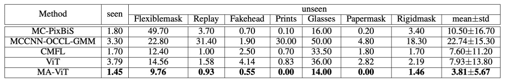

## All appearances Are Illusions

[**MA-ViT: Modality-Agnostic Vision Transformers for Face Anti-Spoofing**](https://arxiv.org/abs/2304.07549)

---

The initial purpose of Face Anti-Spoofing (FAS) technology was to block attacks that deceive face recognition systems using photos, videos, or 3D masks.

These attacks, known as Presentation Attacks (PAs), have become a critical concern for the security of biometric systems as face recognition technology gains widespread use in applications such as financial payments, smartphone unlocking, and self-service immigration checks.

## Problem Definition

The earliest FAS methods primarily relied on RGB visual information to detect anomalies.

However, the cat-and-mouse game between attacks and defenses has never stopped. Attacks have become more realistic, and sensor devices have become increasingly diverse. We began to introduce infrared, depth, and thermal imaging modalities, aiming to piece together a "multi-spectral truth."

The model architectures evolved accordingly: from halfway fusion in intermediate feature concatenation to late fusion at the decision stage, each strategy attempted to more robustly reconstruct the "boundary between truth and falsehood."

However, new problems have quietly emerged.

While halfway fusion can enhance the interactive learning of different modal features, its model design often assumes consistent input modalities during both training and testing phases. If a sensor is absent, the overall prediction could collapse.

Although late fusion preserves independent channels for each modality, allowing for inference even in the absence of certain modalities, it comes at the cost of increased parameters and inference delays, which are not ideal for mobile or edge device deployment.

A more fundamental bottleneck is that these multi-modal methods have never truly addressed a key question:

> **Do we really understand "what are the cross-modal common liveness features"?**

In other words, is the model truly learning "the authenticity of a face," or is it merely memorizing "the differences between modalities"?

Thus, a more radical question arises: If we can use multi-modal knowledge during training but only require a single modality for testing, can we build a truly "modality-agnostic" FAS system? And can such a system, while maintaining lightweight, fast, and flexible characteristics, still retain sharp judgment against spoofing attacks?

The authors of this paper propose thoughts on this and attempt to address these issues.

This time, they don't simply attach the modalities again, but rather begin by breaking them apart.

## Solving the Problem

Traditional halfway and late fusion methods are not only easily disrupted by missing modalities, but they also introduce excessive computational overhead and model complexity. Therefore, the authors aim to design a "modality-agnostic" model here:

- Absorb multi-modal knowledge during the training phase.
- Make predictions using any single modality during the testing phase.

### Model Architecture

<figure style={{"width": "90%"}}>

</figure>

The overall architecture is shown in the diagram above. MA-ViT is built upon a single ViT backbone and contains three key modules:

1. **Multi-Modal Tokenization Module** (on the left side of the figure)
2. **Transformer Encoder** (indicated by the yellow and black arrows in the center)
3. **Modal Shared Classification Heads** (the classifier on the right)

Unlike traditional multi-branch fusion designs, the key innovation of MA-ViT lies in sharing a single ViT structure across all modalities. It uses a series of standard Transformer Blocks (STB) and the newly introduced "Modality-Agnostic Transformer Block" (MATB) to stack and refine modality-agnostic representations.

The yellow arrows in the figure indicate the paths where each modality independently passes through the STB. The black-gray arrows show the subsequent processing in the MATB (MDA) module.

---

At the input stage of MA-ViT, whether it's an RGB or Depth image, it first passes through the **Multi-Modal Tokenization Module**.

As shown on the left side of the figure, the input image is divided into patches and converted into vector tokens ($x_\text{pat}$). These patch tokens are then combined with two special tokens:

- **$x_\text{cls}$**: The classification token, which ultimately carries the task of predicting the authenticity.
- **$x_\text{mod}$**: The modality token, used to guide the model in understanding the spectral properties of the input.

The entire sequence is weighted by positional embeddings ($x_\text{pos}$) and spectral embeddings ($x^i_\text{spe}$), forming the initial input vector:

$$
z^i_0 = [x_\text{cls} \| x^i_\text{mod} \| x^i_\text{pat}] + (x_\text{pos} + x^i_\text{spe})
$$

These tokens will then pass into the subsequent Transformer Encoder process.

---

Each layer of the Transformer Encoder consists of two parts:

1. **STB (Standard Transformer Block)**
   Each modality is processed independently, as shown by the yellow and black-gray arrows, handling local features and context within a single modality.

2. **MATB (Modality-Agnostic Transformer Block)**
   Following the STB, each MATB layer is further divided into two attention modules. The implementation details are as follows:

   

     <figure style={{"width": "70%"}}>
     
     </figure>
   

   - **MDA: Escaping the Modality**

     The task of **Modal-Disentangle Attention (MDA)** is to make the model learn to ignore patches that overly rely on modality-specific features and focus only on modality-agnostic clues strongly related to authenticity detection.

     As shown on the left side of the figure, MDA first computes the modality correlation for each patch token via the dot product between the modality token (MOD) and each patch token:

     $$
     \text{map}_\text{mod} = \frac{q_\text{mod} (k^\text{pat}_\text{mod})^T}{\sqrt{D/h}}
     $$

     Then, using a threshold function $\Gamma_\lambda(\cdot)$, it generates a mask matrix $M$ to mark tokens that are overly modality-dependent. In the attention computation of the CLS token, these tokens' correlations are minimized, effectively "disconnecting" them:

     $$
     \text{map}_\text{cls}' = \Gamma^0_M\left(\frac{q_\text{cls} (k^\text{pat}_\text{cls})^T}{\sqrt{D/h}}\right)
     $$

     The final attention result only focuses on modality-agnostic patches:

     $$
     \text{MDA}(z^i) = \text{softmax}(\text{map}_\text{cls}') \cdot v^\text{pat}_\text{cls}
     $$

     This is a "selective forgetting" process, where the model doesn't remember everything but only what it should.

     ***

   - **CMA: Illuminating Modality Interactions**

     The task of **Cross-Modal Attention (CMA)** is the opposite—it enables one modality to complement information from another modality through cross-attention.

     As shown on the right side of the figure, for example, CMA lets the query vector ($q_r$) from the RGB modality ($z^r$) perform attention operations on the key-value pairs from the Depth modality ($z^d$):

     $$
     A_{rd} = \text{softmax}\left( \frac{q_r k_d^T}{\sqrt{D/h}} \right), \quad \text{CMA}(z_r) = A_{rd} \cdot v_d
     $$

     The reverse process is similar. This step allows each modality to "borrow a perspective" from another, filling in invisible features through the context of the other modality.

### Loss Design

To achieve the design where "only one modality is needed for testing," MA-ViT uses modality-shared classifiers. The CLS token predicts authenticity, and the MOD token predicts modality, with the losses of both being jointly optimized:

$$
\begin{aligned}
L^i_\text{cls} &= \text{BCE}(\text{MLP}_\text{cls}(\text{LN}(z^i_{K, \text{cls}})), y_\text{cls}) \\
L^i_\text{mod} &= \text{BCE}(\text{MLP}_\text{mod}(\text{LN}(z^i_{K, \text{mod}})), y_\text{mod}) \\
L^i_\text{total} &= L^i_\text{cls} + L^{rd}_\text{cls} + L^i_\text{mod}
\end{aligned}
$$

This classifier design ensures that even in the absence of a modality, the system remains stable and avoids failure due to the absence of any particular modality.

## Discussion

To validate the effectiveness of the MA-ViT framework, the authors designed two evaluation scenarios:

1. **Fixed Modality Test**: The test modality is the same as the training modality.
2. **Flexible Modality Test**: Any modality can independently infer the result.

In addition, cross-dataset tests and ablation experiments were conducted to gradually examine MA-ViT's ability to disassemble and translate modality information.

### Fixed Modality Scenario

In the traditional setting, the model needs to perform inference under fixed modality conditions, which is also the primary comparison scenario for past methods.

For example, in the MmFA experiment, a comparison was made between the baseline (ViT without MATB) and multi-modal methods like SEF/MS-SEF:

<figure style={{"width": "70%"}}>

</figure>

- ViT (no fusion) performed worse than traditional methods like SEF, indicating that the Transformer model struggles to judge authenticity without modality guidance.
- After introducing MATB, the TPR (True Positive Rate) increased from 44.33% to 82.83%, and the ACER (Average Classification Error Rate) dropped from 6.51% to 0.80%, significantly outperforming MS-SEF.

This shows that the Transformer model's poor performance was due to the lack of a mechanism for deconstructing modalities.

Next, the experiment using the CeFA Protocol:

<figure style={{"width": "70%"}}>

</figure>

In Protocols 1, 2, and 4, MA-ViT reduced the ACER to 1.10%, 0.10%, and 1.64%, respectively, surpassing competitors Hulking, Super, and BOBO.

The difficulty in CeFA lies in the simultaneous presence of modality and group variation, but MA-ViT still generalizes well in this context, demonstrating its ability to share high-dimensional features.

Finally, let’s review the performance on WMCA:

In WMCA, MA-ViT not only defeated the previous best method, CMFL (seen: 1.70%, unseen: 7.60%), but also showed a significant advantage in handling 3D feature-mixed attacks like "glasses" and "masks." These types of attacks are difficult to detect using just RGB or Depth, but MA-ViT can leverage cross-modal features to compensate and capture local spoofing traces.

### Cross-Dataset Generalization Ability

<figure style={{"width": "70%"}}>

</figure>

On the WMCA test set, **MA-ViT achieved an HTER of 20.63%, outperforming the SoTA method’s 24.54%**. When ViT's CMA was replaced by MDA, the error decreased from 27.97% to 24.84%, showing that **MDA contributes more to generalization**.

This also echoes the original design intent of the model: **Rather than pursuing modality fusion, it is more important to address modality bias first.**

### Flexible Modality Scenario

<figure style={{"width": "80%"}}>

</figure>

This is the most practical aspect of MA-ViT.

Without retraining the model, MA-ViT’s inference results for each modality are as follows:

- **RGB**: 11.43% (a 9.57% improvement over MS-SEF)
- **Depth**: 0.80% (a 2.80% improvement over MS-SEF)
- **IR**: 1.50% (a 17.90% improvement over MS-SEF)

This demonstrates that MATB successfully enables the model to acquire cross-modal representation awareness during training. Even when seeing only a single modality, it can still infer using the multi-modal knowledge "hidden in the weights."

## Conclusion

The MA-ViT framework proposed in this study is a pure Transformer-based face anti-spoofing system. It can not only handle input from any single modality but also remain stable in predicting authenticity when some modalities are missing.

The key to this ability lies in how we redefine the role of modalities, using two core attention mechanisms within the MATB module:

- **MDA**: Removes modality bias and retains discriminative liveness features.
- **CMA**: Cross-modal complementarity, enhancing the judgment of weak local features.

Its contribution is not only an improvement in model architecture but also a shift in design philosophy:

> **“Rather than remembering modalities, it’s better to perceive the essence.”**

A truly effective model should not rely on what you provide but should be capable of understanding anything it is given.
