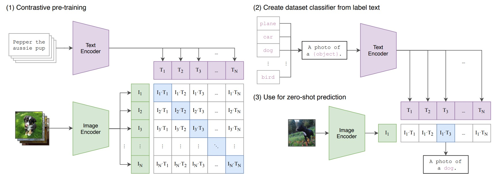
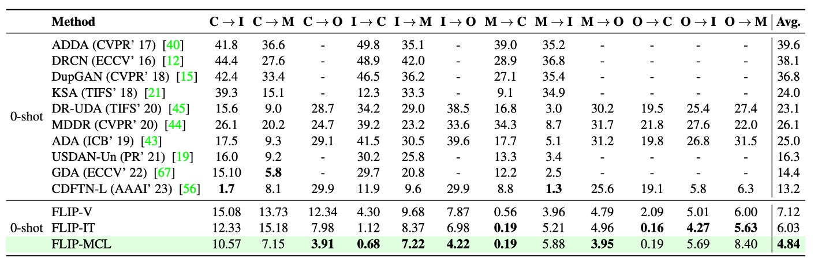

## The Defense Spell

[**FLIP: Cross-domain Face Anti-spoofing with Language Guidance**](https://arxiv.org/abs/2309.16649)

---

"This is real!"

With natural language as the noble witness, so says the model.

## Problem Definition

At airports, smartphones, access control, and various verification points, the face has long become the most familiar identifier.

However, the anti-spoofing models (FAS) relied upon by these systems often reveal unexpected vulnerabilities when tested across devices, attack types, and environmental conditions:

- Models perform well under familiar data distributions but degrade significantly once outside the training scenario;
- Minor changes in camera resolution, lighting conditions, or even attack methods may cause the model to misclassify fake as real;

In the end, many methods assume access to samples from the target domain, but in practice, this is often a luxury. After all, no one knows where or how the next attack will come.

These same words have been heard for over a decade, yet the problem remains unsolved.

This forces us to reconsider a fundamental question:

> **Can a model still retain the perception of "liveness" in cross-domain scenarios with unknown types and lacking annotations?**

Past attempts mostly revolved around three strategies seeking answers:

- **Unsupervised Domain Adaptation (UDA):** relying on unlabeled target data to help generalize decision boundaries;
- **Few-shot Learning:** quickly adjusting representations with a small number of labeled target samples;
- **Domain Generalization:** trying to learn attack-irrelevant discriminative features from multiple source domains.

However, these approaches mostly assume the model can access the target domain or rely on nontrivial auxiliary information such as attack types, style labels, or even special modules. This makes "zero-shot transfer" an ideal yet tricky challenge.

The authors of this paper propose a more radical idea:

- What if we replace pretrained ViT with a multimodal model like CLIP? Would it naturally generalize better across domains?
- If language itself can serve as a "style-neutral" descriptive aid, could it guide the model to learn semantic-level anti-spoofing intuition?
- If images and text are not only paired but jointly encoded during training for "authenticity," could the model gain a deeper understanding of what is real?

These questions imply not just data structure issues but the semantic depth of representations. What the model needs to learn is not just features, but how to recognize the authenticity of a face from "descriptions."

And it all begins with a sentence:

> **_"This is not a spoof face."_**

---

## Problem Solution

Wait, you say you don’t know what CLIP is yet?

Let us briefly introduce:

Suppose we have a set of image-text pairs, for example, an image of a dog and the text "a cute puppy."

In one training batch, CLIP receives many such pairs. The image encoder—using ResNet or ViT—processes images to extract image features, while the text encoder—using a Transformer—processes text to extract text features.

Then, the model compares these features to ensure that the cosine similarity between correctly matched image-text pairs (e.g., dog image and "a cute puppy") is maximized, and between mismatched pairs (e.g., dog image and "an apple") is minimized.

Finally, it is trained on 400 million image-text pairs.

A very simple concept with impressive results, and the success of this architecture has opened a new era.

:::tip
For a more detailed introduction, you can refer to our previous article:

- [**[21.03] CLIP: Breaking the Dimensional Barrier**](../../multimodality/2103-clip/index.md)
  :::

### Model Architecture

<figure style={{"width": "90%"}}>

</figure>

The above figure illustrates the research architecture in this paper, corresponding as follows:

- **(a) FLIP-Vision:** Simply uses CLIP’s vision encoder plus an MLP as the baseline architecture.
- **(b) FLIP-IT:** Introduces textual descriptions as class correspondences, using cosine similarity as the classification criterion.
- **(c) FLIP-MCL:** An evolved version under multimodal contrastive learning regularization, allowing the model to learn consistent cross-domain representations from more perspectives and self-validation.

This is a CLIP-based multimodal contrastive learning framework. Let’s see how CLIP’s knowledge can be transferred to the problem we want to solve.

### FLIP-Vision

As mentioned earlier, since CLIP is pretrained on large-scale web image-text data, it shows strong zero-shot transfer ability on many natural image tasks such as classification, object detection, and segmentation.

However, because the FAS task requires distinguishing **very subtle** differences (e.g., paper reflections, screen texture patterns, recapture distortions), CLIP’s features cannot be directly applied.

Thus, the authors propose FLIP-Vision (FLIP-V) as the baseline model, adopting a minimal adaptation strategy:

- Retain CLIP’s **image encoder**;
- Discard the text encoder and only use CLIP’s ViT backbone for feature extraction;
- Take the **class token** output from the last Transformer block and feed it to a **multi-layer perceptron (MLP)** head for binary classification;
- Train with standard Cross Entropy Loss to distinguish live from spoof faces.

This design can be seen as a form of “language-distilled visual fine-tuning,” inheriting the strong representations CLIP learned in the multimodal world but deliberately removing language interference to focus on tuning the visual encoder’s fine-grained perceptual ability.

During training, the authors use balanced image data from multiple source domains so the model learns discriminative cues across varying styles, attack types, and capture conditions.

This process remains purely supervised without introducing any language prompts or semantic hints.

Therefore, FLIP-V essentially demonstrates one thing:

> **Even without language, CLIP’s visual backbone has better generalization potential than traditional ViT.**

### FLIP-Image-Text

Although the basic FLIP-Vision proves CLIP’s visual encoder has transfer potential on FAS tasks, it remains a “visual-only” classifier.

This design is still constrained within the “feature recognition” framework and does not realize CLIP’s original spirit: using language as a guide and decision reference for vision.

Hence, the authors introduce FLIP-IT.

The core idea of this version is to use natural language sentences as “semantic anchors,” allowing the model to directly compare the alignment between image features and textual descriptions during training, rather than learning solely from image classification boundaries.

This design no longer uses a traditional MLP head to classify images as real or fake. Instead, each image “selects the most similar description.”

The key logic is to represent each category (real/spoof) by a natural language sentence, then use CLIP’s text encoder to convert these sentences into vector representations $\vec{z}_r$ and $\vec{z}_s$, and compute cosine similarity with the image vector $\vec{x}$ as the prediction basis.

In other words, the model predicts which text the image resembles more, rather than which class it belongs to.

Because the language space is much “broader” than the label space, it allows one category to be represented by multiple semantic descriptions and shows stronger tolerance to domain variations through linguistic abstraction.

In experiments, the authors designed six groups of prompts describing real and spoof classes, as shown below:

| Prompt No. | Real Prompts                       | Spoof Prompts                        |
| ---------- | ---------------------------------- | ------------------------------------ |
| P1         | This is an example of a real face  | This is an example of a spoof face   |
| P2         | This is a bonafide face            | This is an example of an attack face |
| P3         | This is a real face                | This is not a real face              |
| P4         | This is how a real face looks like | This is how a spoof face looks like  |
| P5         | A photo of a real face             | A photo of a spoof face              |
| P6         | This is not a spoof face           | A printout shown to be a spoof face  |

These sentences represent different language strategies:

- Some emphasize positive descriptions (e.g., P2: “This is a bonafide face”);
- Some use negation structures (e.g., P3: “This is not a real face”);
- Some resemble image captions (e.g., P5: “A photo of a real face”);
- Others approach semantic irony (e.g., P6: “This is not a spoof face”).

These form a set of “language context prompts.” The authors use all six prompts (P=6) to compute average embeddings, obtaining a more stable and generalizable language representation $\bar{z}$ to align with image features.

This mechanism effectively turns linguistic diversity into a form of data augmentation, helping the model learn more robust decision boundaries.

### FLIP-Multimodal-Contrastive-Learning

We have seen how language transforms from “annotation” to “classifier” in FLIP-IT, enabling the model to align directly with semantic descriptions to learn authenticity. Yet this alignment is still based on single pairs and lacks robustness to variation and uncertainty.

Finally, the authors propose FLIP-MCL (FLIP-Multimodal Contrastive Learning).

The core idea of FLIP-MCL is to introduce contrastive learning into the multimodal framework, allowing the model not only to see correspondences but also to capture the “invariant” parts.

The overall training objective is expanded to three components:

1. **Classification loss $L_{ce}$**: continuing FLIP-IT’s cosine similarity and cross entropy loss;
2. **Inter-image contrastive loss $L_{simCLR}$**: enhancing consistent understanding of image content across different views;
3. **Image-text similarity consistency loss $L_{mse}$**: further promoting semantic stability between visual and textual contexts.

---

First, the simCLR part.

For image feature learning, the authors borrow the classic simCLR contrastive learning framework. For each input image $I$, two augmented views are randomly generated (e.g., different lighting, masking, cropping), denoted as $I^{v_1}$ and $I^{v_2}$.

Then, features are extracted by CLIP’s image encoder $V$:

$$
\vec{x}^{v_1} = \mathcal{V}(I^{v_1}), \quad \vec{x}^{v_2} = \mathcal{V}(I^{v_2})
$$

Next, a nonlinear projection head $\mathcal{H}$ maps these to the contrastive space:

$$
\vec{h}_1 = \mathcal{H}(\vec{x}^{v_1}), \quad \vec{h}_2 = \mathcal{H}(\vec{x}^{v_2})
$$

Finally, the simCLR contrastive loss $L_{simCLR}$ encourages the model to pull features of different views closer, achieving content consistency learning.

---

Next, the MSE part.

On the language side, FLIP-MCL further extracts consistent signals from “sentence diversity.” Each category has multiple natural language prompts, from which two descriptions $\vec{z}^{v_1}$ and $\vec{z}^{v_2}$ are randomly sampled, paired with the two image views.

For pairs $(\vec{x}^{v_1}, \vec{z}^{v_1})$ and $(\vec{x}^{v_2}, \vec{z}^{v_2})$, cosine similarities are computed, and an MSE loss forces these similarities to be close:

$$
L_{mse} = \left(\text{sim}(\vec{x}^{v_1}, \vec{z}^{v_1}) - \text{sim}(\vec{x}^{v_2}, \vec{z}^{v_2})\right)^2
$$

This essentially tells the model:

> **No matter which angle you see or which sentence you hear, you should feel “this is the real face.”**

---

In the end, the authors combine the three objectives into the total loss:

$$
L_{mcl} = L_{ce} + L_{simCLR} + L_{mse}
$$

At inference, the model still uses the same cosine similarity method as FLIP-IT to select the most matching natural language description as the prediction, enabling a language-driven classification pipeline without modification.

## Discussion

This study evaluates performance using three cross-domain testing protocols:

- **Protocol 1** employs four classic datasets: MSU-MFSD, CASIA-MFSD, Idiap Replay Attack, and OULU-NPU. Following a leave-one-domain-out setting, one dataset is held out as the target domain while the others serve as training sources.
- **Protocol 2** uses three large-scale face anti-spoofing datasets: WMCA, CASIA-CeFA, and CASIA-SURF. The leave-one-out strategy is similarly applied to validate generalization across devices and complex environmental variations.
- **Protocol 3** simulates single-source to single-target scenarios, selecting from the MCIO four datasets to form 12 domain-pair tests, modeling practical cases where data sources are limited.

Evaluation metrics include:

- Half-Total Error Rate (HTER, lower is better)
- Area Under the ROC Curve (AUC, higher is better)
- True Positive Rate (TPR) at False Positive Rate (FPR) = 1% (higher is better)

All experiments were repeated five times with averaged results for statistical robustness.

### Protocol 1: MCIO Four Domains

From the table, three main trends emerge:

First, **FLIP-V (visual fine-tuning)** outperforms traditional ViT on most test domains (notably C and O), demonstrating that multimodal pretrained models possess strong structural generalization even when fine-tuned on a single modality. This contrasts prior reports that full fine-tuning may degrade ViT’s cross-domain performance.

Second, **FLIP-IT (language supervision)** further improves performance on target domains C, I, and O, especially significantly boosting TPR\@FPR=1%, indicating language prompts effectively enhance semantic-level decision criteria when data is scarce.

Finally, **FLIP-MCL (multimodal contrastive learning)** shows the most stable and comprehensive gains, achieving the lowest HTERs across all three target domains and outperforming previous zero-shot methods on AUC and TPR metrics—surpassing even the five-shot results of ViTAF on C and O domains.

The only exception is a slight regression on domain M, likely due to some genuine samples being misclassified as attacks, increasing false negatives.

Overall, Protocol 1 results reinforce the key thesis: multimodal semantic alignment and contrastive learning significantly boost model discrimination on unseen domains, mitigating domain shift and data sparsity challenges.

### Protocol 2: WCS Three Domains

Protocol 2 expands experiments to larger, more complex datasets: WMCA (W), CASIA-CeFA (C), and CASIA-SURF (S), which include over a thousand subjects and diverse attack types and sensor setups, reflecting real deployment scenarios more closely.

The table shows **FLIP-V** already delivers solid zero-shot transfer, noticeably reducing HTER versus baseline ViT, with average improvements ranging from +1.5 to +3.5 percentage points, demonstrating CLIP-ViT’s visual features have stable generalization across devices and attack modes.

**FLIP-IT** further boosts TPR\@FPR=1% on W and C domains by +10.25 and +11.41 points, respectively. However, it slightly underperforms FLIP-V in the CW → S setting, possibly due to semantic misalignment between attack types or image textures and language prompts weakening image-text matching.

The most substantial improvements come from **FLIP-MCL**: by incorporating simCLR and image-text consistency learning, it achieves the best HTER and TPR across all targets with high AUC, confirming its ability to learn semantically stable discriminative features under high-variance data distributions.

Compared to Protocol 1, domain gaps here mainly stem from sensor and subject diversity rather than capture process or language annotations, indicating that **language supervision and contrastive learning can handle both style shifts and distribution shifts at device and subject levels.**

### Protocol 3: Single Source → Single Target

Protocol 3 simulates an extreme but common practical case: training data from a single source domain with limited resources and direct inference on an unseen target domain.

Using MSU-MFSD (M), CASIA-MFSD (C), Idiap Replay (I), and OULU-NPU (O), 12 cross-domain tasks were designed to test generalization under data scarcity and domain shift pressure.

Results show:

First, **FLIP-V**, the simplest variant, generally outperforms all prior zero-shot methods with an average HTER reduction of 3–6 percentage points, illustrating the robustness of visual features learned from multimodal pretraining.

However, **FLIP-MCL** stands out with an average HTER improvement of **+8.36**, showing overwhelming advantages on many difficult tasks. For example:

- Source I to target O sees an HTER drop of **26%**;
- C → O and M → C pairs achieve improvements of **+25.7%** and **+11.2%**, respectively;
- A few cases (e.g., O → M) perform slightly below SOTA, yet the overall average remains best.

These results further validate FLIP-MCL’s strong adaptability to sample scarcity, context mismatch, and style drift. simCLR stabilizes image-level features, while prompt averaging and MSE loss maintain semantic image-text alignment, enabling stable cross-domain reasoning even with single-source training.

In summary, Protocol 3 highlights FLIP’s practical value in low-resource settings, particularly in pre-deployment phases lacking target samples, maintaining highly reliable anti-spoofing performance.

### Pretraining Strategies

<figure style={{"width": "90%"}}>

</figure>

To clarify the impact of initialization on cross-domain generalization, the authors compared various ViT initialization methods: training from scratch (no pretraining), self-supervised pretraining (e.g., BeIT), ImageNet pretrained models, and multimodal pretrained weights from CLIP.

The table shows **CLIP initialization consistently achieves the best performance across all cross-domain tasks**. This advantage stems not from single-modal strength but from the semantic structure aligned between images and text, making it the optimal starting point for all FLIP variants.

### Prompt Design

<figure style={{"width": "90%"}}>

</figure>

In language-supervised frameworks (FLIP-IT, FLIP-MCL), the wording of textual prompts significantly affects classification performance.

The table illustrates differences in performance across various cross-domain scenarios depending on prompt design, showing **no single universally optimal prompt exists**, and reliance on semantic phrasing varies by scenario style.

Additionally, comparing single-sentence versus multi-sentence averaging strategies reveals that **prompt ensembling via multiple sentences stabilizes model decisions and reduces bias from any single prompt’s semantics**.

This confirms language supervision should not be simplified as static labels but viewed as tunable semantic space parameters.

### Loss Weight Analysis

<figure style={{"width": "70%"}}>

</figure>

FLIP-MCL uses a tri-loss joint training: supervised Cross Entropy, and self-supervised simCLR plus image-text similarity consistency (MSE). To assess each loss’s contribution, the authors varied their weighting, as shown above.

It is clear that **removing either self-supervised loss (setting simCLR or MSE weight to zero) degrades performance**, proving both contribute significantly to learning stable features and cross-domain alignment. However, overly amplifying self-supervised terms (e.g., weight ratio 1:5:5) dilutes the classification objective and reduces accuracy.

This highlights that the tri-loss design’s key is **properly balancing self-supervised and supervised learning to jointly promote semantic and visual consistency.**

## Conclusion

While most prior works remained stuck on stacking visual features and cycling datasets, the authors chose a new path:

> **Starting from multimodal foundational models like CLIP and introducing language as a semantic anchor for judgment.**

Building on this, they incorporate a visual-language contrastive learning framework to establish an anti-spoofing strategy centered on semantic alignment.

This approach yields several key insights:

1. **Representations learned by multimodal pretrained models have strong cross-domain potential.**

   Even fine-tuning only the image encoder markedly improves generalization, showing that these models embed a semantic space structure far more transferable than traditional ImageNet models.

2. **Language is no longer just an auxiliary annotation but a learnable classification criterion.**

   Through sentence-defined class contexts, models learn “what kind of reality this is,” rather than merely judging “does this look real” from pixels.

3. **Multimodal contrastive learning provides a more general regularization strategy.**

   In scenarios with scarce annotations and limited sample diversity, it helps models align diverse visual contexts and semantic explanations, enhancing stability under extreme domain shifts.

Although FLIP-MCL introduces extra computation by using a language encoder during training, experiments prove this cost is justified by significant performance gains and cross-scenario adaptability.

In future tasks involving more complex, multi-source data, language may become the key medium for deep model generalization.
