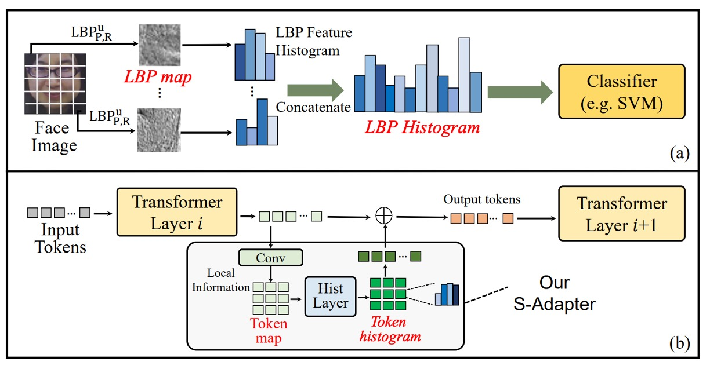
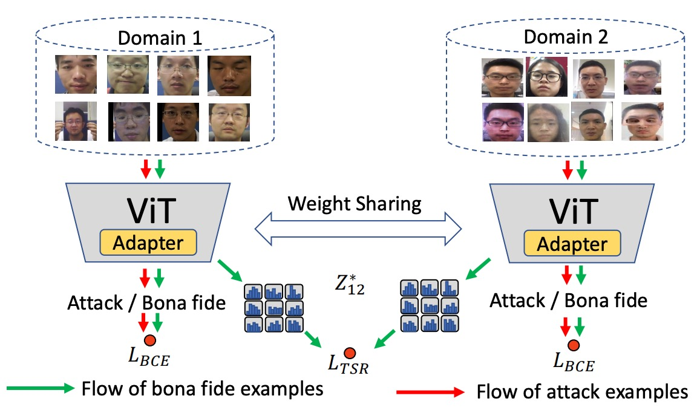
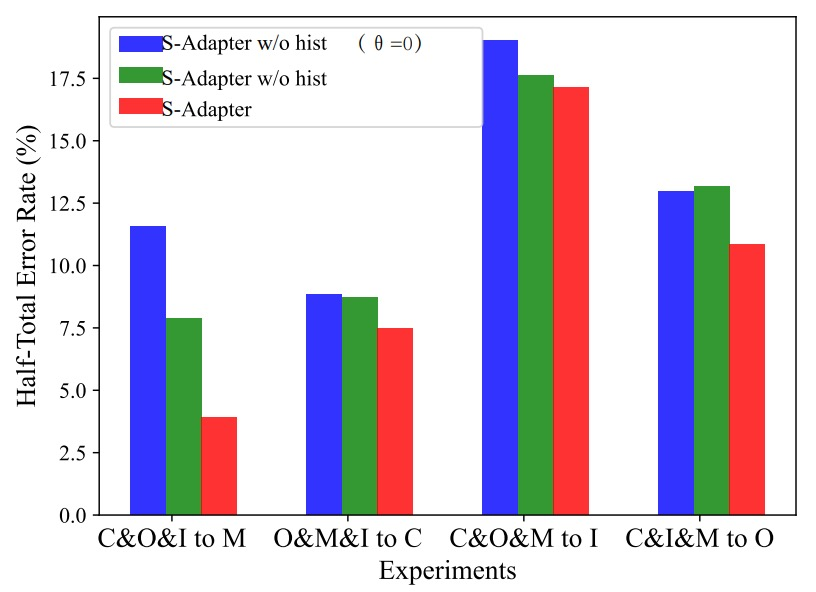

## Real Notebook

[**S-Adapter: Generalizing Vision Transformer for Face Anti-Spoofing with Statistical Tokens**](https://arxiv.org/abs/2309.04038)

---

Adapter is a lightweight model adjustment technique that typically adds additional parameters to a pre-trained Transformer model. These parameters can be fine-tuned for specific tasks without needing to retrain the entire model.

If Transformers are the main protagonists in recent computer vision research, then adapters are the role adjusters that bridge tasks.

:::tip
If you're unfamiliar with this concept, you can refer to our previous paper notes:

- [**[19.02] Adapter: Saving 96% of Parameters**](../../model-tuning/1902-adapter/index.md)
  :::

## Defining the Problem

Looking at the face anti-spoofing (FAS) models so far, it’s clear how difficult they are.

Not only do you need to determine "is this face real or fake," but it must be stable enough. At the very least, it shouldn't fail simply because the lighting changed, the camera switched, or a new type of attack is used.

The cause of model failures is usually not due to the model's weakness, but because the "world" it’s used to during training is too small. It’s like taking thousands of photos of real faces indoors, and then deploying the model only for users to use their phones to scan their faces under the bright sun. The model falls apart immediately. No matter how much you fine-tune or add more layers, **domain shift** will still break its generalization capability.

Thus, various solutions have emerged: Some use adversarial learning for style transfer, some use meta-learning to simulate unseen scenarios, while others try to compress real faces closer and spread fake faces further apart. But these methods still fall short when it comes to generalization, particularly in **zero-shot** testing.

Then came ViT (Vision Transformer), and people were excited.

After all, the attention mechanism in Transformers handles long-range information well, and the architecture is flexible, seemingly perfect for tasks that involve strong environmental variations.

But then another issue arises.

While we can fine-tune a pre-trained ViT model on ImageNet, it indeed performs slightly better than CNN-based models, but just "slightly." Sometimes, in few-shot or even zero-shot conditions, the ViT performs worse than CNN-based baselines.

There might be a more fundamental problem here:

- **Transformers can see far, but can they see fine details?**
- **Can they recognize subtle textures, local defects, and weaknesses left by attack mediums?**

Or perhaps, we’ve assumed too quickly that Transformers can understand these "things beyond style"?

## Solving the Problem

The first step in applying ViT to FAS is usually: fine-tuning a pre-trained ImageNet model.

But if you don’t have eight high-end GPUs, fine-tuning ViT can be a challenge. So, some people thought of inserting small modules using an Adapter approach, only training a few task-specific layers while freezing the rest.

This approach is called Efficient Parameter Transfer Learning (EPTL), and methods like Adapter, LoRA, and Prompt-tuning all fall into this category.

In ViT, we can simplify the process of each block as the following inference process (ignoring LayerNorm and skip connections):

$$
Y = W_i^{\text{MLP}}(W_i^{\text{MSA}}(X))
$$

Here, $X$ and $Y$ are the input and output tokens of a transformer block, MSA represents multi-head self-attention, and MLP is the multi-layer perceptron. If we use an Adapter, the structure becomes:

$$
Y = A_i^{\text{MLP}}(W_i^{\text{MLP}}(A_i^{\text{MSA}}(W_i^{\text{MSA}}(X))))
$$

Where $A_i^{\text{MSA}}$ and $A_i^{\text{MLP}}$ are the inserted Adapters. The original ViT weights $W$ are frozen, and only the Adapter parameters are trained, achieving the "resource-efficient, small change" goal.

However, this Adapter structure works well in natural language tasks but struggles in FAS.

The reason is not hard to understand: General Adapters use linear layers, **which lack the inductive bias of spatial structure**.

But FAS tasks are the opposite—they heavily rely on **local details**. Defects like image artifacts, edge blur, and reconstruction noise are things that global tokens simply cannot detect.

## Model Architecture

<figure style={{"width": "90%"}}>

</figure>

To address the issue of Transformers struggling to effectively capture local texture features, the authors propose **S-Adapter**.

The inspiration comes from traditional texture analysis methods like Local Binary Pattern (LBP), as shown in the figure (a) above.

The LBP process does not directly classify pixel values; instead, it first extracts local textures and then computes a histogram. This statistical feature is robust to lighting changes and material differences, and it was widely used in early face detection and anti-spoofing tasks.

The design of S-Adapter is to translate this logic into the Transformer world:

> **Enable ViT tokens to learn statistics and extract spatial distribution features from local textures.**

The overall structure is as follows:

<figure style={{"width": "90%"}}>

</figure>

The entire module is divided into two stages: **Token Map Extraction** and **Token Histogram Extraction**.

### Token Map Extraction

In the FAS (Face Anti-Spoofing) scenario, the key to detecting attacks often lies in local details.

These details could be blur, edge artifacts, small texture anomalies caused by re-capturing, and such features are difficult for the global attention mechanism of Transformers to capture.

However, before performing self-attention, the tokens in ViT are flattened into a one-dimensional sequence, losing spatial structure.

Therefore, **the first step** is to design a process that restores the spatial properties of tokens:

- Given the input token $X \in \mathbb{R}^{N_P \times C}$, where $N_P$ is the number of patch tokens (class token is ignored), and $C$ is the embedding dimension;
- Reshape it to $X_R \in \mathbb{R}^{H \times W \times C}$, where $H \times W = N_P$;
- Then permute the dimensions to $X_M \in \mathbb{R}^{C \times H \times W}$, similar to a $C$-channel image.

Next, use a 2D convolution layer $W_\text{Conv}$ to extract local features:

$$
Z = W_{\text{Conv}}(X_M)
$$

This step reintroduces the spatial inductive bias, compensating for the lack of local modeling capability in Transformer.

To make the model more sensitive to local changes, the authors introduce a Center Difference (CD) operation:

- For each token $Z_n$, compute the difference with its surrounding neighbors $P_n$;
- Weighted sum using the convolution kernel weights $\omega(p)$:

$$
Z^g_n = \sum_{p \in P_n} \omega(p) \cdot (Z_p - Z_n)
$$

This results in $Z^g$, which captures fine-grained local gradient features, especially for subtle texture changes.

Finally, the original feature $Z$ is fused with the gradient feature $Z^g$ to form a new token map:

$$
Z^* = (1 - \theta) Z + \theta Z^g
$$

where $\theta$ controls the fusion ratio. This allows even ViT to incorporate local feature sensitivity similar to CNN.

### Token Histogram Extraction

Even with added local features, domain shift (cross-device, cross-lighting) still leads to instability in model performance.

The reason is that local pixel values are still easily affected by environmental factors.

Thus, the second step is to further statistically analyze these local features by computing a differentiable histogram for each small region.

Intuitively, this means:

- Soft binning the feature distribution for each patch;
- Obtaining a statistical vector instead of a single pixel value;
- Allowing the model to learn the overall structural distribution of local regions, rather than individual point values, enhancing domain stability.

The computation process is as follows:

First, define the bin center $\mu$ and bin width $\gamma$, then the soft-binned histogram is:

$$
Z_{\text{Hist}}^{c,h,w}
= \frac{1}{JK} \sum_{j=1}^{J} \sum_{k=1}^{K} \exp \Bigl( -\gamma_c^2 (Z^*_{c,h+j,w+k} - \mu_c)^2 \Bigr)
$$

where:

- $J = K = 3$, i.e., a 3x3 convolution window;
- stride = 1, padding = 1, ensuring the size remains unchanged.

The soft binning ensures that values closer to the bin center contribute more, and values farther away contribute less, making it differentiable.

Breaking it down further:

$$
Z_{\text{Hist}}^{c,h,w}
= \frac{1}{JK} \sum_{j=1}^{J} \sum_{k=1}^{K} \exp (-U_c^2)
$$

$$
U_c = \gamma_c (Z^*_{c,h+j,w+k} - \mu_c)
$$

Here, $U_c$ can be implemented using two layers of pixel-wise 1x1 convolutions:

- First layer $W_{\text{Conv1}}$: the weights are fixed to 1, the bias is learnable (corresponding to $-\mu$);
- Second layer $W_{\text{Conv2}}$: the bias is fixed to 0, and the weights are learnable (corresponding to $\gamma$).

This design allows both the bin center and bin width to be automatically adjusted through training.

Finally, the histogram result $Z_\text{Hist}$ is reshaped into $N_P \times 8$ tokens and projected back to $N_P \times 768$, aligning and fusing with the original tokens.

### Gram Matrix

In the context of deep learning, we can roughly classify image features into two categories:

- **Content**: Essential information related to the task, such as texture flaws, blurred edges, and reorganization traces.
- **Style**: Environmental style features related to the image capture, such as lighting, saturation, color shifts, and noise distribution.

Many previous methods have attempted to use adversarial learning for feature disentanglement to separate these two types of information. However, these methods often struggle with instability and convergence, particularly in cross-domain tasks where convergence speed and stability are major challenges.

This paper adopts a more intuitive approach: **Since we know style can be represented using a Gram matrix, let's directly regularize the Gram matrix.**

First, the authors define the Gram matrix for the token map $Z \in \mathbb{R}^{C \times H \times W}$ as follows:

$$
G(Z)_{k,k'} = \frac{1}{CHW} \sum_{h=1}^H \sum_{w=1}^W Z_{k,h,w} \cdot Z_{k',h,w}
$$

Here, $Z_{k,h,w}$ is the value of the $k$-th channel at the spatial position $(h,w)$, and $G(Z)$ represents the co-occurrence structure between each pair of channel features, indicating the "style" of the image.

In the authors' design, the goal is not to enforce uniformity across all image styles but to regularize the **style consistency between bonafide (genuine) samples**.

This design has two advantages:

1. It does not interfere with the style representations of attack samples, avoiding the blurring of the boundary between positive and negative samples.
2. It aligns with real-world assumptions: **bonafide samples come from a "real-world" distribution, whereas attacks can come from anywhere.**

Given bonafide token maps from two domains, $Z_{D1}$ and $Z_{D2}$, the style regularization loss is defined as:

$$
\mathcal{L}_{\text{TSR}} = \left\| G(Z_{D1}) - G(Z_{D2}) \right\|_F^2
$$

This means that the smaller the Gram matrix difference between two bonafide samples, the more consistent their style, and the model will focus more on learning content features.

The following diagram illustrates this design logic:

<figure style={{"width": "90%"}}>

</figure>

The style of bonafide samples from different domains is aligned, but no additional constraints are applied to spoof attack samples, preserving their distinguishability.

In addition to TSR, the model still needs to distinguish between real and fake. Therefore, the authors use the common Binary Cross-Entropy (BCE) loss:

$$
\mathcal{L}_{\text{BCE}} = - \left[ y \cdot \log(\hat{y}) + (1 - y) \cdot \log(1 - \hat{y}) \right]
$$

In the case of multiple domains, all bonafide domains are averaged:

$$
\mathcal{L}_{\text{TSR}}^{\text{avg}} = \frac{1}{N} \sum_{(D_i, D_j)} \left\| G(Z_{D_i}) - G(Z_{D_j}) \right\|_F^2
$$

Finally, the total loss is:

$$
\mathcal{L}_{\text{total}} = \mathcal{L}_{\text{BCE}} + \lambda \cdot \mathcal{L}_{\text{TSR}}^{\text{avg}}
$$

where $\lambda$ is a hyperparameter that controls the influence of style regularization on the overall training.

## Discussion

In this section, let's take a look at how S-Adapter performs under various experimental settings.

The authors conducted four different types of evaluations:

- Intra-Domain Testing (Training and testing within the same dataset)
- Cross-Domain Testing (Testing across datasets)
- Few-Shot Cross-Domain Testing (Testing with a small amount of target data)
- Unseen Attack Testing (Testing with attack types that the model has not seen before)

The datasets used for evaluation include CASIA-FASD, Replay Attack, MSU MFSD, OULU-NPU, and SiW-M. The evaluation metrics include HTER, ACER, EER, AUC, and TPR at FPR = 1%.

### Intra-Domain Testing

The authors compare the performance of existing methods on the four standard protocols of the OULU-NPU dataset, as shown in the table below:

<figure style={{"width": "60%"}}>

</figure>

From the table, we can see that, in terms of the ACER metric, S-Adapter achieves the best or near-best performance in most protocols. This suggests that even with intra-domain training and testing, the design that **incorporates statistical features and local perception** can effectively improve the classifier’s sensitivity to the details of real and fake faces.

However, looking at Intra-Domain alone is not enough to prove generalization capability.

### Cross-Domain Testing

The Cross-Domain testing uses the classic MICO protocol (leave-one-out testing between the four datasets: CASIA-FASD, Replay-Attack, MSU-MFSD, OULU-NPU).

The results are shown in the table below:

<figure style={{"width": "90%"}}>

</figure>

It can be seen that, whether using HTER (Half Total Error Rate) or AUC (Area Under the ROC Curve), **S-Adapter outperforms the ViT† baseline in all four leave-one-out tests** and also surpasses several recent SOTA methods like SSAN-R and MettaPattern.

This once again highlights the core spirit of the earlier design: **It's not just about fine-tuning ViT, but enhancing local recognition and style resilience for the FAS task.**

### Limited Source Domains Testing

In practice, collecting cross-domain datasets is not an easy task.

Therefore, the authors further test whether the model can maintain cross-domain performance when only two source datasets are used for training (e.g., MSU + Replay).

The results are shown in the table below:

<figure style={{"width": "90%"}}>

</figure>

Even with just two sources, S-Adapter still **significantly outperforms other methods (e.g., AMEL)** in scenarios like "M&I to C," demonstrating its robustness even when the dataset is limited.

## Ablation Experiments

Finally, the authors conduct ablation experiments to specifically examine the contributions of S-Adapter and TSR.

### Effectiveness of S-Adapter Components

First, the authors tested different versions of S-Adapter:

- **S-Adapter** (Full version)
- **S-Adapter w/o hist** (Removed histogram layer)
- **S-Adapter w/o hist(θ=0)** (Removed both histogram and gradient extraction)

The experimental results are shown in the figure below:

<figure style={{"width": "60%"}}>

</figure>

From the results, we can see that:

- The full version of S-Adapter performs best in HTER across the four cross-domain scenarios.
- Removing the histogram (w/o hist) causes a significant performance drop.
- Removing both the histogram and gradient (θ=0) results in the worst performance.

This confirms that **statistical features (histogram) and local gradients make substantial contributions to cross-domain recognition.**

However, in the special case of `C&I&M to O`, adding gradients actually slightly increased the HTER.

The authors speculate that this is due to the higher resolution of the OULU-NPU dataset, while I, C, and M sources have lower resolutions, causing inconsistent gradient features across resolutions. The histogram statistical layer helps smooth this discrepancy, thus maintaining stable performance.

### Histogram's Enhancement Effect on Vanilla Adapter

To verify the universality of histograms, the authors also added CDC layers and Histogram layers to the standard vanilla adapter.

The results are shown below:

<figure style={{"width": "70%"}}>

</figure>

It can be seen that:

- After adding CDC, HTER decreased (HTER lower is better).
- Adding Histogram further improved the performance.

This suggests that the "histogram feature" design itself provides a universal gain in cross-domain stability, not limited to the S-Adapter architecture.

### TSR Module and λ Hyperparameter

Next, let's look at the ablation of Token Style Regularization (TSR).

The authors set different values of λ, from 0 to 1, and observed the impact on HTER, as shown in the figure below:

<figure style={{"width": "60%"}}>

</figure>

It can be observed that:

- When λ > 0, HTER generally decreases, proving TSR is effective.
- If λ is set too high (e.g., >0.5), it overly strengthens style alignment, affecting classification performance.
- The recommended setting for λ is around 0.1, balancing style regularization and classification performance.

## Conclusion

This paper did not follow the trend of pushing for a deeper ViT backbone nor did it attempt to reverse domain shift with complex adversarial learning techniques. Instead, it chose a relatively simple yet effective approach:

> **Re-understanding local textures and statistical features, allowing Vision Transformers to learn to perceive differences.**

Each design in S-Adapter directly addresses two fundamental problems in FAS tasks:

- Recognizing local details
- Resilience to style differences across environments

True stable generalization does not come from stacking more complex networks but from understanding and refining the essence of the task. Through comprehensive cross-domain testing, the authors have also proven that their choices were not a fluke but a broadly applicable design.
