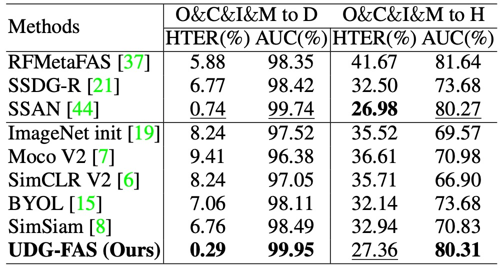

## Fragments of Style

[**Towards Unsupervised Domain Generalization for Face Anti-Spoofing**](https://openaccess.thecvf.com/content/ICCV2023/papers/Liu_Towards_Unsupervised_Domain_Generalization_for_Face_Anti-Spoofing_ICCV_2023_paper.pdf)

---

If you think training an FAS model is already difficult, try doing it without any labeled data and let the model figure things out by itself. The situation goes from bad to incomprehensible.

This is the scenario we're facing now.

## Defining the Problem

Face Anti-Spoofing (FAS) has always been seen as the core defense line for face recognition systems, but it has two fatal flaws:

- The high cost of data collection and annotation;
- The model is easily invalidated when the scene changes.

If you've followed along with us through dozens of papers, you might already be familiar with these issues.

In order to maintain stability across domains (cross-dataset), various Domain Generalization methods have been proposed in the past, but they all come with a prerequisite: you need sufficient labeled data.

In reality, you might have access to a large amount of data, but no manpower or resources to annotate it.

Thus, the shift towards "unsupervised learning" began, aiming to address the issue of "lack of annotations."

There are two main schools of contrastive learning: MoCo and SimCLR.

While these contrastive learning methods have achieved outstanding results in general image tasks, they fail to deliver as expected in FAS. When it becomes a "Real / Fake" binary task, negative samples are hard to define, and the model often fails to determine which side to reject.

Similarly, while BYOL and SimSiam attempt to eliminate the dependence on negative samples, they still fail to perform well on FAS data because the identity bias and domain bias in faces are far richer than in natural images: you think it learned to recognize fake faces, but it actually just memorized which dataset a face belongs to.

To make matters worse, most methods assume you have a pre-trained ImageNet backbone available. However, ImageNet won’t teach you the difference between "fake face" and "real face," it only helps distinguish between "cats" and "dogs." As a result, the model always falls short when it comes to zero-shot or few-shot conditions in FAS.

So, the problem comes back to square one:

- **If there are no annotations and no suitable pre-trained data, what can the model learn from?**
- **If identity and domain noise dominate over spoofing itself, how can we make the model focus on "what it should be looking at"?**

The answer proposed by this paper is: break the face apart first!

## Solving the Problem

The overall design of UDG-FAS revolves around one core objective: to gradually eliminate identity and scene bias without annotations, so that the model can focus on the essential clues for distinguishing live faces from fakes.

This goal is broken down into three strategic modules:

1. Eliminating identity bias within a single image through **Split-Rotation-Merge (SRM)**;
2. Loosening cross-identity representation differences through **In-domain Nearest Neighbor (NN)** search;
3. Handling style shifts between data sources via **Cross-domain Nearest Neighbor (NN)** search.

As always, the situation is complex, so let's go through them one by one.

### SRM Module

**Split-Rotation-Merge (SRM)** is the key module used in this study to eliminate identity bias. The design goal is to preserve the local spoof clues necessary for live face detection, while weakening the model's dependence on face structure and individual differences.

The overall process is as follows:

First, the input image $x_1$ undergoes non-destructive data augmentation (e.g., brightness adjustment, mirroring, etc.) and is then split into $m \times m$ local patches. Each patch $x^p_1$ undergoes random rotation, thereby breaking the symmetry and spatial arrangement bias introduced by the original face structure, and reducing the model's sensitivity to identity-related signals.

Next, these local patches are passed through an encoder $f$ to generate corresponding feature vectors:

$$
e^p_1 = f(x^p_1)
$$

Instead of directly using these local vectors for contrastive learning, $n$ patches are randomly selected from them, and their feature average is computed to obtain a merged identity-agnostic representation $v_1$:

$$
v_1 = \frac{1}{n} \sum_{p \in s} e^p_1
$$

Here, $s$ represents the selected patch index subset. The rationale behind this design is that spoof clues are usually distributed across multiple patches (e.g., texture, reflections, printing noise), while identity features vary greatly across different regions of the face. The averaging operation further erases unstable variations between patches.

The generated local representation $v_1$ is then passed through a projector $g$ and predictor $q$, producing a contrastive vector $p_1$.

In contrast, another image view $x_2$ is not split or rotated and is directly passed through the encoder $f$ and projector $g$, resulting in a global feature vector $z_2$.

For the loss design, the authors adopt SimSiam’s cosine similarity loss, along with a stop-gradient mechanism to avoid collapse and stabilize training:

$$
\mathcal{L}_{\text{SRM}}^i = \frac{1}{2} \cdot \text{dist}(p_1^i, \texttt{stopgrad}(z_2)) + \frac{1}{2} \cdot \text{dist}(p_2^i, \texttt{stopgrad}(z_1))
$$

Where $\text{dist}(\cdot)$ denotes cosine distance. To ensure symmetry, the training process exchanges the roles of $x_1$ and $x_2$, enabling bidirectional learning.

Overall, the SRM module does not merely perform augmentation but implements a feature transformation process aimed at structural decoupling. It allows the model to effectively block identity structure while preserving spoof information, thereby building a more generalized local representation foundation.

### In-domain Nearest Neighbors

After handling identity bias in a single image, the next challenge UDG-FAS faces is how to further eliminate cross-identity feature diffusion across a multi-sample dataset.

Although the SRM module can effectively suppress identity signals from facial structure within a single image, in practice, the FAS task deals with datasets consisting of many cross-identity samples. Even if the samples come from the same domain, the features learned by the model can still be fragmented or stretched due to identity differences, making semantically consistent samples fail to be treated as positive examples.

To further address this issue of "cross-identity but same class" feature diffusion, the authors designed the **In-domain Nearest Neighbor (IDNN)** module as a complementary contrastive mechanism.

The core idea is: without relying on annotations, use the geometric proximity in the embedding space to infer sample pairs that may have similar semantics and include them in contrastive learning to enhance intra-class consistency.

For example, for the global representation $z$ of any sample, we search for the nearest neighbor in the support set $Q^{\text{in}}$ within the same dataset as a positive sample:

$$
z_{\text{NN}} = \underset{k}{\arg\min} \, \| z - z_k^{q_{\text{in}}} \|_2
$$

Note that the search here is limited to in-domain, meaning we retain scene consistency to reduce search errors, avoiding distribution shifts that might be introduced by cross-domain data.

Next, the found neighbor $z_{\text{NN}}$ is incorporated into the contrastive loss and matched with the prediction vector $p^i$ from the SRM module:

$$
\mathcal{L}_{\text{IDNN}}^i = \frac{1}{2} \cdot \text{dist}(p_1^i, \texttt{stopgrad}(z_{\text{NN}})) + \frac{1}{2} \cdot \text{dist}(p_2^i, \texttt{stopgrad}(z_{\text{NN}}))
$$

Here, the same SimSiam-style stop-gradient design is used to maintain symmetry and prevent collapse.

The contribution of the IDNN module is not to enhance the separation of representations, but to reverse this: it attempts to "reduce the dispersion of the same class in the embedding space," allowing positive samples that were originally spread apart due to identity variation to regroup, thereby improving the semantic density of spoof classes.

At the same time, because the search is conducted within the same data source, other environmental factors (such as resolution, lighting conditions, material reflections, etc.) remain consistent, making IDNN both stable and generalizable within the overall architecture.

It compensates for the cross-sample fragmentation that SRM has not resolved, while preserving the image details of the domain itself as training cues.

### Cross-domain Nearest Neighbors

In-domain nearest neighbor search helps the model align live face semantics across different identities within the same domain.

However, in real-world applications, FAS systems are often deployed across various devices and scenarios, with input data exhibiting strong domain gaps, including differences in image resolution, camera equipment, lighting conditions, and background styles.

These cross-domain factors cause the learned feature distributions to be highly heterogeneous. If the raw embeddings are directly used for cross-dataset neighbor search, it could lead to semantic mismatches and even erroneously bring closer samples from different spoof types.

Therefore, the authors introduced the **Cross-domain Nearest Neighbor (CDNN)** module as the third positive sample path in contrastive learning.

To address the heterogeneous distribution problem, the authors first normalize the features of each domain, transforming them into a reference Gaussian distribution with zero mean and unit variance. For any sample from domain $d$, its global feature $z$ and merged local feature $v$ are transformed as:

$$
\hat{z} = \frac{z - \mu_d}{\sqrt{\sigma_d^2 + \epsilon}}, \quad \hat{v} = \frac{v - \mu_d}{\sqrt{\sigma_d^2 + \epsilon}}
$$

Here, $\mu_d$ and $\sigma_d^2$ are the mean and variance of the domain's features, and $\epsilon$ is a small constant added to prevent division by zero.

After normalization, the similarity calculation between samples no longer relies solely on the global representation. Instead, the distance between $\hat{z}$ and $\hat{v}$ is combined:

$$
\text{dist} = \| \hat{z}_i - \hat{z}_j \|_2 + \| \hat{v}_i - \hat{v}_j \|_2
$$

This design simultaneously considers both global and local consistency of spoof information, effectively reducing misleading effects that identity and style could cause at a single scale.

Through this search process, the model can find semantically similar samples $z_{\text{NN}}$ within the cross-domain support set and incorporate them into SimSiam-like contrastive training:

$$
\mathcal{L}_{\text{CDNN}}^i = \frac{1}{2} \cdot \text{dist}(p_1^i, \texttt{stopgrad}(z_{\text{NN}})) + \frac{1}{2} \cdot \text{dist}(p_2^i, \texttt{stopgrad}(z_{\text{NN}}))
$$

The design goal of the CDNN module is not merely data augmentation or diversity supplementation, but to resolve the semantic collapse that might occur when deploying models across different scenes.

### Training Objective Integration

The three loss terms described above are combined into the final objective function:

$$
\mathcal{L} = \mathcal{L}_{\text{SRM}} + \lambda_1 \cdot \mathcal{L}_{\text{IDNN}} + \lambda_2 \cdot \mathcal{L}_{\text{CDNN}}
$$

To prevent early-stage neighbor matching errors from destabilizing training, $\lambda_1$ and $\lambda_2$ adopt a time-progressive strategy, being set to 0 during the first $T_1$ training rounds and gradually activated afterward, preserving the representation shaping process in the early stage.

The design of UDG-FAS does not rely on labeled data and does not pursue innovations in backbone architectures. Instead, it focuses on two core issues: "signal filtering" and "representation alignment." This is not a repackage of contrastive learning, but a targeted unsupervised solution for the inherent data bias in the FAS task.

## Discussion

To comprehensively evaluate the generalization ability of the proposed method in different application scenarios, the UDG-FAS paper designed six experimental protocols.

### Protocol-1: Cross-Domain Generalization with Low Labeled Data

<figure style={{"width": "90%"}}>

</figure>

This protocol is designed for common semi-supervised application scenarios, assuming that the model has access to unlabeled images from multiple data sources but can only use a small amount of labeled data for fine-tuning. Specifically, the model is pre-trained on three domains with unlabeled data, and then fine-tuned on the target domain with varying amounts of labeled samples (from 5% to 100%). Finally, the model is tested on an unseen domain.

Experimental results show that UDG-FAS can serve as a more semantically structured initialization, significantly outperforming ImageNet pre-training or other unsupervised baselines. Even with extremely low labeled data, the pre-trained features still exhibit good adaptability, effectively supporting downstream classification tasks and further mitigating semantic distortion caused by identity and domain biases.

Moreover, when combined with existing DG methods (such as SSDG-R), UDG-FAS can further improve overall performance, demonstrating its excellent modular integration and generalization potential.

### Protocol 2: Semantic Quality Test under Completely Unlabeled Conditions

<figure style={{"width": "70%"}}>

</figure>

This protocol aims to test the quality of the features learned by the pre-trained model, removing any interference from fine-tuning or labeled data, and directly evaluates its recognition ability on the target domain using a kNN classifier. This setup is equivalent to testing whether the semantic structure of the features is clear enough to allow the model to perform zero-parameter predictions on an unseen domain.

The experimental results show that the representations learned by UDG-FAS not only outperform other unsupervised methods but also surpass some baselines that were fine-tuned with fully labeled data, even in the absence of any supervision.

This indicates that through well-designed pre-training learning mechanisms, even without relying on any labeled signals, the model can inherently build a semantic space capable of recognizing spoof phenomena.

### Protocol 3: Pre-training Performance Extension with Large-Scale Unlabeled Data

<figure style={{"width": "70%"}}>

</figure>

This protocol tests whether the model can effectively expand its pre-trained feature space when the amount of available unlabeled data significantly increases. In the experiment, the authors introduced a large-scale CelebA-Spoof unlabeled dataset and a batch of real face samples scraped from the internet as additional unsupervised pre-training sources.

The results show that UDG-FAS can consistently gain performance from more diverse data, and its growth trend continues as the amount of data increases. Compared to other methods, UDG-FAS is better at learning useful signals from open-source data, demonstrating strong data extensibility and noise resilience.

For unsupervised learning, the diversity and structural quality of the data itself have a greater impact on improving the model's representational generalization ability than fine-grained annotations.

### Protocol 4: Generalization Ability Test with Limited Data Sources

<figure style={{"width": "70%"}}>

</figure>

This protocol is set under more stringent conditions, using only two datasets as unsupervised pre-training sources and testing the model's stability in generalization when data sources are limited. The test data comes from a different unseen domain, forming a cross-domain transfer learning scenario.

The results show that even with limited sources, UDG-FAS still outperforms existing unsupervised and weakly supervised methods, exhibiting excellent **data efficiency** and **semantic extensibility**. Additionally, its feature space stability is more pronounced when handling both identity and style biases, especially when the test dataset differs significantly from the training sources, maintaining semantic consistency.

### Protocol 5: Dual Generalization Challenge across Data Sources and Attack Types

<figure style={{"width": "90%"}}>

</figure>

This protocol further increases the testing difficulty by combining both **cross-domain** and **cross-attack type** distribution shifts. During training, only a specific dataset and certain known attack types are used for pre-training and fine-tuning. During testing, the model faces a different domain with **unseen spoof types**.

In this setup, the model cannot rely on known visual styles, and even the spoof clues themselves exhibit semantic jumps. Experimental results show that UDG-FAS can still stably learn a discriminative feature space and outperform most existing state-of-the-art methods, including reinforcement-based methods specifically designed for attack generalization.

This result indicates that even if a specific attack form has not been encountered during training, UDG-FAS can internalize the semantic characteristics of spoofing during the unsupervised pre-training process by suppressing identity and style biases, rather than merely memorizing specific attack types.

### Protocol 6: Generalization Test for Unseen 3D Attacks and Large-Scale Data

<figure style={{"width": "70%"}}>

</figure>

This protocol focuses on one of the most challenging scenarios: **whether the model can generalize to unseen 3D mask attack samples**. The training data does not include 3D spoof samples, and testing is conducted on the 3DMAD and HKBU-MARs datasets, with additional validation on the large-scale CelebA-Spoof (CA) dataset under mixed spoof conditions.

The results show that UDG-FAS can maintain stable recognition performance even under completely unseen modalities, outperforming several strong baselines and generalization-oriented methods. This indicates that the model does not rely on specific spoof surface signals for memorization but learns a representation structure that can transfer across modalities.

Moreover, in the large-scale CA evaluation, UDG-FAS also demonstrates superior generalization ability over existing methods, further confirming that its unsupervised pre-training strategy is scalable for practical deployment and resilient to unknown attacks.

## Conclusion

UDG-FAS does not seek breakthroughs in model architecture or training processes but instead poses a more fundamental question:

> **What remains if we no longer rely on annotations?**

The answer proposed by this paper returns to the representation itself.

It does not propose a new backbone, nor does it design complex loss terms. Instead, through a series of arrangements, it allows the model to gradually build a semantic space capable of navigating identity and style noise under unsupervised conditions.

The contribution of this work is not merely a set of good results but a new perspective:

> **When supervisory information is unavailable, the responsibility of feature design can no longer be shifted to classifiers or regularization strategies.**

We must make choices and limitations at the beginning of learning, guiding the model in the right direction, rather than waiting for the data to tell it what is right.

From a longer-term perspective, such methods may gradually replace the traditional FAS training process's reliance on "attack samples."

After all, the semantic boundary of whether something is live or spoofed should never just be the surface texture of a specific attack type, but a semantic resonance that spans identity, modality, and data sources.

And this, perhaps, is the true beginning of unsupervised learning.
