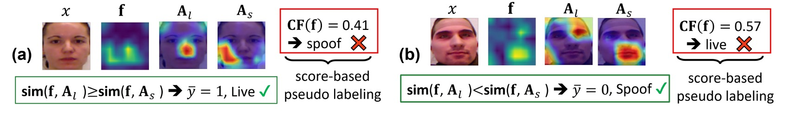
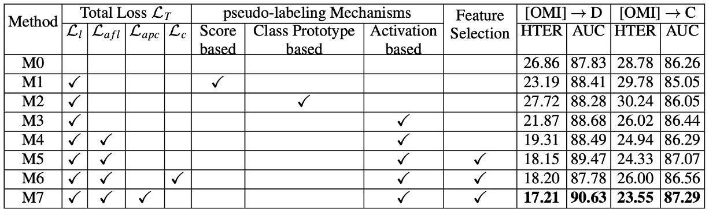

## Surviving the Wilderness

[**Test-Time Adaptation for Robust Face Anti-Spoofing**](https://papers.bmvc2023.org/0379.pdf)

---

You probably don't remember how you learned to distinguish a photo from a face.

Maybe it's the lighting, maybe the reflection, or maybe it's some subtle sense of incongruity.

But for a model, this is never simple. Especially when it has to make the decision on its own, without anyone teaching it.

## Defining the Problem

Face Anti-Spoofing (FAS) is a seemingly simple yet tricky problem.

We just need it to determine whether a face is real or fake, but this judgment breaks down under numerous environmental changes, attack types, and device variations.

To address the cross-environment issue, researchers have proposed many seemingly robust learning strategies.

- Domain Generalization (DG) says: **Let’s make the model more stable.**
- Domain Adaptation (DA) says: **Let’s let the model see new data before learning.**
- Even Source-Free DA (SFDA) says: **It’s fine, we don’t need old data, we can fine-tune.**

As long as you know the future application scenarios, these methods help the model adapt to future changes during the training phase.

But the world doesn’t follow the script.

When the model is already deployed, and attackers begin using unfamiliar methods to invade, or when the environment generates variables that the model has never adapted to, can that model—who we thought was trained—still have a second learning opportunity?

The starting point of this paper comes from such a scenario:

> **When the only opportunity for learning is at the moment of inference, how should the model react?**

This is not just a technical issue, but a late-coming memory battle.

We can't predict the attacker’s next move, but we can try to make the model relearn to see at the last moment.

## Solving the Problem

<div align="center">
<figure style={{"width": "90%"}}>

</figure>
</div>

The authors propose **3A-TTA**, a three-in-one solution, allowing the model to directly rely on the unannotated target data during the "real inference" phase, to make final adaptive adjustments at the last moment.

The entire architecture is divided into three main components:

1. **Activation-based Pseudo-Labeling**:

   With unannotated test data, how should the model learn? If we generate pseudo-labels based on scores, it’s easy to confuse real and fake faces due to their similar appearance.

   This part extracts more detailed feature location information through CAM (Class Activation Mapping), and uses cosine similarity to generate more trustworthy "pseudo-labels."

   ***

2. **Anti-Forgetting Feature Learning**:

   If the new batch consists of new types of attacks, the model might note them down but may also "forget" old knowledge.

   Therefore, high-confidence samples are "filtered" and their features stored in a memory bank. When updating, the model considers these features to reduce the risk of forgetting.

   ***

3. **Asymmetric Prototype Contrastive Learning**:

   New attack types may overlap with old attacks or real faces in feature space. How can the model still distinguish between fake and real faces when it hasn't seen the new attack?

   The authors use contrastive learning and apply local aggregation for "spoof" features (finding K spoof features close to attack samples) and global aggregation for "live" features (synthesizing all live features into a single prototype). This keeps local similarity between attacks and clearly distinguishes between real and fake faces.

   ***

In the authors' setup, every time the model receives a new batch of "unannotated" target data, it immediately performs:

(1) Pseudo-label generation → (2) Reliable sample filtering → (3) Contrastive learning update.

This process happens during the inference phase, with no additional annotations to rely on, and no need to repeatedly call old data.

3A-TTA allows the model to immediately correct its parameters with pseudo-labels and contrastive learning after encountering these new attack types, making subsequent judgments more accurate.

If you just want to understand the concept, then you’ve finished reading the paper here.

Next, let’s take a closer look at how each component works. If you're not interested, feel free to skip straight to the conclusion.

### Activation-based Pseudo-Labeling



The image above illustrates the operation of this mechanism, which solves the problem of "how to learn without annotations."

Consider an unannotated image $\mathbf{x}_j$. If we rely only on score-based predictions to determine whether it is real or fake, there is a high likelihood of misjudgment due to similar lighting or surface features.

To address this, the authors refer to past literature using Class Activation Map (CAM) to identify the most representative activation regions in the feature space for real and fake faces.

Next, the authors define cosine similarity $\text{sim}(\mathbf{f}, \mathbf{A})$:

$$
\text{sim}(\mathbf{f}, \mathbf{A}) = \frac{\mathbf{f} \cdot \mathbf{A}}{\|\mathbf{f}\|\|\mathbf{A}\|}.
$$

They then determine the pseudo-label $\bar{y}$ by comparing the activation map similarities of real and fake faces:

$$
\bar{y} =
\begin{cases}
1, & \text{if } \text{sim}(\mathbf{f}, \mathbf{A}_l) \ge \text{sim}(\mathbf{f}, \mathbf{A}_s), \\
0, & \text{otherwise}.
\end{cases}
$$

This allows the generation of more feasible pseudo-labels for each image.

Finally, they use the **liveness loss** to ensure the model continues to update during the testing phase:

```math
L_{l} = -\sum \Big[\bar{y}\log(CF(\mathbf{f})) + (1-\bar{y})\log\big(1 - CF(\mathbf{f})\big)\Big].
```

### Anti-Forgetting Feature Learning

Pseudo-labels alone are not enough because some batches might be "all live or all spoof," and could even mix in "unknown new attacks." If we simply update with these batches, the model may "only remember new fake face samples and forget the old knowledge."

To avoid this, the authors select the most reliable features in each batch update using a threshold mechanism and store them in a Memory Bank (MB).

Whenever a new batch arrives, the model considers the features in the MB and calculates the Anti-Forgetting Liveness Loss $L_{afl}$ to ensure that the model does not shift too much toward the new data but maintains old knowledge during each fine-tuning.

Specifically, for each sample $\mathbf{f}$ with pseudo-label $\bar{y}$, the following threshold is used to determine if it is reliable:

$$
\gamma =
\begin{cases}
1, & \text{if } (CF(\mathbf{f}) > \alpha \,\wedge\, m_{\text{sim}} \ge \beta)\;\text{or}\;(CF(\mathbf{f}) < 1-\alpha \,\wedge\, m_{\text{sim}} \le -\beta), \\
0, & \text{otherwise},
\end{cases}
$$

where $\alpha = 0.8, \beta = 0.2, m_{\text{sim}} = \text{sim}(\mathbf{f}, \mathbf{A}_l) - \text{sim}(\mathbf{f}, \mathbf{A}_s)$.

If $\gamma = 1$, the feature is written into the $MB$ (using FIFO for updates).

The resulting sample feature set is then considered during subsequent mini-batch updates, and the **Anti-Forgetting Liveness Loss** $L_{afl}$ is defined as:

```math
L_{afl} = -\sum \Big[\hat{y}\log\big(CF(\hat{\mathbf{f}})\big) + (1-\hat{y})\log\big(1 - CF(\hat{\mathbf{f}})\big)\Big].
```

This approach allows the model to learn both new batches and previous knowledge, maintaining decision stability.

### Asymmetric Prototype Contrastive Learning

However, as the attack patterns increase, even the "memory bank" may not capture all possible variations.

Thus, this phase aims to "increase the distance between live and spoof samples" while "appropriately aggregating commonalities within spoof samples" in the same feature space.

- **Local Aggregation (Local Spoof Prototype)**

  Suppose a spoof sample $\mathbf{f}_{s}^{a}$ is a new attack type.

  However, within the memory bank, there may be some "old attack" features that partially resemble it (e.g., both exhibiting strong reflections). Aggregating the K most similar spoof samples into a local spoof prototype enhances the model's ability to classify this new attack, as it can "leverage old knowledge to identify new knowledge."

- **Global Aggregation (Global Live Prototype)**

  On the other hand, real faces do not change drastically across domains (facial feature positions are similar, and skin tone differences are minor), so the authors aggregate all live features into a single "global" live prototype, emphasizing consistency among live faces.

This "asymmetric contrastive learning" helps the model maintain distance between real and fake faces, while also preserving subtle similarities between different spoof types, allowing for greater "attack adaptability."

Even with pseudo-label learning and anti-forgetting strategies, the model may still lack sufficient discriminative cues when facing **unknown attacks**. After incorporating positive and negative sample sets, the authors define the **Asymmetric Prototype Contrastive Loss** $L_{apc}$:

$$
L_{apc} =
-\log \frac{\exp\bigl(\text{sim}(\mathbf{f}_{s}^{a},\;\hat{\mathbf{f}}_{s}^{p})\bigr)}
{\sum_{j= \{\hat{\mathbf{f}}_{s}^{p}\cup \mathbf{N}_s\}}\exp\bigl(\text{sim}(\mathbf{f}_{s}^{a},\;\hat{\mathbf{f}}_{j})\bigr)}
-\log \frac{\exp\bigl(\text{sim}(\mathbf{f}_{l}^{a},\;\hat{\mathbf{f}}_{l}^{p})\bigr)}
{\sum_{i= \{\hat{\mathbf{f}}_{l}^{p}\cup \mathbf{N}_l\}}\exp\bigl(\text{sim}(\mathbf{f}_{l}^{a},\;\hat{\mathbf{f}}_{i})\bigr)}.
$$

Here, $\mathbf{N}_s$ and $\mathbf{N}_l$ represent the negative sample sets of spoof and live anchors, respectively.

Through this contrastive learning, the model can separate real and fake faces in the feature space while retaining subtle similarities between different spoof samples, enhancing its ability to adapt to unknown attacks.

### Total Loss Function

Finally, the authors consolidate the three loss components into:

$$
L_{T} = L_{l} + \lambda_{1}L_{afl} + \lambda_{2}L_{apc},
$$

with $\lambda_{1} = 0.5$ and $\lambda_{2} = 1.5$.

By integrating **pseudo-label learning (Liveness Loss)**, **anti-forgetting (Anti-Forgetting)**, and **contrastive differentiation (Prototype Contrast)**, the model no longer passively receives input but can quickly adjust in the final moments, maintaining high stability and adaptability in real-world unknown environments.

## Discussion

### Comparison with Other Methods


The authors compared 3A-TTA with other common Test-Time Adaptation (TTA) methods, such as Tent and OAP, across overall performance;

The experimental results are shown in the table above:

- **Tent** and other non-FAS-specific TTA techniques perform worse than the "No adaptation" scenario when facing real attack situations. This indicates that generic TTA solutions may not directly transfer to FAS.
- **OAP** uses only score-based pseudo-labeling, which shows limited improvement in most cases.
- **3A-TTA** achieves the best results across various evaluations, such as improving the average HTER by about 12.54% compared to OAP, and also increasing AUC by about 2.11%.

### Ablation Study



The authors dissected the three core modules (pseudo-label learning, Anti-Forgetting, Asymmetric Prototype Contrast) and compared the performance of various loss combinations.

Key findings are as follows:

- **Pseudo-labeling Mechanism**:

  - Score-based or Prototype-based methods show a significant gap in pseudo-label accuracy compared to the **Activation-based** method (the approach used in this paper).
  - Activations not only provide more localized and refined judgments but also capture more crucial regions for attack logic.

- **Anti-Forgetting Feature Learning**:

  - Whether using only $L_l$ or adding $L_{afl}$, significant performance improvements are observed.
  - As long as a viable memory mechanism is present, the model can balance both new and old knowledge without favoring the current batch.

- **Prototype Contrast vs. General Contrast**:

  - Using general contrastive learning ($L_c$) treats all attacks as a "homogeneous spoof class," thus neglecting important differences between new and old attacks.
  - **Asymmetric Prototype Contrast ($L_{apc}$)** effectively highlights subtle differences in attacks, giving a significant advantage when facing unseen attacks.

### Visualization and Analysis


Finally, the authors conducted a visual analysis of 3A-TTA's results and compared them with other methods, also contrasting with models that were not adapted.

1. **t-SNE Feature Distribution**:

   - In figure (a), the non-adapted model shows significant overlap between Live and Spoof features when encountering new domains or attacks.
   - Figure (b) confirms the benefits of 3A-TTA: Live and Spoof features are more distinctly separated, significantly improving the model's ability to distinguish between unknown attacks.

2. **Activation Maps**:

   - Compared to non-adapted cases (figures ① and ③), the activation maps brought by 3A-TTA (figures ② and ④) focus more on the true face regions.
   - For spoof faces, the model shows almost no significant response in its live feature activation, indicating that it has successfully filtered out spoof face interference and focused on the real face details.

## Conclusion

Face Anti-Spoofing is no longer just a simple classification task.

In the ever-evolving landscape of generative attacks and increasingly diverse data sources, FAS models need a key ability to survive:

> **The ability to self-correct their judgment criteria in unforeseen scenarios.**

The 3A-TTA method proposed in this paper is, to some extent, an attempt at such "self-correction."

From the results, this method outperforms previous approaches on the TTA-FAS benchmark and demonstrates that Test-Time Adaptation can indeed introduce new adaptability strategies for FAS tasks.

The life cycle of traditional models ends after training and online inference. However, the life cycle of TTA models begins at the moment of inference. This perspective also leads us to reconsider a key question:

> **If the field is the battleground, how should the model learn to fight back in the field?**

Perhaps, in the future, AI models should not only finish the test but also learn to revise their answers after submission.
