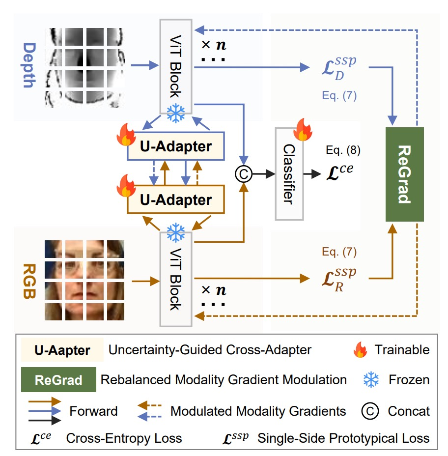
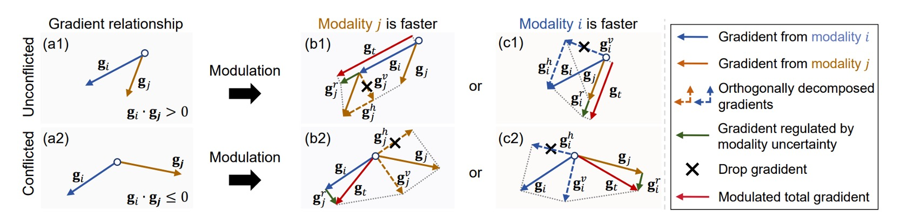
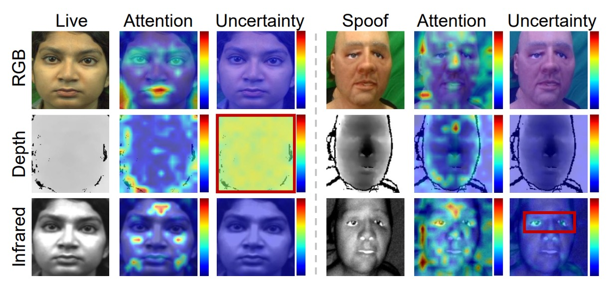

## Trust Management

[**Suppress and Rebalance: Towards Generalized Multi-Modal Face Anti-Spoofing**](https://arxiv.org/abs/2402.19298)

---

At the time this paper was published, the field of computer vision had already embraced multi-modal architectures.

However, the problem of FAS (Face Anti-Spoofing) still exists, and cross-domain generalization remains a challenge.

## Problem Definition

RGB models are fast and constructing datasets is relatively easy. Other modalities also provide valuable information, such as depth maps that reveal 3D structures and infrared that can sense temperature or material reflection, which are extremely useful for determining "whether this face is real or fake."

But why is multi-modality rarely used? Or when it is used, why does it often lead to worse generalization, making it almost impossible to find practical applications?

The authors pinpoint two key issues:

- **Modality Unreliability**

  A change in sensor or lighting conditions can drastically alter the domain. Particularly with infrared (IR) and depth, the information that should reinforce the model can instead mislead it.

  When you use cross-modal fusion to combine all the modalities, the result is mixed—sometimes helpful, other times detrimental, as they drag each other down.

- **Modality Imbalance**

  During training, the model automatically selects the "fastest learning modality," which is usually RGB.

  Information from other modalities does not get properly learned; it only appears useful on the surface, but the model hasn't learned it effectively. Once the target domain is encountered, RGB no longer works, and the slower modalities haven’t been properly trained either, causing the model to fail.

Thus, the difficulty in multi-modal FAS doesn’t just lie in "multi," but in the fact that these modalities are inherently unequal and unreliable.

Therefore, the authors propose:

> **We need to simultaneously address "unreliable signal sources" and train a "non-biased model."**

This is the core of the problem definition in this paper.

## Solution

<figure style={{"width": "60%"}}>

</figure>

To solve the problem of multi-modal FAS, the authors propose the **MMDG** (Multi-Modal Dynamic Gradient) framework, which emphasizes two main functionalities:

- **Suppress** (Suppress unreliable modalities): During cross-modal fusion, unreliable modalities are penalized to reduce their influence.
- **Rebalance** (Balance the learning speed of modalities): During training, gradients between modalities are adjusted to ensure that each modality can learn effectively.

Looking at the architecture diagram, each modality (RGB, depth, infrared) has its own ViT backbone, connected to its own U-Adapter for cross-modal fusion.

During training, only the U-Adapter is fine-tuned. Finally, the ReGrad module dynamically adjusts gradients to ensure that each modality learns effectively without one hindering another or accelerating too quickly.

### U-Adapter

As shown in the diagram above, the U-Adapter is the core module of this method, embedded after each ViT block, with only the Adapter being fine-tuned. Its task is:

1. Detect the "unreliable" tokens in each modality (using the Uncertainty Estimation Module, UEM);
2. During cross-modal fusion, reduce the influence of these unreliable tokens to prevent their information from contaminating other modalities.

:::tip
If you're unfamiliar with the concept of an Adapter, you can refer to our previous notes:

- [**[19.02] Adapter: Saving 96% of Parameters**](../../model-tuning/1902-adapter/index.md)
  :::

### Uncertainty Estimation Module

Referring to the diagram above (b), in order to identify unreliable regions, the authors introduce the Uncertainty Estimation Module:

- **Uncertainty Estimation Module (UEM)**.

This module uses Monte Carlo Dropout (MCD) techniques, performing multiple random samplings after each Multi-Head Self-Attention to estimate the uncertainty of each token.

Let $T = \{x^{u1}_R, x^{u2}_R, ..., x^{ut}_R\}$ represent the MCD sampling results, and the uncertainty estimation is:

$$
x^U_R = \text{Var}(T) \in \mathbb{R}^{B \times L \times 1}
$$

### Cross-Modal Fusion Mechanism

Referring to the diagram (c) above, the U-Adapter doesn't just perform fusion but **selectively fuses**.

It suppresses "suspicious tokens" from other modalities to prevent the spread of misleading information.

For example, in the case of the depth modality, the fusion process of its U-Adapter is as follows:

- The query comes from another modality (e.g., RGB) denoted as $x^3_R$,
- The key and value come from its own modality, $x^3_D$,
- The fusion process is adjusted based on the uncertainty from the RGB modality, $x^U_R$.

The formula for this is:

$$
A(x^U_R, x^3_R, x^3_D) =
\text{CDC} \left(
\text{Softmax} \left(
\frac{Q(x^3_R)K(x^3_D)^\top \odot U(x^U_R)}{\sqrt{n_k}}
\right) V(x^3_D)
\right)
$$

Where:

- $Q(\cdot)$, $K(\cdot)$, $V(\cdot)$ are the query, key, and value linear projections.
- $U(x^U_R) = \exp(-r_e \cdot x^U_R \cdot \mathbf{I})$ is the uncertainty penalty weight, where tokens with higher uncertainty have less influence.
- $\odot$ denotes the Hadamard product (element-wise multiplication).
- $\text{CDC}(\cdot)$ stands for Central Difference Convolution, used to enhance local differences between tokens, compensating for the lack of neighborhood sensitivity in ViT.

The final output for each modality, $x^{\text{out}}_m$, combines two cross-modal fusions and the residual connections from the ViT block:

$$
\begin{aligned}
x^{\text{out}}_R &= A(x^U_D, x^3_D, x^3_R) + A(x^U_I, x^3_I, x^3_R) + x^3_R + x^4_R \\
x^{\text{out}}_D &= A(x^U_R, x^3_R, x^3_D) + x^3_D + x^4_D \\
x^{\text{out}}_I &= A(x^U_R, x^3_R, x^3_I) + x^3_I + x^4_I
\end{aligned}
$$

Where:

- $x^3_m$: Output of the LN in the ViT block for modality $m$,
- $x^4_m$: Output of the MLP in the ViT block for modality $m$,
- $x^U_m$: Uncertainty estimation for modality $m$.

:::info
To avoid "mutual misguidance" between modalities, the authors "do not allow depth and IR to fuse with each other" but only allow them to receive information from RGB.
:::

### ReGrad

The goal of ReGrad is simple: **Make slower modalities learn more, and faster modalities learn less.**

In practice, the gradients of each modality may not be consistent and could even conflict with each other.

So the authors implemented this:

> **Based on the speed of each modality and whether the gradients conflict, we decide which part of the gradient to retain, which to suppress, and apply uncertainty penalties to control the influence.**

Here are the handling methods for four different situations, corresponding to (b1), (b2), (c1), (c2) in Figure 4:

$$
\text{ReGrad}_2(\mathbf{g}_i, \mathbf{g}_j) =
\begin{cases}
\mathbf{g}_i + \dfrac{\mathbf{g}_i \cdot \mathbf{g}_j}{\|\mathbf{g}_i\|^2} \mathbf{g}_i \cdot U(u_j), & \text{(b1) non-conflict, } j \text{ is faster} \\
\mathbf{g}_i + \left( \mathbf{g}_j - \dfrac{\mathbf{g}_i \cdot \mathbf{g}_j}{\|\mathbf{g}_i\|^2} \mathbf{g}_i \right) \cdot U(u_j), & \text{(b2) conflict, } j \text{ is faster} \\
\dfrac{\mathbf{g}_i \cdot \mathbf{g}_j}{\|\mathbf{g}_j\|^2} \mathbf{g}_j \cdot U(u_i) + \mathbf{g}_j, & \text{(c1) non-conflict, } i \text{ is faster} \\
\left( \mathbf{g}_i - \dfrac{\mathbf{g}_i \cdot \mathbf{g}_j}{\|\mathbf{g}_j\|^2} \mathbf{g}_j \right) \cdot U(u_i) + \mathbf{g}_j, & \text{(c2) conflict, } i \text{ is faster}
\end{cases}
$$

Where:

- $\mathbf{g}_i$, $\mathbf{g}_j$: Backpropagation gradient vectors for modalities $i$ and $j$,
- $u_i$, $u_j$: Uncertainty for each modality (batch-level),
- $U(u)$: Uncertainty penalty function, defined as $U(u) = \exp(-r \cdot u)$, which suppresses the gradient influence of unstable modalities.

---

While the above formulas may seem complex, they are actually easy to understand:

- If you are the slower modality (i.e., $i$), you will receive extra help from the gradient of modality $j$.
- If you are the faster modality (i.e., $j$), you won't receive help and will actually be suppressed.
- If the two gradients are conflicting, we first perform **vector projection** to retain only the harmless parts.
- Finally, the uncertainty penalty factor $U(u)$ is applied to suppress gradients from modalities that "learn quickly but are unstable."

### SSP Loss

In addition to gradient adjustment, MMDG also introduces a loss that helps with the cohesion of each modality:

- **Single-Side Prototypical Loss (SSP)**.

First, the prototype vector for each domain $d$ of modality $m$ is defined as:

$$
\mathbf{p}_d^m = \frac{1}{N_d} \sum_{\mathbf{c}_m \in d} \mathbf{c}_m
$$

Next, the SSP Loss is defined as:

$$
L_{\text{ssp}}^m(\mathbf{c}_m, \mathbf{p}_{\text{dgt}}^m) =
- \log \frac{
\exp\left( -\text{ED}(\mathbf{c}_m, \mathbf{p}_{\text{dgt}}^m) \right)
}{
\sum_{d \in D} \exp\left( -\text{ED}(\mathbf{c}_m, \mathbf{p}_d^m) \right)
}
$$

This loss helps each sample to cluster towards the prototype of its domain, enhancing the discriminability within each modality.

Overall, the complete loss function is:

$$
L_{\text{final}} = L_{\text{ce}} + \sum_{m \in \{R, D, I\}} \lambda \cdot L_{\text{ssp}}^m
$$

Where $L_{\text{ce}}$ is the cross-entropy loss for the classification task, and $\lambda$ is used to adjust the impact of the SSP loss.

## Discussion

### Comparison with Other Methods

The horizontal axis in the table represents the test datasets (treated as unseen domains), and the vertical axis represents different methods, including:

- Traditional Domain Generalization methods (SSDG, SSAN, IADG...),
- Multi-modal methods (CMFL, MM-CDCN),
- Flexible-modal methods that can handle missing modalities (ViT+AMA, VP-FAS).

The test methods train on three datasets, testing each by leaving one out each time.

The experimental results show that MMDG achieves **the best performance** in all combinations, outperforming the multi-modal baseline and achieving at least **6% better HTER / AUC** than the SoTA Flexible-modal method, VP-FAS.

This is a clear signal:

> **More modalities do not necessarily mean better results. Only a fusion strategy that "knows which information to trust and which to suppress" allows the model to survive in the unseen world.**

### Ablation Studies

<figure style={{"width": "80%"}}>

</figure>

To demonstrate the contribution of each design component, the authors conducted several ablation experiments.

The results show that regardless of the method used (DG or multi-modal), replacing the backbone with ViT + U-Adapter improves performance:

- **The baseline models using ViT (such as SSDG, IADG)** saw an immediate performance boost when the U-Adapter was inserted.
- **Even without any fancy methods, just using ViT + U-Adapter + Cross Entropy** outperformed many older DG methods.

When ReGrad was added, the overall performance reached SoTA levels, indicating that:

1. **U-Adapter itself has "generalizability"**, able to apply to any ViT architecture without being picky.
2. **It doesn't just fuse, but selectively ignores unreliable information**, making the feature space cleaner and more stable.

Finally, the authors also tested two variants of ReGrad (conflicting and non-conflicting cases), and the results showed that these versions performed worse than the fully activated version, indicating:

- **Not suppressing when needed causes imbalance in learning**; intervening when unnecessary disrupts the learning process.
- The true key to generalization is not hard balancing, but dynamically assessing the overall learning progress.

### Effect of Uncertainty Mechanism

<figure style={{"width": "70%"}}>

</figure>

The authors isolated the uncertainty components in the two modules (U-Adapter and ReGrad) to test:

- **Does the uncertainty estimation mechanism help?**

The results are clear:

- If the uncertainty control in U-Adapter is removed, performance decreases.
- If the uncertainty weight in ReGrad is removed, performance also drops.
- **When both are used, HTER and AUC improve by over 3%.**

This shows that uncertainty estimation indeed helps the model identify unstable sources of information and prevent them from contaminating other modalities, as well as suppressing the influence of unstable modalities.

As shown in the figure below, MMDG actively focuses on uncertain regions in the IR and Depth modalities. Although these areas carry a risk of misjudgment, since the model "estimates" and suppresses them, they do not mislead the overall decision-making process.

<figure style={{"width": "90%"}}>

</figure>

## Conclusion

People might think the future of multi-modal systems will be an "all-inclusive" enhanced model.

Not enough RGB? Add IR; IR not enough? Add Depth; eventually, add a CLIP-style fusion! It seems like the more modalities, the safer.

But this paper tells us: When domain shift occurs, whether the model can correctly judge "which information is trustworthy and which should be questioned" is the key to its ability to generalize.

The value of MMDG lies in its integration of the concept of "uncertainty" into the model, and further designing a judgment and action process based on gradients and fusion mechanisms to determine "who to trust and who to suppress."
