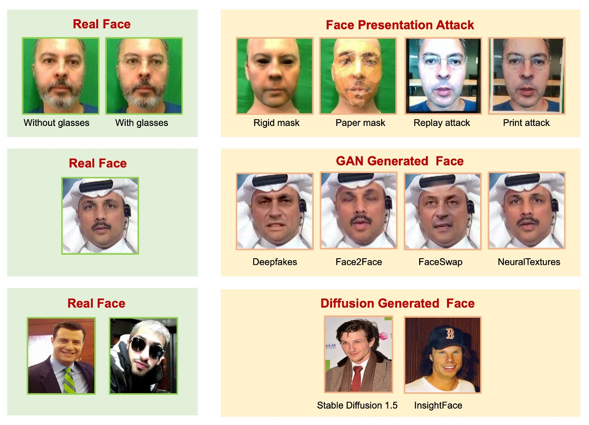
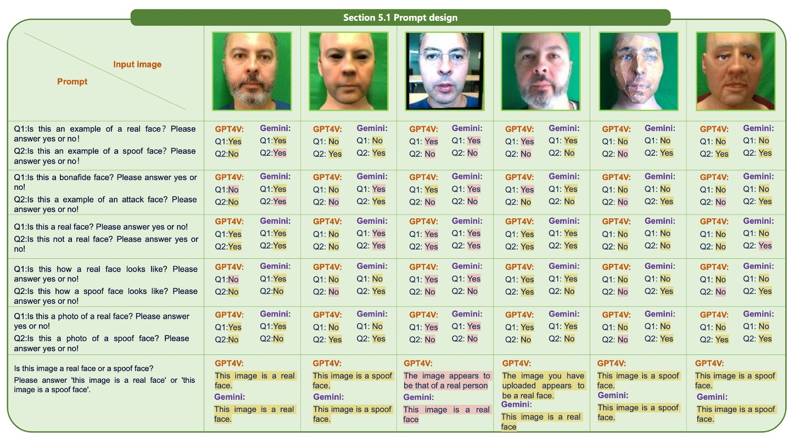

## Tell me, why?

[**SHIELD: An Evaluation Benchmark for Face Spoofing and Forgery Detection with Multimodal Large Language Models**](https://arxiv.org/abs/2402.04178)

---

When I opened this paper, I found it was 100 pages long, and my hand accidentally shook for a moment.

Upon a closer look, I realized that most of it was describing the dataset… Oh, never mind.

## Defining the Problem

The tasks of Face Anti-Spoofing (FAS) and Face Forgery Detection (FFD) essentially ask:

> "Is the face in front of you real or a trap?"

The former concerns whether you're sneaking in photos, videos, or 3D masks into the system (physical attack);
The latter cares whether you're using GANs or Diffusion to generate a fake face (digital attack).

---

Early FAS methods used handcrafted features to distinguish real from fake faces, and later, with the rise of deep learning, CNNs paired with large datasets became the mainstream approach (such as meta-learning and few-shot methods).

Then, Vision Transformers (ViTs) started handling spatial patches and time series, adding physiological signals (such as blinking and periodicity) to improve recognition.

For FFD, most research framed it as a binary classification task, using CNNs to extract features and classify. This worked well within in-domain datasets but failed when switching to new datasets.

To capture forgery traces more precisely, some started using frequency-domain analysis, noise features, and local spatial learning techniques to strengthen the approach.

However, the methods of forgery in the real world evolve much faster than expected, and relying solely on fixed features can't keep up.

Finally, we reached the era of multimodal large models (MLLMs). Can MLLMs save the day?

Well-known models such as GPT-4V, Gemini, BLIP-2, and others have recently been widely applied to image-text alignment, caption generation, and reasoning tasks. But:

- Can they "understand" whether a face is real or fake?
- Can they point out unnatural parts in an image and explain why?
- Can they detect forgeries they've never seen before without training?

Currently, **no one has systematically verified this.**

Clearly, this is a problem!

So, the authors of this paper decided to tackle it and designed a new benchmark to evaluate the performance of MLLMs on FAS and FFD tasks.

In this task, we are not just asking "Is this face real?" but going a step further:

> **"Does this face look real? Tell me why."**

## Solving the Problem

The objective of this paper is simple, yet it's something no one has done before:

- **Bring multimodal large models (MLLMs) like GPT-4V and Gemini into the picture and ask if they can identify whether a face has been forged, and also explain "why they make that judgment."**

But to measure this accurately, it's not enough to just show a picture and ask whether the face is real.

The authors designed a complete testing framework, including data selection, task design, question formats, and how to guide the model’s thinking process. This is not prompt engineering, which is too narrow—it’s more like a task-level protocol.

Regarding the data, there are three types of test images as shown below:

<figure style={{"width": "90%"}}>

</figure>

- Row 1 contains common physical attack samples in FAS tasks, such as printed paper, screen replays, rigid and paper masks, all with corresponding RGB, depth, and infrared modalities.
- Row 2 features classic forgery styles used in FFD tasks, like Deepfakes, Face2Face, FaceSwap, and Nulltextures.
- Row 3 consists of highly realistic synthetic images generated by AIGC systems like Stable Diffusion and InsightFace.

These images do not have a native real face because they are entirely generated, so there is no one-to-one correspondence, making them harder to judge.

To enable the model to systematically express its understanding, the authors designed the evaluation tasks in two formats: true/false and multiple-choice.

The task structure is shown below:

<figure style={{"width": "90%"}}>

</figure>

For example, in the true/false format, the model is asked "Is this a real human face?" In the multiple-choice format, the model has to pick the most likely real human face from four options. These questions can be tested under various contextual conditions, including zero-shot, few-shot, and whether Chain-of-Thought (COT) is used to have the model explain its reasoning before answering.

This design is already more detailed than traditional model evaluations, but the authors took it a step further. They proposed a reasoning mechanism called MA-COT (Multi-Attribute Chain of Thought) to prevent the model from simply "freely describing the image." Instead, the model is required to analyze based on a predefined set of attributes.

Specifically, the model must not only determine "what this is" but also describe attributes such as "whether the facial contour is symmetrical," "whether there are paper edges," "whether the lighting is natural," and "whether the eye, ear, and head movements are coherent," and then draw conclusions based on these intermediary descriptions.

These attributes vary depending on the task type, with a complete classification shown in the table below:

<figure style={{"width": "70%"}}>

</figure>

Here’s a more intuitive illustration of the reasoning process:

<figure style={{"width": "90%"}}>

</figure>

The way it works is that the visual signals in the image are first converted into a set of attribute descriptions. These descriptions, along with the task questions, are then fed into the MLLM, which combines them to generate its reasoning process. You can think of this as giving the model "something to think about" rather than relying solely on memory to perform pattern matching.

Why take this roundabout approach?

Because the authors are not trying to train the model to learn these attributes but to test whether it "can understand."

When the data is new, the style is different, and the attacks are unseen, can these models still make judgments based on the descriptions without fine-tuning? That’s the real challenge.

Therefore, the authors are not comparing models based on accuracy but asking whether the model can truly understand what it means when a face looks "a little off" and whether it can articulate that. This is not just a benchmark, but an experiment in testing the understanding ability of MLLMs through a "linguistic task specification."

## Discussion

To verify whether the overall evaluation process of SHIELD effectively captures the model's understanding ability, the authors selected two publicly available, representative multimodal large language models: **GPT-4V** and **Gemini**, and tested them via API calls. Both models possess visual input capabilities and are designed to handle general image-text tasks, making them the most representative comparison pair in this type of research.

In the experimental design, the authors combined the previously mentioned task design (true/false and multiple-choice), testing conditions (zero-shot, few-shot), and prompting strategies (standard response and COT) to create a comprehensive test matrix, systematically observing the performance differences between the two models under different scenarios. This testing method not only confirms whether the models can "answer correctly" but also reveals their reasoning stability, error tendencies, and differences in response structure.

For result labeling, to make it easier to compare the responses of different models, the authors visually marked the responses as follows:

- **Correct answers are highlighted in yellow**
- **Incorrect answers are marked in red**
- **Unanswered or notable responses are marked in blue**

This labeling method allows readers to quickly identify which questions posed challenges to the models, in which scenarios the models tended to refuse to answer, and where their reasoning deviated from human intuition.

### FAS Test Results

The Face Anti-Spoofing (FAS) task was the first experiment conducted in SHIELD. This part mainly tested RGB-based unimodal data and multimodal data consisting of RGB, IR, and depth maps, observing GPT-4V and Gemini’s performance in identifying physical attacks.

Before starting the model tests, the authors conducted an exploration of prompt design. The findings are shown in the figure below:

<figure style={{"width": "90%"}}>

</figure>

The experiments revealed that different phrasing of the questions had a significant impact on the model’s judgment results.

For example:

- "Is this image a real face?" leads the model to respond with a simple "Yes" or "No," which is not an ideal phrasing.

Instead, the model should be prompted to output a complete sentence such as "This image is a real face" or "This image is a spoof face" to help the model better understand the question.

Additionally, asking about truth or falsity individually is less accurate than combining the question into a binary choice. This may seem like a minor detail, but it reflects the high sensitivity of current MLLMs to contextual details and underscores that prompt crafting is not just a detail but a prerequisite for the model’s performance.

Next, let’s look at the unimodal tests:

- **True/False Question**

  :::tip
  The following sections in the paper are accompanied by many images for illustration. We will only show a few examples here; readers can refer to the original paper for more.
  :::

  The first unimodal test is a true/false question, testing the model’s ability to determine the authenticity of a single face image.

  GPT-4V and Gemini both demonstrated basic recognition ability in a zero-shot context, correctly identifying some real face samples. However, significant differences began to appear in scenes involving paper masks or rigid masks, as shown in the figure below:

    

    <figure style={{"width": "90%"}}>
    
    </figure>
    

  After introducing Chain-of-Thought (COT), GPT-4V made simple descriptions of the image before making judgments. In contrast, Gemini showed less variation and was less likely to perform reasoning.

  Replay and print attacks remain two main failure points. Due to their high quality and natural textures, these attacks are easily confused by the models, leading them to mistakenly classify them as real faces. This problem persists even before and after introducing few-shot learning.

  Under one-shot conditions, adding a known real face as a context prompt significantly improved the model's accuracy. Prior knowledge indeed helps the model understand the task space more accurately. However, using a single sample as a prompt still has limitations, especially when the test sample is highly similar to the reference image but belongs to a different category, potentially causing misleading results.

  Additionally, the effect of COT varied between the two models. GPT-4V’s responses became more complete with guidance, while Gemini’s responses remained largely unchanged, indicating lower adherence to reasoning instructions.

- **Multiple-Choice Question**

  The next test involved multiple images. The task was to select the real human face from four to five images or identify the type of attack. This type of question requires higher overall comparison and feature analysis ability from the model.

  In a zero-shot scenario, GPT-4V was able to recognize some spoof features, but it still struggled with replay and print images, occasionally misidentifying fake images as more realistic ones, as shown in the figure below:

    

    <figure style={{"width": "90%"}}>
    
    </figure>
    

  Gemini performed decently in simple Q&A situations, but when COT was introduced, prompting it to describe details led to confusion. Further analysis showed that while GPT-4V could detect spoof features, it lacked context clues to accurately link these features to specific attack types, resulting in poor judgment.

  After introducing one-shot learning, recognition of replay and print attacks improved significantly. GPT-4V demonstrated better analogical ability, able to link previous features to attack samples logically. In contrast, Gemini's responses were still fragmented, and its reasoning process was incoherent.

Next, let’s consider the multimodal tests (RGB + Depth + IR).

For multimodal tests, adding multimodal information made it easier for both models to identify real faces in zero-shot contexts. However, GPT-4V frequently triggered safety mechanisms under these inputs, refusing to respond. This may be due to the increased complexity of the input data, highlighting that MLLMs’ safety strategies for handling high-dimensional information are not fully matured.

In the multiple-choice scenario with multiple images and multimodal inputs, both models showed improved performance, with GPT-4V’s responses being closer to human expectations under COT guidance. However, when the samples became too numerous and the signals too dense, Gemini tended to experience logical confusion, even outputting irrelevant answers in some cases.

These tests demonstrate that when the prompt design is appropriate, MLLMs are capable of handling structured judgments, but they are still not sufficiently stable.

### FFD Test Results

While FAS focuses on recognizing physical attacks such as photos, screens, or masks, Face Forgery Detection (FFD) deals with a completely different challenge.

This attack form has become increasingly difficult to detect with the progress of AIGC, especially when the entire image is reconstructed using synthetic methods rather than just pasting a face. This increases the model’s requirement for judgment ability.

The testing logic for this part is similar to the previous FAS tests, but it targets more detailed digital forgeries. The models were asked to answer whether the images were real faces using a yes/no format, and their reactions to different generation techniques were observed.

The results clearly show that several forgery methods still leave visual traces, such as local blurring, unnatural symmetry, or abnormal light reflections. In most cases, the models could correctly identify these issues. However, when the generated samples were highly realistic, the models struggled to make a judgment, and in some cases, refused to answer, indicating that the task complexity had exceeded their safety thresholds.

:::tip
The paper also includes unimodal and multimodal tests, paired with true/false and multiple-choice questions, but these details are omitted here for brevity.
:::

## Unified Task Test Results

The previous sections evaluated GPT-4V and Gemini on FAS and Face Forgery Detection tasks. This section further combines these two tasks into a unified detection task, simulating a more realistic application scenario:

> **The model is no longer told "which type" of attack it is facing but needs to simultaneously identify both physical attacks (e.g., photos or masks) and digital forgeries (e.g., GAN or Diffusion generated faces) in the same set of inputs.**

Overall, the gap between GPT-4V and Gemini in this unified task became more pronounced. GPT-4V provided reasonable and complete responses in most situations, with stable judgment processes, whether in simple Q&A or when Chain-of-Thought (COT) reasoning was introduced.

In contrast, Gemini’s responses were generally shorter and lacked detailed descriptions, showing a lack of grasp on the required response style and semantic context. In some cases, Gemini could only provide one-sentence responses, with little to no reasoning process to follow.

To handle the situation of multiple images being input simultaneously, the authors concatenated the images into a single image to bypass Gemini’s input restrictions. However, this method revealed the model’s difficulty in understanding image structure: Gemini struggled to recognize image boundaries and could not properly distinguish the context of different sub-images, leading to confusion between physical attacks and synthetic attack samples, making it harder to identify real faces.

Finally, Diffusion-generated faces remain the most challenging type. Both Gemini and GPT-4V exhibited noticeable confusion when processing such samples, especially when the fake faces had near-perfect skin textures and natural light distribution. The models struggled to differentiate them based purely on surface image characteristics. This indicates that while MLLMs possess some ability in semantic judgment and reasoning, they still lack sufficient detailed recognition and explanation capabilities when confronted with highly realistic visual samples.

However, GPT-4V did show good understanding flexibility on some samples. Without any contextual assistance, GPT-4V accurately identified real face samples, and its descriptions under COT were more reasonable, demonstrating its ability to organize reliable judgment cues in the presence of ambiguous information. For some samples that were difficult to classify binary, GPT-4V, while unable to provide a definitive answer, was able to list multiple possible options and offer reasoning, showcasing its ability for "fuzzy judgment" and "candidate ranking."

## MA-COT Experimental Results

In the previous sections, we have seen the basic performance of GPT-4V and Gemini on various face attack detection tasks.

The core design advocated by the authors here is MA-COT (Multi-Attribute Chain of Thought), a framework for detailed reasoning in multimodal tasks, aimed at making the model’s judgment process not a black-box "whole image description" but a step-by-step attribute breakdown that is interpretable and observable.

From the experimental results, MA-COT has proven to be significantly helpful for GPT-4V.

Many samples that failed to be judged under zero-shot or standard COT conditions, when guided with attribute breakdown, allowed GPT-4V to make more logically coherent inferences based on indicators such as texture clarity, edge consistency, and gloss reflection, ultimately arriving at the correct answer. This not only improved accuracy but also enhanced the interpretability of the responses.

In contrast, Gemini did not show significant improvement after introducing MA-COT. Its responses remained brief and inconsistent, with many attribute analyses failing to support the final judgment, which may be due to its lack of phased reasoning capabilities.

## Conclusion

This paper attempts to solve a simple yet critical problem:

> **Can current multimodal large language models understand "whether this face has a problem"?**

The method proposed by SHIELD is not just a benchmark but more of a test language framework that helps models "say why." Its contribution is not in finding the most accurate model but in providing a way to understand how the model "thinks." If we ever aim to use MLLMs for face security tasks, this could be the most important starting point.
