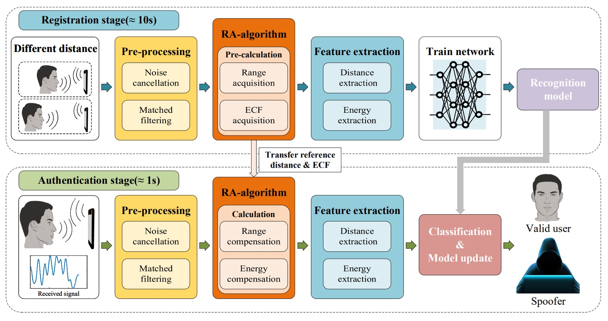
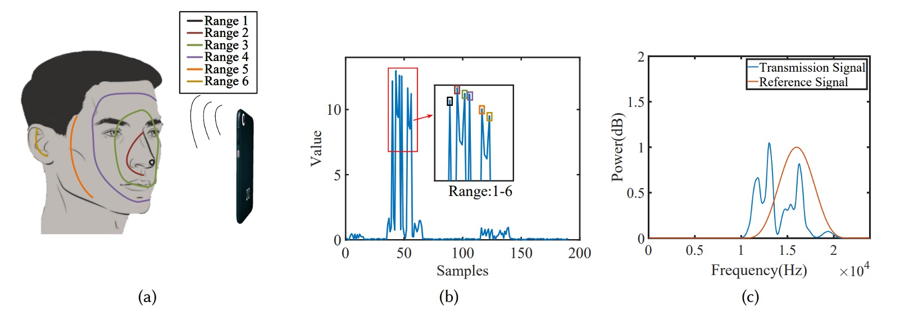
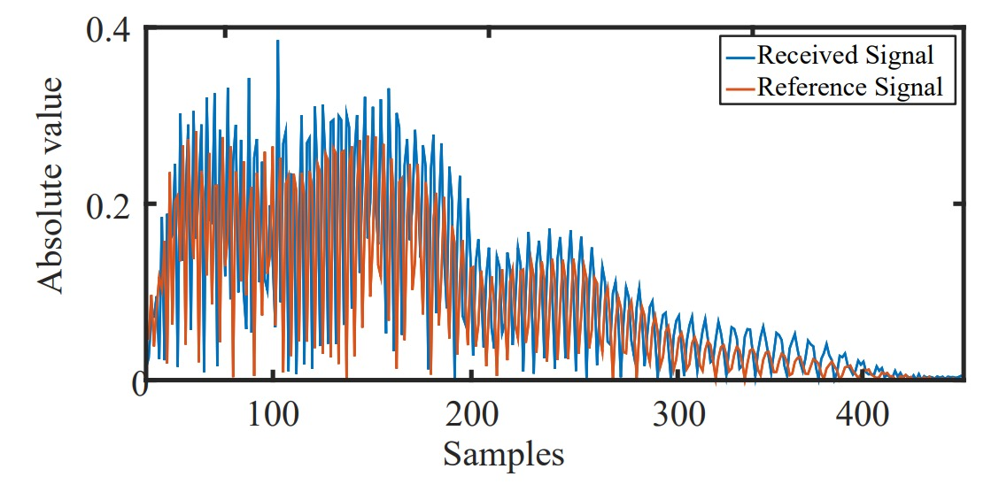
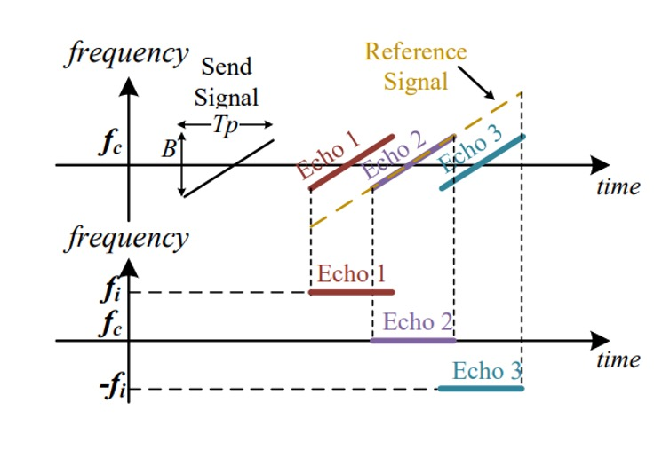
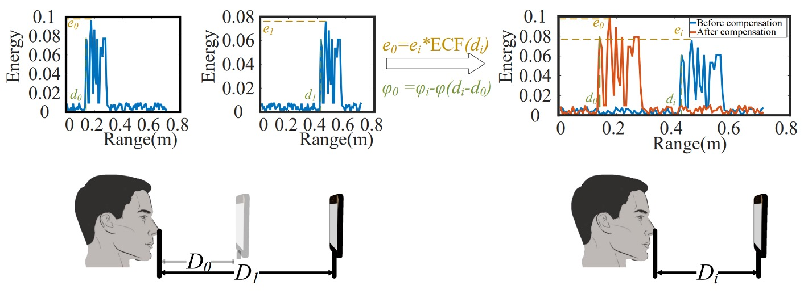
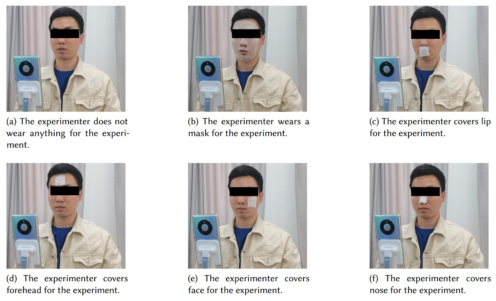
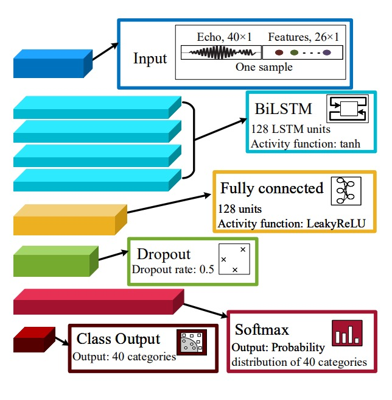
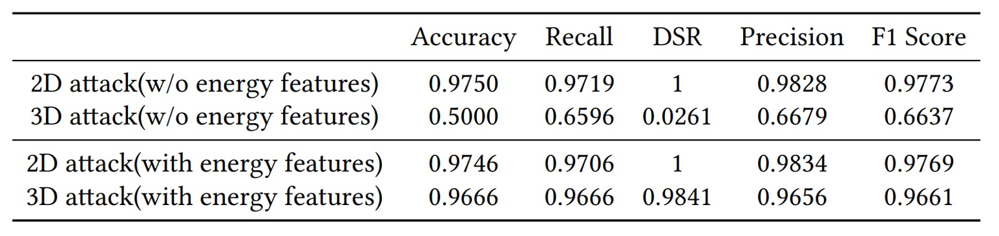
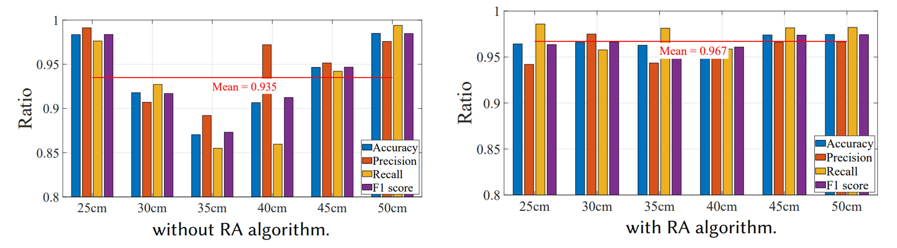

## The Boundary of Waves

[**AFace: Range-flexible Anti-spoofing Face Authentication via Smartphone Acoustic Sensing**](https://www.researchgate.net/profile/Chao-Liu-80/publication/378372686_AFace_Range-flexible_Anti-spoofing_Face_Authentication_via_Smartphone_Acoustic_Sensing/links/65d6faf2adc608480adf3229/AFace-Range-flexible-Anti-spoofing-Face-Authentication-via-Smartphone-Acoustic-Sensing.pdf)

---

Opening this paper, we found it has 33 pages!

We couldn’t help but feel a headache coming.

## Defining the Problem

Over the past decade, smartphone authentication systems have evolved from PINs, fingerprints, iris scans to face recognition.

These methods build progressively upon one another, shifting from memory-based to biometric-based, from contact sensing to contactless sensing, each step aiming for higher convenience and security.

Yet this technological evolution seems to have hit certain boundaries.

- **PIN codes** are easy to forget and vulnerable to shoulder surfing;
- **Fingerprint recognition** has uniqueness but can be replicated with silicone molds;
- **Iris recognition** is accurate but costly, limiting its widespread adoption;
- **Face recognition** is widely deployed but fragile against basic photo and video attacks.

Even with further integration of 3D sensing modules, such as dot projectors and infrared structured light, there remain three major risks:

1. **Cost and size constraints**: These hardware components often increase the phone’s BOM by over 5%, hindering mass adoption;
2. **Resource and latency bottlenecks**: High-performance models often require over 4 seconds for inference, which is unacceptable for users;
3. **Forgery and privacy risks**: Visual information can not only be replicated but is also prone to leakage, making defense difficult.

Moreover, mainstream anti-spoofing research continues to advance—from texture features to deep learning—but it remains trapped by a core challenge:

> **When attackers hold a 3D printed model, existing visual systems still cannot identify the material nature.**

Therefore, some have begun to explore signal-based approaches.

Acoustic waves, WiFi, RFID, and RF signals have started to appear in authentication literature. These non-visual methods attempt to penetrate appearance, reading user gait, breathing, heartbeat, and reflection characteristics. However, these approaches face their own limitations:

- Gait features are overly influenced by clothing and posture;
- WiFi and RFID are accurate but rely on additional devices and tags;
- Ear canal recognition requires uncomfortable in-ear equipment.

Even recent acoustic-based face recognition achieved with smartphone microphones and speakers mainly focus on shape reconstruction, still vulnerable to imitation attacks using 3D fake face models. Once the shape matches, echoes are identical and recognition fails.

So the question arises:

> **If echoes can be mimicked, is there any feature that attackers simply cannot forge?**

## Solution

<figure style={{"width": "90%"}}>

</figure>

AFace is an acoustic-based authentication system.

It relies on a pair of built-in smartphone components—speaker and microphone—to perform face recognition.

The overall process includes four steps:

1. **Acoustic Wave Emission**: The user positions the phone at two different distances, allowing the device to actively emit acoustic waves and receive reflected echoes, thereby establishing a mapping between “energy and distance.”
2. **Signal Preprocessing**: The echo signals undergo background reflection cancellation and match filtering to filter out direct-path signals and interference from non-face objects, extracting information related to the distance dimension.
3. **Compensation Model**: To handle variations in the user-to-phone distance, the system builds a Range Adaptive (RA) model and computes an Energy Compensation Function (ECF) using the dual-distance data mentioned above, enabling all subsequent measurements to be normalized to a common reference baseline.
4. **Feature Extraction and Model Training**: After signal compensation, key features are extracted, and a deep learning model is trained for classification to serve as the basis for subsequent matching.

### Acoustic Wave Emission

Sound must be both emitted and recognized; energy must be focused yet not disturb the user.

To ensure the signal is both “solvable” and “practical,” the authors designed several aspects:

1. **Signal Design**: AFace adopts **FMCW (Frequency Modulated Continuous Wave)** as the signal foundation, with the following advantages:

   1. **High Frequency Separation**: The 10–22 kHz band avoids most ambient noise (< 8 kHz), allowing high-pass filtering to remove environmental interference;
   2. **Sufficient Resolution**: A 12 kHz bandwidth corresponds to 1.4 cm distance resolution, capable of discerning subtle differences across facial regions;
   3. **Smartphone Compatibility**: Most smartphones support frequencies below 24 kHz; considering attenuation, 22 kHz is a reasonable upper limit;
   4. **Non-intrusive Sound**: Signal duration of 10 ms plus 40 ms intervals make the user “barely aware” of the sound;
   5. **Energy Control**: Using a Hanning window focuses energy near 16 kHz, avoiding spectral leakage.

   The mathematical form of this signal is:

   $$
   s(t, \hat{t}_m) = \text{rect}\left( \frac{\hat{t}}{T_p} \right) \cdot e^{j 2\pi \left( f_c t + \frac{1}{2} k \hat{t}^2 \right)}
   $$

   No need to fully grasp the formula; the components mean:

   - $\text{rect}(\cdot)$: restricts the signal duration to 10 ms ($T_p = 10$ ms);
   - $f_c$: carrier frequency (centered at 16 kHz);
   - $k$: chirp rate;
   - $\hat{t} = t - t_m$: fast time used to locate the time window for each segment;
   - $t_m = mT$: slow time, representing the emission time point of each chirp ($m = 0, 1, 2, ...$).

   With this design, the signal physically propagates, reflects, and converges into a set of digital features suitable for comparison.

2. **Iso-depth Model**: After sound emission, the microphone actually receives a mixture of signals. To analyze these, the authors classify them into four categories:

   1. Environmental noise;
   2. Direct path signals (from speaker directly to microphone);
   3. Reflections from the face (the target);
   4. Reflections from other objects (to be removed).

   Accordingly, AFace establishes a multipath reception model:

   $$
   s_r(t, \hat{t}_m) = \sum_i \text{rect}\left( \frac{\hat{t} - \tau_i}{T_p} \right) \cdot e^{j 2\pi \left( f_c (t - \tau_i) + \frac{1}{2} k (\hat{t} - \tau_i)^2 \right)}
   $$

   where

   - $\tau_i$: delay of the $i$-th path;
   - modeled as a delayed version of the emitted signal.

   To simplify processing, the overall signal is further decomposed into:

   $$
   s_r(t, \hat{t}_m) = \sum_i s_i + \sum_j s_j
   $$

   - $s_i$: target reflections (face);
   - $s_j$: non-face reflections (to be removed).

---

To associate acoustic waves with a “face,” the core technique AFace uses is match filtering, which convolves the received echo signal with a reference signal $s_{\text{ref}}$, finding the temporal overlap region to form an energy peak:

$$
E = \sum_i s_i \odot s_{\text{ref}}
$$

- $\odot$: convolution operation;
- The energy peak indicates the alignment between echo and reference signal, i.e., the distribution of reflection distances.

Because regions with close distances cause overlapping peaks and energy superposition, this “superposition effect” serves as the basis for differentiating facial region reflections.

To equip the model with “facial awareness,” AFace divides the face into six iso-depth zones, as shown below:

<figure style={{"width": "90%"}}>

</figure>

- **Nearest: Nose tip (small reflection area, low energy);**
- **Front ring: eye sockets, forehead, lips (large reflection area, facing phone, highest energy);**
- **Side cheek: oblique reflections, limited energy;**
- **Farthest: ears (far distance, complex structure, lowest energy).**

These physical conditions translate into model peak energy distributions as in figure (b). The authors even validated model accuracy by occluding regions in experiments, proving that acoustic reflections truly correspond to facial material and shape.

### Signal Preprocessing

Every signal tells a story, but first, we need to silence the noise.

While signal design is crucial, what actually reaches the receiver is a distorted, delayed, and noisy acoustic wave. We cannot assume that the emitted signal from the phone is exactly what we receive, because hardware imperfections and uncontrollable environments turn the "echo" into raw data that must be cleaned and calibrated.

AFace’s preprocessing module consists of four steps:

1. **Acquiring the True Reference Signal**

   Smartphone speakers and microphones have different gains across frequency bands, causing emitted and received signals to be non-ideal.

   To address this, the authors propose a practical “hardware removal” approach:

   - Collect background signals once in an empty environment;
   - Then place a $1 \text{ cm} \times 1 \text{ cm}$ paperboard at 15 cm distance to collect a single reflection;
   - Taking the difference approximates the pure single echo from the paperboard, serving as the reference signal $s_{\text{ref}}$.

   The significance is that we no longer assume knowledge of the emitted signal but instead infer the true acoustic signal through measurement.

---

2. **Aligning Signal Start Point**

   

   <figure style={{"width": "70%"}}>
   
   </figure>
   

   Since the phone’s speaker and microphone cannot operate simultaneously, the received signal cannot be directly timestamped to the “true emission time.”

   To solve this, the authors leverage the phone’s internal “solid transmission” from speaker to microphone:

   - Sound travels only a few centimeters inside the phone (speaker → microphone) with about 0.04 ms delay;
   - Solid transmission suffers low loss and strong signal strength;
   - Using cross-correlation, the direct path signal arrival can be precisely detected as the time reference.

   This introduces about 1–2 samples of error (\~0.7 cm), but it does not affect relative facial distances (differences remain accurate) and can be compensated by the subsequent RA algorithm.

---

3. **Noise Removal**

   Noise comes in two types:

   - **Environmental noise**: mostly below 10 kHz and removable by high-pass filtering;
   - **Signal noise**: e.g., direct-path interference or multipath reflection noise, requiring subtraction using the reference signal.

   Direct subtraction cannot completely remove noise since echo strength attenuates with reflector distance, making waveforms similar but amplitudes different.

   Therefore, the authors introduce a scaling factor $\varepsilon$ to minimize the difference error:

   $$
   \min_\varepsilon \left\| S_r - \varepsilon \cdot S_c \right\|^2
   $$

   where

   - $S_r$: received signal;
   - $S_c$: previously recorded clean reference signal;
   - $\varepsilon$: scaling factor solved by least squares.

   Experiments show that over 200 continuous frames, $\varepsilon$ varies stably to compensate for reflection attenuation.

---

4. **Match Filtering**

   

   <figure style={{"width": "70%"}}>
   
   </figure>
   

   Once aligned and noise-reduced, we obtain an approximate echo signal $s_i$ corresponding to the face.

   Next, match filtering is performed by convolving $s_i$ with the reference signal:

   $$
   y_t = s_i \odot s_{\text{ref}} = \frac{\sin(\pi k T_p t)}{\pi k t} \cdot \text{rect}\left(\frac{t}{2T_p}\right) \cdot e^{j2\pi f_c t}
   $$

   This result resembles a sinc function, representing:

   - Reflections at different distances produce energy peaks at different time points;
   - Each peak corresponds to a "depth echo" of different facial regions;
   - Via Fourier analysis, each echo segment maps to frequency:

   $$
   f_i = -k \cdot \frac{2\Delta R}{c}
   $$

   where $\Delta R$ is the distance difference to the reference signal and $c$ is the speed of sound.

In other words, through match filtering and Fourier transform, a blurred acoustic signal is restored into a high-resolution “distance spectrum,” representing the depth contour of the face structure.

### Range-Adaptive (RA) Compensation Algorithm

Next, we need to convert the varying distances into stable features for reliable face recognition.

Acoustic echoes are functions of distance.

However, in real scenarios, users won’t always hold the phone at exactly 15 cm or 20 cm; the face-to-phone distance fluctuates slightly during each authentication. These distance variations cause signal phase shifts and energy changes, affecting model stability.

To address this, AFace designs a **Range Adaptive (RA) compensation mechanism** that maps every input back to a stable distance and energy baseline.

This mechanism contains two submodules:

1. **Range Compensation**: compensates for phase changes in echo signals;
2. **Energy Compensation**: corrects the relationship between reflection energy and distance.

During enrollment, users register at two distances (e.g., $D_0$, $D_1$), recording their nearest echo points ($d_0$, $d_1$) and corresponding maximum energies ($e_0$, $e_1$) as compensation baselines.

During authentication, if face distance is $d_i$, the echo signal phase is:

$$
\varphi_1 = 2\pi f_c \left(t - \frac{2d_i}{c}\right) + \pi k \left(t - \frac{2d_i}{c}\right)^2
$$

The ideal reference phase at $d_0$ is:

$$
\varphi_0 = 2\pi f_c \left(t - \frac{2d_0}{c}\right) + \pi k \left(t - \frac{2d_0}{c}\right)^2
$$

Their difference:

$$
\Delta \varphi = -\frac{4\pi f_c}{c}(d_i - d_0) - \frac{4\pi k t}{c}(d_i - d_0) + \frac{4\pi k}{c^2}(d_i^2 - d_0^2)
$$

This phase difference not only shifts time but also causes peak shifts after Fourier transform, impacting distance estimation and feature extraction.

To align signals, AFace compensates all signals as:

$$
s' = \frac{e^{-j\varphi_1}}{e^{-j\Delta \varphi}} = e^{-j(\varphi_1 - \Delta \varphi)}
$$

That is, restoring the signal phase to the “standard distance,” as if all faces were compared at the same position.

Besides phase offset, echo energy changes with distance and material.

AFace finds this is not merely an error source but a valuable identification feature.

They designed experiments:

- Move different materials (paperboard, wood, iron) steadily toward the phone;
- Play signals for 10 seconds each, recording peak energies at various distances;
- Filter noise and background reflections, perform match filtering to get reflection intensities;
- Extract maximum energies per distance and plot energy-distance curves;
- Fit linear regression between energy and distance, yielding high correlation ($R^2 = 0.9536$, RMSE = 0.03198).

Operationally shown below:

<figure style={{"width": "90%"}}>

</figure>

Since energy and distance correlate linearly, and different materials have distinct energy curves,

AFace builds an Energy Compensation Function (ECF):

$$
\text{ECF}(d_i) = \frac{e_1 - e_0}{d_1 - d_0}(d_i - d_0) + e_0
$$

This predicts the theoretical energy at distance $d_i$. The measured energy $e_i$ is compensated as:

$$
e'_i = e_i \cdot \frac{e_0}{\text{ECF}(d_i)}
$$

This compensation doesn’t forcibly normalize $e_i$ to $e_0$ but preserves its characteristics. In other words:

> **If an attacker uses a 3D fake face, its material and energy distribution differ; even at the same distance, the compensated energy will differ noticeably from a real user’s.**

This “difference-preserving compensation” corrects for distance influence while amplifying material differences, making acoustic energy an unforgeable “proof of face.”

### Feature Extraction

Once signals are aligned, compensated, and filtered, AFace extracts information to distinguish one person from another.

The authors design features in two categories:

- Distance Features
- Energy Features

Starting with distance features:

Building on the Iso-depth model, AFace divides the face into six major zones, choosing five for depth analysis:

- Nose tip
- Nose root
- Lips & eye socket
- Cheek to forehead
- Side of face
- Ear is set as the farthest zone with depth baseline zero

Features designed are:

1. **Five absolute distances**: estimated from peak positions after match filtering;
2. **Ten relative distance differences**: depth differences between any two zones, e.g., nose tip to nose root representing “nose bridge height”;
3. **Five approximate area measures**: when adjacent zones have close depths, match filtering produces **overlapping peaks** whose widths indicate reflector sizes;

   - Specifically, peak widths at 50% energy level (similar to Full Width Half Maximum);
   - Especially measured for nose root and lips–eye socket zones.

---

Next, energy features:

Different materials reflect sound differently. The authors conducted masking experiments shown below:

<figure style={{"width": "90%"}}>

</figure>

By covering different face zones, they observed energy changes. Material differences (skin vs model) caused significant variation in absorption and reflection.

Meaning: even if a 3D model fools shape, its energy signature differs.

The final selected energy features are:

1. **Maximum energy**: overall reflection strength reflecting skin and area info;
2. **Average peak energy**: average reflection across face;
3. **Variance**: indicates how concentrated or dispersed facial depth distribution is;
4. **Peak factor**: strength of high reflection points;
5. **Average frequency**: main frequency distribution of echoes;
6. **Energy density**: concentration of energy within regions.

These collectively reflect material traits, complementing shape-based features.

AFace uses a total of 26-dimensional features, fusing shape, material, and reflection behavior into the backend classification model’s core input.

### Classifier Architecture

<figure style={{"width": "60%"}}>

</figure>

After completing feature design and extraction, AFace requires a classifier to convert these features into a “recognize you” decision.

The authors split this into two parts:

1. Using BiLSTM to capture temporal logic and zonal features within the signals;
2. Employing iCaRL to address the “forgetting problem” when updating users and expanding classes.

In AFace, the input features are not mere tabular data but complex features including “signal slices,” “distance relations,” and “energy profiles.” To handle this, AFace uses a **four-layer BiLSTM structure**:

- **40-dimensional signal slices (time series):**

  - Extracted from denoised and distance-compensated echo residuals;
  - Aligned with nose tip as start point, taking 40 samples ≈ 14 cm range;

- **20-dimensional distance features:**

  - 5 absolute depths (nose tip, nose root, lips & eye socket, cheek to forehead, side face);
  - 10 relative depth differences;
  - 5 peak widths after match filtering (reflecting area overlap and shape);

- **6-dimensional energy features:**

  - Reflecting material properties, distribution, and reflection strength (see previous chapter).

BiLSTM parameters:

- **Layers:** four layers total;
- **Activation:** `tanh` (hidden states range in $[-1,1]$);
- **Gating function:** `sigmoid`, controlling information retention;
- **Weight initialization:** Xavier initialization (optimized for `tanh`);
- **Forget gate:** initialized near 1 (unit-forget-gate), enhancing long sequence learning.

Fully connected (dense) and classifier layers:

- **Dense layer:** 128 units with `LeakyReLU` activation;
- **Dropout layer:** rate = 0.5, to prevent overfitting;
- **Softmax layer:** outputs probabilities for 40 classes;
- **Classifier:** maps softmax probabilities to identity classes.

---

Another part is the iCaRL incremental learning strategy.

To handle long-term challenges of “adding users” and “face changes,” AFace adopts iCaRL (Incremental Classifier and Representation Learning), turning the neural network into a dynamic, non-forgetting structure.

Incremental learning has two scenarios:

- **Class Increment:**

  - When new users register, features are extracted from their echo data to generate new training samples;
  - A new fully connected classification node is added to support the new class;
  - Existing BiLSTM and FC layers are frozen to preserve learned knowledge without retraining;
  - Only the new layer is fine-tuned to speed training and stabilize output.

- **Data Increment:**

  - When a user repeatedly passes auxiliary verification (e.g., PIN input), indicating possible long-term face changes;
  - Each “acoustic verification fail but fallback success” stores a new sample;
  - Upon collecting ≥ 5 samples, a “data increment” fine-tuning process triggers;
  - Model architecture remains fixed; fine-tuning uses low learning rate for adaptation and memory update.

This incremental learning avoids “catastrophic forgetting” common in traditional models when encountering new data, and spares the high computational cost of full retraining.

The design goal is for AFace to continuously observe and update user memories, conceptualizing the classifier as an adaptive relationship rather than a fixed model.

## Discussion

The paper contains numerous experimental tables that we won’t list exhaustively here; interested readers can consult the original publication.

Below, we highlight several key aspects to evaluate the method’s performance.

### Different Speaker and Microphone Combinations

<figure style={{"width": "60%"}}>

</figure>

Results show the best combination is the **top speaker + top microphone**.

Using bottom speakers or microphones results in echoes mostly coming from the user’s chest area, which is heavily influenced by clothing material. Even small changes (like changing a jacket) significantly degrade recognition performance.

Hardware design should prioritize top speaker-microphone placement to reduce irrelevant reflections and focus on facial signals.

### 2D vs. 3D Attacks

<figure style={{"width": "90%"}}>

</figure>

Experiments demonstrate that AFace can effectively defend against both 2D and 3D attacks. The key reason is that acoustic verification captures both depth and material properties—flat images provide no genuine echoes.

Without energy features, defense success against 3D fake faces is only 5%; adding energy features raises success rates above 98%. Even when shape matches perfectly, differences in material absorption and reflectivity remain detectable by AFace.

### Importance of the RA Algorithm

<figure style={{"width": "90%"}}>

</figure>

To verify RA’s effectiveness, the authors had users register at 25 cm and 50 cm, then tested at distances of 25, 30, 35, 40, 45, and 50 cm in single-user mode multiple times.

Without RA, accuracy is only high (>96%) at registered distances (25, 50 cm), dropping to about 90% elsewhere. With RA enabled, accuracy stays above 95% across all distances, averaging 96.7%. RA effectively corrects phase and energy shifts, making “distance” no longer a major obstacle to user experience.

### Long-Term Use and Facial Changes

<figure style={{"width": "90%"}}>

</figure>

The authors evaluated iCaRL incremental learning over two months, observing user facial changes and system accuracy. Users were divided into two groups: one with iCaRL enabled, the other without.

Over time, changes like aging, hairstyle variation, and wearing glasses impacted accuracy. Without incremental learning, accuracy dropped noticeably; with iCaRL, the system updated itself automatically, maintaining high stability between 95% and 98%.

## Conclusion

Since 2019, acoustic signals have gradually been introduced into the FAS domain, offering a distinct path from image-based recognition.

However, these methods commonly suffer many limitations, the most critical being:

> **Acoustic signals alone cannot solve the 3D mask problem!**

Masks and real faces produce nearly indistinguishable echoes acoustically.

In AFace, by incorporating the concept of material, acoustic echoes become a composite function of **distance + material**, finally making acoustic-based FAS feasible.

AFace not only improves 3D attack resistance but also expands real-world applicability through range compensation (RA) and energy modeling (ECF). It is among the few acoustic verification systems fully implemented on commercial smartphones and augmented with incremental learning to handle long-term variation.

This does not mean the problem is fully solved, but at least we now know:

**Acoustic signals can stand alone as a reliable biometric clue.**
