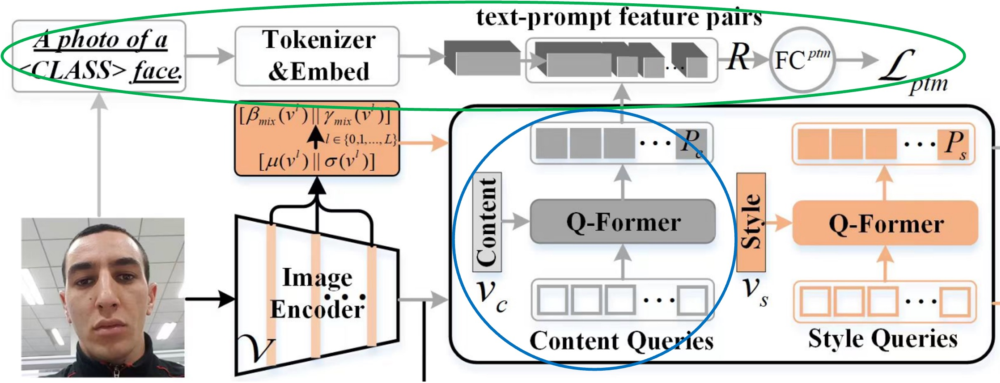
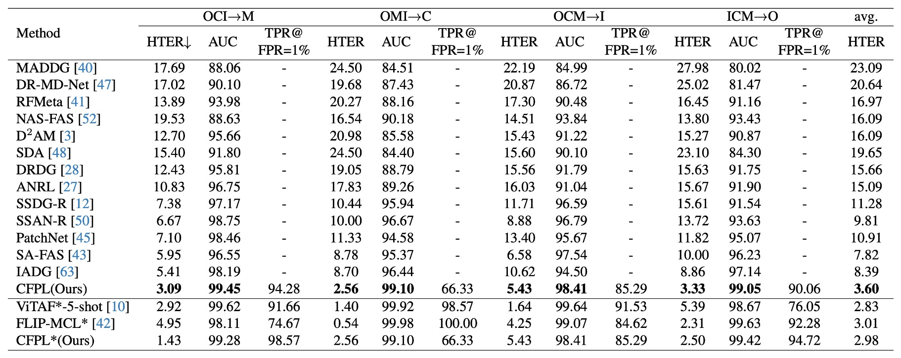
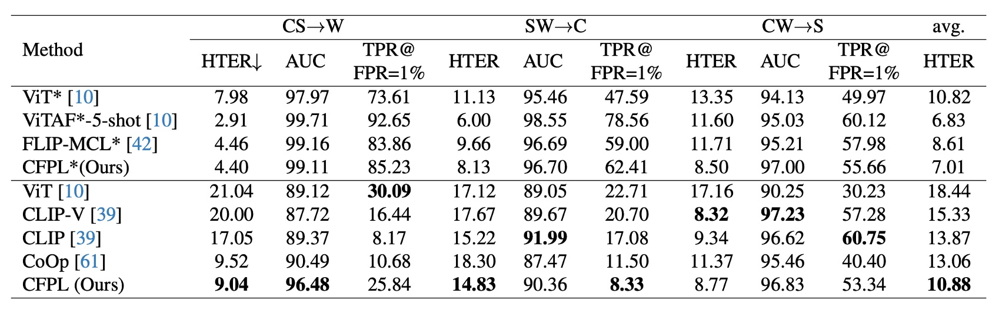
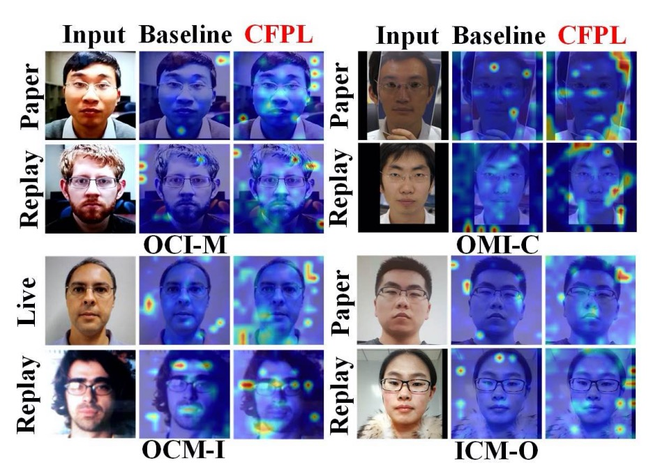

# [24.03] CFPL-FAS

## Class-Free Prompt Learning

[**CFPL-FAS: Class-Free Prompt Learning for Generalizable Face Anti-spoofing**](https://arxiv.org/abs/2403.14333)

---

This paper discusses a complex framework, but we can focus on three major keywords from the title to break it down:

1. **Class-Free**
2. **Prompt Learning**
3. **Face Anti-Spoofing (FAS)**

By focusing on these three aspects, the paper becomes easier to understand.

Face Anti-Spoofing (FAS) is a critical defense mechanism in facial recognition systems, designed to prevent attackers from fooling the system using photos, videos, or other spoofing methods. With the focus on FAS, let's first explore some past approaches in the field.

## Problem Definition

In earlier research, distinguishing real faces from fake ones was done by designing specific features such as texture, spectral information, and motion cues. However, these handcrafted features were limited in scope. This led researchers to move toward deep learning models like Convolutional Neural Networks (CNNs) to extract more advanced features of spoofed faces.

But as the saying goes, "As defenses evolve, so do attacks." Attackers began using high-quality images and videos to trick deep learning-based FAS systems.

To counter unknown types of attacks, the most popular recent strategy has been **Domain Generalization**, which aims to reduce the model's overfitting to the training data, allowing it to generalize better on unseen data.

With the rise of large language models (LLMs), multimodal training has also been applied to FAS, making it harder for attackers to spoof these systems using a variety of data types.

---

With this background in mind, let's dive into **Prompt Learning** as it applies to the problem.

Prompt learning gained popularity because training an LLM from scratch is expensive and impractical for most people. Instead, prompts are fed to pre-trained LLMs to generate useful features, which are then used to guide the training of our own models.

Though this idea isn’t new, it gained traction after CLIP, followed by further research like **BLIP**, which applied this concept to unified vision-language tasks.

- [**[22.01] BLIP: Bootstrapping Language-Image Pre-training for Unified Vision-Language Understanding and Generation**](https://arxiv.org/abs/2201.12086)

Returning to this paper, the authors aimed to apply **Prompt Learning** in the **FAS** domain. However, the limited number of classes and the fact that pre-trained models aren’t specifically designed for FAS meant that even using prompt learning wouldn’t necessarily yield meaningful features, let alone help with generalization.

Thus, the problem was clear: the authors wanted to use prompt learning for FAS, without relying on specific class labels, while still achieving generalization.

Now, let’s explore the solution.

## Solution

### Model Architecture

The above image shows the overall model architecture. However, looking at this without breaking it down is overwhelming. Let's break it into components.

### Prompts Generation

FAS features are often hidden in the image and aren’t immediately apparent.

:::tip
If you’re new to this topic, here’s a quick primer:

Common FAS attacks include **Replay Attacks**, where an attacker uses a photo or video of a real face to impersonate someone. The model may need to identify screen reflections or moiré patterns to detect this.

Another attack is the **Print Attack**, where a printed photo of a face is used. Here, the model might focus on texture cues such as paper patterns.

Real facial features are strong and obvious, but these FAS-specific features are subtle and harder to detect.
:::

To capture these subtle features, the authors designed two sets of query tokens:

1. **Content Q-Former**: A transformer decoder module that queries the "content" features of FAS images.
2. **Style Q-Former**: Another transformer decoder module that queries the "style" features of FAS images.

This part of the architecture corresponds to the diagram below:

The query tokens are randomly initialized, with 16 tokens per set, and experiments showed that 16 tokens are sufficient.

The target features come from FAS images, extracted via CLIP's image encoder. However, instead of directly using the features from the image encoder, the authors take features from **each layer** of the encoder, calculate the mean and standard deviation, and use these to form style features $\boldsymbol{v}_{s}$:

$$
\boldsymbol{v}_{s} = \frac{\sum_{l=1}^{L}\boldsymbol{v}^{l}_{s}}{L}, \quad \boldsymbol{v}^{l}_{s} = \left[\mu(\boldsymbol{v}^{l}) \,||\, \sigma(\boldsymbol{v}^{l})\right], \quad \boldsymbol{v}_{s} \in \mathbb{R}^{1 \times 2d}
$$

Here, $L$ is the number of layers in the image encoder, and $\left[\cdot || \cdot\right]$ indicates concatenation along the embedding dimension.

The content features $\boldsymbol{v}_{c}$ are obtained directly from the image encoder's output, normalized as follows:

$$
\boldsymbol{v}_{c} = \frac{\boldsymbol{v}^{L} - \mu(\boldsymbol{v}^{L})}{\sigma(\boldsymbol{v}^{L})}, \quad \boldsymbol{v}_{c} \in \mathbb{R}^{n \times d}
$$

Once the target features are defined, **Content Q-Former** queries the content features $\boldsymbol{v}_{c}$, and **Style Q-Former** queries the style features $\boldsymbol{v}_{s}$, yielding two sets of features.

:::tip
**Wait, why do we call these "text" features when they come from an image encoder?**

Remember, CLIP is a model designed to align image and text features, so whether the input is from the image or text branch, the output can be interpreted as a mix of "text" and "image" features.
:::

### Prompt Optimization

This section addresses the optimization of prompt features (the blue and green parts in the diagram).

The prompt features generated from the previous step cannot be directly used, as CLIP lacks domain-specific knowledge for FAS. To address this, the authors devised a **binary classification task** to help the **Content Q-Former** (CQF) understand FAS at a higher level.

The task involves predicting whether a prompt feature pair matches a particular class or not. For instance, the authors use the sentence **"a photo of a [CLASS] face"**, where `[CLASS]` could be either "real" or "fake." The text is tokenized and embedded using CLIP's text encoder, producing text features.

To create positive and negative feature pairs, the authors introduced a **Prompt Feature Bank** inspired by **ALBEF** to store prompt features, from which positive and negative pairs are sampled for training. Hard Negative Mining is used to boost training efficiency.

- [**[21.07] ALBEF: Pursuing the Pure Path**](../../multimodality/2107-albef/index.md)

After generating positive and negative pairs, they are passed through a fully connected layer, producing a logit, which is optimized using Cross Entropy Loss:

$$
\boldsymbol{S} = \texttt{Embed}(\texttt{Tokenizer}(\boldsymbol{T})), \quad \boldsymbol{S} \in \mathbb{R}^{B \times 77 \times d}
$$

$$
\boldsymbol{S} = \texttt{Mean\&Expand}(\boldsymbol{S}), \quad \boldsymbol{S} \in \mathbb{R}^{B \times N \times d}
$$

$$
\boldsymbol{R}_{p} = \left[\boldsymbol{P} \,||\, \boldsymbol{S}\right]_{\texttt{2}}, \quad \boldsymbol{R}_{p} \in \mathbb{R}^{B \times N \times 2d}
$$

$$
\mathcal{L}_{ptm} = \sum_{i=1}^{3B} \mathcal{H}\left(\boldsymbol{y}^{ptm}_{i}, \texttt{Mean}(\texttt{FC}^{ptm}(\boldsymbol{R}_{i}))\right)
$$

This optimizes the model for text supervision by predicting whether a query embedding matches or mismatches its pair.

---

During training, three different $\boldsymbol{R}$ matrices are involved: $\boldsymbol{R}_{p}$ (positive pairs), $\boldsymbol{R}^{prompt}_{n}$ (negative pairs), and $\boldsymbol{R}^{text}_{n}$ (negative text samples).

Here's a diagram to clarify the positive and negative pair matching process:

### Class-Free Prompt Learning

Finally, let’s dive into the **Class-Free Prompt** aspect.

This part is actually simpler now that we’ve built up the prompt features and optimization mechanisms.

In traditional FAS models, we classify samples into categories like **Real**, **Print**, **Replay**, and **Deepfake**. However, the authors argue that this design limits generalization because it only works well for those specific classes. For unknown classes, performance suffers.

Instead, they opted for a classification approach with only two classes: **Real** and **Fake**. Anything not real is classified as "Fake" and the model is left to internally deduce the specific type of fake.

This reduces the need for human-designed categories, letting the model learn on its own.

---

The red-highlighted section is the **Class-Free Prompt** module.

The CQF and SQF features are fed into CLIP's text encoder to generate text features. These features are concatenated, passed through a fully connected layer, and then combined with CLIP’s image encoder features to compute a final prediction logit. This logit is optimized using Cross Entropy Loss.

The **Prompt Modulation** module is represented by the following formula:

$$
\boldsymbol{w} = \delta (\texttt{g}_{e}(\boldsymbol{t}, \mathbf{W})) = \delta (\mathbf{W}_{2}\sigma_{\textrm{relu}}(\mathbf{W}_{1}\boldsymbol{t})),
$$

$$
\mathcal{L}_{cls} = \sum_{i=1}^{B} \mathcal{H}(\boldsymbol{y}^{cls}_{i}, \texttt{FC}^{cls}(\boldsymbol{\tilde{v}}_{i})), \quad \boldsymbol{\tilde{v}} \in \mathbb{R}^{B \times d}
$$

### Datasets, Protocols, and Evaluation Metrics

The authors follow two established protocols to evaluate their model’s generalization ability.

- **Protocol 1**: Using four standard benchmarks: MSU-MFSD (M), CASIA-FASD (C), Idiap Replay-Attack (I), and OULU-NPU (O).
- **Protocol 2**: Using RGB samples from CASIA-SURF (S), CASIA-SURF CeFA (C), and WMCA (W), which have a richer variety of attack types and environments.

In both protocols, each dataset is treated as a domain, and the **leave-one-out** approach is used to test generalization. Three metrics are applied:

1. **HTER** (Half Total Error Rate): Average of False Rejection Rate (FRR) and False Acceptance Rate (FAR).
2. **AUC** (Area Under Curve): Measures theoretical performance.
3. **TPR at FPR=1%**: Calculates the true positive rate at a fixed 1% false positive rate, useful for setting thresholds in real-world scenarios.

### Implementation Details

- **Query Setup**: Both content and style queries have a length of 16, with a dimension of 512 per query. CQF and SQF are set to a depth of 1.
- **Style Prompt Diversification**: Activated with a 50% probability during training but not during testing.
- **Training Configuration**: Batch size is 12, optimizer is Adam, weight decay is 0.05, with a minimum learning rate of 1e-6. Image size is adjusted to 224x224, with random cropping and horizontal flipping for augmentation. Training consists of 500 iterations.

## Discussion

### Experimental Results

**Protocol 1**: Compared to state-of-the-art methods, CFPL achieved the best performance on all test datasets.

For instance, CFPL’s HTER on MSU-MFSD (M) is 3.09% (vs. 5.41%), on CASIA-FASD (C) it’s 2.56% (vs. 8.70%), on Replay-Attack (I) it’s 5.43% (vs. 10.62%), and on OULU-NPU (O) it’s 3.33% (vs. 8.86%).

The average HTER of 3.60% significantly outperforms the previous best of 7.82%.

---

**Protocol 2**: CFPL also outperformed several baseline methods on WMCA (W) and CASIA-SURF CeFA (C).

On CASIA-SURF (S), CFPL performs slightly worse than CLIP-V in HTER (8.77% vs. 8.32%), AUC (96.83% vs. 97.23%), and TPR@FPR=1% (53.34% vs. 57.28%).

### Ablation Studies

1. **Effectiveness of Each Component**

   

   - **Baseline**: This is the model without any CFPL components. The introduction of CQF and SQF significantly improves generalization (HTER -0.67%, AUC +1.32%, TPR@FPR=1% +7.88%).
   - Adding **text supervision** further optimizes the model: HTER 7.50%, AUC 96.39%, and TPR@FPR=1% 54.78%.
   - Introducing **style prompt diversification** improves performance again: HTER -0.42%, AUC +0.4%, TPR@FPR=1% +2.83%.
   - Removing the gating function leads to a noticeable drop in performance.

2. **Impact of CQF and SQF Structures**

   

   - Simple bottleneck structures are insufficient for generalizing across different domains in FAS tasks. Adding CQF and SQF shows a significant performance boost, reducing HTER by 1.68% and 1.96%.
   - The combination of CQF and SQF yields the best results, with HTER 3.33%, AUC 99.05%, and TPR@FPR=1% 90.06%.

3. **Impact of Query Length and Q-Former Depth**

   

   - The authors experimented with query length ([8, 16, 32, 64]) and Q-Former depth ([1, 4, 8, 12]).
   - Key findings:
     1. A query length of 16 yielded the best results.
     2. The depth of Q-Former had a minimal impact on performance.

   Therefore, a query length of 16 and Q-Former depth of 1 are recommended.

### Visual Analysis

Using attention maps, the authors compared the **Baseline** model with **CFPL**. The attention maps highlight CFPL’s superiority in correctly identifying spoofed images.

For example, in one experiment, the **Baseline** misclassified a real face, focusing on the background, while **CFPL** correctly focused on the face-background boundary.

For **Replay Attacks**, the **Baseline** missed reflection cues on the screen, while **CFPL** successfully detected them.

## Conclusion

After reading this paper, we can see that the author's design approach is quite unique.

In this model architecture, the CLIP part does not participate in training, but we still want to take advantage of CLIP’s benefits.

Therefore, the entire design starts from CLIP’s Image Encoder, with the goal of using the Image Encoder to produce features that can classify FAS (Face Anti-Spoofing).

But CLIP doesn't know what FAS is, right? So, what should we do?

The author introduced the CQF and SQF designs, which we can think of as "plugins" to store FAS features. The function of these plugins is to "project" the FAS features into CLIP's Text Encoder feature space.

CLIP’s Text Encoder is already pre-trained, so what we can do is "combine." We can assume that CLIP’s Text Encoder has already learned a lot of knowledge, and certain N tokens such as "Monitor," "Face," "OOO," "XXX," etc., can aggregate to form features for FAS's "Replay." Or, certain M tokens like "Paper," "Texture," "OOO," "XXX," etc., can aggregate to form features for FAS's "Print."

The specific tokens used are not important. What’s important is letting the model figure out which group of tokens can help capture FAS features. That's sufficient.

Once the features are found, we perform a dot product operation between these features and CLIP's Image Encoder features. This essentially attaches the FAS features to CLIP’s features, allowing classification to take place.

Interesting, isn’t it?
