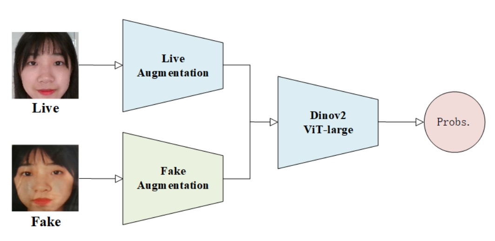
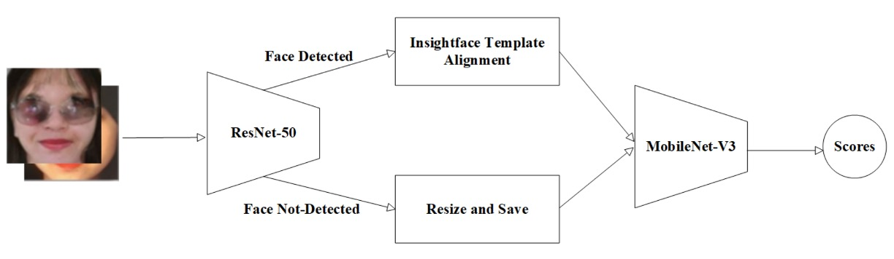

## Arsenal

[**Unified Physical-Digital Attack Detection Challenge**](https://arxiv.org/abs/2404.06211)

---

This is the FAS competition held at CVPR2024, officially titled:

[**5th Chalearn Face Anti-spoofing Workshop and Challenge@CVPR2024**](https://sites.google.com/view/face-anti-spoofing-challenge/welcome/challengecvpr2024)

It’s a lively event that everyone working in the FAS field can check out.

## Problem Definition

The essence of the Face Anti-Spoofing (FAS) task is to mine the "syntax" of liveness from images.

However, in reality, attack methods have evolved into two parallel technical branches:

- **Physical Attacks (PA):** The impersonator presents the face through physical media such as paper, screens, or silicone masks. These interferences mostly occur at the sensor level and have direct interaction with the real world.
- **Digital Attacks (DA):** Such as Deepfake, face swapping, or adversarial examples, which manipulate from the data generation source or feature level. Although visually realistic, their essence is synthetic.

Traditional methods mostly model one of these categories, thus model performance is limited to their training distribution and cannot generalize broadly.

Although both physical and digital attacks belong to the “fake” class in final classification, their image statistical features and variation directions are highly heterogeneous. This causes intra-class feature distances far larger than expected, leading to a generalization bottleneck.

Currently, the core reasons why it is difficult to build a "unified model" are twofold:

1. **Lack of large-scale unified datasets:** Past works typically splice separately collected PA and DA datasets, without covering complete attack types for the same ID.
2. **Absence of public evaluation benchmarks:** Physical and digital attacks use different metrics and protocols, making consistent comparison across domains impossible.

This is the background for initiating the **Unified Physical-Digital Attack Detection Challenge**. Through new datasets, standard protocols, and open competitions, it attempts to define a new problem setting:

> **Can a single model handle two heterogeneous spoofing types simultaneously while maintaining discriminative power in unseen domains?**

## Unified Dataset: UniAttackData

<figure style={{"width": "70%"}}>

</figure>

**UniAttackData** is currently the largest and most comprehensively designed unified attack dataset, covering 1,800 subjects and totaling 28,706 facial video clips, consisting of the following three sample types:

- **Live:** 1,800 genuine video clips
- **Physical Attacks (PA):** 5,400 clips, including print, screen, 3D masks, etc.
- **Digital Attacks (DA):** 21,506 clips, including Deepfake, Face Swap, adversarial examples, etc.

The dataset’s key feature is that **each ID has complete corresponding attack samples**, ensuring the model’s learning process does not skew due to unbalanced attack type distribution. This design avoids models over-relying on irrelevant secondary features such as identity, ethnicity, or lighting, refocusing training on detecting the “spoof” itself.

To prevent models from prematurely exploiting dataset artifacts, the research team performed meticulous preprocessing: face regions were cropped and name steganography applied, ensuring no extraneous clues remain at the pixel level in any image.

### Evaluation Protocols and Generalization Design

The challenge includes two main protocols simulating different real-world deployment scenarios:

- **Protocol 1: Unified Attack Detection**
  Simulates scenarios where the model must simultaneously recognize both PA and DA, testing the model’s integration and classification capability for mixed attack types.

- **Protocol 2: Generalization to Unseen Attacks**
  Zero-shot testing for “unseen attack types,” further divided into:

  - **Protocol 2.1: Unseen Digital Attacks**
  - **Protocol 2.2: Unseen Physical Attacks**

This protocol adopts a leave-one-type-out strategy, meaning the model completely excludes one attack type during training, forcing it to learn more semantically generalizable discriminative logic.

---

### Competition Process and Rules

The overall competition runs in two phases on the CodaLab platform:

- **Development Phase (2/1–2/22)**
  Provides labeled training data and unlabeled development set; participants can repeatedly submit predictions to the leaderboard for iterative model tuning.

- **Final Phase (2/23–3/3)**
  Reveals development set labels and releases an unlabeled test set. Teams must submit final predictions without access to true test labels. The last submission counts as the official score, and teams must publicly release their code and fact sheets to qualify for awards.

---

### Evaluation Metrics

The challenge uses the ISO/IEC 30107-3 international standard metrics to quantify model spoof detection ability, including:

- **APCER** (Attack Presentation Classification Error Rate)
- **BPCER** (Bona Fide Presentation Classification Error Rate)
- **ACER** (Average Classification Error Rate)
- **AUC** (Area Under the ROC Curve)

The main ranking metric is ACER, with AUC as a secondary indicator. To maintain evaluation consistency, the final ACER is computed using a threshold calibrated by the Equal Error Rate (EER) on the development set.

---

## Arsenal

<figure style={{"width": "70%"}}>

</figure>

Next is a technical overview of the top 13 participating teams. Let’s take a closer look at what they actually did.

### 1. MTFace

<figure style={{"width": "90%"}}>

</figure>

In this challenge spanning both digital and physical attacks, the **MTFace** team proposed the ultimate winning solution.

The MTFace architecture can be briefly described as:

> **Optimized Data Augmentation for Comprehensive Face Attack Detection Across Physical and Digital Domains**

The name sounds long but captures the core issue: how to expose the model during training to "sufficiently diverse and realistic" spoof appearances.

The core of MTFace lies in the joint design of data augmentation and loss balancing.

Its data preprocessing steps are as follows:

1. **Face detection and cropping:** Detect faces in all images, with an additional 20-pixel margin to retain peripheral features.
2. **Face mask extraction:** Pre-extract masks of live data faces for subsequent augmentation use.

Then, for the generalization requirements of different protocols, two "semantically aligned augmentation strategies" were designed:

- **Moire simulation augmentation** (for Protocols 1 and 2.1)
  Screen replay often causes moire patterns, which become important visual cues for attack recognition.
  MTFace simulates this interference by injecting moire patterns into original images, enabling the model to anticipate this physical phenomenon’s potential impact.

- **Self-fusion augmentation** (for Protocols 1 and 2.2)
  Inspired by previous literature, MTFace uses live data as a base and injects surface features of digital attacks.
  Through color distortion, spatial deformation, and mask folding, it creates "hybrid samples of digital spoofs," improving the model’s discrimination against Deepfake-type attacks.

The ratio between genuine and attack samples varies greatly across protocols.

Without adjustment, the model tends to bias toward the more numerous class, losing the ability to recognize rare types.

To address this, MTFace adjusts cross-entropy weight configurations per protocol:

- **Protocol 1: live : fake = 1 : 1**
  Maintain balanced loss to ensure unbiased learning.
- **Protocol 2.1 (Unseen DA): live : fake = 5 : 1**
  Strengthen learning of live features to boost defense against digital attacks.
- **Protocol 2.2 (Unseen PA): live : fake = 2 : 1**
  Control the physical attack sample proportion to avoid over-reliance on moire patterns and mask contours.

Such meticulous tuning allows the model to precisely focus on key features under different protocols while maintaining generalization resilience.

MTFace ultimately adopts **ResNet-50 as backbone**, loading **ImageNet pretrained weights**.

No ViT, no custom large model—just strategy and data, clinching first place in this competition.

### 2. SeaRecluse

**SeaRecluse** chose to build defenses through data boundaries and proportion configurations.

Their solution is named:

> **Cross-domain Face Anti-spoofing in Unified Physical-Digital Attack Dataset**

This architecture does not emphasize extreme transformations or style transfer. Instead, it focuses on **data usage ratios and cropping strategies** to optimize model stability and generalization in cross-domain tasks, closer to real deployment conditions.

SeaRecluse uses **SCRFD** to detect and crop faces from uncropped images in the training set.

Unlike other teams, they distinguish and supplement between loose and tight crops as one form of data augmentation.

Additionally, for different task protocols, **data split ratios and augmentation strategies differ completely**:

- **Protocol 1: No additional augmentation**
  Simulate baseline recognition performance, training on 80% training data mixed with validation set.

- **Protocol 2.1 (Unseen DA):**
  Downsample and pad live data edges, expanding real face data to **3×** the original to balance real and fake samples.

- **Protocol 2.2 (Unseen PA):**
  To enhance model perception of fake samples, downsample fake faces by **4× and 8×**, totaling **7×** the original amount.

The team also corrected some images with abnormal aspect ratios to restore reasonable proportions, preventing the model from learning erroneous biases due to visual distortion.

For image augmentation, all tasks applied standard operations (flipping, random cropping, etc.), with Protocol 2.1 additionally using **Gaussian Blur** to simulate photographic blur and distant-view defocus.

The backbone network is **ConvNeXt V2**; chosen as a trade-off between performance and computational cost considering resource efficiency and challenge demands.

To further strengthen generalization, the team applied two training techniques:

- **Image CutMix:** Mixes two images and labels to improve adaptation to visual boundaries and spatial variations.
- **Label Smoothing:** Converts hard labels to soft labels to reduce overfitting risk.

These techniques help the model focus on semantic-level features and mitigate overfitting caused by data imbalance.

SeaRecluse’s approach is not drastic but rather wall-building—starting from task-specific data ratios and cropping scales to confine spoofing within the model’s field of vision.

It is a patient solution and a deployment-oriented mindset.

### 3. duileduile

<figure style={{"width": "90%"}}>

</figure>

The **duileduile** team designed a modular two-stage learning pipeline that combats the fluid boundary between real and spoof through abstract visual representations. The core of their architecture is:

> **Swin Transformer + Masked Image Modeling + Physical and Digital Attack Corresponding Augmentation**

The backbone model is **Swin-Large Transformer**, extracting a 1536-dimensional feature vector, with strong regional awareness and hierarchical abstraction capabilities.

In the **pretraining stage**, duileduile employs the **simMIM (Simple Masked Image Modeling)** strategy,
which partitions the image into non-overlapping patches and randomly masks some parts, forcing the model to learn “reconstructing the whole from incomplete inputs.”

This self-supervised method effectively enhances the model’s robustness in scenarios with feature loss or occlusion attacks,
especially benefiting zero-shot tests on unseen attack types in Protocol 2.

After training the visual syntax, the process moves to the **fine-tuning stage**. At this point, the strategy shifts from large-scale data stacking to precise pattern fitting per attack type, with corresponding augmentation procedures designed as follows:

- **Gaussian Noise:** Simulates pixel-level noise and compression artifacts caused by digital attacks
- **ColorJitter + Moire Pattern + Gamma Correction:** Reconstructs light and shadow variations and display biases of physical attacks

These augmentations are not uniformly applied to all data but probabilistically applied according to different training samples and protocol tasks, exposing the model to varied disturbances and spoofs each time it learns.

Compared to the first two teams focusing on data ratios and semantic augmentation, duileduile’s method is closer to a platform-like anti-spoof strategy. It applies consistent settings across protocols, possessing high transfer potential and structural consistency.

### 4. BSP-Idiap

<figure style={{"width": "90%"}}>

</figure>

The **BSP-Idiap** team took a different path: **returning to the signal’s intrinsic texture rhythm** by reconstructing attack signals in the frequency domain.

Their method is called: **DBPixBiS (Dual-Branch Pixel-wise Binary Supervision)**

Building upon their prior design philosophy, they expanded it into a dual-branch architecture.

**DBPixBiS** employs a dual-branch neural network structure:

1. **RGB branch:** Uses **Central Difference Convolution (CDC)** instead of traditional convolution, emphasizing local texture changes and enhancing the model’s perception of abnormal edges and subtle variation areas.
2. **Fourier branch:** Applies Fourier transform to input images and feeds them into a separate feature path, capturing spoofing textures in the frequency domain, such as repetitiveness, interference, and compression residues.

This design enables the model to simultaneously perceive “visual anomalies” in the image and “signal-level spoofing” within the data.

To mitigate overfitting and the subtlety of adversarial examples, BSP-Idiap adopts highly targeted training designs:

- **Pixel-wise Binary Supervision:** Supervises binary classification at each pixel on the feature map instead of the entire image, improving recognition of localized spoofing.
- **Attentional Angular Margin Loss:** Adds an angular margin penalty during training, guiding the model to distinctly separate live and spoof feature vectors, reinforcing stable class boundaries.

During testing, the model performs global average pooling on the feature map and uses the **mean activation** as the final spoof probability score.

### 5. VAI-Face

<figure style={{"width": "90%"}}>

</figure>

In this unified recognition battle, some teams build mechanisms, some restore syntax, and the **VAI-Face** team chose a third way: **create anomalies to strengthen recognition.**

Their solution centers on the **Dinov2 Vision Transformer (ViT-Large)** architecture, aiming to **expose flaws in distorted faces through visual attention.**

Their key data augmentation strategy is the **deliberate asymmetric treatment of live and fake images.**

They treat the two as semantically heterogeneous sources and thus apply drastically different augmentation pipelines:

- **Live images:** Only undergo **RandomResizedCrop** and **HorizontalFlip**, preserving natural distribution and geometric stability.
- **Fake images:** Subject to heavy asymmetric perturbations such as blur, distortion, and custom cutout occlusions, simulating various unnatural traces and structural breakages common in spoof images.

This strategy trains the ViT model to identify abnormal geometry and texture.

Beyond data strategies, VAI-Face exhibits high engineering sensitivity in training configuration:

- **OneCycleLR:** Precisely controls learning rate ramp-up and decay to improve convergence efficiency and generalization.
- **Label Smoothing:** Prevents overconfidence on specific patterns, reducing overfitting.
- **Mixup Augmentation:** Combines two images and labels to improve robustness at sample space boundaries.
- **Optimizer:** Uses ADAN, a novel optimizer combining adaptive gradients with momentum, providing more stable gradient dynamics in this challenge.

ViT-Large inherently possesses strong regional relational modeling ability. When processing spoof images, its global attention mechanism captures subtle inconsistencies, amplifying flaws hard to conceal. They do not add extra branches or generative modules but maximize the backbone’s recognition potential through finely tuned data perturbations and learning schedules, squeezing out generalization from a simple architecture.

### 6. L&L&W

While most models choose holistic input and full-image classification, the **L&L&W** team took the opposite approach, starting from local details: slicing a face into countless fragments and piecing together subtle clues of authenticity or spoof.

Their core strategy revolves around:

> **Patch-based Feature Learning + Frequency-guided Sampling + Local Attention Guidance**

The process begins with image patch extraction, splitting each input image into multiple small regions for independent feature learning. On this foundation, they introduce the **Centre Difference Attention (CDA)** mechanism.

CDA is an attention method enhancing subtle texture differences, focusing on regions that "should be consistent but show minor variations," such as edge halos, misaligned reassembly, and low-frequency fusion failures.

Beyond spatial details, L&L&W also leverage hidden frequency-domain clues. They designed the **High-Frequency Wavelet Sampler (HFWS)** module to concentrate on high-frequency bands in images, aiming to detect compression artifacts, fusion distortions, and unnatural texture discontinuities left during forgery.

This dual-domain fused feature strategy incorporates spatial attention and frequency intensity into the recognition process, allowing the model not only to see "where it looks odd" but also to hear "at which frequencies the anomaly lies."

To improve prediction stability and multi-angle coverage, the team generates **36 different cropped versions** per image during testing. Each patch is independently evaluated by the model, and results are averaged to form the final score.

### 7. SARM

The **SARM** team’s design focuses not on complex structures or data augmentation but on a repeated “training the trainer” process.

Their method is called:

> **Multi-Attention Training (MAT) + Label Flip Augmentation**

This is a staged visual refinement approach: first, train a model to understand the task, then use this model to finely tune and adapt to different attack types.

SARM splits the process into two phases:

1. **Phase One:** Train dedicated pre-detectors for each protocol (P1, P2.1, P2.2) using **Supervised Contrastive Learning** to maximize semantic distance between live and fake representations.

2. **Phase Two:** Fine-tune the actual anti-spoofing model starting from phase one’s representations as initial weights.

This design strengthens “expected object understanding” per task, reducing misleading effects common in direct end-to-end training, especially effective for cross-domain generalization tasks (P2.1 and P2.2).

In data augmentation, SARM innovates by **transforming live faces into fake ones and labeling them as fake.**

This is not ordinary synthetic spoofing but a weak spoof simulation using **OpenCV style transformations**.

For training data in P2.1 and P2.2, they apply style variations including hue shifts, lighting changes, gamma adjustments, and camouflage filters.

These processed live images are labeled as **spoof**, creating a **label-flip augmentation** set to generate more diverse, distribution-closer “weak attack samples,” thereby narrowing the domain gap.

The optimizer is **Adam**, combined with cross-entropy and contrastive losses for stable training. Protocol P1 uses standard strategies for stable convergence, while P2.1/P2.2 introduces enhanced augmentation.

This method mainly relies on "prior task intention understanding" to drive model convergence.

### 8. M2-Purdue

<figure style={{"width": "90%"}}>

</figure>

The **M2-Purdue** team offers a different strategy.

They abandoned complex architecture design and heavy data augmentation, opting to use CLIP’s semantic representations combined with an “extreme risk–oriented” loss, named:

> **Robust Face Attack Detection with CLIP + MLP + CVAR–AUC Loss Fusion**

The pipeline starts with standard image preprocessing, resizing all inputs to **224×224** to ensure scale consistency.

Next, they extract semantic features via **CLIP’s image encoder**, converting visual information into deep embedding representations.

The key here is not creating new features but “leveraging a model pretrained on massive data,” allowing CLIP to output generalized semantic features. They then attach a three-layer **MLP classifier** as the task-specific decision module — the only part requiring fine-tuning — minimalist yet precise, fitting modern lightweight deployment needs.

The most distinctive aspect is the dual loss design, integrating two supervisory signals:

- **CVAR (Conditional Value at Risk) Loss:** Common in financial risk control, focusing on tail risk—the hardest-to-classify, highest-risk sample regions.
- **AUC (Area Under Curve) Loss:** Emphasizes overall discriminative ability, optimizing the model’s perception of correct ranking.

The overall loss is defined as:

$$
\mathcal{L} = \lambda \cdot \mathcal{L}_{\mathrm{CVAR}} + (1 - \lambda) \cdot \mathcal{L}_{\mathrm{AUC}}
$$

where parameter $\lambda$ balances “extreme risk sensitivity” and “overall generalization.”

The underlying logic is: not striving for all-round correctness, but minimizing errors in the “most error-prone zones.”

Training uses **Adam** for parameter updates without excessive hyperparameter tuning. Built on CLIP features and risk-aware objectives, this simple architecture achieves stable convergence and decent cross-domain recognition.

### 9. Cloud Recesses

<figure style={{"width": "90%"}}>

</figure>

If the essence of anti-spoofing is finding flaws on the face, then the **Cloud Recesses** team’s strategy provides a creative twist: **masking the most recognizable parts, forcing the model to understand authenticity from subtler signals.**

Their method is called:

> **Random Masking for Face Anti-Spoofing Detection**

This is a data-level adversarial training approach that directly obscures key facial regions, **forcing the model to learn liveness recognition even without clear views of eyes and mouth.**

The overall process breaks down into three steps:

1. **Face Detection:** Use **RetinaFace** to crop faces from original images, standardizing them to 256×256 size.
2. **Keypoint Annotation:** Use **dlib** to detect 68 facial landmarks, precisely outlining eyes, nose tip, lips, etc.
3. **Random Masking:** For each training sample, randomly mask three to five key regions, depriving the model of shortcut cues relying on facial features.

This design intentionally disrupts features the model might overly depend on (such as eye sclera texture and mouth contours), forcing it to learn more abstract, stable liveness cues like skin granularity, facial contour continuity, and local motion blur.

The backbone is **EfficientNet**, balancing accuracy and efficiency, suitable for lightweight recognition on masked images.

Training is straightforward without complex hyperparameter tuning, treating the masking strategy as a core data-level regularizer that imposes “visual stress,” compelling the model to reason with incomplete information.

Cloud Recesses’ solution involves no extra modules, no dual branches, no feature fusion — just removing key visual cues from the face to test if the model can recognize truth from darkness.

### 10. Image Lab

<figure style={{"width": "90%"}}>

</figure>

In anti-spoofing detection tasks, we usually want the model to "see clearly," but the **Image Lab** team chose to have the model "see many times." Their architecture is called:

> **Multiattention-Net: A Deep Visual Recognition Network Composed of Multiple Attention Layers**

This design systematically integrates multi-stage spatial information and multiple attentions, extracting possible anomaly cues from different dimensions of the image.

The network starts with a **7×7 convolutional layer** capturing local texture details, followed by ten layers of **modified squeezed residual blocks**, each paired with **max pooling**, progressively abstracting input information into increasingly global spatial semantics.

Throughout this process, spatial information is continuously extracted at each layer, finally followed by a **Dual Attention Block** that strengthens the recognition weights of key regions. This enables the model to discover spoofing traces both in fine details and structure.

Finally, **Global Average Pooling (GAP)** reduces dimensions, and all layer outputs are concatenated before entering a fully connected layer for classification.

During training, Image Lab uses **Binary Focal Cross Entropy Loss**, a loss function designed to penalize **minority classes** and **high-confidence errors** more strongly, with the formula:

$$
\mathcal{L}(y, \hat{y}) = -\alpha \cdot (1 - \hat{y})^\gamma \cdot \log(\hat{y}) - (1 - \alpha) \cdot \hat{y}^\gamma \cdot \log(1 - \hat{y})
$$

where:

- $\hat{y}$ is the predicted probability, $y$ is the ground truth;
- $\alpha = 0.25$ (to handle class imbalance);
- $\gamma = 3$ (to emphasize hard samples).

Though Multiattention-Net is deeper than many other participants’ models, its modular design and residual stability ensure smooth training, and combined with meticulous loss weighting, it demonstrates strong generalization and convergence efficiency.

### 11. BOVIFOCR-UFPR

<figure style={{"width": "90%"}}>

</figure>

In this battle focused on "recognizing spoofs," **BOVIFOCR-UFPR** is among the few teams extending analysis beyond the 2D plane. Rather than only analyzing image colors and textures, they attempt to **reconstruct the 3D authenticity of the entire face**, thereby detecting spatial inconsistencies that spoofs cannot reproduce.

Their core solution is:

> **3D Reconstruction + ArcFace + Chamfer Loss**

Inspired by **3DPC-Net**, the framework centers on an **Encoder-Decoder architecture**:

1. **Preprocessing:** Uses high-quality alignment and cropping to ensure consistent image scale and unified facial regions.
2. **Encoder:** Employs **ResNet-50** backbone to extract high-level features.
3. **Decoder:** Transforms features into corresponding **3D point cloud representations**, simulating the face's geometric shape in space as a basis for subsequent discrimination.

With this structure, the model learns not only "how similar it looks" but "how plausible it is," verifying spatial consistency.

During training, the team combines two feature-guided losses:

- **ArcFace Loss:** Enhances class separation, ensuring feature vectors from different identities are angularly separable.
- **Chamfer Distance Loss:** Measures spatial distance between predicted and ground-truth 3D point clouds to constrain geometric accuracy.

The model must classify live/fake and simultaneously output a 3D geometry consistent with reality.

This method is currently the only team using "3D point cloud reconstruction," demonstrating the potential of geometry-driven anti-spoofing.

It is a cross-dimensional recognition approach, relying on geometric plausibility rather than pixel details to build defenses.

### 12. Inria-CENATAV-Tec

<figure style={{"width": "90%"}}>

</figure>

The **Inria-CENATAV-Tec** team returned to a classic question:

> **Can stable anti-spoofing be achieved under limited computational resources?**

Their answer is: **MobileNetV3-spoof with hyperparameter tuning**

This is a dynamic balance experiment between model complexity and recognition accuracy.

The pipeline reflects their systematic and conservative strategy:

1. **Facial landmark detection:** Uses **ResNet-50** for landmark detection.
2. **Alignment and fallback:** If landmarks are detected, use **InsightFace template** for precise alignment; otherwise, keep original image resized.

This approach balances rigor (precise alignment when landmarks are available) and fault tolerance (does not discard data without landmarks), showing practical understanding of real-world scenarios.

Choosing **MobileNetV3-large1.25** as backbone is key.

This architecture is optimized for edge AI and low-power devices, introducing **SE attention blocks** and **h-swish nonlinear activation** to balance parameters and recognition power.

With **SGD optimizer + Multi-step Learning Rate scheduler**, the model converges steadily in stages rather than through a one-shot global descent.

Besides basic augmentations (cropping, flipping), the team normalizes mean and standard deviation per protocol dataset to prevent feature shifts caused by domain heterogeneity.

This per-protocol preprocessing design, though engineering-level, significantly impacts generalization stability and is a major reason this lightweight model sustains recognition ability across multitask scenarios.

### 13. Vicognit

<figure style={{"width": "90%"}}>

</figure>

Among all participating teams, **Vicognit** is one of the few that explicitly focused on Vision Transformers (ViT).

Their solution is named:

> **FASTormer: Leveraging Vision Transformers for Face Anti-Spoofing**

This is a design with pure intent and clear strategy, avoiding data manipulation, additional modules, or multi-branch paths. They rely fully on the Transformer architecture’s ability to encode relationships and capture sequential structure, allowing the model to autonomously establish facial liveness syntax from spatial information.

The core of Vicognit’s approach is feeding the ViT model with original-resolution inputs without unnecessary downsampling or compression, preserving spatial detail and enabling self-attention to naturally leverage global relationships.

Though not novel per se, this strategy is challenging in face anti-spoofing tasks.

Since differences between real and fake faces often lie not in geometry but in texture, material, and subtle perturbations, ViT’s global relational modeling fits well to learn these fine and irregular semantic gaps.

Their training strategy includes:

- Carefully tuning learning rate and weight decay for stable, precise convergence;
- Using adaptive training methods to avoid early overfitting common in Transformer architectures;
- Omitting extra augmentation pipelines, keeping the architecture simple and focusing learning pressure on sequence pattern construction itself.

This approach allows FASTormer to effectively capture semantic key points without extra guidance, maintaining good generalization and flexible recognition of unseen patterns.

Vicognit’s contribution lies in empirically demonstrating the feasibility of pure Transformer architectures for FAS.

## Discussion

<figure style={{"width": "90%"}}>

</figure>

According to official final statistics, the top five teams exhibit three key characteristics:

1. **The top three teams clearly outperform others on ACER**, demonstrating high generalization stability.
2. **The first-place team leads in ACER, AUC, and BPCER,** but the best APCER was claimed by the fifth-place team, showing different models have selective advantages on different error types.
3. **All top five teams come from industry,** reflecting the practical design strategies’ substantial impact on UAD effectiveness.
4. **There is a large ACER variance across teams,** indicating UAD is still in early technical exploration without stable consensus or definitive architectures.

This challenge ultimately reveals not only who won but which model design philosophies hold up.

From an overall perspective, the distilled generalization design principles in current UAD tasks can be summarized into three paths:

- **Path One: Build global awareness using large models (e.g., ViT and CLIP).**
- **Path Two: Build robustness through data perturbations (e.g., masking, style transfer, self-fusion augmentations).**
- **Path Three: Use semantic alignment as feature regularization (e.g., supervised contrastive learning, ArcFace, dual-branch alignment).**

Almost all effective solutions integrate subsets of these logics in some form.

## Conclusion

Based on observations and organizers’ summaries of this competition, future UAD development still requires breakthroughs in three major directions:

1. **More comprehensive dataset construction:**
   Although UniAttackData has laid the foundation for unified cross-attack datasets, improvements remain needed in attack type diversity, subject variability, and image quality. Especially with emerging adversarial attacks and style-transferred deepfakes, current sample sizes are insufficient for systematic generalization validation.

2. **Visual Language Model (VLM)-guided generalization strategies:**
   Introduction of VLMs like CLIP and DINOv2 offers a semantic-level generalization pressure mechanism. More effective leveraging of these multimodal pretrained knowledge for UAD may reduce dependence on labeled spoof data.

3. **Task protocol and standard reconstruction:**
   Existing protocols, though representative, struggle to cover mixed attacks, multimodal scenarios, and mobile deployment. Developing higher-level task definitions and layered evaluation mechanisms (e.g., distinguishing high-risk from tolerable errors) is necessary to enhance real-world reliability.

Currently, we still walk within the mist of recognizing spoofs.

Different teams have illuminated various algorithmic paths—some piercing anomalies via attention, some building robustness through masking, some disentangling spatial truth via 3D reconstruction.

But the ultimate question remains unchanged:

> **Do we really understand how a fake face is composed?**

Perhaps the answer is yet to form, but after this open technical contest, we have stepped one step closer.
