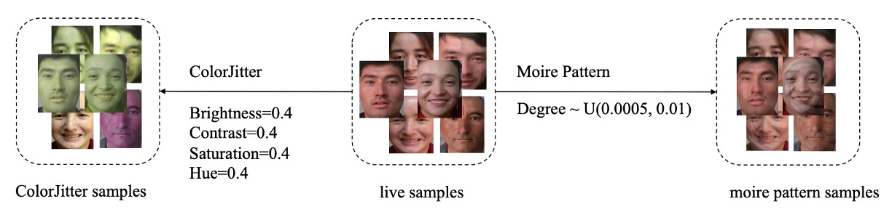
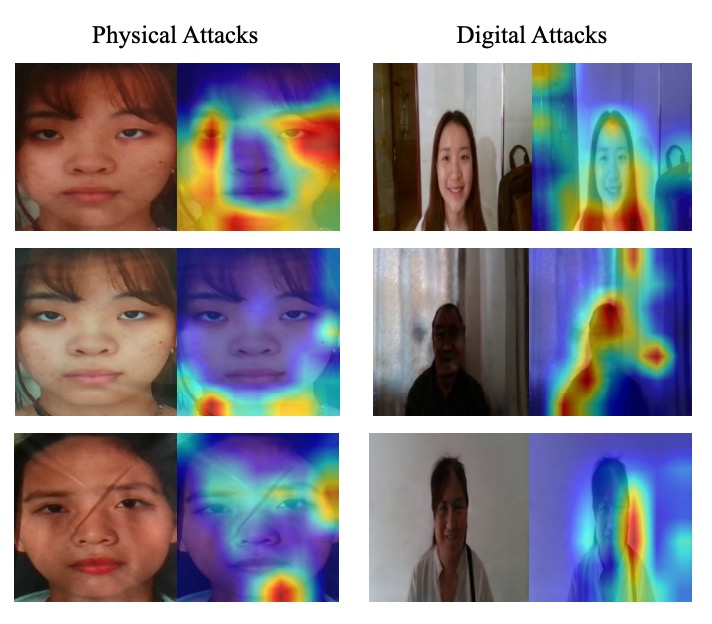

## The Illusionary Arena

[**Joint Physical-Digital Facial Attack Detection Via Simulating Spoofing Clues**](https://arxiv.org/abs/2404.08450)

---

The authors of this paper did not give a specific name to their architecture. We extract the most striking part concerning Physical-Digital attacks and temporarily call it PD-FAS.

If the authors provide a name later, we will update accordingly.

## Problem Definition

The goal of Face Anti-Spoofing (FAS) defense is an ever-deepening battle of transformations.

We usually categorize attackers into two types:

- **Physical Attacks**: Tangible and perceivable by sight. Photos, screens, 3D masks—these disguises visible to the naked eye possess real light reflections, material textures, and angle deviations.
- **Digital Attacks**: Purely generated, such as DeepFake, face swapping, adversarial perturbations. They may look exactly like us but have never truly existed.

You may think of them as physical attacks versus magical attacks.

These two types of attacks differ completely in form and traces, almost representing two separate "worldviews." The former stems from optical inconsistencies, screen refresh rates, and edge aliasing; the latter resembles a semantic space rearrangement, an illusion born from adversarial training.

This divergence has led defense development to split as well: physical attacks focus on low-level texture detection, while digital attacks trend toward semantic and frequency domain modeling. Two models, two logics, two separate training pipelines—like two gatekeepers each guarding a different realm, deciphering different forms of deception.

But the world is never that simple.

What if we take a digitally generated DeepFake video, display it on a phone screen, then use the phone camera for liveness detection? Is this a digital attack or a physical one?

Or suppose we have a 3D-printed mask embedded with variable resistors inside that simulate facial pulse—does this become a bionic organism or an algorithmic extension?

Blurriness emerges; boundaries start to dissolve. The model’s borders instead become gateways for vulnerabilities.

This paper offers a fresh perspective on the question:

> **"How can a single model understand and resist deceptions from two worlds?"**

---

## Solution

<figure style={{"width": "90%"}}>

</figure>

PD-FAS does not introduce novel modules at the architectural level, nor does it attempt a one-size-fits-all discriminator for both attack types. Instead, it adopts a more clever strategy: **Simulated Spoofing Clues**.

This is a data-driven intervention: rather than forcing the model to adapt to all possible deformations, it **actively fabricates illusions**.

PD-FAS proposes two data augmentation strategies:

- **SPSC (Simulated Physical Spoofing Clues)**: Simulates physical attack deformations on genuine images, such as reflections, high-frequency textures, and edge blurring.
- **SDSC (Simulated Digital Spoofing Clues)**: Simulates digital attack disturbances on genuine samples, such as visual semantic misalignment, style mismatches, and frequency domain anomalies.

These processes effectively dress the original “real” images in a layer of “illusion,” rather than directly using existing attack samples. The goal is to teach the model to recognize the **distorted traces resulting from contaminated genuine samples**.

During training, these augmented samples are fed into the main network alongside the original data, using cross-entropy loss to strengthen the recognition of spoofing clues. This approach offers several advantages:

1. **No need for real attack data**: Especially for certain hard-to-collect digital attack types, SDSC can simulate them autonomously.
2. **No extra inference cost**: Illusions are created during training; inference follows a standard process.
3. **Easy integration into existing frameworks**: SPSC and SDSC can be plugged as augmentation modules into any current FAS training pipeline.

Experimental design applies corresponding simulation strategies to different protocols:

- **Protocol 1**: Enables both SPSC and SDSC to boost overall model recognition capability;
- **Protocol 2.1**: Enables only SPSC to counter unseen physical attack types;
- **Protocol 2.2**: Enables only SDSC to tackle unseen digital attack modalities.

### Simulated Physical Spoofing Clues

<figure style={{"width": "90%"}}>

</figure>

Let’s start with the SPSC part.

Physical attacks typically involve transforming a facial image into a tangible carrier, such as paper, screens, or even 3D masks, which are then presented again to the camera. This process leaves many observable "physical traces" in the image, such as color shifts, moiré patterns, edge blurring, and reflection distortions.

The first data augmentation strategy in PD-FAS draws inspiration from these real-world image artifacts, artificially embedding similar visual clues into live samples, enabling the model to start learning recognition logic even before encountering real attack samples.

SPSC integrates two augmentation methods:

- **ColorJitter augmentation**: simulates color distortion caused by physical printing (targeting Print Attacks);
- **Moiré pattern generation**: reconstructs interference patterns generated by screen playback and camera capture (targeting Replay Attacks).

First, consider the ColorJitter augmentation.

Physical printing often results in unstable colors, excessive contrast, or saturation imbalance. These color deviations are important cues for distinguishing attack samples.

PD-FAS simulates these anomalies with fixed augmentation parameters:

- Brightness = 0.4
- Contrast = 0.4
- Saturation = 0.4
- Hue = 0.4

These settings are moderate but enough to tint originally “clean” live samples with a subtle suspicious visual difference—like a poorly made fake ID that looks normal at first glance but feels off upon closer inspection.

Next is moiré pattern generation.

Moiré patterns are common interference phenomena when screens are recorded by cameras, often appearing as spoofing artifacts in Replay Attacks.

To simulate this effect, PD-FAS designs a moiré pattern generation algorithm with the following steps:

1. Obtain image dimensions and center coordinates
2. Randomly generate interference intensity from the interval $U(0.0005, 0.01)$
3. Create pixel coordinate grids $(x, y)$ and convert them to $(X, Y)$ grids
4. Calculate offsets and polar coordinates $(\theta, \rho)$
5. Adjust coordinates based on angle and radius to produce new coordinates $(X_{\text{new}}, Y_{\text{new}})$
6. Map the results back onto the original image to create moiré distortion

Through this process, the original image is distorted with simulated moiré effects, enabling the model to learn to recognize these physical attack features.

:::tip
**Is this distortion too artificial?**

That’s hard to say and must be verified through experiments.

We often apply various augmentation techniques to images, and sometimes observe underperformance on validation sets. This may be because the augmentation does not align well with the characteristics of real attack samples. In such cases, it may be necessary to adjust augmentation parameters or select simulation methods that better match actual attack features.
:::

### Simulated Digital Spoofing Clues

<figure style={{"width": "90%"}}>

</figure>

Next, the SDSC part.

Compared to the light and texture cues in physical attacks, digital forgeries hide their deception in semantic and pixel-level details. Whether DeepFake, face swapping, or facial synthesis, these attack types often leave perceptible yet hard-to-quantify "artificial traces" in the face region—such as boundary misalignment, semantic drift, or local distortions.

To enable the model to recognize these vague and bizarre features, the authors referenced Self-Blending techniques and designed a three-stage forgery simulation procedure covering color distortion, spatial misalignment, and mask blending.

- **Step 1: Dual Image Generation (Color & Spatial Transformations)**

  Starting with the original image $I$, two copies $I_1$ and $I_2$ are made to serve as the “forgery source” and “forgery target,” respectively.

  - $I_1$: undergoes color distortion (Hue, Brightness adjustments and Downscaling) to produce $O_1$, simulating typical color anomalies seen in generated faces.
  - $I_2$: undergoes spatial distortions such as resizing and shifting to produce $O_2$, introducing facial position and geometric misalignment errors.

  At this point, $O_1$ and $O_2$ look like they come from the same image but their boundaries and semantics are misaligned—like a failed face swap attempt.

- **Step 2: Face Mask Generation and Deformation**

  Using a face parsing model, the face region of the original image $I$ is extracted, producing a **face mask**.

  This mask is further processed with two layers of deformation:

  1. **Affine Transform**: simulates spatial deformation of the face;
  2. **Mask Deformation**: adds elastic stretching, blurring, and noise to make edges appear more synthetic.

  The result is a misaligned, distorted, and blurred face mask.

- **Step 3: Blending to Generate Forged Image**

  Finally, $O_1$, $O_2$, and the deformed mask $\text{mask}$ are blended according to the formula:

  $$
  O_{\text{forgery}} = O_1 \odot \text{mask} + O_2 \odot (1 - \text{mask})
  $$

  This means **part of the image comes from the forgery source, while the other part is supported by the distorted target**.

  The fusion yields a face sample “carrying its own flaws,” which SDSC aims to simulate as spoofing clues.

Through these three steps, SDSC provides the model with a “rehearsal script” for digital attacks, helping it learn to detect those fictional-world features hidden in blurred and blended faces.

### Dataset Setup: UniAttackData

To verify the feasibility of the proposed method on the novel problem of **joint physical-digital spoofing detection**, the authors selected the most comprehensive cross-modality attack dataset to date: **UniAttackData**.

This dataset not only covers various attack types but also carefully designs protocols that align with the core question we want to answer:
**Can a single model simultaneously detect both physical and digital spoofs?**

UniAttackData is an extension built upon CASIA-SURF, containing:

- **1800 subjects** spanning three major ethnic groups (African, East Asian, Central Asian)
- **Two physical attack types**: Print and Replay
- **Six digital forgery types**: covering various DeepFake styles
- **Six adversarial attack types**: simulating extreme disguises

It defines two major test protocols tailored for two real-world challenges:

| Protocol     | Testing Objective                                       | Test Data                 |
| ------------ | ------------------------------------------------------- | ------------------------- |
| Protocol 1   | Detect both digital and physical attacks simultaneously | Includes all attack types |
| Protocol 2.1 | Generalize to **unseen physical attacks**               | Unseen physical spoofs    |
| Protocol 2.2 | Generalize to **unseen digital attacks**                | Unseen DeepFake attacks   |

### Evaluation Metrics: APCER / BPCER / ACER

Model performance is evaluated using three classic metrics in the liveness detection domain:

- **APCER** (Attack Presentation Classification Error Rate): proportion of attacks misclassified as bona fide (real)
- **BPCER** (Bona Fide Presentation Classification Error Rate): proportion of bona fide samples misclassified as attacks
- **ACER** (Average Classification Error Rate): average of APCER and BPCER

In the 5th Face Anti-Spoofing Challenge at CVPR 2024, **final rankings are based on ACER**, reflecting not only single attack detection but also overall bidirectional stability in classification.

### Experimental Setup and Training Details

- **Image processing pipeline**:

  - If original image size exceeds 700px, perform face detection and crop with a 20px margin.
  - If face detection fails, center crop to 500×500.
  - Face parsing is applied in SDSC to obtain face masks used for synthesis.

- **Network architecture**:

  - Uses **ResNet-50** backbone. Although the authors claim the method can be applied to any architecture, due to limited data, a sufficiently stable mid-tier model was chosen as the baseline.

- **Training strategy**:

  - Optimizer: AdamW, learning rate $10^{-3}$, weight decay $5 \times 10^{-4}$
  - Learning rate schedule: Cosine Annealing
  - Input size standardized to 224×224
  - Standard augmentations: `RandomResizedCrop` and `HorizontalFlip`
  - Loss: Cross Entropy with weighting to balance live vs. attack classes

- **Three protocols correspond to three independently trained models**, with the following configuration:

  - Training conducted on a single A100 GPU (80GB),
  - **Each model trains within approximately 1 hour.**

| Protocol     | Training Data Coverage           | Training Duration | Testing Duration |
| ------------ | -------------------------------- | ----------------- | ---------------- |
| Protocol 1   | All samples                      | 200 epochs        | \~1 minute       |
| Protocol 2.1 | Excludes unseen physical attacks | 200 epochs        | \~1 minute       |
| Protocol 2.2 | Excludes unseen digital attacks  | 200 epochs        | \~1 minute       |

## Discussion

PD-FAS does not advocate increasing model complexity but instead reconstructs “what constitutes an attack” from the data perspective.

To validate this design’s effectiveness, the authors conducted comprehensive experiments across multiple metrics and settings, including comparisons with SOTA methods, generalization under different protocols, module ablation studies, backbone adaptability, and visualization analysis.

### Comparison with SOTA Methods

<figure style={{"width": "70%"}}>

</figure>

On the UniAttackData dataset, PD-FAS was compared against representative existing methods such as VAI-Face across four key metrics. VAI-Face showed the best BPCER (0.25%), but PD-FAS outperformed it comprehensively on the other three metrics, achieving:

- AUC: **99.69%**
- APCER: **3.75%**
- ACER: **2.33%**

This demonstrates PD-FAS’s robust recognition ability for uncertain real-world attack types. Particularly, the lowest APCER indicates higher sensitivity in identifying fake samples, effectively blocking spoofing infiltration.

### Performance Across Three Protocols

<figure style={{"width": "70%"}}>

</figure>

To simulate real deployment generalization challenges, experiments were divided into three protocols:

- **Protocol 1**: standard training and testing
- **Protocol 2.1**: unseen physical attacks (SPSC only)
- **Protocol 2.2**: unseen digital attacks (SDSC only)

Results showed:

- PD-FAS slightly outperforms the baseline in Protocol 1.
- Protocol 2.1: **ACER dropped from 38.05% to 1.32%**
- Protocol 2.2: **ACER dropped from 44.35% to 1.65%**
- Average ACER decreased by **26.48 percentage points**, from 27.54% to 1.06%

These numbers almost serve as a conclusion: **under cross-domain test conditions, PD-FAS’s simulated data augmentation is far more effective than static original training sets.**

### Module Contribution Analysis

- **SPSC Module**:

<figure style={{"width": "70%"}}>

</figure>

- ColorJitter alone reduces ACER to 3.62%
- Moiré pattern alone reduces ACER to 6.18%
- Combined (full SPSC): **ACER = 1.32%**

This proves simulated color distortion and screen interference are highly representative for Replay and Print attacks.

- **SDSC Module**:

<figure style={{"width": "70%"}}>

</figure>

- SDSC alone: **ACER = 1.65%**
- Compared with Gaussian Noise to simulate adversarial perturbations: only reduces ACER to 36.77%
- SDSC + Gaussian Noise: ACER rebounds to 22.57% (over-strong noise harms performance)

The conclusion is clear: **targeted clues outperform generic noise**, and detailed simulation is more realistic than vague generalization.

### Backbone Network Tests

<figure style={{"width": "70%"}}>

</figure>

PD-FAS is architecture-agnostic. The authors tested five backbones:

- ResNet18 / ResNet34 / ResNet50
- Swin-Tiny / Swin-Base

Though UniAttackData is relatively small causing some fluctuations, results show:

- **All architectures integrate PD-FAS without structural changes**
- **ResNet50 performs best with ACER = 1.06%**

This plug-and-play feature highlights its deployment value.

### Visualization Analysis

<figure style={{"width": "70%"}}>

</figure>

Grad-CAM visualization reveals:

- **Protocol 2.1 (Physical attacks)**: attention focuses on color distortions and moiré pattern areas.
- **Protocol 2.2 (Digital attacks)**: attention focuses on edge breaks and facial deformation regions.

## Conclusion

Through the targeted augmentations **SPSC** and **SDSC**, the authors enable the model to see and learn from ambiguous spoofing clues during training.

Extensive experiments verify that this method significantly improves recognition of “unseen attack types,” while demonstrating excellent architecture-independence and scalability. Ultimately, this approach won first place in the 5th CVPR 2024 Face Anti-Spoofing Challenge and highlights several promising directions:

- **Redefining data augmentation**: guiding models to reason about the logic of “fakeness.”
- **Bridging across attack modalities**: finding common training space from opposing detection approaches.
- **Composability of training data**: architecture-agnostic, minimally invasive strategy with practical scalability.

This paper also reminds us:

**Is generalization really only achievable through larger datasets and deeper models?**

Perhaps not.
