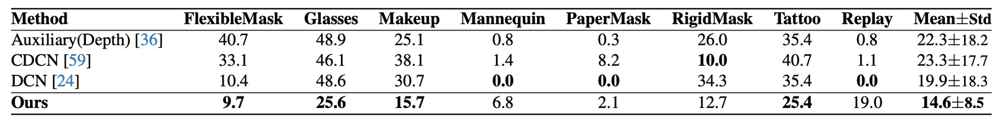
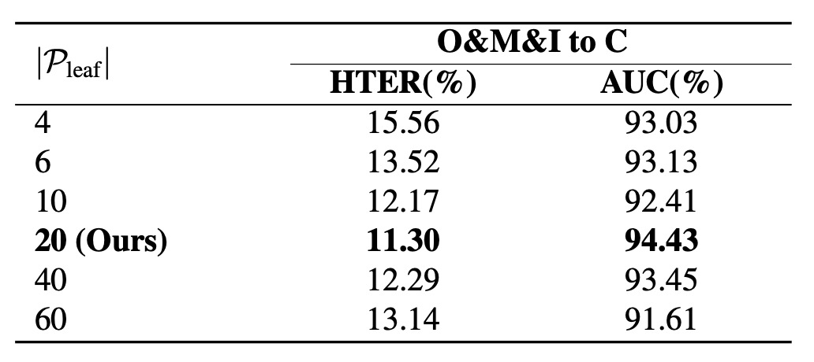

## The Hyperbolic World Tree

[**Rethinking Generalizable Face Anti-spoofing via Hierarchical Prototype-guided Distribution Refinement in Hyperbolic Space**](https://openaccess.thecvf.com//content/CVPR2024/papers/Hu_Rethinking_Generalizable_Face_Anti-spoofing_via_Hierarchical_Prototype-guided_Distribution_Refinement_in_CVPR_2024_paper.pdf)

---

Let's look at a CVPR paper.

The authors attempt to approach the FAS problem from a different perspective, presenting a very novel concept.

## Defining the Problem

The safeguard for face recognition systems is built upon Face Anti-Spoofing (FAS).

With the maturity of deep learning, research progress has been remarkable: from early handcrafted features, to deep binary classification architectures, and more recently, cross-domain learning techniques. FAS has gradually learned how to recognize risks amidst chaos.

However, once the dataset changes or the scenario shifts, the model’s performance drastically deteriorates, repeatedly confirmed.

Later, researchers tried to teach models to "learn generalization" by introducing adversarial, disentanglement, contrastive, meta-learning, and other training strategies, aiming to make features consistent across different scenarios.

But in this process, one thing is unknowingly sacrificed: **the semantic structure**.

By semantic structure, it is not the network architecture itself, but the "semantic distance" and "hierarchical context" between samples:

- A photo printed by a color printer and a video replayed on a mobile phone may be close in pixel distribution, but the types of attacks and underlying mechanisms they represent are vastly different.
- The generation conditions of an attack, including lighting, background, or material, essentially segment the semantic attributes of samples rather than noise.

Yet existing methods mostly force all samples into a single "Euclidean" feature space, prioritizing minimizing the domain gap, which leads to **over-alignment**.

We cram features that should be separate together, compressing the structure the model might have understood into a flat space without hierarchy.

Isn't that strange?

Therefore, the authors of this paper believe:

> **Since the difficulty of generalization stems from semantic imbalance, can we change the space to let hierarchy speak for itself?**

---

## Solving the Problem

:::warning
Mathematical warning: the methodology in this paper is somewhat complex, so readers are advised to proceed with caution.
:::

To repair the semantic structural fractures caused by compression, this paper proposes a novel methodology:

- **Hierarchical Prototype-guided Distribution Refinement (HPDR).**

Overall, HPDR is built upon three core components:

1. Embedding features in **hyperbolic space** to capture their intrinsic hierarchical structure;
2. Using prototype learning as a semantic coordinate system, associating samples with semantic cluster centers;
3. Employing **multi-level alignment and optimization strategies** to gradually approach a generalizable semantic distribution.

First, let’s start by examining this space itself.

---

### Hyperbolic Space

If semantics have a tree-like structure, then hyperbolic space is the precise geometric choice.

We can imagine a semantic tree, branching from the main trunk of “attack” and “real,” continuously subdividing according to material, presentation method, and source device. If we forcibly compress this tree into a flat Euclidean map, its branches become distorted, overlapped, and unable to spread out; but in hyperbolic space, it naturally extends, avoids overlap, and can infinitely proliferate near the boundary.

HPDR adopts exactly such a spatial model: the **Poincaré Ball Model**.

The Poincaré Ball is a conceptual space:

$$
\mathbb{D}^n = \left\{ \mathbf{x} \in \mathbb{R}^n \mid \|\mathbf{x}\| < 1 \right\}
$$

This means all points are contained within an open ball of radius 1.

At first glance, it looks like a closed boundary, but this sphere’s edge is not a limit — it is infinitely far away.

**This means we can approach the boundary arbitrarily close, but never actually reach it.**

This design has a key property: the closer points are to the boundary, the distances between them **nonlinearly expand**. In other words, distance itself carries semantic hierarchical tension.

To make this space computationally viable, we cannot use the traditional Euclidean metric; instead, we introduce a curvature-controlled **Riemannian metric tensor**:

$$
g_{\mathbb{D}} = \lambda_c^2 \cdot g_E, \quad \lambda_c = \frac{2}{1 - c\|\mathbf{x}\|^2}
$$

- $g_E$: the familiar Euclidean metric;
- $\lambda_c$: a location-dependent scaling factor (conformal factor).

Near the center, $\lambda_c$ approximates a constant, and the geometry behaves nearly flat; near the boundary, as $|\mathbf{x}| \to 1$, $\lambda_c$ diverges, causing the space to become “highly tense,” dramatically amplifying small shifts in distance.

This is the essence of hyperbolic space: **allowing hierarchical expansion to unfold naturally.**

Movement in this geometry cannot use linear addition but must employ **Möbius addition**:

$$
\mathbf{u} \oplus_c \mathbf{v}
= \frac{(1 + 2c\langle \mathbf{u}, \mathbf{v} \rangle + c\|\mathbf{v}\|^2)\mathbf{u} + (1 - c\|\mathbf{u}\|^2)\mathbf{v}}{1 + 2c\langle \mathbf{u}, \mathbf{v} \rangle + c^2\|\mathbf{u}\|^2\|\mathbf{v}\|^2}
$$

This addition is not the familiar vector summation, but rather **progression along the curved boundary of the space**. Any movement changes its meaning and direction according to local curvature.

The distance between two points is given by the hyperbolic distance:

$$
d_H(\mathbf{u}, \mathbf{v}) = \frac{2}{\sqrt{c}} \cdot \mathrm{arctanh}\left( \sqrt{c} \cdot \| -\mathbf{u} \oplus_c \mathbf{v} \| \right)
$$

This distance formula geometrically interprets “semantic divergence,” measuring how much vectors bend or split, rather than their traditional “distance apart.”

Having hyperbolic space ready, the next question is:

- **How do we map neural network outputs into it?**

Since neural network outputs are still Euclidean vectors, we must find a proper way to map them into hyperbolic space.

This is done by the exponential map:

$$
\exp_0^c(\mathbf{v}) = \tanh\left(\sqrt{c} \frac{\|\mathbf{v}\|}{2}\right) \cdot \frac{\mathbf{v}}{\sqrt{c}\|\mathbf{v}\|}
$$

This operation has two effects:

- Short vectors get compressed near the ball center, representing high-level semantics;
- Long vectors get pushed toward the ball boundary, representing fine-grained semantic leaf nodes.

Because semantics are inherently nonlinear, this process better reflects the true semantic distribution.

### Semantic Anchors

With hyperbolic space prepared, where do semantics grow?

In HPDR, the authors do not let the model directly perform end-to-end feature classification on all samples. Instead, they provide a stable, controllable semantic framework called **prototypes**.

Prototypes are not mere points but **semantic aggregation units**.

- Their coordinates determine how samples are categorized;
- The distances between prototypes shape the distribution of the entire semantic space.

First, define a basic set of prototypes called **Leaf Prototypes**, which correspond directly to semantic cluster centers of samples, with explicit label information.

Mathematically defined as:

$$
\mathcal{P}_{\text{leaf}} = \{ p_{ij} \mid i \in \{0,1\}, j \in \{0, \dots, K-1\} \}
$$

- $i$: class index, 0 for fake, 1 for live;
- $j$: the $j$th prototype within class $i$, total $K$;
- Thus, there are $2K$ leaf prototypes corresponding to semantic subgroups of the two classes.

This design implies an assumption: **samples within the same class can be subdivided into multiple semantic subtypes**, each represented by different leaf prototypes.

In theory, these prototypes should be initialized directly in hyperbolic space, but practically initializing in $\mathbb{D}^n$ often causes gradient explosion or unstable optimization. Therefore, the authors' practical approach is:

1. Randomly initialize prototype vectors $\mathbf{p}_{\text{Euc}}$ in Euclidean space $\mathbb{R}^n$;
2. Map them into hyperbolic space via the exponential map:

$$
\mathbf{p} = \exp_0^c(\mathbf{p}_{\text{Euc}}), \quad \mathbf{p}_{\text{Euc}} \in \mathbb{R}^n
$$

This design stabilizes initialization and prevents excessive dispersion or collapse early in training.

The most interesting part of the overall structure design follows: **None-leaf Prototypes**.

These prototypes do not correspond to any single sample but exist between leaf prototypes as their common ancestors and semantic connection nodes.

Defined as:

$$
\mathcal{P}_{\text{none-leaf}} = \{ p_k \mid k \in \{0, \dots, K'-1\} \}
$$

- These are also embedded in $\mathbb{D}^n$ but carry no label information;
- They exist to build **internal nodes of the semantic tree**, simulating transitions and convergences between semantic hierarchy levels.

In other words:

- **Leaf Prototypes aggregate samples → establish semantic correspondence;**
- **None-leaf Prototypes aggregate prototypes → establish hierarchical structure.**

The beauty of this design is that **it embeds unsupervised semantic hierarchical modeling into the classification architecture.**

We do not explicitly label which subgroup belongs to whom; the model discovers by itself which prototypes are close, which share common ancestors, which ancestors should be near the boundary, and which remain near the center.

### Semantic Three-Level Alignment

With hyperbolic space and prototypes established, the next step is to build a learnable system.

This design is called **Hyperbolic Prototype Learning (HPL)**, a learning framework crafted around three semantic-level relationships:

- **Prototype ↔ Instance**: point-to-point semantic alignment
- **Instance ↔ Instance**: internal consistency among samples
- **Prototype ↔ Prototype**: hierarchical construction of semantic structure

Let’s examine each in turn:

1. **Prototype-based Feature Alignment**

   Starting with the basic step: **letting each sample find its semantic anchor**.

   For each sample feature vector $\mathbf{z}$, according to its label $y$, find the closest leaf prototype in that class:

   $$
   p(\mathbf{z}) = \arg\min_{p_{yj} \in \mathcal{P}_{\text{leaf}}} d_H(\mathbf{z}, p_{yj})
   $$

   This establishes a "correct prototype" for each sample.

   Next, the model is encouraged to learn features that move closer to these prototypes while distancing from others, applying contrastive learning in hyperbolic space:

   $$
   \mathcal{L}_{PI} = -\sum_{n=1}^N \log \frac{e^{-d_H(\mathbf{z}_n, p_{c_k})}}{\sum_{i,j} e^{-d_H(\mathbf{z}_n, p_{ij})}}
   $$

   This loss lets the model autonomously judge which samples should be close or far apart in semantic space.

   To avoid collapse where all samples map to the same prototype, the training controls mini-batches so each prototype is assigned samples on average, preserving diversity and distribution tension.

---

2. **Instance-based Consistency**

   Real-world samples are not static; they undergo perturbations from lighting, angle, occlusion, etc. The goal is for the model to learn signals truly related to semantics.

   HPL introduces sample consistency learning:

   Given a pair $(x, x*{\text{aug}})$, extract features $\mathbf{z}, \mathbf{z}*{\text{aug}}$, and enforce consistency by minimizing their distance in semantic space:

   $$
   \mathcal{L}_{II\text{-feat}} = d_H(\mathrm{detach}(\mathbf{z}), \mathbf{z}_{\text{aug}})
   $$

   where $\mathrm{detach}(\cdot)$ blocks gradients to only update $\mathbf{z}_{\text{aug}}$, stabilizing the anchor feature.

   At the semantic distribution level, their distance profiles to all prototypes should be consistent:

   $$
   \mathcal{L}_{II\text{-dist}} = \left\| d_H(\mathrm{detach}(\mathbf{z}), \mathcal{P}_{\text{leaf}}) - d_H(\mathbf{z}_{\text{aug}}, \mathcal{P}_{\text{leaf}}) \right\|_2
   $$

   The total loss is:

   $$
   \mathcal{L}_{II} = \mathcal{L}_{II\text{-feat}} + \mathcal{L}_{II\text{-dist}}
   $$

   This design ensures that even if sample appearance changes, its position in the semantic structure remains stable.

---

3. **Hierarchical Structure Modeling**

   The relationships among prototypes cannot be “evenly spread.” They should have proximity, hierarchy, and ancestor-descendant relations.

   This is the most symbolic step in HPDR: **the semantic tree self-growth**.

   To learn this structure, the authors borrow the **Dasgupta cost** concept from hierarchical clustering:

   $$
   \mathcal{C} = \sum_{i,j} w_{ij} \cdot |\mathrm{leaves}(p_i \vee p_j)|
   $$

   where $p_i \vee p_j$ denotes the lowest common ancestor (LCA) of $p_i$ and $p_j$, and $|\mathrm{leaves}(\cdot)|$ is the number of leaf nodes under that subtree. Essentially, this cost asks: **Can semantically close prototypes merge at a lower level?**

   Because Dasgupta cost is not directly optimizable, the authors adopt a triplet-based optimization strategy by constructing triplets:

   1. Positive pair: $p_i, p_j$ are mutual K-nearest neighbors;
   2. Negative prototype: $p_k$ is not close to either.

   Then, for each $(p*i, p_j, p_k)$, find $\rho*{ij}$, the none-leaf prototype acting as LCA of $p_i$ and $p_j$:

   $$
   \pi_{ij}(\rho) = \exp\left( - \max(d_H(p_i, \rho), d_H(p_j, \rho)) \right)
   $$

   $$
   \rho_{ij} = \arg\max_{\rho} \left( \pi_{ij}(\rho) + g_{ij} \right)
   $$

   where $g_{ij}$ is Gumbel noise for differentiable approximation of argmax.

   Then define $\rho*{ijk}$ as the common ancestor of $\rho*{ij}$ and $p_k$, and formulate the triplet loss:

   $$
   \begin{aligned}
   \mathcal{L}_{PP\text{-LCA}} = &\left[d_H(p_i, \rho_{ij}) - d_H(p_i, \rho_{ijk}) + \delta\right] \\
   + &\left[d_H(p_j, \rho_{ij}) - d_H(p_j, \rho_{ijk}) + \delta\right] \\
   + &\left[d_H(p_k, \rho_{ijk}) - d_H(p_k, \rho_{ij}) + \delta\right]
   \end{aligned}
   $$

   Additionally, two structural constraints on leaf prototypes’ distribution are imposed:

   - **Encourage prototypes to stay away from the origin** (to prevent collapse):

   $$
   \mathcal{L}_{P\text{-Origin}} = -\log \frac{1}{1 + \sum_{p_i \in \mathcal{P}_{\text{leaf}}} \exp(-d_H(p_i, \mathbf{O}))}
   $$

   - **Encourage prototypes to disperse from each other**:

   $$
   \mathcal{L}_{PP\text{-leaf}} = -\log \frac{1}{1 + \sum_{p_i, p_j \in \mathcal{P}_{\text{leaf}}} \exp(-d_H(p_i, p_j))}
   $$

   The total semantic structure modeling loss is:

   $$
   \mathcal{L}_{PP} = \mathcal{L}_{PP\text{-LCA}} + \mathcal{L}_{P\text{-Origin}} + \mathcal{L}_{PP\text{-leaf}}
   $$

---

The real challenge of semantic alignment lies in letting relationships among points grow into a tree structure.

HPDR’s Hyperbolic Prototype Learning turns classification into a syntactic parsing process within a nonlinear space, rather than merely assigning labels.

### Training Procedure

The training process is divided into three steps:

- **Step 1: Prototype Initialization**

  First, randomly initialize in hyperbolic space:

  - All **Leaf Prototypes** (used to align samples)
  - All **None-leaf Prototypes** (used to build hierarchy)

  At this stage, prototypes are scattered without structure and have no explicit correspondence with samples. They quietly exist, awaiting to be claimed by samples and to grow semantics from distances.

---

- **Step 2: Prototype Assignment**

  Samples are mapped into hyperbolic space and begin searching for their semantic anchors.

  The authors assign each sample feature $\mathbf{z}$ to the closest leaf prototype within the same class according to its label $y$.

---

- **Step 3: Prototype Optimization**

  Once the relationships between samples and prototypes are established, the system jointly adjusts and aligns semantics.

  The entire system is optimized via the combined loss:

  $$
  \mathcal{L}_{\text{all}} = \mathcal{L}_{\text{pred}} + \mathcal{L}_{PI} + \mathcal{L}_{II} + \mathcal{L}_{PP}
  $$

  These four losses correspond respectively to:

  - **Stability of semantic decision-making** ($\mathcal{L}_{\text{pred}}$)
  - **Alignment degree between samples and prototypes** ($\mathcal{L}_{PI}$)
  - **Consistency of samples under augmentation** ($\mathcal{L}_{II}$)
  - **Hierarchical and structural relations among prototypes** ($\mathcal{L}_{PP}$)

  After this optimization round, both samples and prototypes in the space update: prototypes are fine-tuned, sample embeddings converge, and semantic tension redistributes.

  The process then returns to Step 2, **repeating assignment and entering the next convergence cycle**.

### Experimental Setup

To validate HPDR's generalization capability, the authors used the commonly adopted OCIM benchmark.

To ensure learnability and reproducibility of the overall architecture, key model implementation settings are as follows:

- **Input image size**: 256×256 (cropped color face region)
- **Number of leaf prototypes $K = 20$**: 20 semantic anchors per class
- **Number of none-leaf prototypes $K' = 256$**: backbone nodes for building semantic hierarchy
- **Feature dimension**: 256-dimensional hyperbolic feature space
- **Curvature parameter $c = 0.01$**: controls the degree of hyperbolic curvature
- **Sample configuration**: 5 samples per class per domain, total batch size of 30
- **Positive prototype pairs in triplets**: top 3 KNN selected as positives
- **Structural margin $\delta$ in loss function**: 0.1

Training was implemented with PyTorch framework using DepthNet as backbone, performed on NVIDIA 4090 GPU, with Adam optimizer and a learning rate of 0.001.

## Discussion

### OCIM Benchmark

<figure style={{"width": "90%"}}>

</figure>

This benchmark has become a standard in recent years, where three datasets are chosen as training sources and one unseen domain is left as the test set.

The experimental goal is to simulate real-world challenges of “new devices, new lighting, new environments.”

Results shown in the table:

- All domain generalization (DG) methods outperform traditional methods, confirming that DG strategies effectively enhance cross-domain generalization;
- HPDR significantly surpasses other DG-based methods, maintaining low error rates even on unseen test domains.

Notably, **even when competitors also use prototypes or hyperbolic embeddings, HPDR still leads**, because HPDR does not merely align samples but constructs **a hierarchical semantic tree**.

The advantage comes from the model’s built-in syntactic structure. Other methods align point-to-point relations, whereas HPDR aligns **positions and hierarchies between semantic concepts**.

---

### Limited Source Domain

<figure style={{"width": "60%"}}>

</figure>

In this test, the authors limit training to only two datasets (MSU and Replay) and test on OULU and CASIA. This setting better reflects practical scenarios with sparse samples and constrained domain distributions.

Results in the table show: compared with methods like AEML, HPDR improves AUC by **3.42%** and reduces HTER by **2.30%** under the M\&I→C setting; among hyperbolic and prototype methods, HPDR still leads.

This demonstrates that **even with limited source domains, as long as semantic structure is clear, the model can still make reasonable judgments in unknown scenarios**.

HPDR here acts like a map reader with clear vision, relying on built-in terrain knowledge rather than the immediate route.

---

### Cross-Attack

Finally, the authors conduct cross-attack testing on the HQ-WMCA dataset.

The challenge is: exclude a certain attack type during training and test exclusively on that type, testing **the robustness of semantic transfer**.

Results show HPDR maintains lower ACER across all attack types, and remains stable when “new attacks” appear, compared to other methods.

The reason: **HPDR does not merely learn to identify specific attack types but learns to distinguish whether a sample’s semantic distribution is familiar** in semantic space.

In other words, the model does not simply detect “whether this face is wearing makeup,” but judges whether “the overall semantic of this face reasonably fits within known semantic structures.”

---

### What Is Key in Semantic Space?

<figure style={{"width": "60%"}}>

</figure>

From experiments, several observations arise:

- **Without any loss added**, the model performs worst (HTER notably increases), indicating simply embedding in hyperbolic space does not improve performance; the space needs **structured supervisory signals**.
- **Adding only $\mathcal{L}_{PI}$** (prototype-instance alignment) significantly improves performance, showing that correspondence between samples and semantic prototypes is the primary factor for stable embeddings.
- **Adding $\mathcal{L}_{PP}$** further improves results, confirming that hierarchical construction among prototypes makes the space not only stable but also layered.
- **Using the full loss yields the best results**, confirming HPDR’s design logic is synergistic, not a linear stack, but a three-dimensional semantic syntax puzzle.

The conclusion: space itself cannot guarantee structure; structure requires multi-level relations—from alignment, to consistency, to hierarchical logic—each indispensable.

---

### How Many Branches Should the Semantic Tree Have?

<figure style={{"width": "60%"}}>

</figure>

The authors tested different numbers of branches, increasing prototypes from 4 to 20, observing stable performance improvements. Beyond 20, an **over-expansion effect** occurs: the space becomes too sparse and the semantic distribution unstable.

Also, too many prototypes cause uneven mini-batch resource allocation and trivial assignments. Thus, under current settings, **20 prototypes per class** is the optimal balance of minimal redundancy and maximal expressiveness.

---

### How Curved Should the Semantic Space Be?

<figure style={{"width": "60%"}}>

</figure>

From the results:

- **Euclidean space ($c=0$) performs worst**, since semantic hierarchies cannot unfold;
- Performance improves as curvature increases up to 0.01, indicating clearer semantic hierarchies;
- When $c$ is too large, performance degrades due to distortion near the base point (exponential map centered at zero), causing semantic imbalance.

Hence, hyperbolic space should be “just right” — curved enough to let semantic branches grow freely but not so much as to lose direction.

---

### Visualization Results

Finally, the authors visualize the learned semantic space from Leave-One-Out and Cross-Attack tasks.

In the figures:

- **Sample colors indicate class or source domain**;
- **Positions correspond to hyperbolic embeddings**;
- **Leaf and none-leaf prototypes are marked as specific points or hierarchical nodes**.

Key observations:

1. Semantic distributions unfold hierarchically rather than diffusely; samples cluster naturally around their semantic prototypes, forming a tree structure by semantic similarity;
2. None-leaf prototypes are key to semantic convergence, acting as junctions for multiple semantic subgroups, preventing fragmentation from excessive prototypes;
3. Cross-domain or cross-attack samples naturally embed into existing structures, showing the model learns the logical topology of overall semantics, not just surface domain distributions.

In figure (b), samples corresponding to each leaf prototype are visualized in groups, revealing:

- Samples under the same prototype are highly similar regardless of domain;
- Prototypes sharing lower-level LCAs exhibit higher semantic consistency among their samples, confirming hierarchy geometrically reflects semantic consistency rather than just classification.

This visualization shows that even without explicit structural supervision, the model naturally learns semantic hierarchical differentiation.

## Conclusion

The core idea of this study is not to memorize more samples, but to build a spatial logic that accommodates semantic hierarchies.

The authors verify HPDR’s effectiveness through extensive experiments and visualization. Whether facing unknown scenarios, limited sources, or new attacks, HPDR shows excellent generalization and proves that structural modeling significantly improves cross-domain recognition stability.

With recent trends integrating natural language capabilities into FAS, combining the semantic tree concept with language models may reveal a fundamentally different kind of semantic tree in the future.
