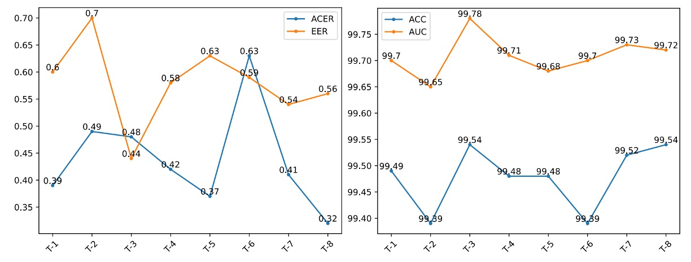

## Sparse Cracks

[**La-SoftMoE CLIP for Unified Physical-Digital Face Attack Detection**](https://arxiv.org/abs/2408.12793)

---

physical attacks (PAs) infiltrate the camera with increasingly realistic forms, from color photos spit out by printers to deep eye sockets beneath lifelike masks.

digital attacks (DAs) generate phantoms deep within algorithms, including style transfers, deepfake face swaps, and even direct manipulation of the image records themselves.

The boundary of facial recognition systems has never been so blurred.

## Problem Definition

In past research, these were treated as separate tasks:

- **PAD (Physical Attack Detection):**

  Focused on multimodal sensing and physiological feature extraction, emphasizing measurable aspects of the physical world;

- **DAD (Digital Attack Detection):**

  Concentrated on detailed feature-level analysis, frequency domain anomalies, and visual deception patterns.

Although each has made progress, this separation has led to repeated model deployments and difficulty in cross-task transfer.

In practical scenarios, no system encounters only one attack type, making **Unified Attack Detection (UAD)** an urgent and natural research direction.

However, unification does not mean fusion.

Looking at the feature distributions shown by UniAttackData, the two attack types distribute very differently in embedding space, especially under ID-consistency settings. Even attack samples from the same face demonstrate isolated clustering tendencies.

This "**sparse and split feature space**" is a blind spot for existing methods.

While some researchers have tried multi-branch designs (e.g., CA-MoEiT), multi-task learning, or introducing physiological information to handle the two attack types, these methods often introduce new challenges:

- Increased architectural complexity, leading to higher computational resource consumption and deployment latency;
- Lack of ID-consistent datasets causing models to learn background and non-semantic cues;
- In large-scale general models (such as CLIP), feature sparsity among dimensions further weakens the stability of classification logic.

In such contexts, even vision-language models like CLIP struggle to recognize a unified syntax for "fake faces" within a sparse feature space.

People start to realize: **this might not be merely a lack of data, but rather that semantic feature distributions are overly fragmented**. The real problem may not lie in model capacity but in the absence of clear methods for the model to utilize its own capabilities.

Perhaps it is time for the model to learn self-scheduling and self-collaboration.

This is exactly where the design logic of Mixture-of-Experts (MoE) originates.

:::tip
For readers unfamiliar with the MoE concept, you may refer to another paper we previously studied:

- [**[21.01] Switch Transformer: Let the Experts Speak**](../../transformers/2101-switch-transformer/index.md)
  :::

## Solution

To address the above issues, the authors propose an architecture that combines the Mixture-of-Experts (MoE) design philosophy with a linear attention mechanism, named **La-SoftMoE CLIP**.

This method modifies the original CLIP architecture, specifically enhancing its classification capability under sparse semantic distributions.

### SoftMoE Module Design

<figure style={{"width": "90%"}}>

</figure>

To strengthen CLIP’s recognition ability in sparse semantic space, the authors introduce the **Soft Mixture-of-Experts (SoftMoE)** module, embedded within the residual blocks of each ViT layer as shown above.

Compared to traditional MoE architectures, SoftMoE has the following advantages:

- **Soft Dispatch:** Uses softmax weights to map all input tokens to slots, avoiding token-dropping and load imbalance problems caused by top-k hard assignments.
- **Differentiable Design:** The entire operation is fully differentiable, enabling stable joint training with the backbone network.
- **High Scalability:** No sorting or expert selection required, allowing lightweight scaling up to thousands of expert slots.

The specific computational process is as follows:

1. **Dispatch Weights**

   In Soft-MoE, the traditional top-$k$ dispatch strategy is abandoned and replaced by:

   - **Soft dispatch mechanism**

   The core idea is to introduce a set of intermediate representations called **slots**, which serve to aggregate the semantic weighted average of input tokens. Each slot does not correspond to a single token but is generated as a weighted sum of tokens, effectively representing a **semantic subspace aggregation vector**.

   Each expert handles several slots, allowing the model to perform differentiated expert computations based on data characteristics.

   The dispatch process is as follows: Given the input token matrix $X$, a learnable parameter set $\Phi$ projects $X$ into dispatch logits, and a column-wise softmax is applied over each slot ($m = e \cdot s$ slots):

   $$
   D_{ij}= \frac{\exp\bigl[(X\Phi)_{ij}\bigr]}
           {\sum_{i'=1}^{n}\exp\bigl[(X\Phi)_{i'j}\bigr]}
   ,\qquad
   \tilde X = D^{\!\top}X
   $$

   - $D \in \mathbb{R}^{n \times m}$ is the dispatch weight matrix, representing the contribution of token $i$ to slot $j$.
   - $\tilde X$ is the input representation matrix for all slots, where the $j$-th row represents the weighted semantic vector aggregated by slot $j$.

   This design integrates information from all tokens into each slot, weighted by different attention intensities. The model thus transforms discrete token-level features into higher-level, shareable slot-level representations.

   It also avoids token-dropping and expert imbalance problems common in traditional MoE, laying a consistent and differentiable feature foundation for subsequent expert processing and combination weights.

---

2. **Expert Processing and Combine Weights**

   $\tilde X$ is grouped by slots and sent into $e$ Experts (each expert processes $s$ slots) to produce **slot outputs** $\tilde Y$.

   Then, **Combine Weights** $\mathbf{C}$ are computed. This time a row-wise softmax is applied **per token** to decide “how to gather information back from each slot”:

   $$
   C_{ij}= \frac{\exp\bigl[(X\Phi)_{ij}\bigr]}
               {\displaystyle \sum_{j'=1}^{e, s}\exp\bigl[(X\Phi)_{ij'}\bigr]}
   ,\qquad
   Y = C\,\tilde Y\;
   $$

   - $Y$ is the output token list of Soft-MoE, which can be connected in parallel or series with the ViT’s MLP and Attention modules.

### La-SoftMoE

Although Soft-MoE features differentiable dispatch and recombination mechanisms, its combination phase still has a potential limitation:

In the original design, each output token’s weighting over all slots is implemented via a row-wise softmax, meaning the model applies the same weighting mechanism across all slots. This approach may lead to overly averaged information integration in scenarios with highly heterogeneous feature distributions, making it difficult to assign differentiated weights to slots corresponding to different attack types (e.g., 3D masks vs. deepfake images).

To solve this, the authors propose an improved version: **La-SoftMoE**, implementing two key modifications:

<figure style={{"width": "90%"}}>

</figure>

1. **Replace row-wise softmax with a Linear Attention mechanism**

   The original softmax uses uniform weighting across all slots, unable to adjust based on specific slot feature intensities. Linear Attention dynamically computes slot weights via a learnable feature mapping function $\phi(\cdot)$, offering more flexible semantic selection while maintaining linear computational cost, suitable for large-scale model deployment.

2. **Add Instance Normalization in weight calculation**

   To further stabilize attention weight distributions and prevent feature magnitude expansion or unstable gradients, La-SoftMoE applies Instance Normalization on logits before computing Combine Weights. This ensures weighted values across all slots remain within a controllable range, enhancing training stability and generalization.

### Implementation Details

- **Embedding position:** La-SoftMoE modules are embedded in the 12 residual blocks of the ViT, arranged in parallel with the original Feed-Forward MLP submodules.
- **Expert configuration:** Each layer has $e=4$ experts, each handling $s=49$ slots, totaling $m=196$ slots; this setting can be linearly scaled according to GPU memory, providing good flexibility.
- **Overhead evaluation:** Compared to the original ViT architecture, introducing La-SoftMoE increases inference latency by less than 6%, while on UniAttackData, the F1-score for UAD tasks improves by 5 to 8 percentage points, demonstrating excellent performance.
- **Implementation notes:** All matrix operations can be expressed via `einsum` or `torch.einsum` for efficient GPU batch computation; Instance Normalization is slot-wise 1D designed, ensuring minimal parameters and numerical stability.

---

Through the above architectural adjustments and module integration, La-SoftMoE CLIP achieves task-specific feature modeling and hierarchical subspace alignment for both PAs and DAs with almost no additional model parameters or computational cost.

This method effectively compensates for the performance shortcomings of the original CLIP architecture in sparse attack feature spaces and provides an extensible implementation foundation for subsequent cross-domain generalization tasks.

## Discussion

The experiments are primarily based on **UniAttackData**, the first benchmark for Unified Attack Detection with ID consistency, which includes:

- 1800 subjects covering 2 types of physical attacks (PAs) and 12 types of digital attacks (DAs)
- The first evaluation protocol uses complete live/fake paired samples for training and testing

Supplementary experiments use **JFSFDB**, which integrates 9 FAS sub-datasets, including traditional PAD and deepfake DAD examples.

The main protocol employed is Joint Training to examine cross-dataset generalization ability.

The model backbone is ViT-B/16 with embedded La-SoftMoE modules (4 experts per layer, 49 slots), trained on an A100 GPU using Adam optimizer with a learning rate of $10^{-6}$.

### Experimental Results Analysis (UniAttackData)

<figure style={{"width": "70%"}}>

</figure>

The table above compares La-SoftMoE CLIP with existing methods, showing state-of-the-art performance on key metrics:

- **ACER: 0.32%** (previous best 0.52%)
- **Accuracy: 99.54%** (previous best 99.45%)
- AUC and EER slightly lower than the top model but still very high (99.72% / 0.56%)

This indicates La-SoftMoE effectively separates real and fake face samples and forms a more compact classification logic within the feature space.

### Cross-Dataset Generalization Test (JFSFDB)

<figure style={{"width": "70%"}}>

</figure>

To verify model stability in complex scenarios, tests on the JFSFDB dataset were conducted, comparing generalization across its subsets. Although overall metrics are slightly lower than UniAttackData, La-SoftMoE CLIP still achieves:

- **ACER: 4.21%**
- **Accuracy: 95.85%**
- **AUC: 99.11%**
- **EER: 4.19%**

The authors also visualized feature distributions of both datasets with t-SNE (see below):

<figure style={{"width": "90%"}}>

</figure>

This shows UniAttackData exhibits clearer clustering and connectivity in feature space, whereas JFSFDB’s distribution is more dispersed and lacks ID consistency, which likely accounts for the cross-dataset performance differences.

### Prompt Robustness Test

Given that CLIP-like models are sensitive to language prompts, the authors designed 8 semantically equivalent but structurally different prompts (T-1 to T-8, see table below) to evaluate La-SoftMoE CLIP’s stability and semantic adaptability.

<figure style={{"width": "70%"}}>

</figure>

Results show:

- **T-8 ("This is an image of a \<fake/live> face")** performs best in ACER and Accuracy
- **T-3 ("A photo of a \<fake/live> face")** yields highest AUC and lowest EER

The figure below compares performance differences across prompts:

<figure style={{"width": "90%"}}>

</figure>

All prompts demonstrate stable performance, verifying La-SoftMoE’s robustness to semantic variations.

### Ablation Study

<figure style={{"width": "90%"}}>

</figure>

Table 6 sequentially compares:

- **Vanilla CLIP**
- **CLIP + SoftMoE**
- **CLIP + La-SoftMoE**

SoftMoE significantly improves CLIP’s classification under sparse distributions, while La-SoftMoE further enhances the weighting mechanism via linear attention, boosting both generalization and accuracy.

Finally, feature distributions of four models are shown:

<figure style={{"width": "90%"}}>

</figure>

- ResNet-50 (top left)
- CLIP (top right)
- CLIP + SoftMoE (bottom left)
- CLIP + La-SoftMoE (bottom right)

We observe that while CLIP separates real and fake samples, its boundaries are blurry; SoftMoE sharpens but irregularizes boundaries; La-SoftMoE achieves the most stable and compact distribution shapes and decision boundaries.

These experimental results and visualizations jointly confirm La-SoftMoE’s multi-level benefits in unified attack detection: **more structured feature hierarchies, controlled semantic diffusion, stronger generalization, and manageable computational cost.**

## Conclusion

In this paper, the authors introduce Soft Mixture-of-Experts (SoftMoE) into the CLIP image encoder and further refine its weighting strategy using linear attention and normalization mechanisms. This enables the model to flexibly handle heterogeneous features of physical and digital attacks without significant computational overhead.

The key insight is: **when semantic distributions are intrinsically fragmented, rather than forcibly unifying them, it is better to let the model learn to allocate experts and share responsibilities, reorganizing the feature space structurally.**

Future directions include exploring semantic-driven routing mechanisms, prompt-conditioned generation, and token-slot alignment methods with cross-modal generalization capabilities to further expand structured designs’ potential in multimodal recognition tasks.
