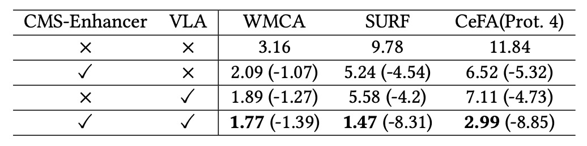

## Guidance from Language

[**FM-CLIP: Flexible Modal CLIP for Face Anti-Spoofing**](https://dl.acm.org/doi/pdf/10.1145/3664647.3680856)

---

In the field of Face Anti-Spoofing (FAS), "multimodal" usually refers to different sensors such as RGB, depth, and infrared.

However, in recent years, another "modality" has gained prominence: natural language.

## Problem Definition

Face Anti-Spoofing (FAS) originally focused on images themselves.

Researchers designed convolutional networks to extract features such as texture, depth, and reflectivity to distinguish between genuine and fake faces. However, as attack methods evolved, high-resolution printing, replay attacks, and 3D masks gradually made the single-modality defense fragile.

To address this escalation of attacks and defenses, the FAS community introduced multimodal fusion. RGB captures color, IR detects heat sources, and Depth measures structure. By combining signals from different sensors, researchers attempt to piece together a more accurate representation of reality.

But this approach has its cracks.

Multimodal fusion relies on all modalities being present during both the training and testing phases. If any sensor data is missing, the system's recognition capability collapses. Hardware costs and variations in environmental conditions make "modality consistency" a luxury.

The concept of Flexible Modal emerges, aiming to design a model that learns multimodal features during training but does not rely on all modalities being present during testing. However, previous research on Flexible Modal focused on traditional modalities like spectral, thermal, and geometric signals.

The rise of natural language presents another possibility.

Language does not directly capture the light and form of the world but describes, interprets, and aligns experiences. It offers an alignment mechanism beyond the sensor level, allowing heterogeneous observations to find commonality at the semantic level.

Perhaps, in the gaps of these fragmented modalities, we can rebuild the ability to discern authenticity using natural language as a bridge.

## Solution

:::tip
This paper uses CLIP as the underlying architecture. If you're unfamiliar with CLIP, you can refer to our previous paper:

- [**[21.03] CLIP: Breaking the Dimensional Barrier**](../../multimodality/2103-clip/index.md)

  :::

### Model Architecture

<figure style={{"width": "90%"}}>

</figure>

The authors propose **FM-CLIP**, a multimodal alignment model specifically designed for FAS, based on CLIP.

The entire architecture is built on a frozen CLIP model.

As shown in the figure above, FM-CLIP consists of two main branches:

- **Visual Branch**: Receives sensor data such as RGB and Depth and processes it through a ViT image encoder.
- **Language Branch**: Uses text vectors generated via prompt learning as auxiliary signals to guide visual feature alignment.

Next, we will carefully examine the design of each component according to the flow of signals.

### CMS-Enhancer

ViT, originally a pure self-attention network, lacks sensitivity to local structures and frequency signals.

To address this shortcoming, FM-CLIP inserts a **Cross-Modal Spoofing Enhancer (CMS-Enhancer)** at each ViT stage.

This enhancement splits the input features into two parallel channels:

- **Spatial Features** — Extracted using the Spatial Extractor (SE) for fine-grained texture extraction.
- **Frequency Features** — Extracted using the Frequency Extractor (FE) that maps the image to the frequency domain, capturing high-level structural differences.

**Spatial Extractor (SE)** operates as follows:

$$
F_{\text{SE\_output}}^{(j)} = \text{Conv1}(\text{GELU}(\text{Conv3}(\text{GELU}(\text{Conv1}(F_{\text{input}}^{(j)})))))
$$

$$
\hat{F}_{\text{spatial}}^{(j)} = F_{\text{SE\_output}}^{(j)} \oplus F_{\text{input}}^{(j)}
$$

**Frequency Extractor (FE)** works as:

$$
F_{\text{FE\_output}}^{(j)} = \sigma(\text{Conv1}(\text{GELU}(\text{Conv1}(\text{DCT}(F_{\text{input}}^{(j)})))))
$$

$$
\hat{F}_{\text{frequency}}^{(j)} = F_{\text{FE\_output}}^{(j)} \otimes F_{\text{input}}^{(j)}
$$

Here, the DCT (Discrete Cosine Transform) allows the model to understand structural and texture differences between modalities from a frequency perspective.

### Cross-Modal Interactor

Different modalities may vary greatly in spatial features, but in the frequency domain, they can be mapped onto a shared intermediate plane.

To facilitate this interaction in the frequency domain, FM-CLIP designs the **Cross-Modal Interactor (CMI)** module:

- First, a gate map is computed for each modality, marking regions with high and low information density.
- Then, based on the gate map, useful information from another modality is used to supplement and strengthen the weaker regions of the current modality.

**Calculating the gate map:**

$$
M_{\text{freq.RGB}} = \sigma(\text{Conv3}(F_{\text{freq.RGB}}))
$$

$$
M_{\text{freq.Depth}} = \sigma(\text{Conv3}(F_{\text{freq.Depth}}))
$$

**Interactive supplementation process:**

$$
eF_{\text{freq.RGB-Depth}} = (1-M_{\text{freq.RGB}}) \otimes eF_{\text{freq.Depth}}
$$

$$
eF_{\text{freq.Depth-RGB}} = (1-M_{\text{freq.Depth}}) \otimes eF_{\text{freq.RGB}}
$$

Finally, the original features of the modality, enhanced features, and supplemented features are fused:

$$
F_{E\_\text{freq.RGB}} = F_{\text{freq.RGB}} \oplus eF_{\text{freq.RGB}} \oplus eF_{\text{freq.RGB-Depth}}
$$

$$
F_{E\_\text{freq.Depth}} = F_{\text{freq.Depth}} \oplus eF_{\text{freq.Depth}} \oplus eF_{\text{freq.Depth-RGB}}
$$

These are then combined with the corresponding spatial features to form enhanced features.

In this way, the visual branch in each ViT block not only learns the details of its own modality but also absorbs frequency supplementation information from other modalities.

### Language-Guided Patch Alignment

Once the visual signals are processed, the authors introduce the natural language modality to further guide each patch to focus on spoofing cues.

In the text branch, FM-CLIP uses **Prompt Learning** technology to initialize a set of learnable context vectors $\mathbf{v} = \{v_1, v_2, ..., v_M\}$, and combines class labels $c_i$ to form the prompt:

$$
t_i = \{v_1, v_2, ..., v_M, c_i\}
$$

After processing through the text encoder $g(\cdot)$, a text feature $f_{\text{text}}$ is generated.

In the visual branch, we have already obtained the CLS token $f_{\text{img}}^{(0)}$ and the Patch tokens $f_{\text{img}}^{(1:N)}$.

FM-CLIP adopts dual alignment:

1. **CLS token alignment** — The similarity between the CLS token and the EOS (real/fake) vector is calculated for global classification.
2. **Patch token alignment (LGPA)** — A similarity matrix is computed for each Patch token and the text feature:

$$
S = f_{\text{img}}^{(1:N)} \cdot (f_{\text{text}})^T
$$

Then, weighted fusion is performed:

$$
\hat{f}_{\text{img}}^{(1:N)} = \text{softmax}(S) \cdot f_{\text{text}} + f_{\text{img}}^{(1:N)}
$$

This allows each patch to refocus, guided by language, on local cues where spoofing traces may exist.

### Loss Function Design

To supervise both global and local alignment, FM-CLIP introduces two loss terms:

- **CLS Loss (global alignment):**

  $$
  L_C = \text{CrossEntropy}(p_{\text{cls\_token}}, y)
  $$

- **Patch Loss (local alignment):**

  $$
  L_P = \text{CrossEntropy}(p_{\text{patch\_token}}, y)
  $$

The final total loss is:

$$
L_{\text{total}} = L_C + L_P
$$

This design maintains a balance between global recognition and local detail, allowing the model to capture both macro semantics and focus on microscopic flaws.

## Discussion

The authors tested the model on three commonly used multimodal FAS datasets:

- **CASIA-SURF (SURF)**: A three-modal dataset primarily focused on unknown attack types.
- **CASIA-SURF CeFA (CeFA)**: Includes racial and modality variations, using Protocols 1, 2, and 4.
- **WMCA**: High-fidelity multi-attack scenarios, covering both "seen" and "unseen" evaluation contexts.

The experiments include two testing settings:

- **Fixed Modal**: Training and testing modalities are the same.
- **Flexible Modal**: Only one modality's data is provided during testing.

Evaluation metrics used include APCER, BPCER, and ACER as standards.

### Fixed Modal Results

:::tip
Due to space limitations, only the SURF dataset charts are shown here. Please refer to the original paper for the charts of the other two datasets.
:::

<figure style={{"width": "90%"}}>

</figure>

In the fixed modality setting, FM-CLIP shows a stable improvement trend.

- **SURF dataset**:
  After introducing CMS-Enhancer, the ACER decreased from 0.45 to 0.44; after integrating LGPA, it further dropped to 0.43.
- **WMCA dataset (unseen protocol)**:
  CMS-Enhancer reduced the ACER from 2.49% to 2.36%, and with LGPA, FM-CLIP finally dropped to 2.29%.
- **CeFA dataset**:
  On the three protocols, FM-CLIP slightly reduced the APCER, BPCER, and ACER metrics, demonstrating robust cross-domain generalization capabilities.

Since FM-CLIP has fewer trainable parameters than FM-ViT, its absolute performance is slightly lower than FM-ViT in the WMCA "seen" scenario, which is an expected trade-off.

### Flexible Modal Results

In the more challenging flexible modal tests, FM-CLIP shows a clear advantage.

- **SURF dataset**:
  In the RGB, Depth, and IR single-modal settings, FM-CLIP outperforms FM-ViT across the board, achieving up to a 2.17% reduction in ACER.
- **CeFA Protocol 4**:
  Especially in the IR modality, FM-CLIP reduced the ACER by 8.1 points compared to FM-ViT, showing its particular effectiveness in handling challenging infrared data.
- **WMCA (seen protocol)**:
  FM-CLIP showed additional improvement across all modalities (RGB, Depth, IR), maintaining a stable low error rate.

### Core Component Analysis

<figure style={{"width": "70%"}}>

</figure>

The authors conducted ablation experiments on the two main modules of FM-CLIP, CMS-Enhancer and VLA (Vision-Language Alignment). The experiments were conducted on the WMCA (seen), SURF, and CeFA (Protocol 4) datasets in the flexible modal setting.

The results show:

- When **CMS-Enhancer** was introduced alone, the ACER decreased by more than 4%, effectively improving the stability of visual features.
- When **VLA** was introduced alone, it also resulted in approximately a 4% decrease, proving the role of language guidance in aligning local features.
- After **integrating both modules (FM-CLIP)**, the ACER dropped by 8% to 9% across all datasets, demonstrating the complementary nature of the two modules.

## Conclusion

The introduction of Vision-Language Models (VLM) into the FAS field has become a popular trend in recent years.

In the context of heterogeneous data sources and varying attack methods, relying on a single sensor or handcrafted feature design has become increasingly difficult to maintain a stable recognition system. Natural language, as a high-level alignment mechanism, provides potential links across sensors and attack types and has become a direction many researchers are attempting to leverage.

From this research, we can observe two important directions in current studies:

1. **When physical-level observations inevitably fragment, alignment and repair at the semantic level will become an essential pillar for recognition systems.**
2. **Simple language guidance is not enough to fully replace sensor-level information reinforcement; frequency space, local structure, and semantic correlations need to be more tightly integrated.**

FM-CLIP, with its lightweight design, demonstrates the feasibility of cross-modal alignment and opens up the possibility of deeper structural modeling and active perception repair.
