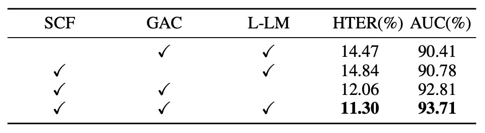

## The Final Chapter of Classification

[**Interpretable Face Anti-Spoofing: Enhancing Generalization with Multimodal Large Language Models**](https://arxiv.org/abs/2501.01720)

---

Face anti-spoofing is commonly treated as a binary classification task: Real or Spoof.

However, if we ask "Why?", most models cannot provide an answer.

In fact, they do not even allow you to ask "Why?".

## Problem Definition

Existing face anti-spoofing models are mostly trained on a single objective — classifying input images as either real or fake.

This logic has been used for years, but frequently fails in scenarios such as:

- Large style gaps between test scenes and training data
- New spoofing techniques (e.g., high-definition replay, 3D masks)
- User groups with cultural, device, or geographic differences

Researchers have tried various approaches to strengthen generalization ability, including:

1. **Domain Adaptation (DA)**: Exposing the model to target domain data for feature alignment
2. **Domain Generalization (DG)**: Learning stable feature distributions from multiple source domains
3. **Incremental Learning (IL)**: Introducing new data domains while preserving prior knowledge

Yet, regardless of the method, the essence remains extracting "liveness features" from images — features that the models themselves mostly cannot interpret.

This is the core issue:

> **We train a system that can judge but cannot explain.**

It can tell you "this is fake," but cannot specify "where it is fake" or "why it is fake."

We let the model see the image but never taught it how to tell a reasonable story.

Ironically, human recognition is precisely based on storytelling.

## Solution

"Is this real?"

For face anti-spoofing models, this question should not only have an answer but also an explanation.

The I-FAS framework is built on this belief, translating the FAS task into an "image question answering" problem.

To make the model answer like a human, three aspects need to be addressed: **language construction, feature alignment, and training strategy**.

## Spoof-aware Captioning and Filtering (SCF)

Most general captioning models only focus on facial expressions, clothing, or background, but ignore key spoofing clues.

As illustrated below:

<figure style={{"width": "80%"}}>

</figure>

The traditional captioner output is denoted as $T_F$, while after fine-tuning by the authors, the spoof-aware captioner is $T_S$.

As shown, traditional captions tend to be vague, whereas the fine-tuned spoof-aware captioner can explicitly indicate the attack medium (e.g., _screen_, _paper_, _mannequin_) embedded in the sentence, forming a convincing semantic basis.

The SCF process is as follows:

- Aggregate 12 public datasets into $D$, labeled with real or fake samples $(I_i, Y_i)$.
- Build a dictionary of spoof keywords $K$, categorized by attack types.
- Use a general captioner $C_G$ to generate initial descriptions $T_F$ for all fake images.
- Filter out captions that **do not contain corresponding keywords**, keeping a subset $D_S$ that clearly reflects attack features.
- Fine-tune $C_G$ on $D_S$ to obtain the spoof-aware captioner $C_S$.
- Finally, generate captions for all real images to form training data with semantic differences.

This strategy equips each data sample not only with labels but also **semantic explanations**, enhancing the model’s contrastive learning and interpretability.

## Multimodal Instruction Tuning with GAC

After completing the preparation of training data, we move on to the model training stage.

The overall model architecture is shown above. I-FAS consists of three main components:

- **Visual Encoder $E_V$**: Extracts features $X_V \in \mathbb{R}^{N \times D}$ from input image $I \in \mathbb{R}^{H \times W \times 3}$.
- **Cross-modal Connector $P_{V \to T}$**: Maps $X_V$ into the token space of the language model.
- **Language Model $\Phi_T$**: Automatically answers questions and generates natural language descriptions based on visual features and textual prompts.

### Globally Aware Connector (GAC)

To achieve more comprehensive and detailed visual semantics, the authors propose the GAC module, which aims to transmit multi-level global features to the language model. The detailed process is as follows:

- Extract $g_i$ (i.e., cls tokens) from each layer of the visual encoder, forming $G_V = \{g_1, ..., g_L\}$.

- Linearly project these into $Q_V$ and concatenate with learnable query vectors $Q_P$:

  $$
  Q = \text{Concat}(Q_P, Q_V)
  $$

  where $Q_P$ employs the commonly used prefix tuning technique.

- Then, $Q$ undergoes multi-head self-attention (MSA) and multi-head cross-attention (MCA) combined with regional features $X_V$:

  $$
  \begin{aligned}
  Q' &= Q + \text{MSA}(\text{LN}(Q)) \\
  Q'' &= Q' + \text{MCA}(\text{LN}(Q'), \text{LN}(X_V)) \\
  X_T &= Q'' + \text{MLP}(\text{LN}(Q''))
  \end{aligned}
  $$

This means using $Q$ as the main query to attend to image features and find liveness-specific representations.

Typically, shallow features help capture texture details (e.g., moiré patterns, blur), while deep features tend to abstract semantics; GAC integrates these perspectives into the language output. Thus, the input to the language model is not a single feature, but a **cross-modal representation that fuses visual depth, spatial, and semantic hierarchies**.

## Lopsided Language Model Loss (L-LM Loss)

Once the model learns to "speak," the next question is:

> **Should it speak the "result" first or the "reason" first?**

The authors reformulate the FAS task into a single-turn question-answer format, with training data composed of three parts: $(I, T_Q, T_A)$

where:

- $T_Q$ is a fixed instruction sentence:
  "Is this photo of a real person?"
- $T_A$ is a two-segment answer format:

  $$
  T_A = [T_{\text{Judgment}},\ T_{\text{Interpretation}}]
  $$

Here, $T_{\text{Judgment}}$ is the model’s real/fake decision (“Yes” or “No”), and $T_{\text{Interpretation}}$ is a semantic explanation generated by the captioner ($C_G$ or $C_S$) to justify the judgment.

Using traditional LM loss, the model treats the entire $T_A$ as continuous text for autoregressive learning.

This leads to two issues:

1. **Unclear semantic focus**: The model may overly mimic the style of the caption at the sentence end, neglecting key judgment tokens.
2. **Noise hampers convergence**: Explanations often contain detailed noise, offering limited help to the core FAS decision and slowing the model’s convergence on the main task.

To enable the model to first learn the "correct judgment" and then the "reasonable explanation," the authors adopt an asymmetrically weighted language model loss called **Lopsided LM Loss (L-LM Loss)**:

$$
L_{\text{total}} = \alpha L_{\text{Judgment}} + (1 - \alpha) L_{\text{Interpretation}}
$$

where:

- $L_{\text{Judgment}}$ is the token-level loss for the judgment part (Yes/No)
- $L_{\text{Interpretation}}$ is the loss for the explanation part
- $\alpha \in [0,1]$ is a hyperparameter controlling the training focus

By increasing $\alpha$, the model initially concentrates on the primary judgment task, reducing noise interference from captions; meanwhile, the semantic explanation still acts as auxiliary supervision, gradually teaching the model to explain after judgment stabilizes.

This design not only improves accuracy but also enhances the **convergence speed and stability** during training.

## Discussion

### Cross-Domain Generalization Evaluation

<figure style={{"width": "90%"}}>

</figure>

First, **Protocol 1** uses four classic datasets in a leave-one-domain-out test.

As shown in the table, I-FAS achieves superior performance over previous state-of-the-art methods across all groups, with an average HTER reduced to **1.33%**. This demonstrates that by incorporating natural language supervision, the model gains greater tolerance to data distribution shifts. In contrast, unimodal methods relying solely on classification tokens tend to degrade in accuracy across varying environments.

**Protocol 2** pushes the experiment to an extreme: training only on CelebA-Spoof as a single source, while testing on 11 unseen datasets differing in attack types and sensing devices.

Experimental results:

<figure style={{"width": "90%"}}>

</figure>

Under this setting, I-FAS surpasses FLIP and ViTAF by more than **7 percentage points** in average AUC, maintaining stability against challenging conditions such as **3D masks (SURF-3DMask)**, **makeup interference (HKBU-MARs)**, and **novel material attacks (SIW-M-V2)**. This confirms the framework’s ability to handle highly heterogeneous attack variations.

### Module Contributions

<figure style={{"width": "70%"}}>

</figure>

To verify the tangible contribution of each module, the authors performed sequential ablation experiments on three core components and observed their effect on generalization. Results are shown above:

- **Removing SCF** causes the model to revert to only outputting Yes/No responses, leading to a significant rise in HTER (+3.17%) and a drop in AUC (−3.30%). This indicates that captions are not merely additional text but effective supervisory signals.
- **Removing GAC** causes loss of global semantic integration from encoder layers, degrading performance accordingly. This shows that different feature layers have distinct roles in perceiving spoofing cues.
- **Replacing L-LM Loss with standard LM Loss** results in a smaller performance drop, but training convergence speed and stability decline, with overfitting more likely on high-variance test sets.

### Caption Type Analysis

<figure style={{"width": "70%"}}>

</figure>

Does text diversity necessarily imply better generalization?

The authors conducted relevant experiments. The table compares various textual supervision formats, illustrating that semantic content in captions is key:

- Using only judgment tokens (Yes/No) or diverse template statements does not significantly improve performance.
- When captions explicitly indicate attack clues (e.g., “tablet screen,” “mask texture”), AUC improves significantly to **93.71%**, outperforming all baselines.
- Replacing spoof-aware captions with generic captions ($T_F$) decreases performance, indicating that specificity of information matters more than corpus diversity.

### L-LM Loss Hyperparameter Study

<figure style={{"width": "70%"}}>

</figure>

Analysis shows that the hyperparameter $\alpha$ in L-LM Loss, which controls the weight between judgment and interpretation, should stay at a mid-value (\~0.7) to balance accuracy and learning stability:

- If $\alpha$ is too high, the model focuses almost exclusively on Yes/No judgments, causing the semantic part to fail and indirectly weakening generalization.
- If $\alpha$ is too low, caption noise dominates the loss, hindering convergence.

This loss design enables the model during fine-tuning to quickly align critical statements, forming a syntax-structured classification process rather than pure token matching.

### Explanation Capability Visualization

Earlier we compared spoof-aware captions with generic captions; the former can produce clues like “wrinkles on paper” or “glare from glossy screen,” providing the model with additional perceptual anchors. These terms serve not only linguistic functions but also simulate human visual focus guidance.

Finally, the figure below visualizes predictions under the interpretable QA setting. Despite training on a single domain, the model can generate structurally coherent answers with both judgment and explanation parts on most unseen datasets, demonstrating strong semantic summarization ability.

## Conclusion

When models can only learn to answer "yes" or "no," we can only expect a confidence score output, but remain blind to why and based on which clues the decision was made.

This classification mindset, while helpful for system development and evaluation, traps models in a black-box framework, struggling to cope with cross-domain generalization, evolving attack types, and changing deployment scenarios.

This study attempts to redefine the output format of this task by introducing natural language question answering and caption-assisted supervision, enabling models not only to "answer true or false" but also to "explain their reasoning."

This shift in supervision syntax reflects a broader trend in computer vision:

> **From single-label to structured semantic descriptions.**

Experimental results show that this semantic guidance brings substantial benefits. Whether in Protocol 1’s multi-source generalization test or Protocol 2’s extreme single-source setting, I-FAS achieves the best performance so far on the OCIM metric.

This confirms that language not only aids learning but also stably enhances the model’s perception and understanding of anomalous samples. This rewrite driven by language is not merely the process of models learning to speak, but an opportunity to rethink the boundaries of the FAS task.

The moment the model begins to speak, perhaps not only FAS but

> **All classification tasks will eventually face a different destiny.**
