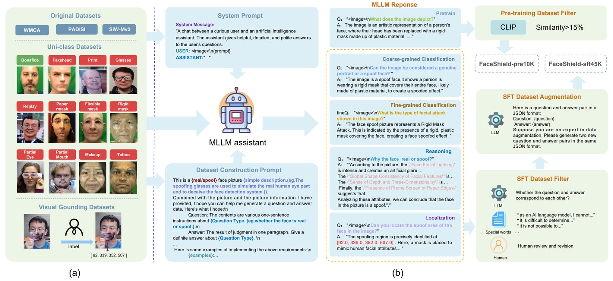
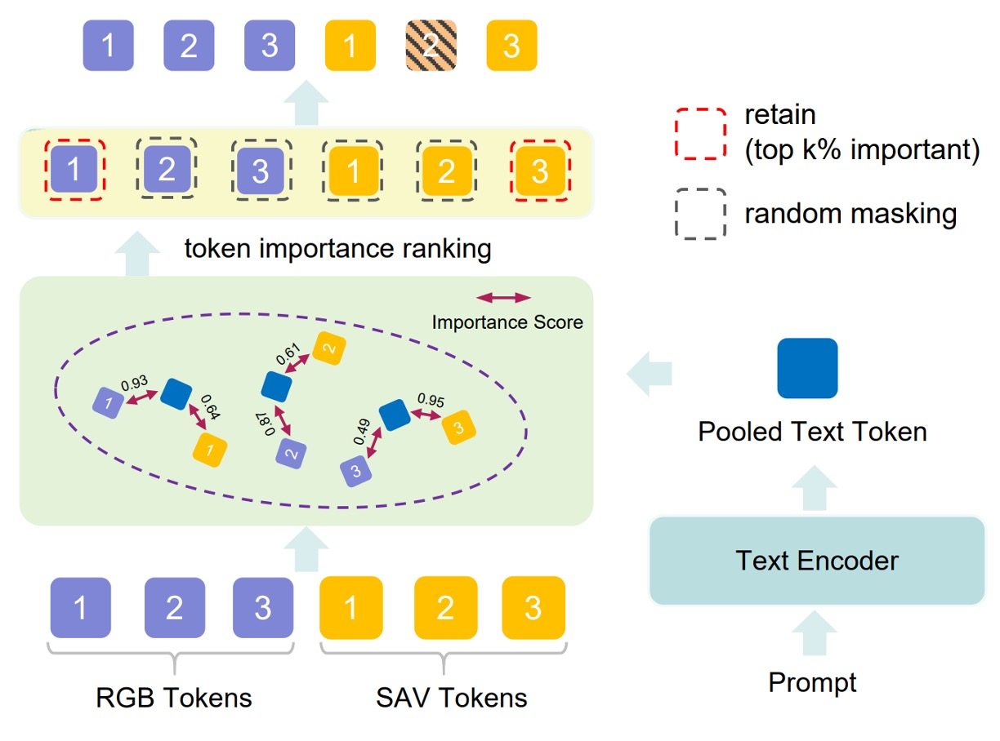
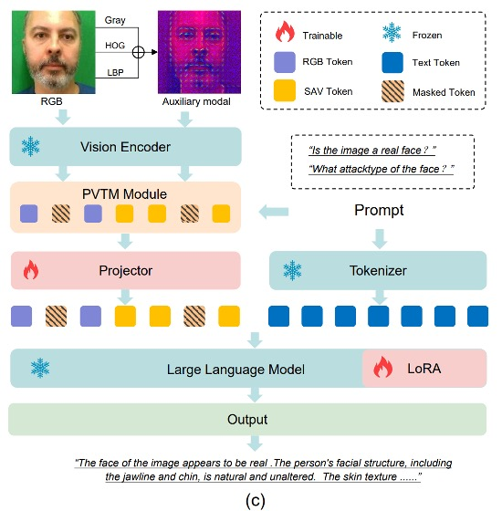
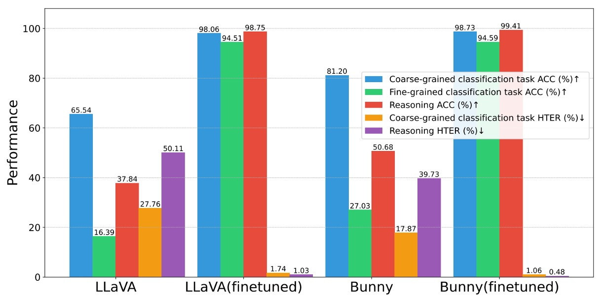

## Shield for Faces

[**FaceShield: Explainable Face Anti-Spoofing with Multimodal Large Language Models**](https://arxiv.org/abs/2505.09415)

---

Do you still remember the dataset paper SHIELD we read not long ago?

This time, let's take a look at the related follow-up applications.

## Problem Definition

Face Anti-Spoofing (FAS) is an indispensable security mechanism in facial recognition systems that prevents spoofing attacks such as photos, videos, and masks from misleading the model. Over the past decade, the research community has proposed a large number of methods addressing this problem, which can be roughly divided into two main directions:

The first type are vision models based on CNNs or Vision Transformers as backbone, supplemented with auxiliary features such as reflection light, depth maps, rPPG signals, and gradient signals, treating the task as a simple binary classification between live and fake faces; these methods perform well on training data but show significantly limited generalization ability when facing unseen scenarios or new attack types.

The second type are recently emerging vision-language methods, which train models using paired images and text, with CLIP being a representative example. These methods leverage semantic signals from language descriptions to assist judgments, improving over traditional models that rely on spurious features.

However, VLM methods still have two major unresolved issues:

- First, they lack **explainability** and cannot answer why a face is fake;
- Second, they cannot localize forged regions on the fake face nor handle classification and reasoning tasks simultaneously.

Even worse, both visual models and VLM methods suffer from severe scarcity of training data. Most FAS datasets only contain labels and images, lacking descriptive annotations that support reasoning tasks, which directly limits the language ability and generalization potential of the models.

What about Multimodal Large Language Models (MLLM)?

Although general-purpose MLLMs such as GPT-4V and LLaVA have demonstrated strong capabilities in tasks like remote sensing, medical imaging, and deepfake detection, they perform only moderately on FAS tasks. The main reason is that current language models lack specific knowledge about face spoofing attacks, and off-the-shelf vision encoders struggle to detect subtle texture differences between real and fake faces.

Some prior works attempted instruction tuning to build FAS models with descriptive capabilities and integrated multiple datasets to improve semantic recognition, but such methods still cannot simultaneously handle classification, reasoning, and localization tasks. Real-world attacks are often composite in nature, and these limitations make it difficult for existing models to be practical.

Thus, the question arises:

> **Can we build a model that truly understands the suspicious aspects of a fake face, can explain why, and even point out where the deception starts?**

## Proposed Solution

To enable a multimodal language model to learn to detect fake faces, just using text and images is insufficient.

It requires task-specific, semantically complete, and structurally coherent training data, and even needs to understand “why this face is suspicious” at multiple levels. The authors believe the key starting point is the data.

To this end, the authors first designed the concept of their dataset as shown below:

FaceShield’s training data consists of two stages:

- **FaceShield-pre10K**: for pretraining, enabling the model to acquire basic descriptive and comprehension abilities;
- **FaceShield-sft45K**: for instruction fine-tuning (SFT), strengthening the model’s concrete performance across multiple tasks.

The research team integrated popular FAS datasets including WMCA, PADSIS, and SiWMv2, unifying their labels into 12 categories:

> Bonafide, Fakehead, Print, Glasses, Replay, Paper mask, Flexible mask, Rigid mask, Partial Eye, Partial Mouth, Makeup, Tattoo

Not only did they keep image-level labels, but also provided precise bounding boxes and coordinates for locally forged regions, resulting in 12,091 images with category labels and 3,139 images with forged region annotations.

After collecting images and labels, the next step was to help the language model understand this information.

The authors used Bunny-Llama-3-8B-V as the generation assistant, guiding the model with system prompts to produce descriptive sentences and generating corresponding QA pairs according to different task types.

For **FaceShield-pre10K**, the process was relatively straightforward: the model generated descriptive text based on images, which were then filtered by CLIP similarity (below 15% removed) to ensure a strong vision-language correspondence.

For **FaceShield-sft45K**, the process was more rigorous, covering four types of task instructions along with multi-level filtering and enhancement strategies:

- The MLLM first outputs multiple QA pairs, which are filtered manually and by keywords to remove errors;
- Then LLaMA3 is used to linguistically enhance the remaining QA seed data, improving sentence diversity and dialogue fluency.

The four tasks are illustrated as follows:

- **Coarse-grained Classification**: recognizing whether the face is real or fake;
- **Fine-grained Classification**: identifying the specific attack type of the fake face;
- **Reasoning**: verbally describing the judgment basis from image features;
- **Attack Localization**: detecting forged face regions and marking attack coordinates.

### Model Architecture

Training a multimodal large language model (MLLM) tailored for face anti-spoofing (FAS) tasks has two core objectives:

1. **Enable the visual encoder to better distinguish subtle differences between real and fake faces;**
2. **Enable the language model to make more causally reasoned generalized judgments from semantic prompts.**

However, if training directly on RGB images paired with QA, as shown in (a), the model faces a challenge:

- **In RGB space, real and fake faces look too similar.**

This makes it difficult for the model to stably learn reliable discriminative features, limiting generalization.

To solve this problem, the authors introduced two key modules:

- **SAVP (Spoof-Aware Vision Perception)**: enhancing the model’s perception of spoof details via visual preprocessing;
- **PVTM (Prompt-Guided Vision Token Masking)**: dynamically adjusting the model’s attention focus based on language prompts.

Together, these two modules build a more sensitive and more explainable FAS MLLM.

### Spoof-Aware Vision Perception (SAVP)

As illustrated in (b), the core idea of SAVP is that **appearance in RGB space alone is insufficient to effectively distinguish live from spoof faces, but combining image texture and gradient information can amplify these subtle differences.**

Specifically, for each input image, SAVP computes three additional local features, which are combined into a three-channel input:

- **LBP (Local Binary Pattern):** reflects local texture variation
- **Gray (Grayscale):** removes color interference, emphasizing luminance structure
- **HOG (Histogram of Oriented Gradients):** captures edge orientation and gradient energy distribution

These image features are concatenated as three channels and fed into the visual encoder to extract spoof-aware feature representation $V_{\text{SAV}}$, which is then concatenated with the original RGB features $V_{\text{RGB}}$ as the total visual input:

$$
V_{\text{SAV}} = \text{Encoder}([\text{LBP}, \text{Gray}, \text{HOG}])
$$

$$
V = [V_{\text{RGB}}, V_{\text{SAV}}]
$$

This design provides the model with two types of visual cognition: one from appearance, the other from texture and structure.

### Prompt-Guided Vision Token Masking (PVTM)

<figure style={{"width": "70%"}}>

</figure>

Even with rich visual features extracted, if the model cannot focus on **task-relevant regions**, it can still be distracted.

PVTM offers a mechanism to dynamically select visual tokens as follows:

- For each visual token $V_i$ and language prompt $P$, compute their cosine similarity:

$$
\text{Sim}(V_i, P) = \frac{V_i \cdot P}{\|V_i\| \cdot \|P\|}
$$

- Convert to weight ranking scores via softmax:

$$
S_{\text{rank}}(V_i, P) = \frac{e^{\text{Sim}(V_i, P)}}{\sum_j e^{\text{Sim}(V_j, P)}}
$$

Then keep the top $k\%$ most important tokens and randomly mask the remaining tokens with probability $p\%$ to reduce irrelevant feature influence.

This enables the model’s visual attention to vary with prompts for tasks such as classification, reasoning, and localization, enhancing task adaptability and robustness against noise.

### Model Workflow

<figure style={{"width": "70%"}}>

</figure>

The overall architecture shown in (c) flows as follows:

1. Convert input images into two sets of features: $V_{\text{RGB}}$ and $V_{\text{SAV}}$;
2. Merge and apply PVTM to select the most important visual tokens;
3. Project the selected tokens and align them with the language prompt, yielding fused input $V_{\text{align}}$:

$$
V_{\text{align}} = \text{Projection}(V_{\text{RGB}}, V_{\text{SAV}})
$$

4. Input $V_{\text{align}}$ together with the prompt $P$ into the language model, producing task prediction $Y$:

$$
Y = \text{MLLM}(V_{\text{align}}, P)
$$

### Two-Stage Training

FaceShield adopts a two-stage training strategy:

- **Stage 1: Pretraining**

  Using the previously constructed **FaceShield-pre10K**, this stage aligns features extracted by the visual encoder with language prompts, **establishing correspondence channels between vision and language**.

  - The vision encoder comes from a pretrained model; only the **Projector and PVTM modules** are fine-tuned;
  - Training follows **continual pretraining** on existing weights;
  - Loss function is **cross-entropy**, optimizing next-token prediction as the language objective;
  - Pretraining lasts for **one epoch**, focusing on rapid embedding space alignment rather than strengthening semantic generation.

- **Stage 2: Instruction Fine-tuning (SFT)**

  This critical adaptation stage uses **FaceShield-sft45K** to fine-tune the model to answer four specific task queries.

  Fine-tuned modules include:

  - **LoRA layers** (lightweight adapters inside the language model)
  - **Projector** (vision-language bridging module)

  LoRA (Low-Rank Adaptation) efficiently adjusts the large language model by inserting LoRA submodules in each Transformer block, with parameters:

  - Hidden size: 128
  - Scaling factor: 256

  The loss remains cross-entropy with next-token prediction, but emphasis shifts to language performance and task responsiveness.

## Discussion

### Intra-dataset Evaluation

<figure style={{"width": "60%"}}>

</figure>

Experimental results show that when trained and tested on the same dataset sources (W/S/P), FaceShield significantly outperforms two main competitor types:

1. **Traditional FAS methods**

   - These mainly rely on CNNs or ViTs, combined with lighting, depth, or frequency features for binary classification.
   - Although expected to excel on in-dataset training, they exhibit noticeably higher HTER, indicating substantial misclassifications.

2. **Zero-shot capability of general-purpose MLLMs**

   - Such models are not fine-tuned for FAS tasks, relying solely on prior language/vision knowledge for inference.
   - Results show even models at GPT-4V or LLaVA levels remain unreliable for spoof detection.

3. **Finetuned MLLM baseline: Bunny**

   - The authors fine-tuned the open-source MLLM “Bunny” on the same data (SFT) as a strict baseline.
   - FaceShield achieves roughly 1% lower HTER than the finetuned Bunny despite using identical visual and language data.

### Cross-dataset Evaluation

<figure style={{"width": "60%"}}>

</figure>

This table presents cross-dataset generalization results.

Each experiment trains on two of the three datasets (e.g., S + P) and tests on the excluded one (e.g., W), denoted as `S&P → W`. There are three such permutations corresponding to three domains.

FaceShield’s HTER is substantially lower than traditional methods and MLLM baselines in all settings; notably, under the most challenging `S&P → W` protocol, FaceShield achieves 5.72% HTER—among the best performances reported for this task.

### Ablation Studies

1. **Effectiveness of Instruction Dataset**

   If the instruction dataset is effective, can it improve other models as well?

   The authors applied the same dataset for pretraining and finetuning on open-source MLLMs like LLaVA and Bunny.

   Results (shown below) demonstrate significant improvements on all three tasks (coarse classification, fine classification, reasoning), with average gains exceeding **+10% accuracy and –4 percentage points HTER**.

   This confirms the dataset’s transferability and the broad utility of the data construction and prompt design.

   

    <figure style={{"width": "60%"}}>
    
    </figure>
    

2. **Effectiveness of SAVP (Spoof-Aware Vision Perception)**

   

   Comparing the top two rows: baseline (RGB only) versus RGB + SAVP.

   Experiments show improvement across all four tasks, especially in attack localization.

   This confirms that **low-level texture features supplement the encoder’s perception gaps on subtle changes**, aiding recognition and localization of “camouflage details.”

3. **Effectiveness of PVTM (Prompt-Guided Vision Token Masking)**

   Referring to the last row of the same table:

   PVTM yields significant gains on coarse classification, fine classification, and localization tasks; the only exception is a slight drop in reasoning, likely due to context loss caused by masking.

### Visualization Analysis

<figure style={{"width": "80%"}}>

</figure>

If a model claims a face is fake, where is it “looking” to make this claim?

The authors provide this answer.

Figure (a) shows token importance scores—how strongly visual tokens respond to language prompts—across three different attack types.

Results indicate that **the model’s most sensitive tokens cluster around facial regions (eyes, nose, mouth)** for both coarse and fine classification tasks; details in these areas directly determine the output.

This demonstrates the model has learned to focus on semantically relevant regions guided by prompts rather than guessing from the whole image.

Figure (b) compares RGB and SAV tokens for “attack region detection”:

- Left: an eye mask example:

  - RGB token importance is **highly dispersed** with no clear focus;
  - SAV tokens distinctly **focus on the eye mask region**, accurately highlighting the attack area;

- Right: a composite attack (eye mask + hand obstruction):

  - Combined RGB and SAV tokens enable the model to detect **both eye disguise and hand occlusion**, showing SAV’s ability to **compensate RGB perception blind spots**, enhancing regional understanding.

## Conclusion

This paper extends traditional binary classification into a multi-task framework including coarse classification, fine classification, semantic reasoning, and localization. The model not only tells if a face is real or fake but explains why, identifies abnormal regions, and focuses on image features most valuable for judgment under language guidance.

Such capability transforms anti-spoofing systems from simple classifiers into discriminators with semantic logic, visual interpretability, and multi-step reasoning—beyond mere “yes or no” answers.

The ability to say **“why it is fake”** and **“where the fake is”** represents current expectations and major research trends.

:::tip
Previously, we reviewed I-FAS.

I-FAS mainly demonstrated that descriptions can serve as supervision signals, while FaceShield complements visual details so that language, texture, and spatial location simultaneously inform decisions.

If one prefers a simpler model with refined caption design, I-FAS is indeed “purer”; but if the goal is an all-weather, cross-device, repeatedly convincing practical system, FaceShield’s comprehensive task coverage and localization explanation make it a more complete design.
:::
