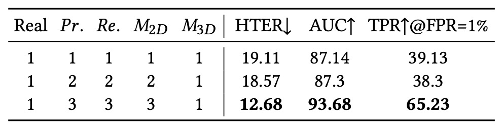
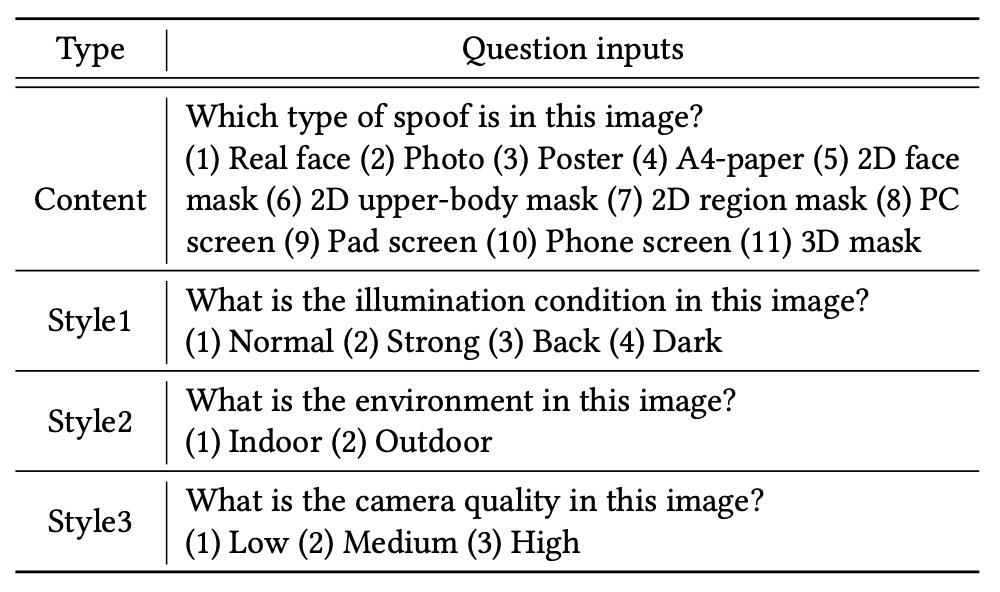
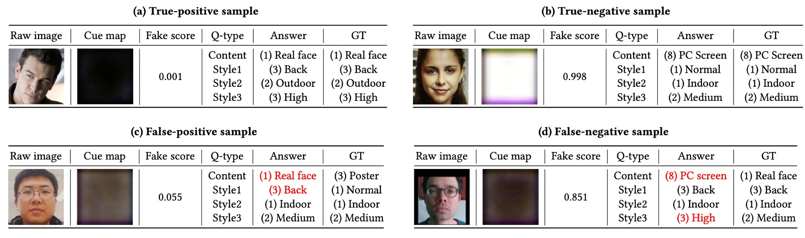

## The Wall of Sighs

[**InstructFLIP: Exploring Unified Vision-Language Model for Face Anti-spoofing**](https://www.arxiv.org/abs/2507.12060)

---

Face recognition technology is a mirror.

It reflects the progress of artificial intelligence in "seeing" human appearances, while also exposing the fragility of our definition of "reality."

## Problem Definition

This technology has moved from the periphery of biometrics into daily life, replacing passwords, unlocking devices, and even deciding who can cross borders.

However, when a high-resolution photo, a looping video, or even a perfectly shaped silicone mask can fool the system, we must admit: this mirror is not reliable.

Face Anti-Spoofing (FAS) was born to address this. Researchers started from binary classification models, gradually adding attention mechanisms, generative adversarial networks, and auxiliary learning modules, trying to expose the illusion of fake faces.

Next, Domain Adaptation (DA) and Domain Generalization (DG) emerged to provide remedies for cross-device and cross-scene problems. But their cost is enormous annotation effort and repeated training torture, making "each new scene comes with an added cost" a pain point the industry cannot ignore.

Until 2023, the emergence of **FLIP** brought new imagination.

It first introduced the language modality from CLIP, attempting to incorporate the "semantics of faces" into the detection system, using language to describe the authenticity of the scene. This approach opened the door for cross-modal FAS, but language only played a supportive role; semantics had not yet become core.

Soon after, **CFPL-FAS** continued this path, adopting the more powerful BLIP-2 architecture with the Q-Former bridging module, attempting a deeper alignment of image and language features. It introduced more structured prompt design, converting "attack types" and "environmental conditions" into language commands, improving the model's situational awareness.

However, it still could not escape the framework limitations of "relying on explicit annotations" and "training separately for each domain." Its generalization capability remained unstable, and its language description ability was limited, failing to serve as true semantic understanding.

In 2025, **I-FAS** further emphasized the model's understanding of context by strengthening language-guided depth via "prompt engineering," enhancing adaptability to unknown attack types. Although effective, it was still built on the traditional leave-one-out DG training process, resulting in repeated computational resource consumption and difficulty in unified generalization.

In other words, these studies—from FLIP to CFPL to I-FAS—while continuously expanding the semantic boundary of FAS tasks, all left sighs by the same wall:

> **Models cannot understand the world with a unified language, nor maintain consistent reasoning across diverse environments.**

So, do we really need more training and bigger models to climb over this wall? Is there untapped power in language? Can we build a model that can understand language, see through illusions, and learn the whole picture at once?

## Problem Solution

One of the greatest challenges models face in FAS tasks comes from the feature distribution gap caused by different datasets, scenes, and devices.

Traditional solutions typically choose a "wide-net" approach: repeatedly train across multiple domains and validate one by one, trying to piece together a cross-domain applicable model. But this method is costly: every added domain exponentially increases computational resources and training cycles.

To solve this, InstructFLIP proposes a **unified generalization framework** with the core idea:

> **Instead of letting the model blindly guess the attack and environment behind each face, directly give it clear language instructions.**

This strategy is built on a key dataset: **CelebA-Spoof**.

CelebA-Spoof has highly annotated semantics and complete scene variables, allowing us to design explicit prompt sentences for each image, enabling the model to learn all types of spoof and scene conditions in one go.

To effectively cover the semantic space, InstructFLIP’s instructions are clearly divided into two categories:

- **Content Prompts**: Asking "What type of attack is this image showing?"

  Options include photo, screen, flat mask, partial occlusion, 3D mask, etc.—a total of 11 spoof types plus real face classes. For example:

  > _“Choose the correct option for the following question: Which spoof type is in this image?”_

- **Style Prompts**: Asking "What is the shooting environment of this image?"

  Options cover lighting conditions (normal/backlight/dark/strong light), scenes (indoor/outdoor), camera quality (low/medium/high). For example:

  > _“What is the illumination condition in this image?”_

  > _“What is the environment of this image?”_

  > _“What is the camera quality in this image?”_

This language structure does not merely transform the image into a multi-class classification problem, but lets the model "understand what the task is," learning to extract corresponding feature regions from the image guided by instructions.

### Model Architecture

<figure style={{"width": "90%"}}>

</figure>

The above figure shows the entire InstructFLIP architecture, which can be divided into three core modules:

- **(a) Content Branch**
- **(b) Style Branch**
- **(c) Feature Fusion and Judgment Module (Fusion + Classifier & Cue Generator)**

Below, we analyze the figure step-by-step following the data flow.

### Content Branch

The Content Branch is responsible for learning semantic representations directly related to attack types, aiming to enable the model to judge which spoof attack category an input image belongs to, or whether it is a real face.

The process starts from the image $x$, which is passed through the visual encoder $E$ to obtain deep features $f_c$ representing the content semantics of the image. Then, it enters the language-driven key module **Q-Former**, bridging language instructions and image semantics.

Specifically, the authors design a set of content prompts in the form of multiple-choice questions, for example:

> _"Choose the correct option for the following question: Which spoof type is in this image?"_

Options range from real face to various spoof types (photo, screen replay, 2D mask, 3D mask, etc., totaling 11 types). These prompts are converted into instruction embedding vectors $T_c \in \mathbb{R}^{j \times d}$, concatenated with a set of learnable query vectors $Q_c \in \mathbb{R}^{k \times d}$, serving as initial input to Q-Former:

$$
h = Q_c \oplus T_c
$$

Inside Q-Former, multiple layers of attention modules are stacked:

1. **Multi-Head Self-Attention (MSA)**: Updates internal relations between queries and semantic instructions:

$$
\tilde{h} = h + \phi(h)
$$

2. **Cross-Modal Attention (MCA)**: Interacts the updated representation with image content features $f_c$, extracting key visual semantics:

$$
\hat{h} = \tilde{h} + \psi(\tilde{h}, f_c)
$$

This process enables the query vectors to "correspond" to the semantic targets the instruction aims to find, e.g., "Does this face have suspicious attack features?" or "Does it show a specific spoof pattern?"

The final query representation, combined with the original instruction embeddings, forms a soft prompt fed into the frozen Large Language Model (LLM) layer for semantic-guided prediction, producing content branch prediction $p_c$.

The loss function uses standard cross-entropy:

$$
\mathcal{L}_c = - \sum y_c \log(p_c)
$$

where $y_c$ is the ground truth class label. This design lets the content branch focus on learning discriminative cues related to spoof types, filtering out background interference, improving the model's ability to analyze attack patterns.

### Style Branch

The Style Branch acts more like a background observer, primarily tasked with understanding "how this face was captured."

Domain shifts in FAS tasks often come not from attack method changes but from differences in "environment and device." For example, a real face taken at dusk with low resolution may look more like an attack sample than a brightly lit, clear fake face.

This explains why the style branch is needed: **it does not judge authenticity but helps the model learn to recognize variations unrelated to spoofing that could interfere with judgment.**

Structurally symmetrical to the content branch, the style branch also receives a set of style prompts such as:

- “What is the illumination condition in this image?”
- “What is the camera quality in this image?”
- “Is this photo taken indoors or outdoors?”

These instructions are encoded into embedding vectors $T_s$, concatenated with learnable query vectors $Q_s$, then fed into the Q-Former module. This allows the model to learn: "Under what environmental conditions are which visual features unreliable?"

Regarding feature design, the style branch uses a different construction approach from the content branch:

1. First, it extracts multi-layer intermediate outputs from the visual encoder: $E_1(x), E_2(x), \dots, E_L(x)$.
2. For each layer, the mean $\mu_i$ and standard deviation $\sigma_i$ are calculated to form a statistical representation:

$$
s_i = \mu_i \oplus \sigma_i
$$

3. Finally, all layers are combined into a multi-scale style feature:

$$
f_s = s_1 \oplus s_2 \oplus \cdots \oplus s_L \in \mathbb{R}^{2L \times d}
$$

This design is inspired by Adaptive Instance Normalization (AdaIN) used in style transfer tasks.

The style branch prediction $p_s$ is also semantically aligned by language guidance and optimized with cross-entropy loss for recognition accuracy:

$$
\mathcal{L}_s = -\sum y_s \log(p_s)
$$

Although this branch does not directly participate in the final spoof/real judgment, the background information it provides plays a key role in suppressing environmental noise and enhancing semantic reasoning.

### Feature Fusion and Decision Module

After the Content Branch and Style Branch each complete the parsing of task semantics and scene semantics, InstructFLIP does not simply concatenate their outputs. Instead, it designs a **semantically guided fusion module** that integrates knowledge from both channels as the basis for the final decision.

The key operation in this module comes from the attention mechanism within the Q-Former architecture. The authors first concatenate the learned query vectors from the Content Branch and Style Branch ($Q_c, Q_s$) into a fusion query:

$$
Q = Q_c \oplus Q_s \in \mathbb{R}^{2k \times d}
$$

Then, this query is further interacted with the content features $f_c$ via cross-modal attention to obtain the final fused representation $\hat{Q}$:

$$
\hat{Q} = Q + \psi(Q, \tilde{f_c})
$$

Notably, the **style features $f_s$ do not participate in the fusion**. This is an intentional decision because style features are domain-specific, and including them could degrade generalization ability.

In other words, InstructFLIP uses the Style Branch to learn an immunity mechanism but does not allow it to dominate the final decision.

The fused representation $\hat{Q}$ is then split into two parts:

- **$t_{cls}$**: a leading token fed into the spoofing classifier $C$ to predict whether the sample is spoof or real.
- **$t_{cue}$**: the remaining tokens passed into the cue generator $G$ to produce a binarized **cue map**, highlighting possible abnormal regions on the face.

### Multi-Task Learning

To simultaneously optimize language understanding, visual reasoning, and interpretable output, the authors use a composite loss function:

$$
\mathcal{L} = \lambda_1 \mathcal{L}_c + \lambda_2 \mathcal{L}_s + \lambda_3 \mathcal{L}_{cls} + \lambda_4 \mathcal{L}_{cue}
$$

- $\mathcal{L}_c$ / $\mathcal{L}_s$: classification losses from the Content and Style Branches (semantic alignment).
- $\mathcal{L}_{cls}$: final spoof/real classification loss, using standard cross-entropy between prediction and ground truth.
- $\mathcal{L}_{cue}$: loss for the cue map learning, inspired by one-class training, defined as:

$$
\mathcal{L}_{cue} =
\begin{cases}
\frac{d^2}{\beta} & \text{if } d < \beta \\
d - \frac{\beta}{2} & \text{otherwise}
\end{cases}
$$

where $d = |p_{cue} - y_{mask}|$ is the difference between the cue map and the ground truth mask, and $\beta$ is the threshold switching between L1 and L2 penalties.

This design enables the model to learn spatial cues in a "white map = spoof, black map = no anomaly" manner, reinforcing visual judgment consistency and interpretability through backpropagated signals.

### Implementation Details

InstructFLIP uses **CelebA-Spoof (CA)** as the sole training source.

This dataset not only covers 11 fine-grained spoof types (photo, video, 2D mask, screen, etc.) but also includes comprehensive environment annotations such as:

- **Illumination conditions**
- **Shooting environment**
- **Camera quality**

These semantic annotations construct rich **content prompts** and **style prompts**, enabling the model to learn features driven by natural language instructions.

Unlike prior leave-one-out or one-to-one training strategies, InstructFLIP adopts a **train once → test on multiple datasets** approach, conducting generalization evaluations on seven public FAS datasets:

- **MSU-MFSD (M)**
- **CASIA-FASD (C)**
- **Replay-Attack (I)**
- **OULU-NPU (O)**
- **WMCA (W)**
- **CASIA-CeFA (C)**
- **CASIA-SURF (S)**

This protocol represents a stricter generalization scenario, meaning **the model requires no adaptation to target domains and directly handles unknown attack styles and style distributions.**

Model implementation details include:

- **Input processing**: All face images aligned via MTCNN and resized to $224 \times 224$ RGB inputs.
- **Visual backbone**: CLIP’s ViT-B/16 model as feature extractor $E$.
- **Language model (LLM)**: FLAN-T5 base, kept frozen during training.
- **Training strategy**: AdamW optimizer with OneCycleLR scheduler. Initial learning rate $1 \times 10^{-6}$, peak learning rate $5 \times 10^{-6}$, weight decay $1 \times 10^{-6}$.
- **Training setup**: Single NVIDIA RTX 4090, batch size 24, total 20 epochs.
- **Loss weights**:

  - $\lambda_1 = 0.4$ (Content Branch)
  - $\lambda_2 = 0.4$ (Style Branch)
  - $\lambda_3 = 0.15$ (Final Classifier)
  - $\lambda_4 = 0.05$ (Cue Generator)

These settings balance semantic learning depth and real-time deployment efficiency.

For evaluation metrics, the authors follow prior literature conventions using three classic indicators:

- **HTER** (Half Total Error Rate)
- **AUC** (Area Under ROC Curve)
- **TPR\@FPR** (True Positive Rate at specific False Positive Rate)

To ensure stability and credibility, each model is trained and tested with **five different random seeds**, reporting average performance.

## Discussion

To evaluate InstructFLIP’s true strength under a unified setting, the authors include current representative FAS methods for comparison, covering diverse design philosophies and technical routes:

- **SSDG**: uses style separation to enhance domain-invariant features.
- **ViT**: pure vision transformer architecture; here tested in zero-shot mode excluding ViTAF few-shot for fair comparison.
- **SAFAS**: employs self-adaptive filters to boost generalization.
- **FLIP**: pioneering research introducing CLIP for cross-modal FAS.
- **CFPL**: further incorporates BLIP2 and Q-Former to expand language prompt use in FAS tasks.

Due to lack of public code, **BUDoPT, DiffFAS, and FGPL** are excluded from implementation comparison.

All other methods are re-implemented and retrained under the authors’ unified experimental protocol to ensure evaluation consistency.

Experimental results are shown below:

- **HTER (Error Rate)**: InstructFLIP outperforms previous methods on all datasets, achieving significant improvements in most cases:

  - MSU-MFSD (M): **37% reduction**
  - CASIA-FASD (C): **47% reduction**
  - Replay-Attack (I): **3.5% reduction**
  - OULU-NPU (O): **16% reduction**
  - WMCA (W): **28% reduction**
  - CASIA-SURF (S): **25% reduction**

- **AUC (Area Under Curve)**: overall improvement shows stable learning of discriminative semantic features.

- **TPR\@FPR=1% (True Positive Rate at low false positive rate)**: an important practical indicator, InstructFLIP maintains steady advantages balancing usability and security.

Despite the strong overall performance, results on **CASIA-CeFA** are more conservative without obvious advantages seen in other datasets. The authors speculate this may be due to:

- The dataset covering diverse cultural backgrounds, skin tones, clothing, and habits, with finer visual differences.
- Current prompt design covers spoof and style semantics but cannot yet precisely capture subtle cultural or contextual nuances.

This suggests a future research direction: **how to further refine prompts so language can capture culturally or regionally specific semantic boundaries, potentially key to improving InstructFLIP’s sensitivity.**

### Module Contribution Analysis

<figure style={{"width": "70%"}}>

</figure>

In the ablation study, the authors first evaluate the contribution of the three main modules:

- **Content Branch (CB)**
- **Style Branch (SB)**
- **Cue Generator (Cue)**

The baseline model uses "no language prompts, image-only input," serving as a fair comparison starting point.

- Adding CB alone significantly reduces error rates and improves semantic recognition, highlighting the value of fine-grained annotation for spoof type discrimination.
- Adding SB greatly enhances model generalization, especially under low false positive conditions (TPR\@FPR=1%), showing style modeling effectively suppresses overfitting.
- The Cue module provides additional auxiliary signals during final fusion, enhancing overall semantic clarity and confidence in decisions, becoming a key "visual interpretability guide" in reasoning.

These results confirm that **InstructFLIP’s success comes not from a single technique but from the semantic complementarity among modules, collectively achieving robust generalization and reasoning capabilities.**

### Impact of the LLM Module

<figure style={{"width": "70%"}}>

</figure>

To clarify whether performance gains originate from the semantic capabilities of the large language model (LLM) or from the structured annotations provided by the meta-domain, the authors designed a variant called **InstructFLIP†**:

- Retains the Content Branch (CB) and Style Branch (SB) but replaces the LLM with a lightweight classifier.

Results show:

- Simply using semantic annotations and the Q-Former architecture already surpasses previous methods such as CFPL.
- Integrating the LLM (FLAN-T5) further improves performance, confirming the complementary nature of language reasoning and structural supervision.

In other words, **semantic reasoning is not the sole solution, but when combined with structured supervision, it yields effects far beyond any single technique.**

### Granularity of Spoof Type Classification

<figure style={{"width": "70%"}}>

</figure>

In this experiment, the authors evaluated how the granularity of spoof type semantic classification affects model performance. They subdivided types like print/replay/2D mask into three subclasses and gradually increased the number of visible categories during training.

The results show: **more subclasses help the model learn intra-class differences and strengthen its perception of semantic boundaries.**

This indicates that not all labels should be simplified to a binary "spoof" or "real"—**semantic precision itself is an important factor for model generalization.**

### Diversity of Style Prompts

<figure style={{"width": "70%"}}>

</figure>

Finally, the authors examined the impact of different numbers of style prompts on performance. They incrementally added:

- Style 1: Illumination condition
- Style 2: Shooting environment
- Style 3: Camera quality

The conclusion shows **style prompts are not merely auxiliary parameters but are key to improving the model’s ability to disentangle features.** They help the model build sensitivity to "non-spoof factors," effectively stripping noise and semantic conflicts to enhance generalization.

## Qualitative Analysis

Beyond quantitative metrics, the authors conducted qualitative observations to analyze InstructFLIP’s actual inference behavior, covering successful cases, failure cases, and comparisons with open-source vision-language models.

To ensure fairness and semantic completeness, four sets of prompts were designed for each sample:

- **Content**: Detect attack type
- **Style1**: Illumination condition
- **Style2**: Shooting environment
- **Style3**: Camera quality

This prompt design, shown in the table below, helps the model establish clear semantic-visual correspondences and improves context-based capabilities.

<figure style={{"width": "70%"}}>

</figure>

### Successful Case Analysis

As shown in (a), a live face sample was correctly classified as genuine with a fake score of only **0.001**, indicating near-zero misclassification probability.

Similarly, in (b), a spoof image (tablet screen replay) was accurately identified as fake with a fake score of **0.998**, demonstrating high confidence and semantic consistency.

In these successes, we observe:

- **Semantic outputs predicted by the LLM** (e.g., spoof type, illumination, environment, image quality) perfectly align with ground truth.
- The **cue map** precisely highlights suspicious textures and spoof boundaries, reinforcing interpretability and decision rationale.
- The model robustly reasons across unknown variations in cross-domain test sets, confirming effective semantic guidance by language prompts.

### Failure Case Analysis

Despite strong overall performance, InstructFLIP still faces misclassification risks in some scenarios.

Failure cases are categorized into:

- **False Positives**

  As in (c), the model incorrectly recognized a **poster spoof sample as a real face**. Possible reasons include:

  - Poster material closely resembles facial texture, making gloss features hard to distinguish.
  - The model misclassified illumination as Normal rather than Backlight, indicating room for improvement in luminance gradient sensitivity.

- **False Negatives**

  As in (d), the model misclassified a **real face as screen replay**. Although illumination and environment predictions were correct, the model may have been misled by **overgeneralized reflection features**, projecting genuine faces into spoof classes. Moreover, camera quality was overestimated, reflecting incomplete disentanglement between clarity and authenticity in model logic.

These cases remind us that **semantic consistency does not equal perfect recognition; the model still needs to enhance sensitivity to material details and reflective backgrounds.**

### Comparison with Open-Source VLM Models

To further validate InstructFLIP’s advantage in prompt understanding, the authors chose two representative models for comparison:

- **InstructBLIP**: good at language alignment but lacks spoof-specific specialization.
- **GPT-4o**: strong language expression but lacks clear classification capability.

Comparing samples (fake and live) under full content + style prompts showed GPT-4o often refused to answer or gave vague descriptions without clear spoof type or environment predictions. InstructBLIP provided partly correct predictions but had multiple misclassifications in spoof type recognition, falling short of InstructFLIP’s accuracy.

Overall, InstructFLIP demonstrates superior stability and accuracy in semantic alignment and reasoning compared to these two models.

## Conclusion

InstructFLIP continues CFPL’s research line on semantic-driven FAS. Although superficially similar in architecture—both use Q-Former with multimodal prompt design—InstructFLIP makes significant improvements in three key aspects:

First, through a meta-domain training strategy, it no longer depends on cumbersome leave-one-out setups but generalizes across multiple unseen scenarios with a single training, substantially reducing deployment costs.

Second, it explicitly decouples spoof type and environmental factors via a dual-branch architecture, optimizing and aligning them separately. This allows the model to consciously exclude irrelevant semantic noise when recognizing attacks, improving semantic clarity and robustness.

Finally, InstructFLIP introduces query fusion and a cue map generator, enabling real-time prediction without relying on LLM decoding, making inference lighter and deployment-friendly. Notably, if needed, the LLM module can still be retained for explaining the semantic basis behind model decisions, achieving flexible switching between inference and explanation.

From an engineering standpoint, InstructFLIP shows that one need not sacrifice language reasoning power nor be bound by the computational burden of large language models. With proper design, language can serve as an efficient supervision method, and prompts can become the most natural interface between models and task specifications.
