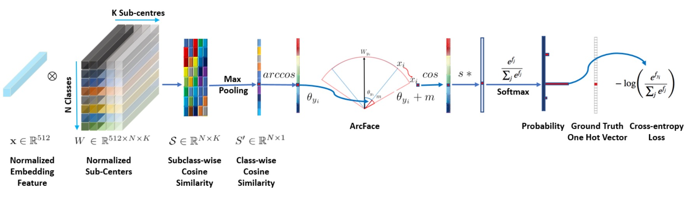
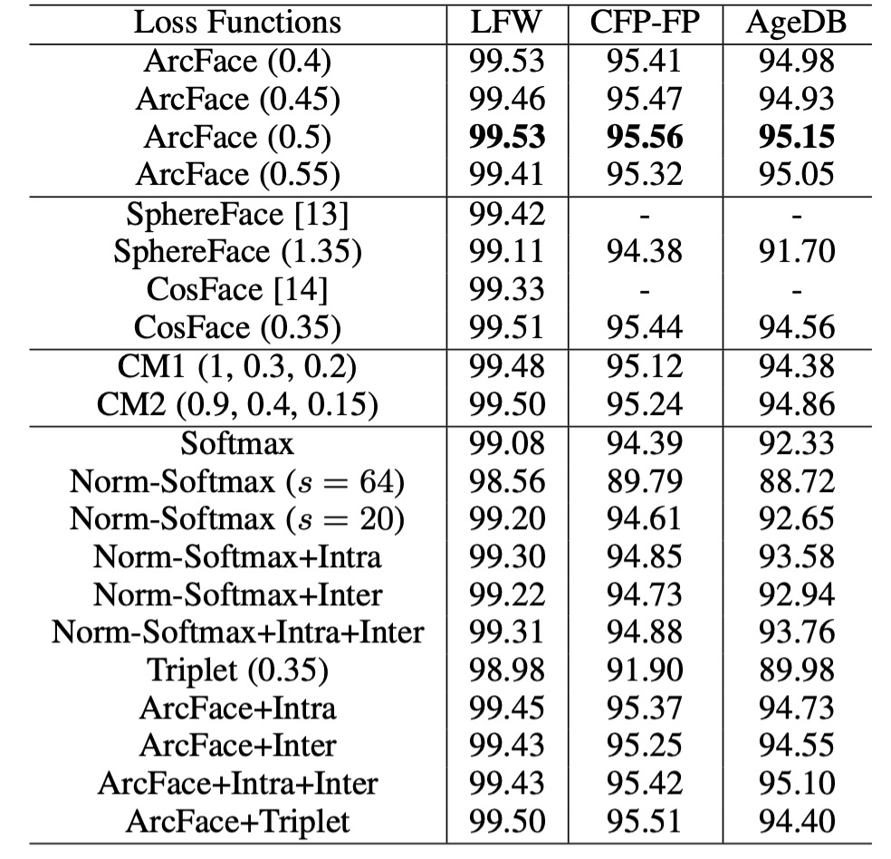

# [18.01] ArcFace

## Additive Angular Margin Loss

[**ArcFace: Additive Angular Margin Loss for Deep Face Recognition**](https://arxiv.org/abs/1801.07698)

---

This has been an eventful year for face recognition.

The concept of metric learning was introduced during this phase, starting from A-Softmax to CosFace, and now to ArcFace. These loss functions are all designed to address the margin problem in face recognition.

## Problem Definition

Let’s dive straight into the explanation, beginning with Softmax:

$$
L_{\text{Softmax}} = \frac{1}{N}\sum_{i=1}^{N}-\log\left(\frac{e^{f_{y_i}}}{\sum_{j=1}^{C}e^{f_j}}\right)
$$

Here, $f$ is the feature vector, $y_i$ is the class of the $i$-th image, $C$ is the number of classes, and $N$ is the batch size.

Typically, $f_j$ is the activation function of a fully connected layer, which can be represented as $f_j = W_j^Tx + B_j$, where $W_j$ is the weight of the fully connected layer, and $B_j$ is the bias term.

When we set $B_j = 0$, we get $f_j = W_j^Tx$, which can be written as the dot product:

$$
f_j = \|W_j\|\|x\|\cos\theta_j
$$

Here, $\theta_j$ is the angle between $W_j$ and $x$.

So far, we haven’t changed anything—we’re just describing the computation process of the Softmax loss function.

### Revisiting CosFace

- [**[18.01] CosFace: Large Margin Cosine Loss**](../1801-cosface/index.md)

Next, we apply L2 normalization to $\|W_j\|$ and $\|x\|$, fixing them at 1. This simplifies $f_j$ to $f_j = \cos\theta_j$.

In the CosFace paper, they modified the original $f_j$ to $f_j = \cos\theta_j - m$.

Subtracting a constant $m$ introduces a "margin" in the decision boundary, forcing the model to be more confident when classifying. This effectively increases inter-class margins and enhances the model’s ability to differentiate between different classes. In other words, the model requires higher confidence (greater cosine similarity) to correctly classify a sample, which helps reduce class overlap.

But if our goal is to increase inter-class margins, why apply $m$ to $\cos\theta$?

### Why Not Apply it Directly to $\theta$?

This is precisely the problem the authors aim to address in this paper:

**If our goal is to increase inter-class margins, why not apply it directly to $\theta$?**

## Solution

### Model Architecture



The image above shows the architecture of the ArcFace model.

But you probably don't like that image, so let's dive into the implementation details:

```python
# Implementation from ArcFace by InsightFace

class ArcFace(torch.nn.Module):

    def __init__(self, s=64.0, margin=0.5):
        super(ArcFace, self).__init__()
        self.s = s
        self.margin = margin
        self.cos_m = math.cos(margin)
        self.sin_m = math.sin(margin)
        self.theta = math.cos(math.pi - margin)
        self.sinmm = math.sin(math.pi - margin) * margin
        self.easy_margin = False


    def forward(self, logits: torch.Tensor, labels: torch.Tensor):
        index = torch.where(labels != -1)[0]
        target_logit = logits[index, labels[index].view(-1)]

        with torch.no_grad():
            target_logit.arccos_()
            logits.arccos_()
            final_target_logit = target_logit + self.margin
            logits[index, labels[index].view(-1)] = final_target_logit
            logits.cos_()
        logits = logits * self.s
        return logits
```

Take a close look at this segment:

```python
with torch.no_grad():
    target_logit.arccos_()
    logits.arccos_()
    final_target_logit = target_logit + self.margin
    logits[index, labels[index].view(-1)] = final_target_logit
    logits.cos_()
```

This segment means that the logits are first converted back to radians, then the margin is added, and finally, they are converted back to cosine values. The default margin is 0.5 radians, which corresponds to approximately 28.6 degrees. For example, if the model originally predicted an angle of 60 degrees, adding the margin would shift it to 88.6 degrees, making the prediction more challenging and thus enhancing the model's classification ability.

### What's the Difference?

The authors compare the impact of different margins on classification:


In the diagram, the horizontal and vertical axes represent the angles $\theta_1$ and $\theta_2$ corresponding to two classes. The leftmost image shows the result of Softmax with L2 normalization, where there’s a clear boundary between the two classes. Suppose the angles are 60 degrees and 120 degrees; the boundary between the classes is 90 degrees. There's no overlap, but the discrimination near the boundary is low.

The second image shows the result of SphereFace, which uses a multiplicative angular margin, i.e., $f_j = \cos(m\theta_j)$. This method assumes each class lies on a different hypersphere. However, the margin isn’t consistent across all $\theta$; as the angle decreases, so does the margin, making the boundary disappear entirely when $\theta$ approaches zero.

CosFace applies the margin to the cosine value, so when projected back to angular space, the decision boundary becomes a curve. Finally, in ArcFace, since the margin is applied directly to the angle, the decision boundary is a straight line.

### Unifying the Formula

Given the concepts of "additive cosine margin" in CosFace, "additive angular margin" in ArcFace, and "multiplicative angular margin" in SphereFace, we can unify these margins into a more general formula:

$$
f_j =
\begin{cases}
\cos(m_1\theta_{y_i} + m_2) - m_3 & \text{if } j = y_i, \\
\cos\theta_j & \text{if } j \neq y_i.
\end{cases}
$$

Thus, the loss function can be written as:

$$
L_{\text{ArcFace}} = -\frac{1}{N}\sum_{i=1}^{N}\log\left(\frac{e^{s(f_{y_i})}}{e^{s(f_{y_i})} + \sum_{j\neq y_i}e^{s(f_j)}}\right)
$$

Based on this formula, let's revisit the different loss functions:

- In CosFace, $m_1 = 1$, $m_2 = 0$, $m_3 = 0.35$;
- In ArcFace, $m_1 = 1$, $m_2 = 0.5$, $m_3 = 0$;
- In SphereFace, $m_1 = 1.35$, $m_2 = 0$, $m_3 = 0$.

:::tip
After understanding this, you can propose your own loss function. For example, set $m_1 = 1.35$, $m_2 = 0.25$, and $m_3 = 0.15$ to create a new loss function.
:::

### Training and Validation Datasets


1. **Training Datasets**:

   - **CASIA**
   - **VGG2**
   - **MS1MV0**

     - This dataset is a loosely cropped version.
     - The estimated noise ratio in the original data is around 47.1% ∼ 54.4%.
     - It was cleaned semi-automatically to create **MS1MV3**.

   - **Celeb500K**

     - Collected similarly to **MS1MV0**.
     - Celebrity identities were searched on Google to download top-ranked face images.
     - 25 million images of 500,000 identities were collected.
     - Faces larger than 50×50 pixels were detected using RetinaFace.

   - **IBUG-500K Dataset**

     - After removing overlapping identities (about 50K) through ID string matching, the cleaned MS1MV0 and Celeb500K were combined.
     - The final dataset, named **IBUG-500K**, consists of 11.96 million images from 493K identities.
     - The gender, race, pose, age, and image count distributions are shown below.

       

2. **Validation Datasets**:

   - **LFW & CFP-FP & AgeDB**

     - These are used to quickly check the model's convergence.

   - **CPLFW & CALFW**

     - Newer datasets with more significant pose and age variations.

   - **MegaFace & IJB-B & IJB-C**

     - Large-scale image datasets.

   - **LFR2019**
     - A dataset with 10,000 identities collected from various shows, movies, and TV series, comprising a total of 200,000 video clips. Each clip ranges from 1 second to 30 seconds in length.

### Training Configuration

1. **Face Standardization and Cropping**:

   - Standardized face crops are generated using five facial points predicted by RetinaFace, with dimensions of 112×112.

2. **Network Architecture**:

   - ResNet50 and ResNet100 CNN architectures are used as the embedding networks, without bottleneck structures.
   - The final 512-D embedding features are obtained using a BN-Dropout-FC-BN structure after the last convolutional layer.

3. **Training Settings**:

   - The feature scale `s` is set to 64, and the angular margin `m` in ArcFace is set to 0.5.
   - All recognition experiments are implemented using MXNet.
   - The batch size is set to 512, and models are trained on 8 NVIDIA Tesla P40 (24GB) GPUs.
   - Momentum is set to 0.9, and weight decay is set to 5e−4.

## Discussion

### Comparison of Different Losses



1. **Angular Margin Setting**:

   - A margin of 0.5 is found to be optimal on the CASIA dataset with ResNet50.
   - The best margins for SphereFace and CosFace are 1.35 and 0.35, respectively.

2. **Model Performance**:

   - In the implementations of SphereFace and CosFace, these settings achieve excellent performance without convergence issues. ArcFace achieves the highest validation accuracy across all three test sets.

3. **Combined Margin Framework**:

   - Experiments using a combined margin framework showed the best performance with CM1 (1, 0.3, 0.2) and CM2 (0.9, 0.4, 0.15). The combined margin framework outperforms SphereFace and CosFace alone but is limited by the performance ceiling of ArcFace.

4. **Norm-Softmax and Triplet Loss**:

   - Combining Norm-Softmax with intra-class loss improves performance on CFP-FP and AgeDB.
   - Combining Norm-Softmax with inter-class loss results in only a slight improvement in accuracy.
   - Applying margin penalties in triplet samples is less effective than in ArcFace, suggesting that the global comparison in ArcFace is more effective than the local comparison in Triplet loss.

   No significant improvement is observed when combining Intra-loss, Inter-loss, and Triplet-loss with ArcFace. Therefore, the authors conclude that ArcFace effectively enhances intra-class compactness, inter-class variation, and classification margins.

### Performance on Validation Datasets


The ArcFace model, trained with ResNet100 on MS1MV3 and IBUG-500K, outperforms baseline models (e.g., SphereFace and CosFace) on the LFW and YTF datasets, indicating that the added angular margin penalty significantly enhances the discriminative power of deep learning features, demonstrating the effectiveness of ArcFace.

Margin-based softmax loss has been widely used in recent methods, leading to saturated performance of around 99.8% on LFW and 98.0% on YTF. However, ArcFace remains one of the most competitive face recognition methods.

---


Beyond the LFW and YTF datasets, ArcFace also reports strong performance on CFP-FP, CPLFW, AgeDB, and CALFW. These datasets feature more significant pose and age variations, and ArcFace continues to excel in these challenging scenarios.

---


ArcFace significantly improves TPR (@FPR=1e-4) on the IJB-B and IJB-C datasets by approximately 3∼5% compared to softmax-based methods. The ArcFace model trained on IBUG-500K and ResNet100 increases TPR (@FPR=1e-4) on IJB-B and IJB-C to 96.02% and 97.27%, respectively.

:::info

- **IJB-B Dataset**

  Contains 1,845 subjects, 21.8K still images, and 55K frames from 7,011 videos.

- **IJB-C Dataset**

  An extended version of IJB-B, containing 3,531 subjects, 31.3K still images, and 117.5K frames from 11,779 videos.

- There are two evaluation protocols on IJB-B and IJB-C: 1:1 verification and 1:N identification.
  :::

## Conclusion

The core idea of ArcFace is to enhance intra-class compactness and inter-class differences by introducing angular margins in the feature space, achieving superior performance on multiple face recognition benchmarks.

:::tip
In practice, since ArcFace assumes the training data is clean, a noisy dataset can significantly affect model performance. But which public dataset isn’t filled with noise?

To address this, the authors propose an alternative view in the paper: **Sub-center ArcFace**. In simple terms, this method allocates multiple cluster centers for each class, allowing noise to be distributed across different cluster centers:


This is an improvement to ArcFace that effectively handles noisy datasets. However, it may impact the algorithm's ability to aggregate features, so be mindful of this when using it.
:::
