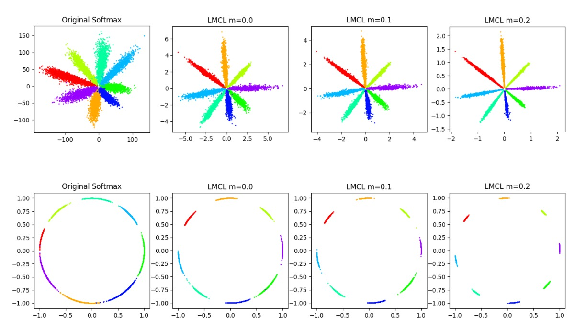
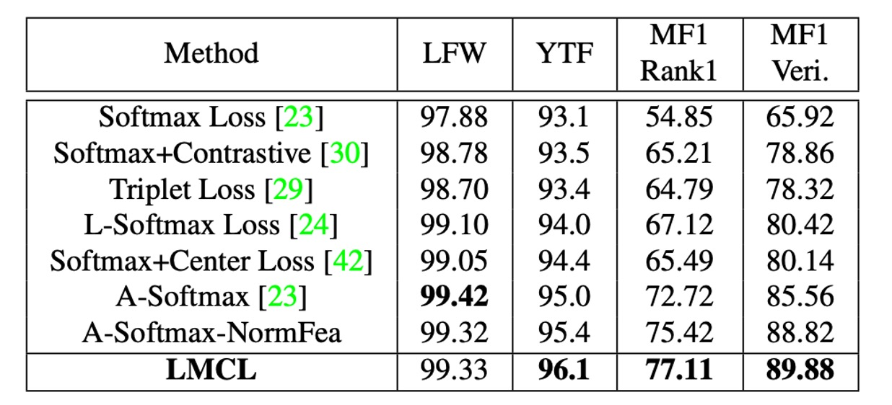

## Large Margin Cosine Loss

[**CosFace: Large Margin Cosine Loss for Deep Face Recognition**](https://arxiv.org/abs/1801.09414)

---

The task of face recognition has interested researchers even before the advent of deep learning. As it is one of the few areas with numerous real-life applications, it has remained a popular topic over the past few decades.

## Defining the Problem

Face recognition differs from general classification problems due to the following reasons:

- **Faces are very similar!**

Unlike classification problems on datasets like ImageNet, the challenge in face recognition lies in the fact that photos of the same person can differ significantly due to variations in lighting, angle, expression, and even the camera used.

In general, in this field, we discuss two characteristics of faces:

1. **High intra-class variation**: Photos of the same person can vary greatly due to lighting, angle, expression, age, etc.
2. **Low inter-class variation**: The basic structure of faces is similar, with two eyes, a nose, and a mouth, making different people's photos look quite alike.

:::tip
**But I think faces are very different!**

- This is because your brain is trained to differentiate faces, making you perceive significant differences. But if you switch to another species, say cats, can you match more than ten "cat faces" just by looking at their faces?
  :::

### Face Recognition System


A typical face recognition system comprises several parts:

1. **Feature Extractor**: Usually a convolutional neural network (CNN) that converts face images into fixed-length feature vectors.
2. **Metric Learner**: Used to calculate the distance between two feature vectors, which is discarded during deployment.

---

The feature extractor part is not the focus here as it evolves with the latest backbone networks.

After passing through the feature extractor, we obtain a feature vector $f$, commonly 512 dimensions, which, according to previous research, is theoretically sufficient to represent all human faces in the world.

This vector is the key topic in face recognition. Previous research using the Softmax loss function yielded limited model capability, insufficiently distinguishing in marginal cases.

This paper aims to solve this issue.

## Solving the Problem

### Loss Function

Here, we follow the author's steps to see how the original Softmax loss function is improved.

1. **Softmax Loss Function**:

   $$
   L_{\text{Softmax}} = \frac{1}{N}\sum_{i=1}^{N}-\log\left(\frac{e^{f_{y_i}}}{\sum_{j=1}^{C}e^{f_j}}\right)
   $$

   Here, $f$ is the feature vector, $y_i$ is the class of the $i$-th image, $C$ is the number of classes, and $N$ is the batch size.

   $f_j$ is usually the activation of a fully connected layer, represented as $f_j = W_j^Tx+B_j$, where $W_j$ is the weight of the fully connected layer, and $B_j$ is the bias term.

   The author sets $B_j = 0$, so $f_j = W_j^Tx$, which can be written as a dot product:

   $$
   f_j = \|W_j\|\|x\|\cos\theta_j
   $$

   Here, $\theta_j$ is the angle between $W_j$ and $x$.

   Up to this point, nothing has changed; it's just a description of the Softmax loss calculation process.

2. **Normalized Softmax Loss (NSL)**:

   Next, the author proposes an improvement called Normalized Softmax Loss (NSL).

   By normalizing $\|W_j\|$ to 1 using L2 normalization and fixing the length of $\|x\|$ to $s$, $f_j$ becomes $s\cos\theta_j$.

   NSL eliminates variations in Euclidean space by fixing the norms of the weight vector $W_j$ and the feature vector $x$, leaving only angle variations. Thus, the loss function depends only on the angle:

   $$
   L_{\text{NSL}} = \frac{1}{N}\sum_{i}-\log\left(\frac{e^{s \cos(\theta_{y_i})}}{\sum_{j} e^{s \cos(\theta_j)}}\right)
   $$

   This focuses feature learning on the angular space, improving feature discrimination.

3. **Large Margin Cosine Loss (LMCL)**:

   However, NSL's feature discrimination is still not strong enough. To further improve feature discrimination, the author introduces a cosine margin and naturally incorporates it into Softmax's cosine formulation.

   In a binary classification scenario, let $\theta_i$ be the angle between the learned feature vector and the weight vector of class $C_i$.

   NSL forces $\cos(\theta_1) > \cos(\theta_2)$ for distinguishing between class $C_1$ and $C_2$.

   To build a large margin classifier, we further require:

   - $\cos(\theta_1) - m > \cos(\theta_2)$
   - $\cos(\theta_2) - m > \cos(\theta_1)$

   where $m \geq 0$ is a fixed parameter controlling the cosine margin. Since $\cos(\theta_i) - m$ is smaller than $\cos(\theta_i)$, this constraint is stricter for classification. This constraint must be satisfied from different class perspectives.

   Finally, the author formally defines Large Margin Cosine Loss (LMCL) as:

   $$
   L_{\text{LMCL}} = \frac{1}{N}\sum_{i}-\log\left(\frac{e^{s(\cos(\theta_{y_i}) - m)}}{e^{s(\cos(\theta_{y_i}) - m)} + \sum_{j \neq y_i} e^{s \cos(\theta_j)}}\right)
   $$

   Under this constraint:

   $$
   W = \frac{W^*}{\|W^*\|}, \quad x = \frac{x^*}{\|x^*\|}, \quad \cos(\theta_j, i) = W_j^T x_i
   $$

   Here, $N$ is the number of training samples, $x_i$ is the i-th feature vector corresponding to the ground-truth class $y_i$, $W_j$ is the weight vector of the j-th class, and $\theta_j$ is the angle between $W_j$ and $x_i$.

After understanding these formulas, we can refer to the figure below to grasp the significance of this loss function:


In the figure, the original Softmax loss function shows overlapping boundaries between different classes due to the lack of L2 normalization.

With NSL's improvement, we see a boundary between different classes, but this boundary lacks distance, making classification at the intersection unstable.

Finally, with LMCL's enhancement, the boundaries between different classes become clearer. The model, constrained by this boundary during training, finds it easier to distinguish feature vectors in angular space.

There is also the A-Softmax method, an earlier improvement that constrains:

- $\cos(m\theta_1) \geq \cos(\theta_2)$
- $\cos(m\theta_2) \geq \cos(\theta_1)$

A-Softmax's drawback is its inconsistency for all $\theta$. As the angle decreases, so does the margin, and at $\theta = 0$, the margin disappears completely, possibly leading to insufficient discrimination for small-angle feature vectors.

:::tip
These boundary-focused improvement methods are collectively referred to as "Margin-based Loss".
:::

### Hyperparameter $s$

In learning discriminative features on the hypersphere, the cosine margin is crucial for enhancing feature discrimination.

For LMCL, the cosine margin should have a lower bound:

$$
s \geq \frac{C - 1}{C} \log \frac{(C - 1)P_W}{1 - P_W}
$$

where $C$ is the number of classes and $P_W$ is the expected minimum posterior probability of the class center.

This means that for optimal classification performance, $s$ should increase with the number of classes.

When the number of classes exceeds the feature dimension, the upper bound of the cosine margin decreases. Therefore, a hypersphere with a large radius is necessary for embedding features with small intra-class and large inter-class distances.

### Hyperparameter $m$



The figure above shows the impact of different $m$ values on the feature space.

It can be seen that as $m$ increases, the boundaries between classes become clearer.

---

Considering the binary classification case, suppose the normalized feature vector $x$ is given.

Let $W_i$ denote the normalized weight vector, and $\theta_i$ denote the angle between $x$ and $W_i$.

For NSL, the decision boundary is defined as $\cos \theta_1 - \cos \theta_2 = 0$, equivalent to the angular bisector of $W_1$ and $W_2$. This means that under NSL supervision, the model partitions the feature space into two close regions, where features near the boundary are highly ambiguous and can belong to either class.

In contrast, LMCL defines the decision boundary as $\cos \theta_1 - \cos \theta_2 = m$, where $\theta_1$ should be much smaller than $\theta_2$. This increases inter-class variance while reducing intra-class variance. The maximum angular margin depends on the angle between $W_1$ and $W_2$.

Specifically, suppose all feature vectors of class $i$ exactly overlap with the corresponding weight vector $W_i$. In this extreme situation, the decision boundary margin reaches its maximum value (i.e., the strict upper bound of the cosine margin).

In general, we assume that all features are well-separated, and there are a total of $C$ classes. The theoretical range of cosine margin $m$ is:

$$
0 \leq m \leq (1 - \max(W_i^T W_j)), \quad i, j \leq n, \, i \neq j
$$

The Softmax loss attempts to maximize the angle between any two weight vectors from different classes for perfect classification.

Therefore, the optimal solution for the Softmax loss should distribute the weight vectors uniformly on a unit hypersphere.

Based on this assumption, the range of the cosine margin $m$ can be inferred as follows:

$$
0 \leq m \leq 1 - \cos\left(\frac{2\pi}{C}\right), \quad (K = 2)
$$

$$
0 \leq m \leq \frac{C}{C - 1}, \quad (C \leq K + 1)
$$

$$
0 \leq m \leq \frac{C}{C - 1}, \quad (C > K + 1)
$$

where $C$ is the number of training classes and $K$ is the dimension of learned features.

These inequalities indicate that as the number of classes increases, the upper bound of the cosine margin between classes decreases accordingly. Particularly, when the number of classes far exceeds the feature dimension, the upper bound of the cosine margin becomes smaller.

In practice, $m$ usually cannot reach the theoretical upper bound because all feature vectors tend to cluster around their corresponding class weight vectors. When $m$ is too large, the model fails to converge because the cosine constraint becomes too strict to satisfy. Additionally, an excessively large $m$ makes the training process more sensitive to noisy data.

### Implementation Details

Theory is just to support the feasibility of a method.

In practice, implementing CosFace is straightforward, and we can quickly write one:

```python
import torch
import torch.nn as nn

class CosFace(nn.Module):

    def __init__(self, s=64.0, m=0.35):
        super(CosFace, self).__init__()
        self.s = s
        self.m = m

    def forward(self, logits: torch.Tensor, labels: torch.Tensor):
        index = torch.where(labels != -1)[0]
        target_logit = logits[index, labels[index].view(-1)]
        final_target_logit = target_logit - self.m
        logits[index, labels[index].view(-1)] = final_target_logit
        logits = logits * self.s
        return logits
```

The above implementation does two things: subtract $m$ from the logits obtained via Softmax, then multiply by $s$.

The adjusted logits can then be used with the standard CrossEntropyLoss.

## Discussion

### Exploring the Impact of m


1. **Experimental Design**:

   - Varying $m$ from 0 to 0.45.
   - Training CosFace models on a small dataset (CASIA-WebFace).
   - Evaluating performance on LFW and YTF datasets.

2. **Experimental Results**:

   - Models with no margin ($m = 0$) performed the worst.
   - Accuracy on both datasets increased as $m$ increased.
   - Performance saturated at $m = 0.35$.
   - Models failed to converge when $m$ exceeded 0.45.

3. **Conclusion**:
   - The margin $m$ effectively enhances the discriminative power of learned features.
   - For subsequent experiments, $m$ is fixed at 0.35.

### Impact of Feature Normalization


1. **Experimental Design**:

   - Comparing CosFace models with and without feature normalization.
   - Training on CASIA-WebFace with $m$ fixed at 0.35.
   - Evaluating performance on LFW, YTF, and Megaface Challenge 1 (MF1) datasets.

2. **Experimental Results**:

   - Models trained without normalization were initially supervised by Softmax loss, followed by LMCL.
   - Models using feature normalization consistently outperformed those without normalization across all three datasets.

3. **Conclusion**:
   - Feature normalization eliminates fundamental variance, making learned features more discriminative in angular space.
   - Experiments validate the effectiveness of feature normalization.

### Comparison with Other Loss Functions



1. **Experimental Design**:

   - Training models on CAISA-WebFace.
   - Using the same 64-layer CNN architecture as described in SphereFace.
   - Comparing performance on LFW, YTF, and MF1 datasets.

2. **Comparison Settings**:

   - Strictly following SphereFace's model structure (64-layer ResNet-like CNN) and detailed experimental settings.
   - Conducting fair comparisons with other loss functions.

3. **Experimental Results**:
   - LMCL achieved competitive results across all three datasets.
   - LMCL outperformed A-Softmax with feature normalization (referred to as A-Softmax-NormFea).
   - Notably, LMCL significantly outperformed other loss functions on YTF and MF1 datasets.

## Conclusion

In this paper, the authors proposed a novel loss function named CosFace, or Large Margin Cosine Loss (LMCL), aiming to enhance the discriminative power and classification performance of deep learning models. The researchers thoroughly analyzed the limitations of the original Softmax loss function and introduced cosine margin and feature normalization techniques to achieve more effective feature learning.

The introduction of CosFace offers a new perspective and methodology for feature learning and classification problems, demonstrating exceptional performance in face recognition and other applications requiring highly discriminative features. This innovative approach provides new insights and methods for developing more precise and efficient models in various fields.
