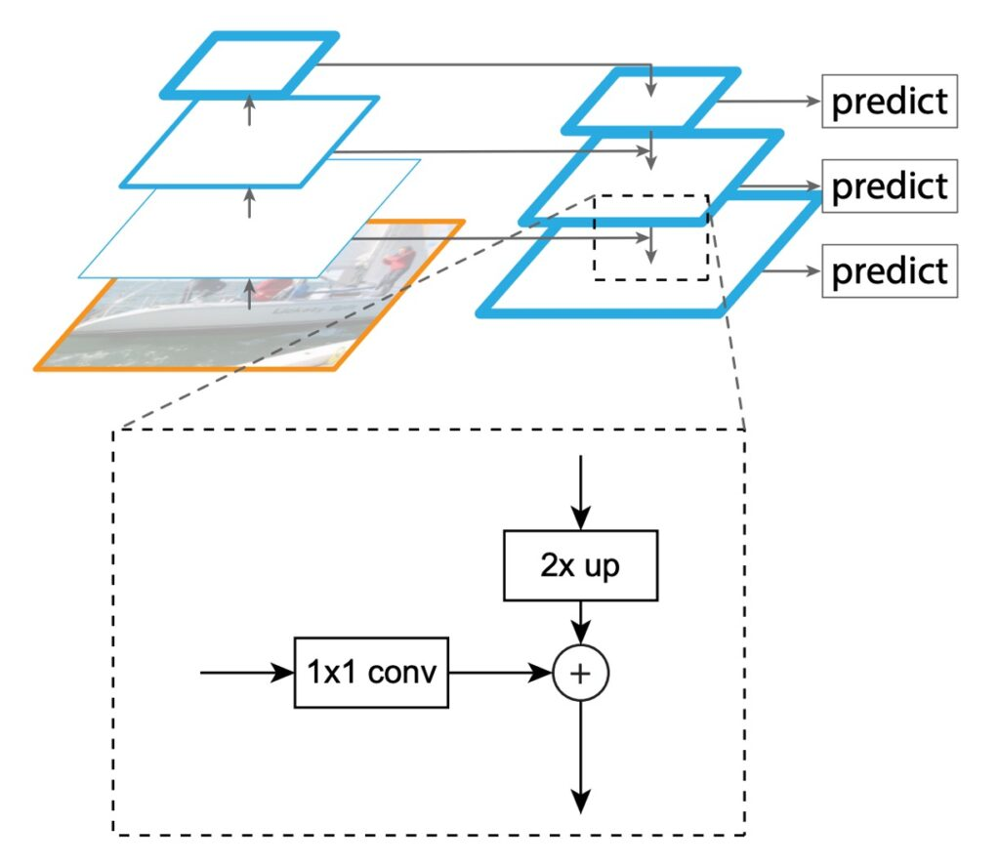

# FPN

## Pyramid Architecture

**[Feature Pyramid Networks for Object Detection (2016.12)](https://arxiv.org/abs/1612.03144)**

---

:::info
The following content is compiled by ChatGPT-4, with manual proofreading, editing, and additional explanations.
:::

---

Consider a scenario.

Given the typical workflow of a convolutional neural network model: starting with inputting an original image, possibly with dimensions of 3 x 224 x 224, then passing through layers of downsampling, finally obtaining a high-dimensional semantic feature map, with dimensions possibly being 256 x 7 x 7. Typically, in a conventional model, the output is usually at a 1/32 scale, meaning, for example, with an original image of 224 x 224, the final feature map would be 7 x 7.

There are several ways to describe this feature map, you might have heard:

- Low-resolution feature map (because compared to the original image, the final feature map is only 1/32 in size).
- High-dimensional semantic features (as it condenses the features of the entire image, carrying a larger receptive field).
- Top-level features (bottom｜original -> C1 -> C2 -> … -> C5 ｜top)

This design works well for classification tasks because classification can reference the content of the entire input image and output one or several possible classification results.

However, this approach doesn't work for object detection. As mentioned earlier, this feature map is at a 1/32 scale. So, if there's an object we want to detect, and its size in the image is smaller than 32 x 32 pixels, unfortunately, it will "vanish" during the downsampling process, as the model won't see it in the final feature map.

Well, "vanish" might be a bit exaggerated. In reality, if the model uses convolutional operations for downsampling, the object might still be represented by nearby pixels.

:::tip
If you find this description a bit supernatural, that's okay. In any case, the model will struggle to see it, as it would require more capacity to capture this tiny feature, ultimately affecting the overall performance.
:::

This means if we want to improve object detection performance, we need to do something to retain these features.

Around the end of 2015, SSD was proposed:

- **[SSD: Single Shot MultiBox Detector (2015.12)](https://arxiv.org/abs/1512.02325)**

It aimed to improve upon YOLO v1.

It is based on the architecture of YOLO v1, where different-scale feature maps are added to the prediction head, and high-dimensional features (P3~P5) are merged for prediction, marking the first attempt at a pyramid feature hierarchy. While it was an earlier design, it can be considered a precursor to feature pyramid networks. Its drawback lies in its computational complexity and the inability of low-dimensional features to reference high-dimensional semantic features.

## Problem Definition

In this paper, the authors clearly identify these main problems:

1. **Limitations of Feature Pyramids**

    Traditional feature pyramid strategies, prevalent in the era of handcrafted features, were the primary tools for recognizing multi-scale objects. However, in the era of deep learning, these methods no longer suffice for current needs. Their main issue is their relatively weak ability to process features of different scales. Especially when dealing with large amounts of image data, their processing speed is far from meeting real-time application requirements. Additionally, these methods only perform simple feature scaling without deeper feature fusion and optimization, limiting their recognition effectiveness.

2. **Limitations of SSD**

    In order to address the above problems, SSD, as an emerging strategy, attempts to utilize the pyramid feature hierarchy of deep convolutional networks. Its goal is to completely replace traditional feature pyramid strategies. However, SSD has some obvious flaws in its design. In order to avoid using lower-level features, it deliberately does not reuse high-resolution layers that have already been computed, instead opting to add new layers to build its pyramid. This approach not only increases computational complexity but also overlooks the importance of high-resolution mappings in the feature hierarchy. For detecting small objects, these high-resolution mappings are crucial, which SSD's strategy clearly ignores.

## Solution

### FPN Model Design

The main purpose of FPN is to improve upon the design of SSD. The authors propose a structure, as shown in the above figure, to create a feature pyramid with strong semantics at all scales while maintaining the pyramid-shaped hierarchical structure of convolutional network features.

To achieve this goal, the authors design a structure:

- **Combine low-resolution features with high-resolution features through top-down pathways and lateral connections.**

In fact, once this sentence is explained, the paper is essentially concluded, as what follows is just implementation and testing.

However, we can still look at some implementation details provided by the authors.

1. **Bottom-up pathway**

    

    The first part is called the data path from Bottom features to Top features. Since this paper does not provide image references, I hand-drew an architecture diagram and inserted actual numbers, simplifying the information as much as possible to illustrate the flow of data within the model:

    Taking ResNet18 as an example, inputting a 224 x 224 x 3 image. Since we use PyTorch syntax, the number of channels comes first. After passing through ResNet18, we get five different resolution feature maps. Here, let's define these feature maps:

    - P1: Feature map at 1/2 scale, size 64 x 112 x 112.
    - P2: Feature map at 1/4 scale, size 64 x 56 x 56.
    - P3: Feature map at 1/8 scale, size 128 x 28 x 28.
    - P4: Feature map at 1/16 scale, size 256 x 14 x 14.
    - P5: Feature map at 1/32 scale, size 512 x 7 x 7.

    This image goes through the downsampling process of the model, referred to as the Bottom-up pathway in this paper.

    It's worth noting that in most model architecture designs, P1 and P2 feature maps are not used to construct the feature pyramid because these two feature maps still have very large dimensions and would consume a lot of computational resources.

2. **Top-down pathway and lateral connections**

    Reflecting on the previous steps, data flow starts from the left and moves to the right.

    In the second stage of feature pyramid design, the goal is to merge features "from right to left".

    So let's zoom in on the P4 – P5 section we just discussed:

    

    In this fusion process, first, because high-dimensional feature maps have smaller dimensions, we need to address them first.

    Here, we perform an Upsample operation on the P5 feature map to ensure size consistency.

    Next, we want to add these two feature maps with different dimensions. However, this poses another challenge: the channel numbers do not match.

    As shown in the figure above, the feature map output from Block5 has 512 channels, while the feature map output from Block4 only has 256 channels. Due to the mismatch in channel numbers, direct addition operations cannot be performed. To solve this problem, we need to use 1×1 convolutional kernels to adjust the number of channels in the feature maps. Note that there is no fixed rule for adjusting the number of channels; you can define a suitable number of channels based on the actual situation, such as setting it to 64.

    Each P1～P5 feature map needs to pass through a 1×1 convolutional layer to ensure consistent channel numbers, thus avoiding alignment issues.

    After ensuring channel alignment and size consistency, we can directly add feature maps from different layers to complete a round of fusion operations.

    If this step is repeated, it might give you a better understanding. So let's look at the fusion from P4 to P3 again.

    

    Finally, here's a more straightforward architecture design that is easier to implement:

    

    :::tip
    Scaling each scale's feature maps first and then performing feature fusion is a common design approach in engineering implementation.
    :::

## Discussion

### Is this really better?

Directly speaking about the results: yes, it is.

The paper's authors conducted numerous sets of experimental data to argue this point. At the end of the article, let's pick out a few key figures to take a look at. Let's first examine the ablation experiments provided in the paper, as shown in the table below:

This table first discusses removing different components, where (d) removes the top-down component; (e) removes lateral connections; and (f) changes the representation of the feature pyramid. It can be observed that removing any component leads to a significant decrease in performance, with marginal differences from the baseline comparison model.

Next, let's look at the next table:

The authors of this paper compared their method with the single-model results of the COCO competition winners, including the 2016 winner G-RMI and the 2015 winner Faster R-CNN+++. Without using various fancy techniques, FPN's single model already surpasses these powerful, carefully designed competitors. On the test development set, FPN outperforms the existing best results by 0.5 points AP.

## Conclusion

FPN proposes a concise framework that can be combined with various backbone networks to construct powerful feature pyramids. This method shows significant improvements over multiple strong baseline models and competition winners.

This paper on FPN discusses two things:

- Firstly, whenever the problem to be solved exhibits multiscale characteristics, different-scale feature fusion techniques must be considered.
- Secondly, feature fusion techniques boil down to three sentences: "bottom to top, top to bottom, then add them together."

Following this paper, many directions for discussion have emerged, such as: how to design better feature fusion strategies? How to improve the efficiency of fusion? Or how to adjust fusion weights? Various scenarios like these have been explored in subsequent papers. We'll look at them together when we have time.
