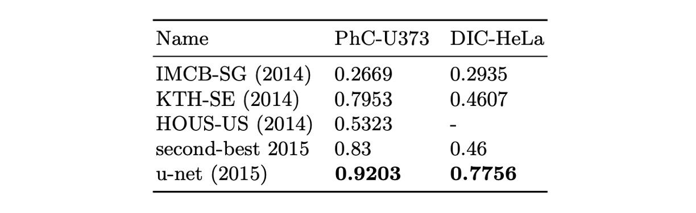

## The Dawn of Integration

[**U-Net: Convolutional Networks for Biomedical Image Segmentation**](https://arxiv.org/abs/1505.04597)

---

At a time when the VGG network had just emerged, many unmet needs still lingered.

Researchers discovered that traditional CNN architectures were insufficiently granular and failed to meet the challenges posed by biomedical image segmentation.

This realization led to the development of a groundbreaking model, one that became a classic in the field of image segmentation.

## Defining the Problem

In contrast to the thriving image classification domain, where ImageNet dominated and satisfied the research community, biomedical image segmentation researchers faced a different reality.

In this field, the availability of training data was severely limited, falling short of the requirements for training deep learning models.

The solution to this problem was not straightforward. A previous approach involved dividing training data into multiple smaller patches to generate more training samples. However, this method led to another issue—the loss of contextual information, which in turn reduced segmentation accuracy.

Around the same time, another research paper introduced the fully convolutional network (FCN) architecture, which provided some inspiration to the authors.

- [**[14.11] Fully Convolutional Networks for Semantic Segmentation**](https://arxiv.org/abs/1411.4038)

  

Perhaps this architecture could be applied to the problem of biomedical image segmentation to address the issue of contextual information loss.

## Solving the Problem

### Model Architecture

Using the entire image did solve the problem of losing contextual information, but the issue of insufficient data remained. The authors proposed the U-Net architecture, which improves segmentation accuracy by reusing high-resolution feature maps and simultaneously reduces the model's data dependency.

The diagram above illustrates the U-Net architecture. You can ignore the numbers for now because the authors did not use padding in the convolutional layers, which results in a reduction in feature map size after each convolution. This can be distracting when first encountering the architecture.

Let's break the diagram in half and focus on the left side:

This is the part we often refer to as the Backbone. This section can be swapped out for different architectures. If you prefer MobileNet, use MobileNet. If you prefer ResNet, use ResNet.

A basic Backbone design includes five layers of downsampling, corresponding to the five output layers shown in the diagram.

Now, let's look at the right side:

This section is commonly referred to as the Neck. The key characteristic here is the upsampling that begins from the lowest layer. The method can be simple interpolation or more complex transposed convolution. In this paper, the authors used transposed convolution.

After upsampling, we obtain higher-resolution feature maps, which are then fused with the feature maps from the corresponding layers. The fusion can be done through simple concatenation or addition, and here the authors opted for concatenation.

Following this process, we finally obtain a segmentation result that matches the original image's size. The number of channels can be adjusted based on the segmentation task: one channel for binary segmentation and multiple channels for multi-class segmentation.

:::tip
If you choose addition instead of concatenation, you'll end up with another classic architecture: FPN.

- [**[16.12] FPN: The Pyramid Structure**](../1612-fpn/index.md)
  :::

## Discussion

### ISBI Cell Tracking Challenge 2015

The authors applied U-Net to the ISBI 2014 and 2015 Cell Tracking Challenges:

- On the PhC-U373 dataset, U-Net achieved a 92% IoU, significantly outperforming the second-place model, which achieved 83%.
- On the DIC-HeLa dataset, U-Net reached a 77.5% IoU, again vastly exceeding the second-place model's 46%.

These results demonstrate that U-Net excels across different types of microscopy image segmentation tasks and significantly outperforms other existing methods.

## Conclusion

U-Net's design preserves high-resolution feature maps, enhancing segmentation accuracy through the fusion of contextual information while reducing the model's reliance on large datasets. The architecture is simple and easily extensible, making it suitable for various image segmentation tasks, including cell segmentation, organ segmentation, and lesion detection.

Compared to FPN, the concatenation-based structure of U-Net results in a larger number of parameters and higher computational costs, which can be a limitation in resource-constrained environments. Each architecture has its strengths, and it is valuable to learn different designs and select the most appropriate architecture based on the specific requirements of the task at hand.
