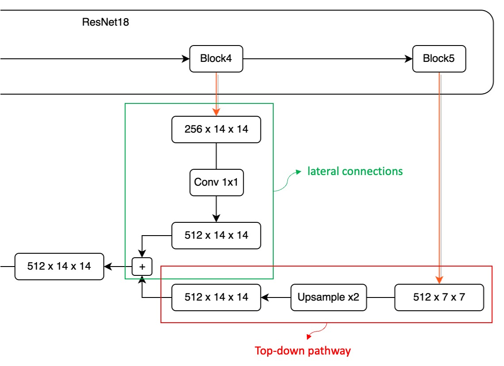

## The Pyramid Structure

**[Feature Pyramid Networks for Object Detection](https://arxiv.org/abs/1612.03144)**

---

Imagine a scenario.

Given a typical convolutional network model's operation flow: first, an input image, possibly of size 3 x 224 x 224, is passed through successive layers of downsampling, ultimately producing a high-dimensional semantic feature map, potentially 256 x 7 x 7. Conventionally, the final output of such a model is 1/32 the original size, meaning that for an input image of 224 x 224, the final feature map is 7 x 7.

This feature map has various descriptions:

- Low-resolution feature map (since it's only 1/32 the size of the original image)
- High-dimensional semantic features (as it condenses features from the entire image with a large receptive field)
- Top-level features (bottom | original image -> C1 -> C2 -> ... -> C5 | top)

This design poses no issue for classification tasks, where the goal is to reference the entire input image content to output one or several possible classification results.

However, this approach doesn't work well for object detection. As mentioned, this feature map is 1/32 the scale. If an object we want to detect is smaller than 32 x 32 pixels, it might "disappear" during downsampling, making it hard for the model to recognize it on the final feature map.

Okay, saying it "disappears" might be an exaggeration. In reality, if the model uses convolution operations for downsampling, the object might still leave some trace in the nearby pixels.

:::tip
If you find this description too mystical, the point is that the model will struggle to detect it, requiring more capacity to remember this tiny feature, which can degrade overall performance.
:::

This indicates that to improve object detection performance, we need to do something to preserve these features.

Around the end of 2015, SSD was proposed:

- **[SSD: Single Shot MultiBox Detector (2015.12)](https://arxiv.org/abs/1512.02325)**

The primary aim was to improve upon YOLO v1.

Based on YOLO v1's architecture, it added prediction heads at different feature scales, combining high-dimensional features (P3~P5) for predictions. This was an early attempt at a pyramid feature structure and can be considered a precursor to feature pyramid networks. However, this design had drawbacks: high computational cost and inability of low-dimensional features to reference high-dimensional semantic information.

## Defining the Problem

In this paper, the authors explicitly pointed out these main issues:

1. **Limitations of Traditional Feature Pyramids**

   Traditional feature pyramid strategies were the main tool for recognizing multi-scale objects in the era of handcrafted features. However, in the deep learning era, these methods no longer meet current needs. The main issue is their relatively weak ability to handle features at different scales. Particularly when dealing with large amounts of image data, their processing speed is far from sufficient for real-time applications. Additionally, these methods merely perform simple feature scaling without deeper feature fusion and optimization, limiting their recognition effectiveness.

2. **Limitations of SSD**

   To address the above issues, SSD, as an emerging strategy, attempted to utilize the pyramid feature hierarchy of deep convolutional networks. Its goal was to fully replace traditional feature pyramid strategies. However, SSD had some evident design flaws. To avoid using lower-level features, SSD deliberately did not reuse computed high-resolution layers, instead choosing to add new layers to build its pyramid. This approach increased computational complexity and overlooked the importance of high-resolution mappings in the feature hierarchy. These high-resolution mappings are crucial for detecting small objects, which SSD's strategy clearly ignored.

## Solving the Problem

### FPN Model Design

The main goal of FPN is to improve SSD's design. The authors proposed a structure, shown above, to create a feature pyramid with strong semantics at all scales while maintaining the pyramid shape of the convolutional network's feature hierarchy.

To achieve this, the authors designed a structure that:

- **Combines low-resolution features with high-resolution features through top-down pathways and lateral connections.**

This sentence essentially concludes the paper, leaving the implementation and testing parts.

However, let's look at some implementation details provided by the authors.

1. **Bottom-up Pathway**

   

   The first part is the data pathway from bottom features to top features. Since the paper doesn't provide an image reference, I drew a structure diagram with actual numbers and simplified information for explanation, hoping to give you a more intuitive sense of data flow in the model:

   Taking ResNet18 as an example, an input image of 224 x 224 x 3. Based on PyTorch syntax, the channel count is at the front. After passing through ResNet18, we get five different resolution feature maps. Let's define these feature maps:

   - P1: 1/2 size feature map, 64 x 112 x 112.
   - P2: 1/4 size feature map, 64 x 56 x 56.
   - P3: 1/8 size feature map, 128 x 28 x 28.
   - P4: 1/16 size feature map, 256 x 14 x 14.
   - P5: 1/32 size feature map, 512 x 7 x 7.

   This image passes through the model's downsampling process, termed as the bottom-up pathway in the paper.

   It's worth noting that most model architectures do not use P1 and P2 feature maps in the feature pyramid due to their large size, which consumes substantial computational resources.

2. **Top-down Pathway and Lateral Connections**

   Recall the previous steps, where input data flows from left to right.

   The second stage of feature pyramid design involves merging features from right to left.

   Let's zoom in on the P4 - P5 section:

   

   During this fusion process, we first deal with the high-dimensional feature map due to its smaller size.

   Here, we upsample the P5 feature map to ensure size consistency.

   Next, we aim to add these different dimension feature maps. However, this introduces a challenge: channel mismatch.

   As shown above, the feature map from Block5 has 512 channels, while the feature map from Block4 has only 256 channels. Due to the channel mismatch, direct addition is impossible. To resolve this, we use a 1×1 convolution to adjust the feature map's channel count. Note that there's no fixed rule for adjusting channel counts; you can predefine a suitable channel count based on practical needs, like setting it to 64.

   Each P1 - P5 feature map needs to pass through a 1×1 convolution layer to ensure consistent channel counts, avoiding alignment issues.

   After aligning the channels and sizes, we can directly add feature maps from different layers, completing one round of fusion.

   To further illustrate, let's look at the fusion from P4 to P3:

   

   Finally, here's a more practical architecture design, which might look like this:

   

   :::tip
   Scaling each feature map before fusion is a common design in practical engineering implementations.
   :::

## Discussion

### Is It Really Better?

To summarize the results: Yes.

The authors conducted several experiments to illustrate this, and we'll highlight some key charts from the paper. First, let's look at the ablation study provided in the paper:

This table discusses the effects of removing different components: (d) removes the top-down pathway, (e) removes lateral connections, and (f) removes the feature pyramid representation.

We see that removing any component causes a significant performance drop, sometimes making the model barely better than the baseline.

Next, let's look at another table:

The authors compared their method with single-model results from COCO competition winners, including the 2016 winner G-RMI and the 2015 winner Faster R-CNN+++. Without using various fancy techniques, a single FPN model already surpasses these strong, meticulously designed competitors. On the test-dev set, FPN improves the current best result by 0.5 points in AP.

## Conclusion

FPN introduces a simple framework that can be combined with various backbone networks to build powerful feature pyramids. This method shows significant improvements over multiple strong benchmark models and competition winners.

FPN makes two points clear:

- First, when addressing problems with multi-scale characteristics, consider techniques for merging features from different scales.
- Second, feature fusion can be summarized in three steps: "Bottom-up, top-down, then add."

Following this paper, many discussions emerged, such as how to design better feature fusion strategies, improve fusion efficiency, or adjust fusion weights, among other scenarios.

There are many subsequent papers, and we’ll explore them together when we have time.
