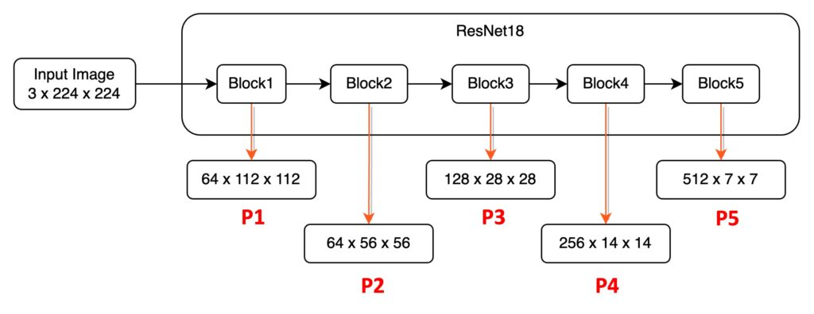
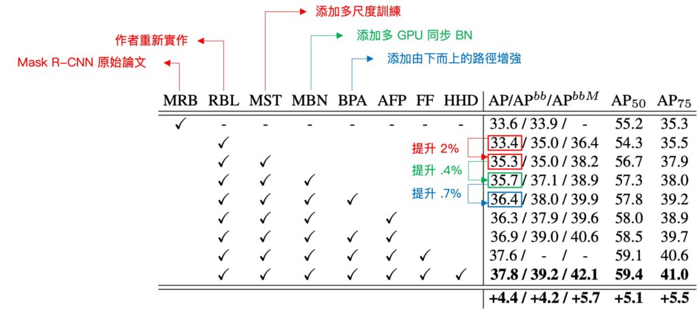

# [18.03] PANet

## Give Me a Shortcut

**[Path Aggregation Network for Instance Segmentation](https://arxiv.org/abs/1803.01534v4)**

---

After the introduction of the classic FPN, the question of "how to achieve more efficient feature fusion" became an area of research. Let's explore another equally classic architecture — PANet.

## Defining the Problem

In the PANet paper, the primary comparison is with the FPN architecture. If you're not familiar with FPN, you can refer to:

- **Portal: [FPN](../1612-fpn/index.md)**

Recall a key conclusion from FPN: "Bottom-up, top-down, then add."

PANet suggests that this design is insufficient. Here's the authors' argument:

> The insightful point that neurons in high layers strongly respond to entire objects while other neurons are more likely to be activated by local texture and patterns manifests the necessity of augmenting a top-down path to propagate semantically strong features and enhance all features with reasonable classification capability in FPN.
>
> Excerpted from PANet

To translate this simply: high-layer neurons can see entire objects, while lower-layer neurons see local textures. Therefore, we shouldn't rely on a single path for feature fusion; we need more.

This statement captures the core idea of the paper.

Using this image, let's break down the statement. High layers refer to Block5, where neurons have a broad receptive field and can focus on larger objects. Lower layers, like P1 and P2, focus on local textures and patterns.

FPN's design allows lower layers (e.g., P1) to reference higher-layer features (e.g., P5) via a short path, possibly only a few dozen convolutional layers. However, for higher layers (e.g., P5) to reference lower-layer information (e.g., P1), it might require hundreds of convolutional layers, depending on the backbone network.

This discrepancy is significant and suggests a need for change.

## Solving the Problem

### PANet Model Design

The above image shows the proposed improvement. First, (a) is the FPN architecture we previously discussed. Then, (b) shows the added path by the authors. Conceptually, it's about providing a shortcut from bottom to top (green path) to complement the original path (red path).

### Path Aggregation FPN

Now, let's delve into the implementation of the path aggregation module. Each block takes the feature map from the lower layer (Ni) and the feature map from the higher layer (Pi+1) to create a new feature map (Ni+1).

For each feature map (Ni), a 3×3 convolution with stride=2 is first applied to halve the spatial dimensions and reduce the amount of data. Note that N2 is simply P2, with no processing.

Then, corresponding small patches from Pi+1 and the downsampled Ni are added together. Finally, another 3×3 convolution processes this combined feature map, creating the new feature map (Ni+1) for subsequent sub-networks.

This process repeats until reaching the top feature map (P5). Throughout these blocks, PANet maintains the feature map's channel count at 256, with each convolution followed by a ReLU activation. The authors believe this helps the model learn more useful features.

Finally, the newly generated feature maps [N2, N3, N4, N5] are combined for each proposal's feature grid. This method preserves the importance of features and effectively enhances information flow, laying a solid foundation for subsequent tasks.

## Discussion

### How Does It Compare to Basic FPN?

As we delve into the architecture, the authors conducted various analyses and experiments during the optimization process. Let's highlight some key points.

First, focus on "Multi-Scale Training" (MST). This refers to the FPN architecture's implementation. Adding this element improves the model's AP score by 2%.

Next, the authors added "Multi-GPU BatchNorm" (MBN) on top of the multi-scale architecture, further improving performance by 0.4%. The core element of this paper, "Bottom-Up Path Augmentation" (BPA), emphasizes combining lower and higher-level feature maps to create a richer feature hierarchy. Incorporating BPA improves performance by 0.7%.

It would have been more straightforward to see a direct comparison between "MST" and "MST+BPA" without the intermediate MBN element.

Besides "Bottom-Up Path Augmentation," the authors introduced other key elements, although they fall within the Model Head section and are not the focus here. Nonetheless, since the table is provided, let's briefly cover some information.

One element is "Adaptive Feature Pooling," which connects the feature grid with all feature levels, allowing useful information from each level to propagate directly to subsequent sub-networks. This enhances cooperation between different feature levels, improving the model's performance. Additionally, "Fully Connected Fusion" aims to improve prediction quality, further enhancing overall performance.

## Conclusion

PANet continues the design philosophy of FPN, exploring how to better address multi-scale feature fusion while introducing further innovations. This architecture effectively combines various backbone networks, constructing a more powerful feature pyramid and providing superior performance for multi-scale tasks.

PANet conveys two critical messages:

First, regardless of the multi-scale problem faced, feature fusion must be considered. PANet's design focuses on different scale features, enhancing them through path augmentation, feature pooling, and fusion to create a robust feature representation.

Second, unlike FPN's "Bottom-up, top-down, then add," PANet proposes "Bottom-up, top-down, bottom-up, then add."

There are still unresolved issues in feature fusion, such as comparing additive and concatenative fusion, improving fusion efficiency, and adjusting fusion weights. These topics will be further explored in future research.
