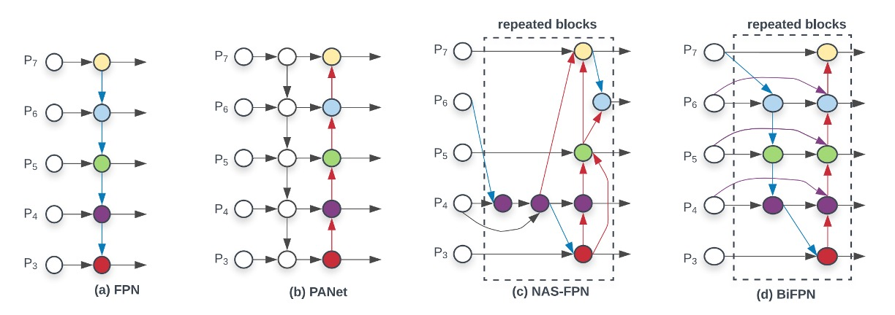
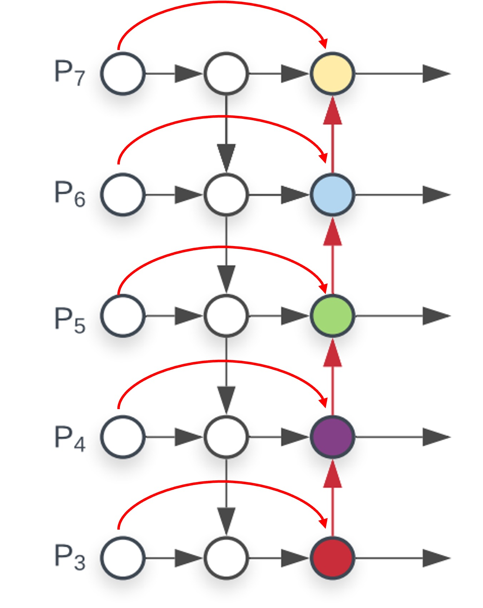
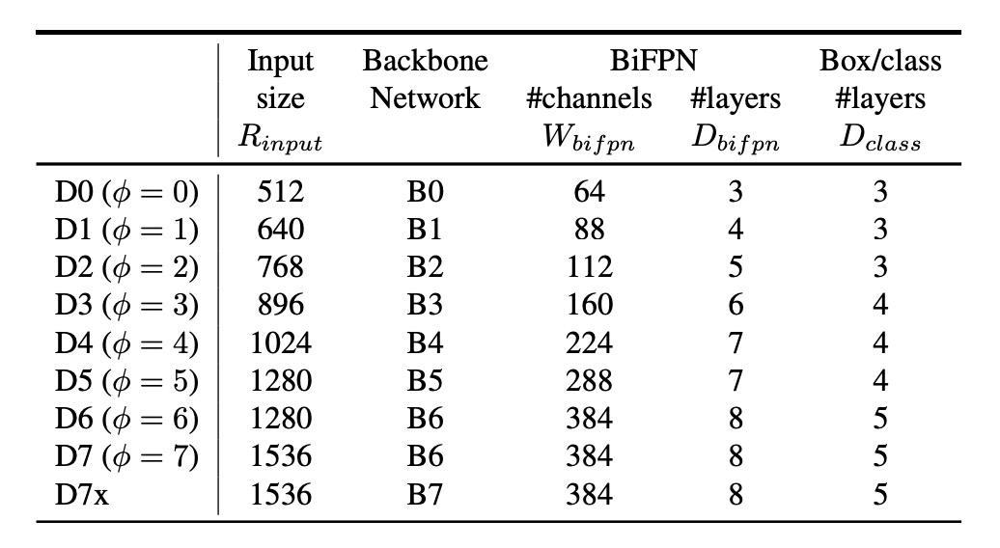
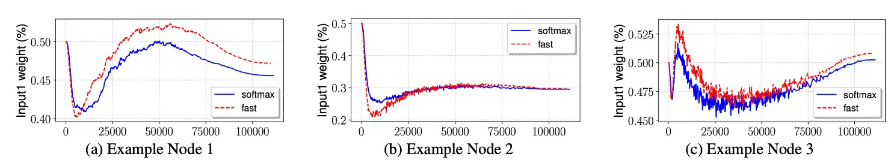
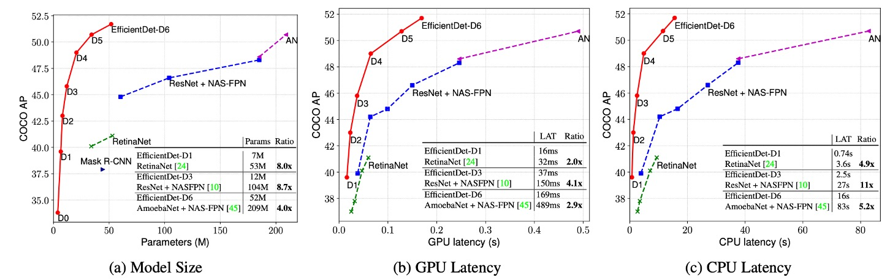

## The Power of BiFPN

[**EfficientDet: Scalable and Efficient Object Detection**](https://arxiv.org/abs/1911.09070)

---

Around half a year ago, Google introduced NAS-FPN, but it seems that not everyone within the company agreed it was the best direction. They decided to completely abandon the search results of NAS-FPN and instead reimagined a new feature fusion module based on FPN, which they named BiFPN.

## Defining the Problem

Since its inception, the pioneering work of FPN has been widely applied to various object detection tasks. Numerous variants and improvements have followed, and we can see a rough development trajectory in the image below:

Starting from the original FPN on the far left, feature fusion occurs across different resolution feature maps, with the deepest feature map being progressively upsampled and added back to shallower feature maps.

PANet later proposed that simply adding features back along one path was insufficient, so they introduced a second path: another round of downsampling and addition. The purpose of this, as we’ve discussed before, is to establish a shortcut for feature fusion from the shallowest to the deepest layers, allowing the model to better utilize different levels of features.

- [**[18.03] PANet: Give Me a Shortcut**](../1803-panet/index.md)

NAS-FPN then introduced an automatic search method, mapping out a multi-layer feature fusion structure, allowing the model to find the optimal fusion strategy on its own. However, this method’s drawbacks are also apparent—it’s difficult to interpret and control.

- [**[19.04] NAS-FPN: Money Talks**](../1904-nasfpn/index.md)

In this paper, the authors from Google decided not to use the NAS approach but instead revisited the strengths of PANet, focusing on two key perspectives:

- **Feature fusion shouldn’t be just a simple addition; it needs to consider the importance of features and perform weighted addition.**
- **The number of FPN layers should scale with the model size.**

## Solving the Problem

### Model Architecture

To demonstrate the effectiveness of BiFPN, the authors selected RetinaNet, a classic object detection model, and replaced the FPN feature fusion module with BiFPN.

In the image above, the backbone on the far left is not the focus of this paper, nor is the head on the far right. We should focus solely on the BiFPN in the middle.

This design starts with PANet and makes a few improvements, which we’ll illustrate step by step:

1. **Cross-scale connections:**

   Starting from PANet, cross-scale connections are added, with each connection involving a “weighted” addition. Therefore, each node introduces a set of weight parameters.

   

   <figure style={{"width": "30%"}}>
   
   </figure>
   

2. **Removing low-contribution nodes:**

   Looking at the above diagram, you’ll notice that the deepest node only has one connection, which is inefficient. It’s better to remove it. Similarly, the shallowest nodes don’t need to receive features from higher levels, so the two nodes are redundant and can also be removed.

   

   <figure style={{"width": "30%"}}>
   
   </figure>
   

After these two steps, we arrive at the BiFPN structure.

The authors also emphasized an important point: they view this structure as a “module.” As such, it can be stacked in layers, allowing for more feature fusion layers as the model size increases.

:::tip
This concept was not demonstrated in the original PANet, which only had one upsampling and one downsampling layer. With the idea of module stacking, we can apply this to both FPN and PANet, thereby enhancing model performance.
:::

### Model Scaling

<figure style={{"width": "70%"}}>

</figure>

Beyond the new architecture, the authors extended the concept of model scaling from EfficientNet, introducing a scaling concept for the FPN as well.

The general idea is that if the backbone can scale, so should the FPN, to better match models of different sizes. The table above shows BiFPN scaling configurations for models of varying sizes. As the model size increases, the number of BiFPN layers and channels also increases.

### Weighted Average

Finally, the authors discussed how to design the weights for the weighted feature maps.

Three design methods were proposed in the paper:

1. Unbounded fusion: No constraints on the weights, allowing the model to learn them freely, but the results were very unstable and were thus disregarded.
2. Softmax fusion: Apply softmax to the weights, ensuring they sum to 1.
3. ReLU constraint: Apply ReLU to ensure weights are positive, and then normalize them to sum to 1.

In the above figure, the authors show experimental results for the second and third methods. The results indicate that ReLU and Softmax perform similarly, but ReLU is 30% faster, which is why the authors recommend this design.

## Discussion

### Performance on COCO

<figure style={{"width": "90%"}}>

</figure>

The authors conducted experiments on the COCO 2017 detection dataset, using 118,000 training images.

During training, they used the SGD optimizer with a momentum of 0.9 and a weight decay of 4e-5. The learning rate linearly increased from 0 in the initial epochs to 0.16, followed by a cosine decay schedule. Additionally, synchronized batch normalization was applied after each convolution operation, with a decay factor of 0.99 and an epsilon of 1e-3.

The model employed SiLU (Swish-1) as the activation function and applied an exponential moving average with a decay factor of 0.9998 to improve stability. During training, the focal loss function was used, with α set to 0.25 and γ to 1.5. Data augmentation strategies included horizontal flipping and scale jittering, with image sizes randomly adjusted to 0.1 to 2.0 times the original size before cropping. Furthermore, soft non-maximum suppression (Soft NMS) was used during evaluation.

For training resources, EfficientDet-D0 to D6 models were trained for 300 epochs on 32 TPUv3 cores, while EfficientDet-D7 and D7x models were trained for 600 epochs on 128 TPUv3 cores, with a total batch size of 128.

The results demonstrated that EfficientDet models achieved superior efficiency across different precision and resource constraints. Compared to previous detectors, EfficientDet models were 4 to 9 times smaller in size and reduced FLOPs by 13 to 42 times. Notably, EfficientDet-D0 reduced FLOPs by 28 times compared to YOLOv3 while maintaining similar accuracy. Compared to RetinaNet and Mask-RCNN, EfficientDet achieved similar accuracy with 8 times fewer parameters and 21 times fewer FLOPs.

In high-precision settings, EfficientDet-D7x achieved 55.1 AP on the COCO test-dev set, significantly surpassing the state of the art, improving accuracy by 4 AP while being 7 times more efficient. The authors also compared inference latency on Titan-V FP32, V100 GPU FP16, and single-thread CPU, highlighting EfficientDet’s advantage in inference speed.

## Conclusion

Compared to traditional FPN architectures, BiFPN achieves better multi-scale feature fusion by leveraging selective weighting and lightweight design, all without significantly increasing computational costs.

Simple and effective, BiFPN is a great companion for implementing models. We highly recommend giving it a try.
