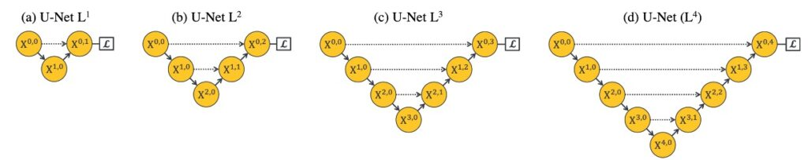
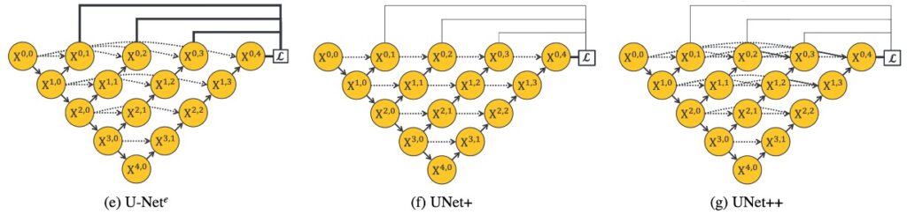
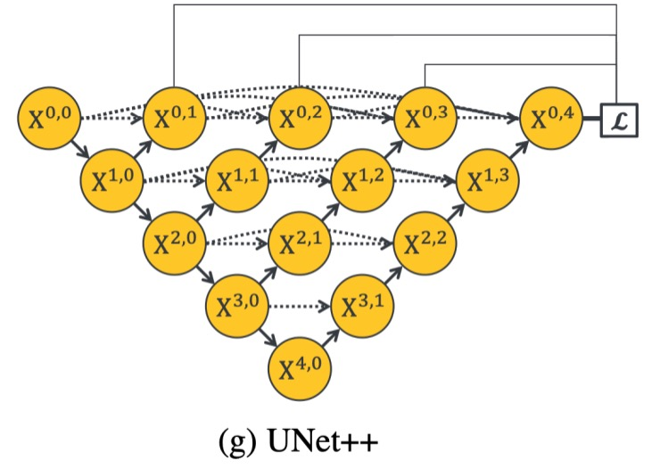

## The Subtle Weaver

**[UNet++: Redesigning Skip Connections to Exploit Multiscale Features in Image Segmentation](https://arxiv.org/abs/1912.05074)**

---

The authors of this paper use U-Net as a starting point to explore design issues in the original U-Net architecture.

To quote the authors:

> "Is there really nothing wrong with this topology that hasn't changed in three years?"
>
> Excerpted from [**研习 U-Net**](https://zhuanlan.zhihu.com/p/44958351)

The authors believe that U-Net not only has issues but also has many.

## Problem Definition

The common U-Net has a depth of five down-sampling layers, as shown in diagram (d) above.

Why not three layers? Why not seven layers? How deep should the network be designed?

In many deep learning applications, the depth of the network is often a critical parameter that directly impacts the performance and learning capability of the network.

Let's delve into various aspects of this question:

1. **Feature Representation Capability**

   The depth of the network determines its representation capability. Simply put, deeper networks can usually learn more complex and abstract features. In tasks such as image segmentation, object detection, or classification, this ability to capture abstract features can be crucial. Shallower networks might only capture simpler, more local features.

2. **Computational Complexity**

   As the network depth increases, the computational complexity and the number of parameters usually grow dramatically. This not only increases training and inference time costs but also demands more computational resources. Finding an appropriate network depth is challenging when resources are limited.

3. **Overfitting and Generalization**

   Deeper networks usually have higher model complexity and might be prone to overfitting, especially with smaller datasets. Shallower networks might generalize better but could sacrifice some representation capability.

4. **Optimization Difficulty**

   You could certainly down-sample 100 layers (if your image is large enough), but as the network depth increases, optimizing the network parameters becomes increasingly difficult. Issues such as vanishing or exploding gradients might occur, requiring specific initialization methods or optimizers to address.

5. **Theory vs. Practice**

   Theoretically, deep networks can represent the same functions with fewer nodes and computations, but in practice, finding an appropriate network depth is not straightforward. Both overly deep and overly shallow networks might not perform well on specific tasks.

6. **Dataset and Task Characteristics**

   Different datasets and tasks might require different network depths. Some tasks might need deep networks to capture complex patterns, while others might not require as many abstract layers.

7. **Interpretability and Debugging Difficulty**

   As the network gets deeper, model interpretability might decrease, making it harder to debug and understand the model's behavior.

By thoroughly investigating the question of "how deep," we can better understand how network depth impacts the performance and effectiveness of deep learning models, and how to make reasonable choices and designs in practical applications.

## Solution

### UNet++ Model Design

When addressing image segmentation and similar problems, the ideal scenario is for the network to effectively learn features at different depths to better understand and process image data.

In exploring this issue, the authors proposed several innovative network structure designs aimed at better integrating features at different depths and optimizing network performance.

Here are the core design concepts and schemes:

1. **Unified Architecture (U-Nete)**

   - **Objective:** Define a unified architecture for nested U-Nets
   - This design integrates U-Nets of different depths into a single unified architecture. In this architecture, all U-Nets share at least part of the encoder while having their own decoders. This design allows decoders of different depths to operate independently within the same network structure, providing a unique perspective to observe and compare how different depths affect network performance.

2. **Upgraded U-Net (UNet+)**

   - **Objective:** Serve as a control group to verify the effectiveness of long connections
   - This design evolved from U-Nete, discarding the original long skip connections in favor of short skip connections linking every two adjacent nodes. This design enables deeper decoders to send supervision signals to shallower decoders, achieving better information transmission and feature integration. It aims to explore how collaboration between decoders of different depths impacts overall network performance.

3. **Advanced U-Net (UNet++)**
   - **Objective:** Experimental group to verify the effectiveness of long connections
   - Built on the foundation of U-Nete, UNet++ achieves dense connected skip connections by linking decoders. This design allows dense feature propagation along the skip connections, achieving more flexible feature fusion. UNet++ aims to realize more flexible and efficient feature extraction and fusion within a unified architecture to tackle challenges posed by different depths.

Through these architectural designs, the authors aim to retain the advantages of the original U-Net architecture while addressing the issue of network depth selection, integrating features from different depths to improve performance in tasks such as image segmentation.

Of course, this architectural design didn't materialize out of nowhere. It evolved through the authors' thought process and changes, which you can explore further in their detailed writings.

## Discussion

Let's discuss several questions based on the above content:

### Is It Just About More Parameters?

To address this doubt, the authors designed an experiment where they scaled up the original U-Net to match the parameter count of UNet++ and compared the results. Although this approach might be considered a bit crude (according to the authors), the table shows that simply increasing the number of parameters:

- **Doesn't result in any significant improvement.**

In deep learning, more parameters usually imply higher representational capacity for the model, but this doesn't always lead to better results. Too many parameters might lead to overfitting, especially with smaller datasets. Moreover, as the number of parameters increases, the computation and storage requirements also rise significantly, which might not be desirable. UNet++ demonstrates the importance of optimizing network structure rather than merely adding more parameters.

### Deep Supervision and Model Pruning

When exploring network structures in deep learning, especially for image segmentation tasks using the U-Net architecture, two concepts stand out: Deep Supervision and Model Pruning. These techniques not only enhance the learning efficiency of the network but also help significantly reduce the model's size while maintaining a certain level of accuracy, thereby accelerating the inference process, particularly in resource-constrained environments like mobile devices.

1. **Deep Supervision**

   

   The core idea of deep supervision is to introduce additional loss functions at different stages of the network to ensure effective gradient updates even in shallower network structures. By adding auxiliary losses in each level of the sub-networks, every stage of the U-Net can receive clear supervisory signals, thereby promoting the overall network's learning. In the UNet++ architecture, deeper supervision allows each sub-network's output to be regarded as the segmentation result, providing a natural and direct solution to overcome the issue of vanishing gradients.

2. **Model Pruning**

   

   Model pruning is another effective technique for reducing model size. By evaluating the performance of each sub-network on a validation set, it is possible to determine how much of the redundant network structure can be pruned without losing accuracy. During the inference phase, appropriate network depth can be selected based on actual requirements to balance performance and computational costs.

   After discussing the concepts of the UNet++ structure and model pruning, we can analyze its feasibility and importance from the following aspects:

   - **Feasibility**

     - Deep Supervision and Multi-Output: The UNet++ structure, through deep supervision, possesses multi-level outputs, allowing each sub-network to generate image segmentation results. Due to this design, the performance of each sub-network can be independently evaluated, providing a foundation for subsequent pruning.
     - Model Pruning: During the testing phase, forward propagation is sufficient, and if certain sub-networks can already produce satisfactory results, pruning other sub-networks won't affect the output of the preceding sub-networks. However, during training, the pruned parts contribute to weight updates during backpropagation, indicating their importance in the training process. This design ensures the feasibility of pruning while maintaining network performance.

   - **Importance**

     - Computational Efficiency and Resource Utilization: Through pruning, the model size is significantly reduced. For example, if the output of the L2 layer is satisfactory, many parameters can be pruned, greatly reducing computational and storage demands. This is particularly important for running models in resource-constrained environments, such as mobile devices.
     - Speedup: The pruned network structure can significantly improve inference speed. For instance, replacing L4 with L2 can triple the processing speed, which is crucial for applications requiring real-time or near-real-time responses.
     - Flexible Network Structure: Through reasonable pruning, UNet++ offers a flexible network structure that can be adjusted based on the task requirements and dataset difficulty to achieve a good balance between performance and efficiency.

   - **Balancing Accuracy and Model Size**
     - The relationship between dataset difficulty and network depth suggests that through pruning, smaller models can be used for simpler datasets while maintaining similar performance. This design allows UNet++ to reduce model size and computational costs while maintaining high accuracy.

   In the implementation of the UNet++ architecture, the successful application of deep supervision and model pruning has significantly reduced the number of parameters while maintaining good segmentation performance. This not only improves the model's running efficiency on mobile devices but also offers new insights into network design flexibility and adjustability.

## Conclusion

Implementing deep supervision and model pruning on UNet++ demonstrates the potential of these methods in optimizing image segmentation tasks.

Deep supervision allows the model to obtain better feature representation at different network levels, while pruning provides an effective way to reduce computational and storage needs while maintaining performance, especially important for resource-constrained environments.

However, from an engineering perspective, these methods also present challenges:

Most intuitively, determining the extent of pruning depends on performance on the validation set, which may lead to performance instability across different datasets or real-world applications, possibly causing the model to fail unexpectedly.

One possible direction to address this issue is to adopt adaptive pruning strategies, dynamically adjusting the pruning extent at different stages and exploring multi-objective optimization methods to balance accuracy and efficiency. Alternatively, using cross-dataset validation and transfer learning techniques could improve the model's generalization ability and stability in different application scenarios.

In practice, implementing deep supervision and model pruning increases the complexity of model design and training. Engineers might need to invest additional time and resources to adjust and validate pruning strategies to ensure the model's generalization ability, potentially extending the development cycle.

This paper offers new insights into optimizing feature fusion methods but still presents certain technical challenges that need to be overcome through further research and practice. It is hoped that this article provides valuable reference and inspiration for researchers' work and research.
