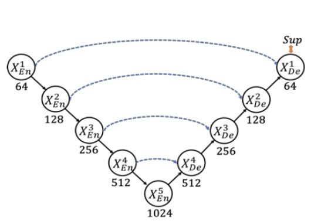
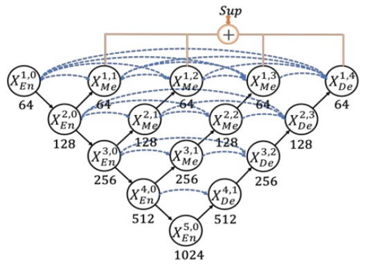

## Design Changes UNet++

[**UNet 3+: A Full-Scale Connected UNet for Medical Image Segmentation**](https://arxiv.org/abs/2004.08790)

---

This is also a paper in the medical field, aimed at medical image segmentation.

The authors found an idea to improve the structure of UNet++, but naming it UNet+++ did not quite capture the researchers' aesthetic.

So, they decided to call it "UNet 3+" instead!

## Problem Definition

Speaking of U-Net, it’s well known, and the architecture looks like this:

<figure style={{"width": "50%"}}>

</figure>

This classic architecture uses skip connections to combine high-level semantics with low-level details, achieving significant results in fields like medical image segmentation.

However, there are a few issues. First, multi-scale features might get diluted during the progressive downsampling and upsampling processes, preventing the model from fully utilizing information at different scales to improve segmentation accuracy. Secondly, the traditional U-Net’s skip connections directly fuse semantically mismatched high- and low-level features, leading to performance degradation.

Thus, UNet++ reduces this semantic gap with nested and dense skip connections, modifying the entire architecture as follows:

<figure style={{"width": "50%"}}>

</figure>

However, the authors of this paper felt that this architecture has too many redundant connections, making it inefficient!

We should consider a different connection method.

## Solution

### Model Architecture

<figure style={{"width": "50%"}}>

</figure>

Here, the authors define the downsampling layers in UNet as the encoder and the upsampling layers as the decoder. In UNet 3+, they redesigned the skip connections between the encoder and decoder, allowing multi-scale features to be more thoroughly integrated.

As shown in the figure above, each decoder layer integrates features from smaller scale encoder features, same-scale encoder features, and larger scale decoder features, followed by feature aggregation.

Once the five features at the same spatial resolution are collected in a decoder layer, the channels are unified, concatenated, and processed through a convolution + BN + ReLU layer to complete feature aggregation. Finally, a segmentation prediction result is directly output and supervised against the ground truth. The authors refer to this as "full-scale deep supervision."

### Loss Function

To emphasize organ boundaries, the authors introduced Multi-scale Structural Similarity (MS-SSIM) as one of the loss functions.

Intuitively, MS-SSIM is used to compare the similarity of local patches, with larger differences in segmentation results at the boundary leading to higher MS-SSIM scores and greater penalties during training.

The mathematical formula is as follows:

$$
\ell_{\text{ms-ssim}}(p,g)
= 1 - \prod_{s=1}^S
\Biggl(
  \frac{2\mu_p^s \mu_g^s + c_1}{(\mu_p^s)^2 + (\mu_g^s)^2 + c_1}
\Biggr)^{\alpha_s}
\Biggl(
  \frac{2\sigma_{pg}^s + c_2}{(\sigma_p^s)^2 + (\sigma_g^s)^2 + c_2}
\Biggr)^{\beta_s}
$$

- $p$ and $g$ are the segmentation result and ground truth, respectively; the local patch size for both $p$ and $g$ is $N \times N$.
- $\mu_p^s, \mu_g^s$ represent the mean values of $p$ and $g$ at scale $s$, $\sigma_p^s, \sigma_g^s$ represent the standard deviations, and $\sigma_{pg}^s$ is the covariance between them.
- $\alpha_s, \beta_s$ control the weight of brightness and contrast (or similarity measure) at different scales; $c_1=0.01^2, c_2=0.03^2$ are smoothing terms to prevent division by zero.
- The experiment uses 5 scales (S=5).

The larger the MS-SSIM value, the more similar the segmentation is to the ground truth, resulting in a smaller loss.

The authors combine the MS-SSIM loss, Focal loss, and IoU loss to form a three-tier hybrid loss (pixel-level, patch-level, and map-level):

$$
\ell_{\text{seg}}
= \ell_{\text{focal}}
+ \ell_{\text{ms-ssim}}
+ \ell_{\text{iou}}
$$

This combination balances "pixel-level errors," "local region structural similarity," and "overall image region overlap," achieving better segmentation performance.

### Classification-guided Module (CGM)

<figure style={{"width": "80%"}}>

</figure>

In common medical image segmentation tasks, a "false positive" error might occur when the input image does not contain the organ, but the model still makes a segmentation.

To avoid this situation, the authors propose guiding the segmentation model through "an additional classification task": first determining whether the organ is present in the image. If the classification result is "not present," the output should be a blank segmentation; if "present," the segmentation result should be retained.

The approach is shown in the figure above. The last layer of the encoder, $E^i_5$ (the deepest layer with the strongest semantic information), is connected to a simple classification network, which uses dropout, convolution, and max pooling, and outputs a 2-dimensional vector (representing the probabilities of "organ present/absent") through a sigmoid.

During inference, the binary classification result is obtained using argmax, resulting in either a 0 or 1. This 0/1 result is then multiplied with the segmentation output from each decoder layer. If the classification result is 0 (no organ), the segmentation result is cleared; if 1 (organ present), the original segmentation is kept.

### Experimental Setup

The authors selected two organs for validation: the liver and spleen.

The study uses the well-known and publicly recognized challenging LiTS liver segmentation dataset, as well as an ethically approved hospital spleen dataset, considering practical scenarios such as "organ size, shape differences" and "individual differences between patients."

- **Liver Dataset (LiTS 2017 Challenge)**
  - 131 contrast-enhanced 3D abdominal CT scans.
  - 103 used for training, 28 for testing.
- **Spleen Dataset (hospital-acquired, ethically approved)**
  - 49 CT scans (40 for training, 9 for testing).

To speed up training, the input images use 3 channels:

- **Current CT slice**
- **Previous slice**
- **Next slice**

This allows the network to receive contextual information from the adjacent slices, aiding the segmentation of organ boundaries. Additionally, the images are cropped to $320 \times 320$ size.

The evaluation metric used is the **Dice coefficient** to measure segmentation quality, calculated for each 3D volume.

## Discussion

### Comparison with UNet and UNet++

The authors first compare **UNet 3+** with the classic model **UNet** and the improved model **UNet++**. All comparisons use **focal loss** as the loss function, with tests conducted on both VGG-16 and ResNet-101 backbone networks.

The table above shows the experimental results on the liver and spleen datasets. We can observe:

- UNet 3+ (without deep supervision) already surpasses both UNet and UNet++ in average accuracy, improving by about 2.7 (for VGG-16) and 1.6 (for ResNet-101) percentage points (averaged across the two organ datasets).
- With the addition of multi-scale deep supervision (i.e., the full version of UNet 3+), performance improves by an additional 0.4 percentage points when handling organs of different sizes (like liver and spleen).

The results demonstrate that UNet 3+ leverages multi-scale features and deep supervision to achieve better segmentation performance with fewer parameters.

### Comparison with SOTA

<figure style={{"width": "70%"}}>

</figure>

The authors compare **ResNet-101-based UNet 3+** with several state-of-the-art methods, where all methods are tested with a "single model" and "no post-processing" techniques.

The results shown in the table above indicate that the hybrid loss function (including pixel, patch, and map-level optimizations) significantly improves segmentation performance; particularly, the **patch-level MS-SSIM loss** gives higher weight to the boundaries, resulting in better "boundary-aware" effects.

Furthermore, CGM effectively prevents erroneous segmentation in complex background regions, as the model can directly remove false positives if it determines the organ is not present.

Ultimately, UNet 3+ achieves the best results in liver segmentation (Dice = 0.9675) and spleen segmentation (Dice = 0.9620), outperforming the second-best methods by 0.0334 and 0.0296, respectively.

### Visualization Results

<figure style={{"width": "80%"}}>

</figure>
<figurecaption>The pink-purple region is TP; the yellow region is FN; the green region is FP</figurecaption>

---

The figure above shows the segmentation results for the liver dataset based on ResNet-101, comparing UNet, UNet++, and UNet 3+ (with multi-scale deep supervision).

It can be observed that UNet 3+ not only provides more accurate organ localization but also performs better at boundary handling, with smoother and more continuous boundaries. Even when dealing with smaller organ structures or local details, it maintains good segmentation consistency.

## Conclusion

This paper is easy to read, and the authors have made several key improvements:

1. **Redesigning skip connections**: Integrating multi-scale features more comprehensively and applying deep supervision in the decoder layers.
2. **Introducing MS-SSIM loss**: Emphasizing the structural similarity of local regions, benefiting boundary perception.
3. **CGM module**: Guiding the segmentation model through an additional classification task to avoid false positives.

These improvements have enabled UNet 3+ to achieve the best performance in liver and spleen segmentation, with fewer parameters and better boundary consistency compared to other state-of-the-art methods.
