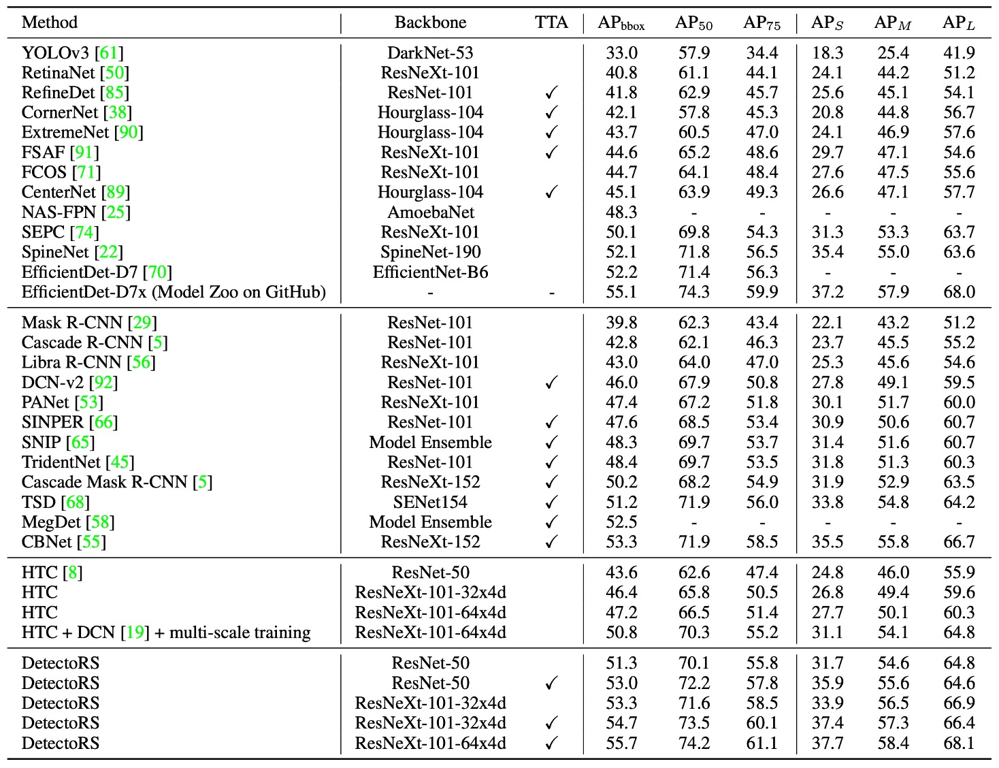

## Recursive Pyramid

[**DetectoRS: Detecting Objects with Recursive Feature Pyramid and Switchable Atrous Convolution**](https://arxiv.org/abs/2006.02334)

---

The simple research on the FPN architecture seems to have reached its limits.

However, Google Research still wanted to experiment with this topic, perhaps by integrating the design of Backbone and Neck, and finding new design directions.

## Defining the Problem

Past major achievements such as PANet, BiFPN, NAS-FPN, etc., have all been improvements based on the FPN, without disrupting the pyramid's fundamental structure.

But the issue of feature fusion remains unresolved (because performance on evaluation datasets has not reached saturation).

We still need richer features to potentially achieve new performance levels on evaluation datasets.

:::tip
If you're interested in previous studies, you can refer to our past articles:

- [**[18.03] PANet: Give Me a Shortcut**](../1803-panet/index.md)
- [**[19.04] NAS-FPN: Money Talks**](../1904-nasfpn/index.md)
- [**[19.11] EfficientDet: The Power of BiFPN**](../1911-bifpn/index.md)
  :::

## Solving the Problem

### Recursive Feature Pyramid

<div align="center">
<figure style={{"width": "90%"}}>

</figure>
</div>

Recursive Feature Pyramid (RFP) is a new design approach proposed by the authors in this paper. The "R" in RFP stands for Recursive, which means feeding the FPN output "back" into the backbone network.

As shown in the image, part (a) is the traditional FPN architecture, while part (b) is the proposed RFP architecture. When the backbone network receives the feedback features, it will re-extract and fuse richer information, then go through the FPN process again, achieving the effect of "multiple reflections and corrections."

We can recall the design concept of BiFPN: connecting multiple feature pyramids to fuse multi-scale information, with the goal of training a "strong Neck." On the other hand, RFP feeds the feature map back into the backbone network, so the goal here is to train a "strong Backbone." In other words, BiFPN focuses on enhancing the backend feature fusion, while RFP focuses on providing the backbone with multiple "re-look" opportunities to further improve overall feature representation ability.

Finally, part (c) of the image shows the final connection method, which involves residual connections between the N-th recursive feature map and the final prediction head, ensuring smooth gradient signal propagation and feature stability throughout the multi-layer recursion process.

### Atrous Convolution

Before moving to the next section, let’s cover some background knowledge: What is atrous convolution?

Atrous Convolution (also known as dilated convolution) is a technique that inserts holes (dilations) into the convolution kernel. The goal is to expand the receptive field without adding extra parameters or computational costs. This allows the model to simultaneously focus on "local details" and "global information," which is particularly effective in tasks like semantic segmentation and object detection.

:::tip
Atrous convolution is widely used in feature extraction in the DeepLab series of research.
:::

In standard convolution, the range of the convolution kernel is limited by its size, and it cannot capture large-scale information all at once. While stacking multiple layers of convolution can increase the receptive field, it also significantly increases computational costs. Atrous convolution, by inserting "gaps" into the convolution kernel, allows the fixed-size kernel to skip certain pixels, thus expanding the receptive field without extra computational cost.

Let’s look at how a 3×3 convolution behaves under different atrous rates:

- **(a) Standard Convolution (Atrous Rate = 1)**

  ```bash
  X  X  X
  X  X  X
  X  X  X
  ```

  - The convolution kernel covers a small range, suitable for learning local details.

- **(b) Atrous Convolution (Atrous Rate = 2)**

  ```bash
  X  -  X  -  X
  -  -  -  -  -
  X  -  X  -  X
  -  -  -  -  -
  X  -  X  -  X
  ```

  - Each weight is spaced 1 pixel apart (`-` represents skipped pixels), expanding the receptive field by a factor of two.

- **(c) Atrous Convolution (Atrous Rate = 3)**

  ```bash
  X  -  -  X  -  -  X
  -  -  -  -  -  -  -
  -  -  -  -  -  -  -
  X  -  -  X  -  -  X
  -  -  -  -  -  -  -
  -  -  -  -  -  -  -
  X  -  -  X  -  -  X
  ```

  - Each weight is spaced 2 pixels apart, further expanding the receptive field.

By adjusting the atrous rate $r$, the model can flexibly learn features at different scales, further enhancing its semantic understanding capability.

### Switchable Atrous Convolution

Switchable Atrous Convolution (SAC) is another key design proposed by the authors in this paper. The goal is to allow the same convolution kernel to "dynamically switch" between different atrous rates.

The SAC architecture is shown in the diagram below, which consists of three main components:

<div align="center">
<figure style={{"width": "90%"}}>

</figure>
</div>

1. **Pre-Global Context** module on the left
2. The central **SAC body**
3. **Post-Global Context** module on the right

Let’s focus on the SAC body design and leave the Global Context parts aside for now:

The authors represent a convolution operation with weights $w$ and atrous rate $r$ acting on the input $x$ as $\text{Conv}(x, w, r)$, with output denoted as $y$.

To transform a standard 3×3 convolution into SAC, the mathematical expression is as follows:

$$
\underbrace{\text{Conv}(x,\, w,\, 1)}_{\text{Standard Convolution}}
\;\;
\xrightarrow{\text{Convert to SAC}}
\;\;
$$

$$
S(x)\,\cdot\,\underbrace{\text{Conv}(x,\, w,\, 1)}_{\text{Atrous Rate = 1}}
\;+\;
\bigl[\,1 - S(x)\bigr]\;\cdot\;\underbrace{\text{Conv}\bigl(x,\; w + \Delta w,\; r\bigr)}_{\text{Atrous Rate = r}}
$$

Where:

- $r$ is the atrous rate hyperparameter of SAC (default $r=3$ in experiments).
- $w$ comes from the originally pretrained weights.
- $w + \Delta w$ represents the weights corresponding to "atrial rate = $r$", where $\Delta w$ is a learnable parameter, initialized to 0.
- $S(x)$ is the "switching function," which dynamically decides at each pixel whether to prefer the "standard convolution" or the "convolution with a larger atrous rate."

:::tip
In the paper, the implementation of $S(x)$ involves first performing average pooling on the input $x$, then passing it through a 1×1 convolution, and finally applying a Sigmoid function. This generates a spatially dependent attention map, enabling the model to dynamically adjust the receptive field size based on spatial location.
:::

Thus, when $S(x)$ approaches 1, the output is more influenced by the convolution with atrous rate 1. Conversely, when $S(x)$ approaches 0, the output is more influenced by the convolution with atrous rate $r$. Since $S(x)$ can be updated during training, the entire backbone network can dynamically adjust the receptive field size for different spatial locations, better adapting to multi-scale objects.

Next, we face the following issue:

- **If the original convolution weight $w$ and the weight for atrous rate = $r$ are learned independently, it would prevent the pretrained weights from being fully utilized, or the entire model would need to be trained from scratch.**

To address this, the authors propose a "weight locking mechanism," where one weight remains as $w$, and the other weight is $w + \Delta w$. This approach retains the benefits of pretrained weights while allowing $\Delta w$ to fine-tune the behavior of the convolution with atrous rate = $r$ during training.

---

Finally, let's return to the design of the Global Context module. The SAC body is preceded and followed by a lightweight "Global Context" module.

The method is similar to SENet, but the authors make two key modifications:

1. They use only a single 1×1 convolution without additional non-linearity (such as ReLU).
2. The output features are added to the main features, rather than multiplying as in SENet after a Sigmoid.

The process is essentially as shown in the diagram above: first, global average pooling (Global AvgPool) is applied to the input, followed by a 1×1 convolution to scale the channels, and finally, this global information is added back to the original feature map.

:::tip
Readers unfamiliar with SENet can refer to our previous article:

- [**[17.09] SENet: Squeeze and Excitation Network**](../../lightweight/1709-senet/index.md)
  :::

## Discussion

Here, we focus on the performance of **RFP (Recursive Feature Pyramid)** and **SAC (Switchable Atrous Convolution)** in experiments.

### Performance Boost from RFP and SAC

<div align="center">
<figure style={{"width": "90%"}}>

</figure>
</div>

The authors conducted experiments on the COCO dataset using **HTC + ResNet-50 + FPN** as the baseline model, and added RFP and SAC separately, then combined both to form the final **DetectoRS** model.

The experimental results show that RFP and SAC each bring more than a 4% increase in AP, with significant gains in both bounding box and mask AP. Although the inference speed slightly decreases after adding RFP and SAC, it does not significantly drop and remains within an acceptable range.

After combining the two (i.e., DetectoRS), the model achieves **49.0% box AP and 42.1% mask AP**, with an inference speed of approximately 3.9 fps, demonstrating a balance between overall performance and efficiency.

:::tip
Readers interested in the specifics of HTC can refer to the paper:

- [**[19.01] Hybrid Task Cascade for Instance Segmentation**](https://arxiv.org/abs/1901.07518)
  :::

### Ablation Studies of RFP and SAC

<div align="center">
<figure style={{"width": "70%"}}>

</figure>
</div>

First, let's look at the ablation experiments of RFP:

- **RFP + sharing**: This represents the case where, during the recursive (unrolled) process of RFP, the backbone stages (B1, B2) share the same weights. The results show that while sharing weights leads to some improvement, it is not as significant as "non-shared" weights.
- **RFP - aspp**: This removes the ASPP module used in the feedback connection. The results show that ASPP provides better multi-scale information, and its removal leads to a performance drop.
- **RFP - fusion**: This disables the Fusion Module. Without fusion, there is less integration of the recursive feature maps, resulting in reduced performance.
- **RFP + 3X**: This increases the unrolled step $T$ from 2 to 3, which improves **1.3%** box AP. This shows that "looking more times (3 times)" indeed enhances feature representation, but it comes with a higher computational cost.

---

Next, we look at the ablation experiments of SAC:

- **SAC - DCN**: This represents the case where Deformable Convolution is not used (only atrous convolution). The AP is lower compared to the version with DCN.
- **SAC - DCN - global**: This further removes the Global Context modules before and after SAC without using DCN, which leads to a drop in AP.
- **SAC - DCN - locking**: This removes the "locking mechanism" in SAC and directly uses $\Delta w$ instead of $w + \Delta w$ for the second atrous convolution. The results show a drop in AP, confirming that the "locking mechanism" is crucial for retaining pretrained weights while allowing learning differences.
- **SAC - DCN + DS (dual-switch)**: This tries to replace the original design with two independent switches, $S1(x)$ and $S2(x)$, instead of $S(x)$ and $1 - S(x)$. The results did not show improvements, indicating that the original positive-negative design is more effective.

---

From the above analysis, it is clear that RFP and SAC can significantly improve HTC's performance while maintaining inference speed, achieving competitive detection and segmentation results on COCO. This demonstrates the effectiveness and feasibility of their innovative designs.

### Comparison with Other Methods



The results in the table are divided into four major categories:

1. One-stage detectors
2. Multi-stage detectors
3. HTC
4. The authors' DetectoRS results

The models are also categorized by whether **Test-Time Augmentation (TTA)** is used, and the third column indicates which models used TTA.

Different papers use different TTA programs and scales. For example, CBNet uses a stronger TTA, which improves AP from 50.7% to 53.3%. For DetectoRS with ResNeXt-101-32x4d backbone, TTA only brings a 1.4% AP increase.

Overall, the results show that under fair testing conditions, DetectoRS still outperforms other advanced methods in bounding box accuracy, demonstrating a clear advantage.

:::tip
**What is TTA?**

TTA (Test-Time Augmentation) refers to "applying diverse transformations to the input data during testing" and integrating multiple inference results. It is a common "trading computation for accuracy" strategy that improves a model's accuracy and stability during inference without changing the training process, though it comes with added inference time costs.
:::

:::info
The paper also includes results from other domains such as instance segmentation and panoptic segmentation. For brevity, these are not listed here, but interested readers can refer to the original paper.
:::

## Conclusion

In this paper, the authors introduced two core concepts: **Recursive Feature Pyramid (RFP)** and **Switchable Atrous Convolution (SAC)**, and combined them into the **DetectoRS** model.

At the "macro level," RFP strengthens features by injecting FPN's output back into the Backbone across various stages. At the "micro level," SAC enables flexible adaptation to different receptive fields, increasing the diversity of feature learning.

From a feature fusion perspective, considering both Backbone and Neck together may be a potential direction for future research.
