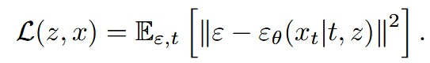
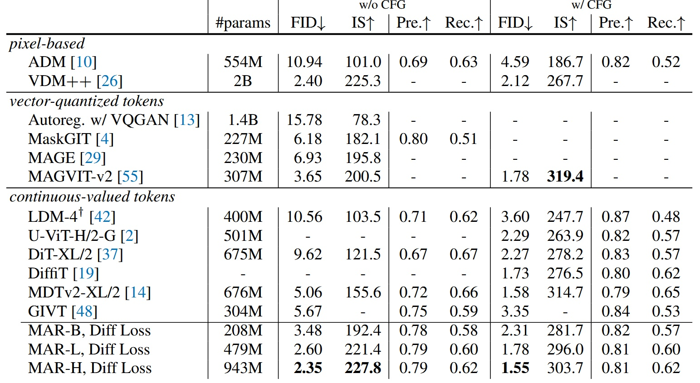

## Reforging the Order of Generation

[**Autoregressive Image Generation without Vector Quantization**](https://arxiv.org/abs/2406.11838)

---

:::info
This article is simultaneously published on [**nbswords' Medium**](https://medium.com/@nbswords/autoregressive-image-generation-without-vector-quantization-516b68b5acfa)
:::

Current autoregressive image generation models often use vector quantization (VQ) to discretize images into tokens, mimicking the success of autoregressive models in the NLP domain. However, the authors argue that such a discrete space is not necessary for autoregressive image generation. Therefore, they propose an autoregressive image generation model based on continuous space, which achieves higher accuracy and faster inference time.

## Background Knowledge

### Vector Quantization (VQ)

This is a long-established technique to accelerate vector search. The method segments a feature space vector (embedding vector) into different groups, each represented by a centroid vector serving as an index. A codebook containing all centroid vector indices is then used to access these groups of vectors.

<figure style={{"width": "60%"}}>

</figure>

For details, please refer to [Survey Of Vector Space Search](https://medium.com/@nbswords/survey-of-vector-space-search-26555890ca5e) or [Vector quantization wiki](https://en.wikipedia.org/wiki/Vector_quantization).

### Auto-regressive Image Generation

Early Visual Autoregressive Models (VAR) treated the image generation task as GPT-like autoregressive text generation, viewing each pixel as a category. The model’s task was to perform multi-class prediction using categorical cross-entropy. Examples include Google's [Image Transformer, 2018](https://arxiv.org/abs/1802.05751) and OpenAI’s [ImageGPT, 2020](https://cdn.openai.com/papers/Generative_Pretraining_from_Pixels_V2.pdf).

To accelerate image generation speed, current autoregressive image generation models commonly introduce VQ for two-stage training: the first stage learns a codebook in the latent space for image reconstruction, and the second stage autoregressively generates images based on the learned codebook.

- Take [VQ-VAE, 2017](https://arxiv.org/abs/1711.00937) as an example:

  - In the encode stage, a CNN extracts image features, then vector quantization is applied on the feature map $z_e$ to obtain centroid vectors (purple vectors, $e_1 \sim e_K$). Next, distances between each feature point in $z_e$ and the centroid vectors are computed, and the nearest centroid vector index replaces each feature point, producing the discrete representation $q(z|x)$.
  - In the decode stage, the image is generated using the mapped back $Z_q$ from $q$.

<figure style={{"width": "80%"}}>

</figure>

Autoregressive models speeding up image generation with VQ sounds great, but are there no drawbacks?

Certainly, there are: 1. VQ encoders are hard to train; 2. VQ degrades the quality of the reconstructed images.

## Method

### Abandoning VQ, Embracing Diffusion

Since diffusion models can represent the joint probability distribution of all pixels or tokens in an image, why not use them to represent the probability distribution of each token?

- Diffusion models can generate images from noise conditioned on an input prompt/image.

<figure style={{"width": "80%"}}>

</figure>

- The current approach conditions on the output of a transformer to generate images from noise (details of the transformer input will be explained later).

<figure style={{"width": "80%"}}>

</figure>

Their method autoregressively predicts the conditional latent variable $z$ for each token, then uses a diffusion model (a small MLP) to perform denoising and obtain the output $x$'s probability distribution $p(x|z)$.

<figure style={{"width": "60%"}}>

</figure>

They propose a Diffusion Loss to replace the original categorical cross-entropy.

<figure style={{"width": "60%"}}>

</figure>

<figure style={{"width": "60%"}}>

</figure>

- $\varepsilon$ is a noise sample drawn from a standard normal distribution $\mathcal{N}(0,1)$.
- $\varepsilon_{\theta}$ is a small MLP, where $\varepsilon_{\theta}(x_t | t, z)$ means the model takes timestep $t$ and condition $z$ as inputs and predicts the noise vector $\varepsilon_{\theta}$ given $x_t$.

  - $t$ is the timestamp in the noise schedule, and $z$ is the condition vector generated by the Transformer based on context.

Finally, similar to DDPM, during inference the model uses the reverse diffusion process to generate images (from $x_t$ to $x_0$).

<figure style={{"width": "60%"}}>

</figure>

Additionally, readers familiar with diffusion models for image generation will recognize the hyperparameter called temperature, which controls sampling randomness—higher temperature means more randomness, lower means less. In this work, temperature is controlled by $\tau * \sigma_t \delta$, following the method introduced in [Diffusion Models Beat GANs on Image Synthesis](https://arxiv.org/abs/2105.05233).

Reflecting on this approach reveals a clever combination of VAE’s conditional generation and DDPM’s denoising: compressing image features with a VAE and generating images with DDPM.

<figure style={{"width": "80%"}}>

</figure>

### Integrating Concepts from Autoregressive and Masked Generative Models

As the author of [MAE (Masked Autoencoders Are Scalable Vision Learners), 2021](https://arxiv.org/abs/2111.06377), Kai Ming naturally considered incorporating MAE’s ideas into the model.

- The main pipeline refers to follow-up works on MAE: [MaskGIT, 2022](https://arxiv.org/abs/2202.04200) and [MAGE, 2022](https://arxiv.org/abs/2211.09117), both using Transformers for Masked Autoregressive (MAR) modeling. MaskGIT’s contribution is using a bidirectional transformer decoder to predict multiple tokens simultaneously, while MAGE unifies image representation learning and image synthesis.
- This work adopts MAE’s bidirectional attention mechanism, placing mask tokens \[m] in the middle layers so that all tokens can see each other, rather than only previous tokens. Loss is computed only on unmasked tokens.

  - Note: This is not the conventional causal vs. bidirectional attention. For deeper understanding, refer to the original MAE paper.

  - The advantage is improved image generation quality; the disadvantage is that training and inference cannot leverage kv cache acceleration. However, since multiple tokens are predicted simultaneously, the method is still reasonably fast.

<figure style={{"width": "60%"}}>

</figure>

- The figure below compares standard sequential AR, random-order AR (random masking of one token), and their approach (random masking of multiple tokens with simultaneous prediction)—this reveals that the transformer input mentioned earlier is a masked image.

<figure style={{"width": "60%"}}>

</figure>

## Implementation

- Diffusion Loss: uses a cosine-shaped noise schedule; training uses 1000 DDPM steps while inference uses only 100 steps.
- Denoising MLP (small MLP): consists of 3 blocks with 1024 channels each; each block contains LayerNorm, linear layer, SiLU activation, and residual connections. AdaLN is used to inject the transformer output $z$ into the LayerNorm layers.
- Tokenizer: uses publicly available tokenizers from LDM, including VQ-16 and KL-16. VQ-16 is based on VQ-GAN with GAN loss and perceptual loss; KL-16 uses KL divergence regularization and does not rely on VQ.
- Transformer: a ViT receives the token sequence from the tokenizer, adds positional encoding and a class token [CLS], then passes through 32 layers of transformer blocks each with 1024 channels.
- Masked autoregressive models: training uses a masking ratio between 0.7 and 1.0 (e.g., 70% tokens randomly masked). To avoid sequences becoming too short, 64 [CLS] tokens are always padded. During inference, the masking ratio is gradually reduced from 1.0 to 0 using a cosine schedule over 64 steps by default.
- Baseline autoregressive model: a GPT model with causal attention, input appended with a [CLS] token, supporting kv cache and temperature parameters.

## Experiments

The model experiments were conducted using AR/MAR-L (\~400M parameters), trained for 400 epochs on ImageNet 256×256 images.

### Diffusion Loss vs. Cross-Entropy Loss

Among all AR/MAR variants, models trained with Diffusion Loss consistently outperformed those trained with cross-entropy loss. The AR model saw the smallest improvement, with increasing gains moving towards MAR+bidirectional+more than one predictions (preds), demonstrating the critical importance of Diffusion Loss for MAR models.

- Diffusion Loss also incorporates Classifier-Free Guidance (CFG), commonly used in diffusion models, to enhance generation quality.
- Fréchet Inception Distance (FID) is better when lower, while Inception Score (IS) is better when higher; both metrics assess generated image quality.

<figure style={{"width": "80%"}}>

</figure>

### Tokenizers

Experiments tested different tokenizers paired with Diffusion Loss. Moving away from discrete space to continuous space allows Diffusion Loss to work on both continuous and discrete tokenizers.

- VQ-16 refers to taking the continuous latent before vector quantization in VQ-VAE as tokens. Both VQ-16 and KL-16 tokenizers come from LDM but trained on ImageNet instead of OpenImages.
- Consistency Decoder is a non-VQ tokenizer originating from [DALL·E 3](https://github.com/openai/consistencydecoder).
- Reconstruction FID (rFID) is better when lower, used to evaluate tokenizer quality.

<figure style={{"width": "80%"}}>

</figure>

Results show continuous tokenizers like KL-16 outperform discrete ones like VQ-16. The model also works compatibly with different tokenizers such as Consistency Decoder.

### Denoising MLP

Performance comparison among MLPs of different sizes shows width=1024 yields the best results.

<figure style={{"width": "60%"}}>

</figure>

### Sampling Steps of Diffusion Loss

Different diffusion steps impact generation quality. Using 100 steps already achieves good performance.

<figure style={{"width": "80%"}}>

</figure>

### Temperature of Diffusion Loss

Temperature is also an important factor for Diffusion Loss.

<figure style={{"width": "60%"}}>

</figure>

### Speed/Accuracy Trade-off

Since kv cache cannot be used, this evaluation is critical. Testing was done on an A100 GPU with batch size=256.

<figure style={{"width": "60%"}}>

</figure>

- MAR: each point represents different autoregressive steps (8 to 128).
- DiT: each point represents different diffusion steps (50, 75, 150, 250), using DiT-XL here.
- AR: uses kv cache.

Despite no kv cache, this model maintains decent inference speed, although default settings (step=64) are noticeably slower.

### System-Level Comparison

Compared with other models, only the largest model MAR-H achieves the best performance, but MAR-L already performs well.

<figure style={{"width": "80%"}}>

</figure>

## Conclusion

In summary, this work breaks away from traditional autoregressive image generation methods by combining Diffusion and MAE concepts to open a new direction. It demonstrates promising results using the simplest DDPM; better diffusion models should yield even stronger outcomes. Looking forward to more derivative works.

Below are some example images generated by the model.

<figure style={{"width": "60%"}}>

</figure>

## Reference

[https://zhouyifan.net/2024/07/27/20240717-ar-wo-vq/](https://zhouyifan.net/2024/07/27/20240717-ar-wo-vq/)
