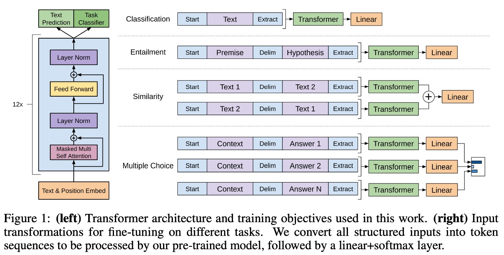
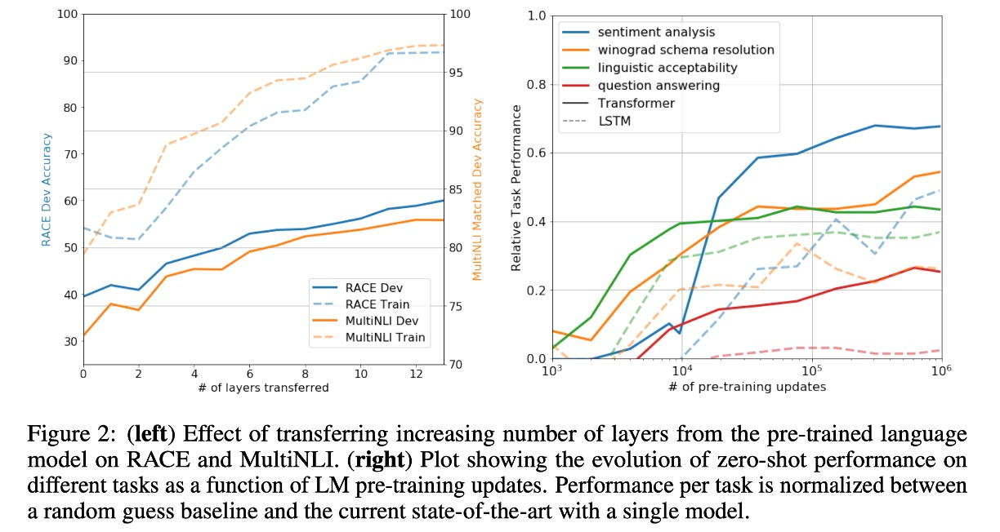
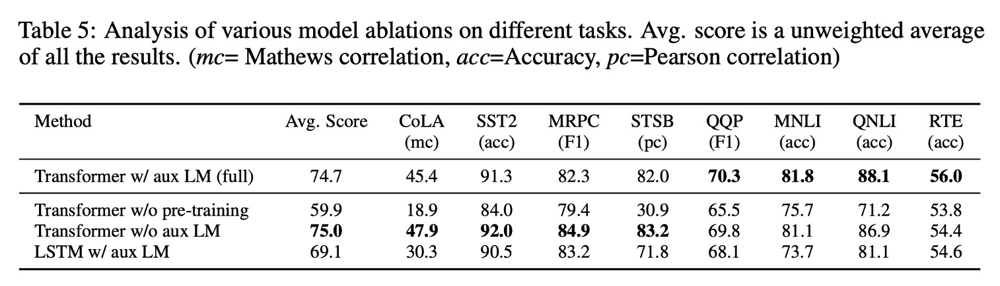

# [18.06] GPT-1

## Twelve-Layer Decoder

[**Improving Language Understanding by Generative Pre-Training**](https://cdn.openai.com/research-covers/language-unsupervised/language_understanding_paper.pdf)

---

:::info
The following content has been compiled by ChatGPT-4 and manually proofread, edited, and supplemented.
:::

---

The original Transformer architecture consists of two parts: an encoder and a decoder. However, OpenAI took a different approach and chose to use a decoder-only architecture.

## Defining the Problem

The authors identified several issues with current NLP models:

### 1. Lack of Labeled Data

In the field of NLP, while data is abundant, labeled data is scarce. This is particularly problematic when working on specific tasks such as specialized domain question answering (QA) or machine translation (MT), where the lack of corresponding labeled data makes training difficult.

To address this, many methods adopt unsupervised learning, later known as self-supervised learning. A common approach is to use a "text completion" task, predicting the next word. This method requires no labeled data, only continuous collection of large amounts of text data for the model to learn from. However, this method introduces another issue: task inconsistency.

### 2. Task Inconsistency

In NLP models, there are typically two stages: pre-training and fine-tuning. Pre-training involves letting the model learn from large amounts of text data, while fine-tuning involves training the model further on specific tasks. The inconsistency between these two stages is problematic.

In pre-training, the model learns to predict the next word, but in fine-tuning, the model might need to answer questions or translate sentences. Previous research has shown that introducing numerous parameters during fine-tuning improves model performance. Different tasks require different parameters, making the process cumbersome and difficult to manage.

To address this, the authors proposed using a decoder-only architecture to adapt to different tasks with minimal parameter changes.

## Solving the Problem

### Model Architecture

The proposed model architecture consists of 12 layers of decoders. The configuration is as follows:

- 12 decoder layers, each following the basic Transformer structure.
- Each decoder layer has 768 feature dimensions and 12 attention heads.
- The hidden layer in the feed-forward network (FFN) uses 3072 neurons.
- Sequence length is 512.
- Dropout rate is 0.1.
- L2 regularization is applied.
- Gelu activation function is used.
- Position encoding uses learnable positional embeddings.
- Tokenization is done using the [**spaCy tokenizer**](https://spacy.io/api/tokenizer).

Training was conducted using:

- Adam optimizer.
- Maximum learning rate of 2.5e-4, linearly increasing over the first 2000 steps, then using cosine annealing to 0.

### Pre-training Strategy

Training the model involved two stages. The first stage was self-supervised learning on large text datasets, and the second stage was fine-tuning on target tasks. The datasets used were:

1. [**BooksCorpus**](https://arxiv.org/abs/1506.06724):
   It contains over 7,000 unique unpublished books covering various genres like adventure, fantasy, and romance. Importantly, it includes long stretches of contiguous text, allowing the model to learn long-range dependencies.

2. [**1B Word Benchmark**](https://www.statmt.org/lm-benchmark/):
   Similar to methods used by [ELMo](https://arxiv.org/abs/1802.05365), this dataset is roughly the same size but reorganized at the sentence level to disrupt long-range structure.

### Fine-tuning Strategy

The authors did not introduce any special techniques for fine-tuning but used standard methods. Unless otherwise specified, the hyperparameters from unsupervised pre-training were reused. A dropout rate of 0.1 was applied to the classifier, with a learning rate of 6.25e-5 and a batch size of 32 for most tasks.

## Discussion

Overall, the proposed method achieved state-of-the-art (SoTA) results in 9 out of 12 evaluated datasets, demonstrating the effectiveness of the decoder-only architecture for NLP tasks. The authors conducted a deeper exploration into the topic of zero-shot learning.

### Why is the Transformer Effective?

In Figure 2 (left), the authors explored how model performance improves with increased depth during task transfer. Results showed that each layer in the pre-trained model contains useful information for the target tasks.

---

In Figure 2 (right), the authors visualized the model's effectiveness during pre-training, showing that performance improves as pre-training progresses. This indicates that pre-training generates features supportive of various tasks.

### Which Part is Effective?

To identify which components contributed most to the model's performance, the authors conducted three different ablation studies. Results are shown in Table 5 of the paper:

1. **Impact of the Auxiliary Language Model Objective:**

   - Removing the auxiliary language model objective during fine-tuning helped tasks like natural language inference (NLI) and question answering (QQP).
   - Larger datasets benefited more from the auxiliary objective, while smaller datasets did not show significant improvement.

2. **Comparison Between Transformer and LSTM:**

   - Comparing the Transformer with a single-layer LSTM with 2048 units showed that using LSTM resulted in an average performance drop of 5.6 points.
   - LSTM outperformed the Transformer only on the MRPC dataset.

3. **Importance of Pre-training:**
   - Comparing a Transformer trained directly on the target task with a pre-trained Transformer showed that lack of pre-training significantly impacted performance, with a 14.8% drop in performance compared to the full model.

## Conclusion

GPT-1 is OpenAI's first large-scale pre-trained model based on the Transformer architecture, marking a significant advancement in the field of natural language processing. By pre-training on large amounts of unlabelled text and fine-tuning on specific tasks, GPT-1 achieved remarkable performance improvements.

The success of GPT-1 demonstrated the potential of the pre-training-fine-tuning paradigm in diverse NLP tasks, paving the way for the development of more powerful models like GPT-2 and GPT-3.
